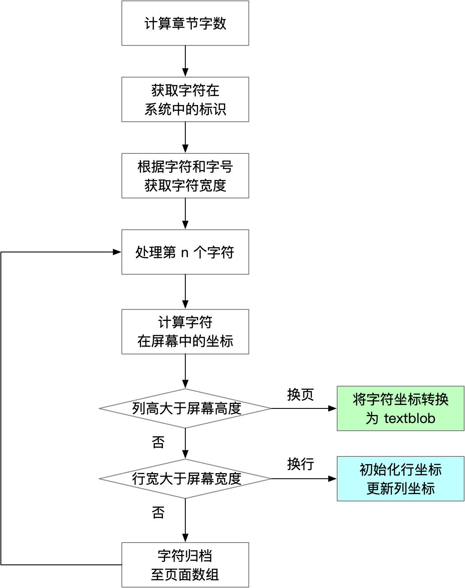
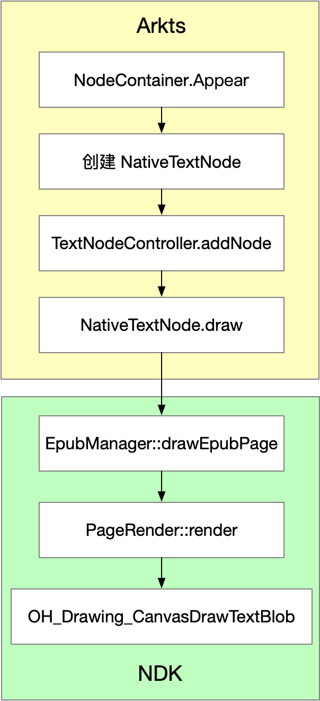
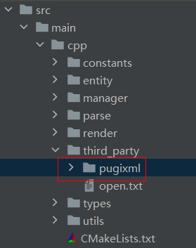

# 阅读听书 行业模板快速入门

## 目录

\- [功能介绍](#功能介绍)

\- [环境要求](#环境要求)

\- [快速入门](#快速入门)

\- [示例效果](#示例效果)

\- [权限要求](#权限要求)

\- [开源许可协议](#开源许可协议)

## 功能介绍

本模板为阅读听书类应用提供了常用功能的开发案例，模板主要分阅读、书架和我的三大模块：

- 阅读：支持 epub 标准格式电子书加载、工具栏（目录跳转、字体修改、亮度与颜色修改等功能）、添加书架和听书功能。
- 书架：支持电子书列表和浏览历史展示。
- 我的：支持华为账号登录、修改个人信息、借阅证与借阅信息查看等功能。

| 阅读                             | 书架                               | 我的                           |
| -------------------------------- | ---------------------------------- | ------------------------------ |
|  |  |  |

本模板主要页面涉核心功能清单如下所示：

```ts
阅读听书模板
 |-- 首页
 |    |-- 搜索
 |    |    |-- 搜索电子书
 |    |-- 阅读
 |    |    |-- 电子书封面展示
 |    |    |-- 电子书加载
 |    |    └-- 横滑翻页
 |    |    └-- 加入书架
 |    |    └-- 横滑翻页
 |    |    └-- 跳转目录
 |    |    └-- 调整字体
 |    |    └-- 调整亮度
 |    |    └-- 调整背景颜色
 |    |    └-- 听书
 |    |-- 首页
 |    |    |-- 电子书列表
 |    |    |-- 推荐列表
 |    |    |-- 展示Banner
 |    |-- 我的
 |    |    |-- 电子书列表
 |    |    |-- 浏览历史
 |    |    └-- 图书馆
 |    |    └-- 借阅证
 |    |    └-- 设置
 |    |    └-- 关于
 |    |    └-- 登录 
```

本模板工程核心代码结构如下所示：

```shell
├─commons
│  ├─common                        // 通过基础模块
│  └─parse/src/main/cpp            // c++ 电子书解析渲染模块
|  	|  	├─constants                // 常量定义
│   |   ├─entity                   // 电子书元数据定义库
│   |   ├─manager                  // 电子书元数据管理库
│   |   ├─parse                    // 电子书解析库
│   |   ├─render                   // 电子书渲染库
│   |   |─third_party              // 三方依赖库
│   |   |─utils                    // 工具库
|	|	|─CMakeLists.txt           // 编译定义
|	|	└─napi_init.cpp            // ets/cpp 桥接类
├─entry
├─features
│   ├─book_home                    // 首页模块
│   ├─book_person                  // 个人中心模块
│   ├─book_read/src/main/ets       // 阅读器模块
|   |   ├─comps
|   |   | 	BookCoverCard.ets      // 电子书封面卡片
|   |   |   CatalogCard.ets        // 电子书章节卡片
|   |   |   ReaderSpeechCard.ets   // 听书卡片
|   |   |   ReaderToolCard.ets     // 阅读器底部工具栏卡片
|   |   |   ReaderTopCard.ets      // 阅读器顶部工具栏卡片
|	|   ├─controller
|   |   |	ReaderController.ets   // 阅读器控制类
|	|   ├─node
|   |   |	TextNode.ets           // 电子书渲染节点类
|   |   |   TextNodeController.ets // 电子书渲染控制节点类
|   |  ├─views
|   |   |    BookViewPage.ets      // 阅读器启动页面
|   |   |    ReaderView.ets        // 阅读器
│   ├─book_shelf                   // 书架模块
```

parse 模块支持解析标准 epub 文件，并渲染至设备的能力。

每个章节的渲染流程



每页文字渲染流程




## 环境要求

### 软件

* DevEco Studio版本：DevEco Studio 5.0.0 Release及以上
* HarmonyOS SDK版本：HarmonyOS 5.0.0 Release SDK及以上

### 硬件

* 设备类型：华为手机（直板机）
* HarmonyOS版本：HarmonyOS 5.0.0 Release及以上


## 快速入门

### 配置开源依赖

在运行工程前，需要导入开源 pugixml 源码依赖，导入方式有两种，您可以基于是否配置Git环境进行选择：

* **【方式一】**
  如果没有配置Git环境，可从github 下载[pugixml源码](https://github.com/zeux/pugixml/archive/refs/heads/master.zip)，下载后解压将文件夹名改成`pugixml`，然后将`pugixml`放入工程`commons/parse/src/main/cpp/third_party/` 下。



* **【方式二】**
  如果已配置Git环境，在工程`commons/parse/hvigorfile.ts`中编写了自动引入脚本，工程同步时可自动下载并引入。

###  配置工程

在运行此模板前，需要完成以下配置：

1. 在DevEco Studio中打开此模板。

2. 在AppGallery Connect创建应用，将包名配置到模板中。

   a. 参考[创建应用](https://developer.huawei.com/consumer/cn/doc/app/agc-help-createharmonyapp-0000001945392297)为应用创建 APPID 和应用包名，并进行关联。

   b. 返回应用列表页面，查看应用的包名。

   c. 将模板工程根目录下AppScope/app.json5文件中的bundleName替换为创建应用的包名。

3. 配置华为账号服务。

   a. 将应用的client ID配置到entry模块的module.json5文件，详细参考：[配置Client ID](https://developer.huawei.com/consumer/cn/doc/harmonyos-guides/account-client-id)。

   b. 添加公钥指纹，详细参考：[配置应用证书指纹](https://developer.huawei.com/consumer/cn/doc/app/agc-help-signature-info-0000001628566748#section5181019153511)。

   c. 如需获取用户真实手机号，需要申请phone权限，详细参考：[配置scope权限](https://developer.huawei.com/consumer/cn/doc/harmonyos-guides/account-config-permissions)。在端侧使用快速验证手机号码Button进行[验证获取手机号码](https://developer.huawei.com/consumer/cn/doc/harmonyos-guides/account-get-phonenumber)。

### 运行调试工程

1. 连接调试手机和PC。

2. 对应用[手工签名](https://developer.huawei.com/consumer/cn/doc/harmonyos-guides-V5/ide-signing-V5#section297715173233)。

3. 菜单选择“Run > Run 'entry' ”或者“Run > Debug 'entry' ”，运行或调试模板工程。

## 示例效果

[阅读功能展示](doc/example.mp4)

## 权限要求

- 网络权限：ohos.permission.INTERNET、ohos.permission.GET_NETWORK_INFO

## 开源许可协议

该代码经过[Apache 2.0 授权许可](http://www.apache.org/licenses/LICENSE-2.0)。