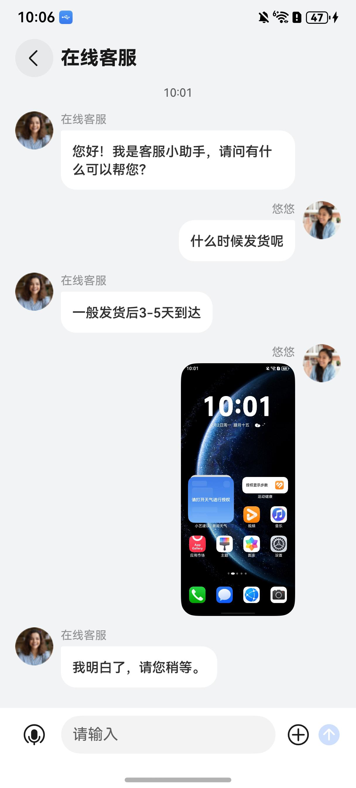
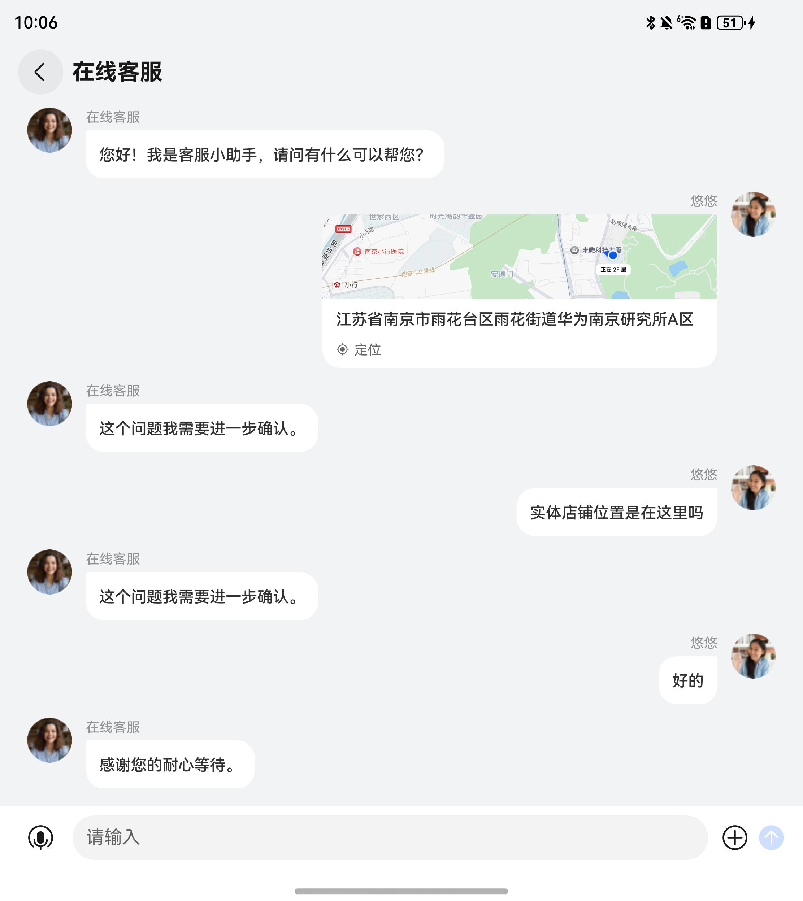
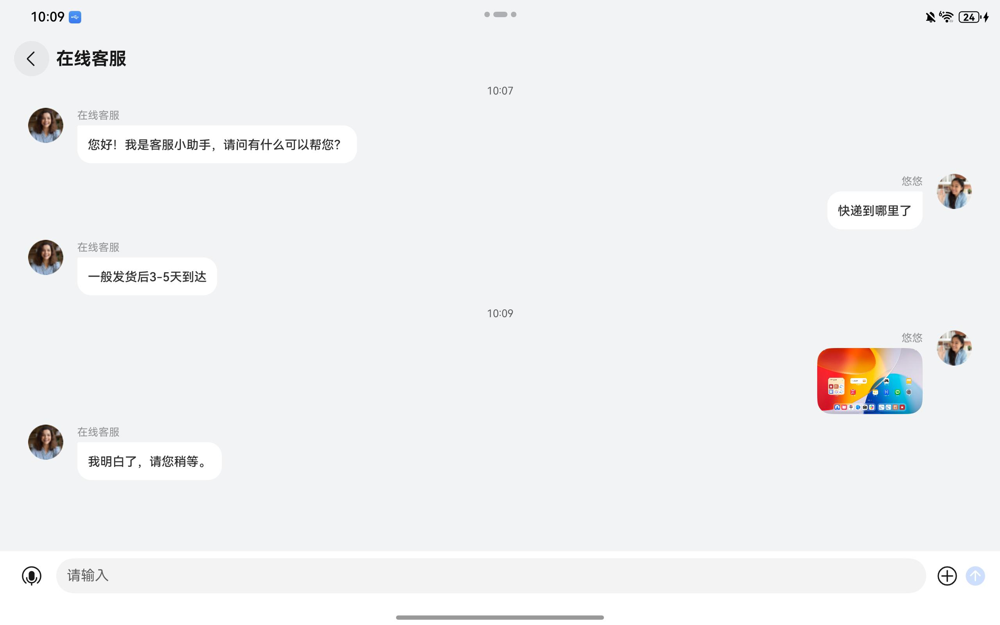
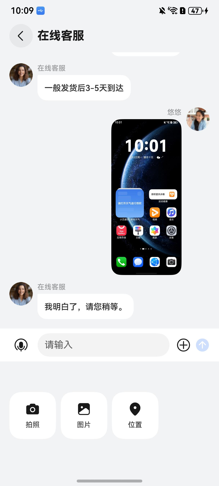
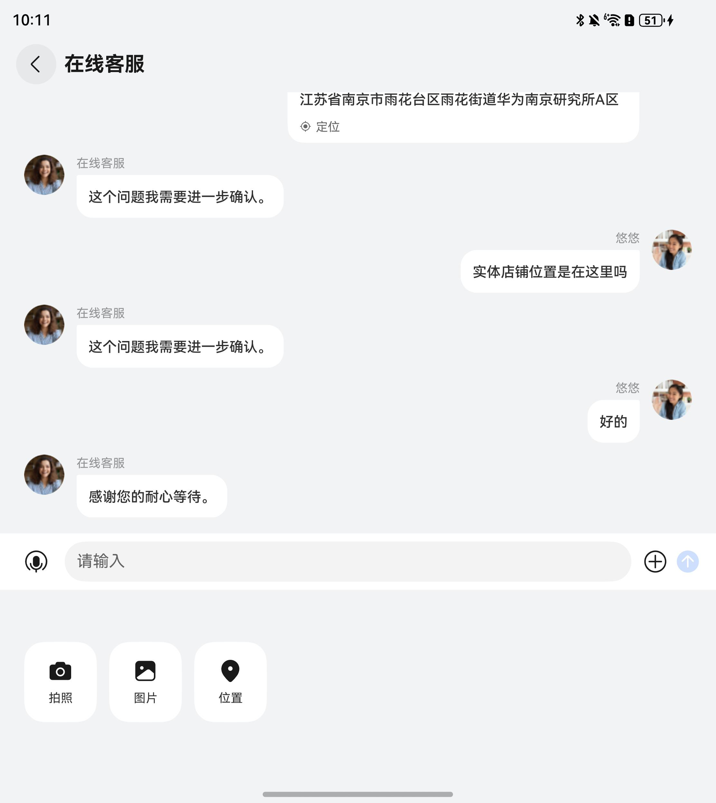
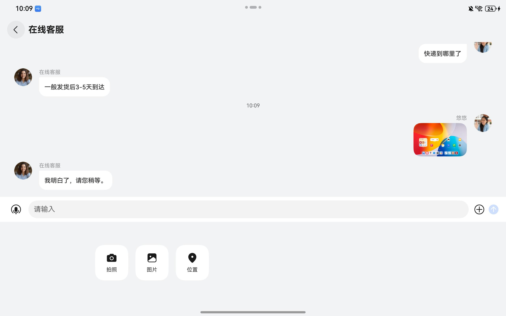

# 通用客服组件快速入门

## 目录

- [简介](#简介)
- [约束与限制](#约束与限制)
- [使用](#使用)
- [API参考](#API参考)
- [示例代码](#示例代码)

## 简介

本组件提供了原生的聊天交互界面，支持完整的客服对话功能，包括文字、表情、图片、地址等基础交互。

<div style='overflow-x:auto'>
  <table style='min-width:800px'>
    <tr>
      <th></th>
      <th>直板机</th>
      <th>折叠屏</th>
      <th>平板</th>
    </tr>
    <tr>
      <th scope='row'>聊天窗口</th>
      <td valign='top'></td>
      <td valign='top'></td>
      <td valign='top'></td>
    </tr>
    <tr>
      <th scope='row'>聊天输入</th>
      <td valign='top'></td>
      <td valign='top'></td>
      <td valign='top'></td>
    </tr>
  </table>
</div>

## 约束与限制

### 环境

- DevEco Studio版本：DevEco Studio 6.0.1 Release及以上
- HarmonyOS SDK版本：HarmonyOS 6.0.1 Release SDK及以上
- 设备类型：华为手机（包括双折叠和阔折叠）、平板
- 系统版本：HarmonyOS 6.0.1(21)及以上

### 权限

- 网络权限：ohos.permission.INTERNET
- 模糊位置权限：ohos.permission.APPROXIMATELY_LOCATION
- 位置权限：ohos.permission.LOCATION
- 麦克风权限：ohos.permission.MICROPHONE

## 使用

1. 安装组件。

   如果是在DevEco Studio使用插件集成组件，则无需安装组件，请忽略此步骤。

   如果是从生态市场下载组件，请参考以下步骤安装组件。

   a. 解压下载的组件包，将包中所有文件夹拷贝至您工程根目录的XXX目录下。

   b. 在项目根目录build-profile.json5添加image_preview和customer_service_chat模块。

   ```
   // 在项目根目录build-profile.json5填写image_preview和customer_service_chat路径。其中XXX为组件存放的目录名
   "modules": [
     {
       "name": "image_preview",
       "srcPath": "./XXX/image_preview"
     },
     {
       "name": "customer_service_chat",
       "srcPath": "./XXX/customer_service_chat"
     }
   ]
   ```
   c. 在项目根目录oh-package.json5中添加依赖。

    ```
    // XXX为组件存放的目录名称
    "dependencies": {
      "customer_service_chat": "file:./XXX/customer_service_chat"
    }
    ```

2. 引入通用客服组件句柄。

   ```
   import { AvatarInfo, ChatView } from 'customer_service_chat';
   ```

3. 调用组件，详细参数配置说明参见[API参考](#API参考)。

## API参考

### 接口

ChatView(options?: ChatViewOptions)

搜索组件。

**参数：**

| 参数名     | 类型                                      | 是否必填 | 说明       |
|:--------|:----------------------------------------|:-----|:---------|
| options | [ChatViewOptions](#ChatViewOptions对象说明) | 是    | 通用客服组件参数 |

### ChatViewOptions对象说明

| 参数名                    | 类型                                                                                                    | 是否必填 | 说明                 |
|:-----------------------|:------------------------------------------------------------------------------------------------------|:-----|:-------------------|
| serviceAvatarInfo      | [AvatarInfo](#AvatarInfo类型说明)                                                                         | 否    | 客服方头像信息            |
| userAvatarInfo         | [AvatarInfo](#AvatarInfo类型说明)                                                                         | 否    | 用户头像信息             |
| avatarParam            | [AvatarParam](#AvatarParam类型说明)                                                                       | 否    | 头像参数               |
| placeholder            | [ResourceStr](https://developer.huawei.com/consumer/cn/doc/harmonyos-references/ts-types#resourcestr) | 否    | 输入框默认提示文本，默认为‘请输入’ |
| featureSwitch          | [FeatureSwitch](#FeatureSwitch类型说明)                                                                   | 否    | 功能开关               |
| additionalFeatureItems | [FeatureItemConfig](#FeatureItemConfig类型说明)[]                                                         | 否    | 自定义输入框功能           |
| onChatAvatarClick      | (senderType: [SenderType](#SenderType枚举说明)) => void                                                   | 否    | 点击聊天头像回调函数         |

### AvatarInfo类型说明

| 参数名    | 类型          | 是否必填 | 说明                               |
|:-------|:------------|:-----|:---------------------------------|
| avatar | ResourceStr | 否    | 头像，默认为'app.media.avatar_grey'    |
| name   | ResourceStr | 否    | 昵称，默认为空                          |

### AvatarParam类型说明

| 参数名          | 类型                                                                                          | 是否必填 | 说明                                        |
|:-------------|:--------------------------------------------------------------------------------------------|:-----|:------------------------------------------|
| avatarSize   | number                                                                                      | 否    | 头像大小，默认为40                                |
| avatarRadius | [Length](https://developer.huawei.com/consumer/cn/doc/harmonyos-references/ts-types#length) | 否    | 头像圆角，默认为'sys.float.corner_radius_level10' |
| avatarMargin | number                                                                                      | 否    | 头像与聊天区域的间隔，默认为0                           |

### FeatureSwitch类型说明

| 名称           | 类型      | 是否必填 | 说明                   |
|:-------------|:--------|:-----|:---------------------|
| showCamera   | boolean | 否    | 是否显示拍照功能图标，默认为'true' |
| showPicture  | boolean | 否    | 是否显示相册功能图标，默认为'true' |
| showLocation | boolean | 否    | 是否显示位置功能图标，默认为'true' |

### FeatureItemConfig类型说明

| 名称            | 类型                                                                                                                                                                             | 是否必填 | 说明            |
|:--------------|:-------------------------------------------------------------------------------------------------------------------------------------------------------------------------------|:-----|:--------------|
| icon          | Resource                                                                                                                                                                       | 是    | 图标            |
| label         | ResourceStr                                                                                                                                                                    | 是    | 标签，最多展示两个字符   |
| isSymbolGraph | boolean                                                                                                                                                                        | 是    | 图标是否为symbol资源 |
| onClick       | (context?: [common.UIAbilityContext](https://developer.huawei.com/consumer/cn/doc/harmonyos-references/js-apis-inner-application-uiabilitycontext#uiabilitycontext-1)) => void | 是    | 点击事件函数        |

### SenderType枚举说明

| 名称               | 值                  | 说明  |
|:-----------------|:-------------------|:----|
| USER             | 'user'             | 用户方 |
| CUSTOMER_SERVICE | 'customer_service' | 客服方 |

## 示例代码

```
import { AvatarInfo, ChatView } from 'customer_service_chat';

@Entry
@ComponentV2
struct Index {
  @Local serviceAvatarInfo: AvatarInfo = {
    avatar: $r('app.media.startIcon'),
    name: '在线客服'
  }
  @Local userAvatarInfo: AvatarInfo = {
    avatar: $r('app.media.startIcon'),
    name: '悠悠'
  }

  build() {
    NavDestination() {
      ChatView({
        serviceAvatarInfo: this.serviceAvatarInfo,
        userAvatarInfo: this.userAvatarInfo,
      })
    }
    .backgroundColor($r('sys.color.comp_background_gray'))
    .expandSafeArea([SafeAreaType.KEYBOARD, SafeAreaType.SYSTEM])
    .title('在线客服')
  }
}
```