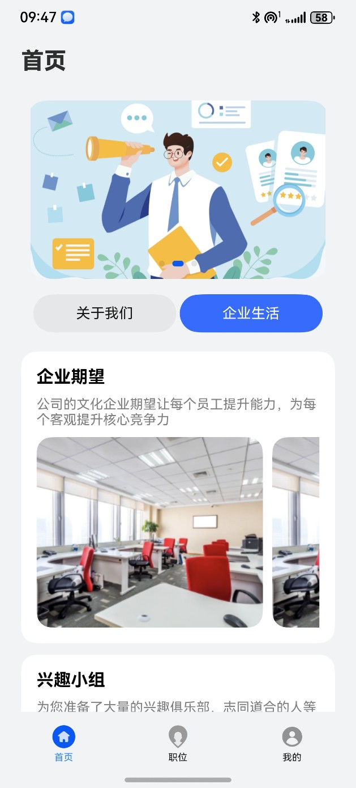
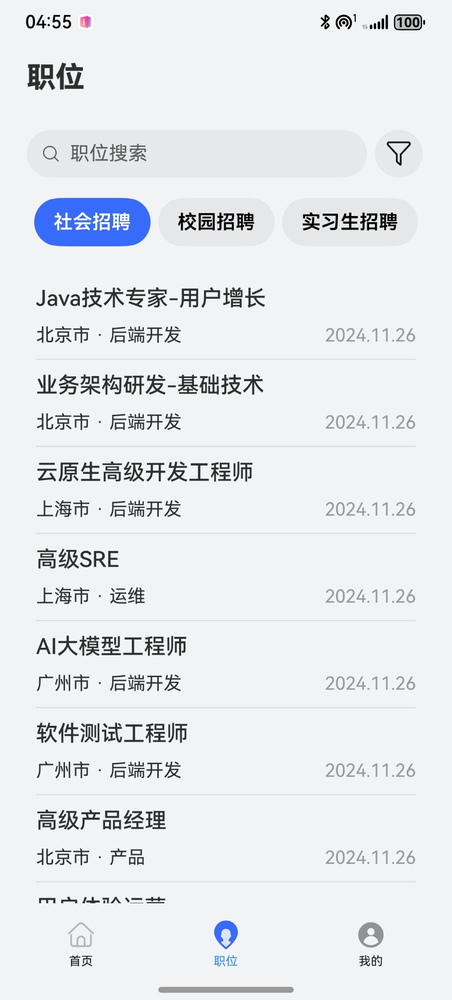
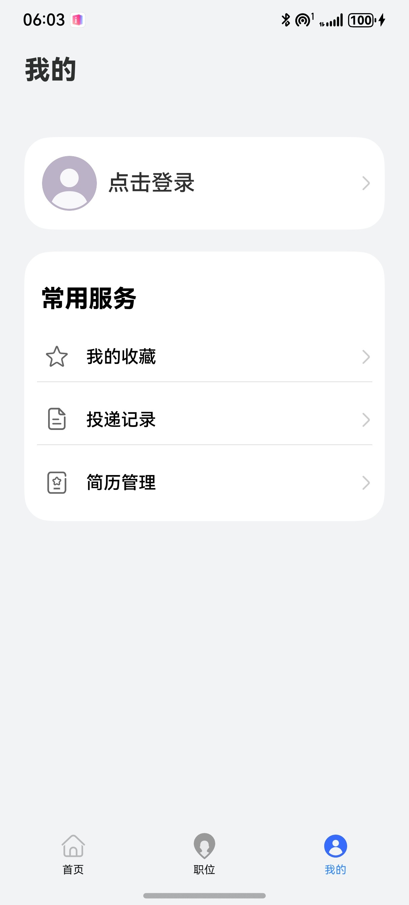

# 企业招聘模板

## 目录

- [功能介绍](#功能介绍)
- [环境要求](#环境要求)
- [快速入门](#快速入门)
- [示例效果](#示例效果)
- [权限要求](#权限要求)
- [开源许可协议](#开源许可协议)


## 功能介绍

本模板为企业招聘类应用提供了常用功能的开发样例，模板主要分首页、职位和我的三大模块：

* 首页：提供企业招聘banner轮播图、公司文化信息、企业生活等宣传介绍。

* 职位：支持不同地域和岗位类型的职位搜索、职位详情查看、简历投递和职位收藏功能。

* 我的：支持账号信息、简历信息、职位收藏信息和投递记录的查询和维护。

本模板已集成华为账号等服务，只需做少量配置和定制即可快速实现华为账号的登录功能。


| 首页                                                     | 门店                                                   | 我的                                               |
|--------------------------------------------------------|------------------------------------------------------|--------------------------------------------------|
|  |  |  |


本模板主要页面及核心功能如下所示：

```ts
企业招聘模板
 |-- 首页
 |    |-- 顶部轮播
 |    |-- 企业介绍tab
 |    |    └-- 关于我们
 |    |     |    |-- 公司简介
 |    |     |    |-- 企业文化
 |    |     |    |-- 企业愿景
 |    |     |    |-- 企业责任
 |    |     |    |-- 质量要求
 |    |     |-- 企业生活
 |    |     |    |-- 图文展示
 |-- 职位
 |    └-- 职位搜索
 |     |-- 职位过滤筛选
 |     |-- 职位列表
 |     |    └-- 职位详情
 |     |     |      └-- 职位收藏
 |     |     |       |-- 简历投递
 |     |     |       |     └-- 应聘者信息、简历上传
 └-- 我的
      |-- 华为账号一键登录/用户信息
      |-- 我的收藏
      |-- 投递记录
      |-- 简历管理
```


本模板工程代码结构如下所示：

```ts
EnterpriseRecruitment
  |- commons                                       // 公共层
  |   |- component/src/main/ets                    // 公共工具模块(har)
  |   |    |- clazz 
  |   |    |     AttachmentDatabase.ets            // 简历管理数据
  |   |    |     AvoidArea.ets                     // 规避区
  |   |    |     BasicDataSource.ets               // 数据操作监听
  |   |    |     DeliveryDatabase.ets              // 投递数据类
  |   |    |     DeliveryRecord.ets                // 投递记录类
  |   |    |     Divider.ets                       // 分割线
  |   |    |     FavoriteDatabase.ets              // 职位收藏类
  |   |    |     JobListItem.ets                   // 职位列表类
  |   |    |     MyDataSource.ets                  // 懒加载数据
  |   |    |     ResumeEntity.ets                  // 简历类
  |   |    |     UserContactInfo.ets               // 用户联系信息
  |   |    |     UserInfo.ets                      // 用户信息类
  |   |    |- component
  |   |    |     AdaptiveButton.ets                // 自适应按钮
  |   |    |     Avatar.ets                        // 头像
  |   |    |     FilterButton.ets                  // 过滤按钮
  |   |    |     LeftReturnComponent.ets           // 返回按钮
  |   |    |     PromptComponent.ets               // 提示弹框组件
  |   |    |     ResumeComponent.ets               // 简历
  |   |    |     SwiperComponent.ets               // 轮播图组件
  |   |    |     TitleBar.ets                      // 标题Bar
  |   |    |- constants 
  |   |    |     CommonContants.ets                // 公共常量
  |   |    └- utils 
  |   |          DateUtil.ets                      // 日期处理工具
  |   |          Logger.ets                        // 日志管理工具
  |- product                                       // 应用层  
  |   └- phone/src/main/ets                        // 主包(hap)                                                     
  |        |- entryability  
  |        |      |- EntryAbility.ets                                                                   
  |        |- information                          //  首页
  |        |      |- clazz 
  |        |      |      |-Article.ets             //  详情类
  |        |      |- AboutUs.ets                   //  关于我们二层tab
  |        |      |- Introductions.ets             //  企业生活二层tab
  |        |- mine                                 //  我的     
  |        |      |- MineListItem.ets              //  我的常用服务列表         
  |        |- pages                              
  |        |      |- jobRoute     
  |        |      |      |- JobDelivery.ets        //  简历投递页面   
  |        |      |      |- JobDetail.ets          //  职位详情页面   
  |        |      |- mine
  |        |      |   |- clazz                     
  |        |      |   |   |- QuickLoginInfo.ets    //  匿名手机号
  |        |      |   |- common            
  |        |      |   |   |- Constants.ets         //  我的-一键登录的Constants
  |        |      |   |   |- PrivacyAgreement.ets  //  我的-一键登录的隐私页
  |        |      |   |   |- ShowToast.ets         //  我的-统一ShowToast
  |        |      |   |- AvatarUpload.ets          //  头像修改  
  |        |      |   |- MyDelivery.ets            //  我的简历投递   
  |        |      |   |- MyFavorite.ets            //  我的收藏岗位  
  |        |      |   |- PersonalInformation.ets   //  个人信息页
  |        |      |   |- QuickLoginPage.ets        //  一键登录页
  |        |      |   |- ResumeManagement.ets      //  我的简历管理   
  |        |      |-    Index.ets                  //  入口   
  |        |      |-    Information.ets            //  导航tab（首页 页面）   
  |        |      |-    Job.ets                    //  导航tab（职位 页面）  
  |        |      |-    Mine.ets                   //  导航tab（我的 页面）                                                           
```

## 环境要求
### 软件
* DevEco Studio版本：DevEco Studio 5.0.0 Release及以上
* HarmonyOS SDK版本：HarmonyOS 5.0.0 Release SDK及以上
### 硬件
* 设备类型：华为手机（直板机）
* HarmonyOS版本：HarmonyOS 5.0.0 Release及以上

## 快速入门
###  配置工程
在运行此模板前，需要完成以下配置：

1. 在DevEco Studio中打开此模板。

2. 在AppGallery Connect创建应用，将包名配置到模板中。

   a. 参考[创建应用](https://developer.huawei.com/consumer/cn/doc/app/agc-help-createharmonyapp-0000001945392297)。

   b. 返回应用列表页面，查看应用的包名。

   c. 将模板工程根目录下AppScope/app.json5文件中的bundleName替换为创建应用的包名。

3. 配置华为账号服务。

   a. 将应用的client ID配置到phone模块的module.json5文件，详细参考：[配置Client ID](https://developer.huawei.com/consumer/cn/doc/harmonyos-guides/account-client-id)。

   b. [申请调试证书](https://developer.huawei.com/consumer/cn/doc/app/agc-help-add-debugcert-0000001914263178)，用于配置公钥指纹和调试时对应用签名。

   c. 添加公钥指纹，详细参考：[配置应用证书指纹](https://developer.huawei.com/consumer/cn/doc/app/agc-help-signature-info-0000001628566748#section5181019153511)。

   d. 如需获取用户真实手机号，需要申请phone权限，详细参考：[配置scope权限](https://developer.huawei.com/consumer/cn/doc/harmonyos-guides/account-config-permissions)，并在端侧使用快速验证手机号码Button进行[验证获取手机号码](https://developer.huawei.com/consumer/cn/doc/harmonyos-guides/account-get-phonenumber)。

###  定制说明
建议在如下业务场景，如果没有登录，则跳转至华为帐号一键登录界面：
* 点击收藏职位和投递简历时
* 在“我的”页签，点击“我的收藏”、“投递记录”和“简历管理”时

###  运行调试工程
1. 连接调试手机和PC。

2. 对应用签名：由于模板中集成了华为账号服务，所以需要采用[手工签名](https://developer.huawei.com/consumer/cn/doc/harmonyos-guides/ide-signing)。

3. 菜单选择“Run > Run 'phone' ”或者“Run > Debug 'phone' ”，运行或调试模板工程。

## 示例效果
- [首页-关于我们.jpg](pictures%2F%E9%A6%96%E9%A1%B5-%E5%85%B3%E4%BA%8E%E6%88%91%E4%BB%AC.jpg)
- [首页-企业生活.jpg](pictures%2F%E9%A6%96%E9%A1%B5-%E4%BC%81%E4%B8%9A%E7%94%9F%E6%B4%BB.jpg)
- [职位搜索功能.jpg](pictures%2F%E8%81%8C%E4%BD%8D%E6%90%9C%E7%B4%A2%E5%8A%9F%E8%83%BD.jpg)
- [职位筛选功能.jpg](pictures%2F%E8%81%8C%E4%BD%8D%E7%AD%9B%E9%80%89%E5%8A%9F%E8%83%BD.jpg)
- [职位详情页.jpg](pictures%2F%E8%81%8C%E4%BD%8D%E8%AF%A6%E6%83%85%E9%A1%B5.jpg)
- [简历投递.jpg](pictures%2F%E7%AE%80%E5%8E%86%E6%8A%95%E9%80%92.jpg)
- [我的-头像昵称修改.jpg](pictures%2F%E6%88%91%E7%9A%84-%E5%A4%B4%E5%83%8F%E6%98%B5%E7%A7%B0%E4%BF%AE%E6%94%B9.jpg)
- [我的-职位收藏记录.jpg](pictures%2F%E6%88%91%E7%9A%84-%E8%81%8C%E4%BD%8D%E6%94%B6%E8%97%8F%E8%AE%B0%E5%BD%95.jpg)
- [我的-职位投递记录.jpg](pictures%2F%E6%88%91%E7%9A%84-%E8%81%8C%E4%BD%8D%E6%8A%95%E9%80%92%E8%AE%B0%E5%BD%95.jpg) -
- [我的-简历管理-上传简历.jpg](pictures%2F%E6%88%91%E7%9A%84-%E7%AE%80%E5%8E%86%E7%AE%A1%E7%90%86-%E4%B8%8A%E4%BC%A0%E7%AE%80%E5%8E%86.jpg)
- [我的-简历管理-重命名 删除.jpg](pictures%2F%E6%88%91%E7%9A%84-%E7%AE%80%E5%8E%86%E7%AE%A1%E7%90%86-%E9%87%8D%E5%91%BD%E5%90%8D%20%E5%88%A0%E9%99%A4.jpg)

## 权限要求
* 网络权限：ohos.permission.INTERNET


## 开源许可协议

该代码经过[Apache 2.0 授权许可](http://www.apache.org/licenses/LICENSE-2.0)。

