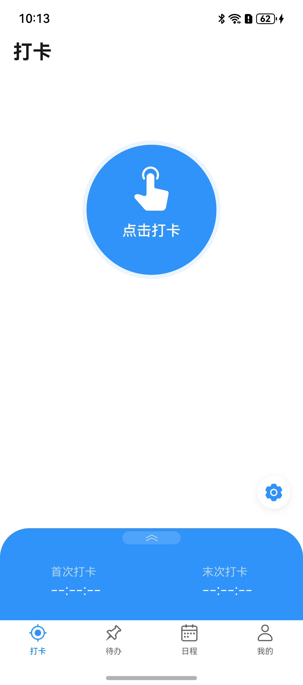
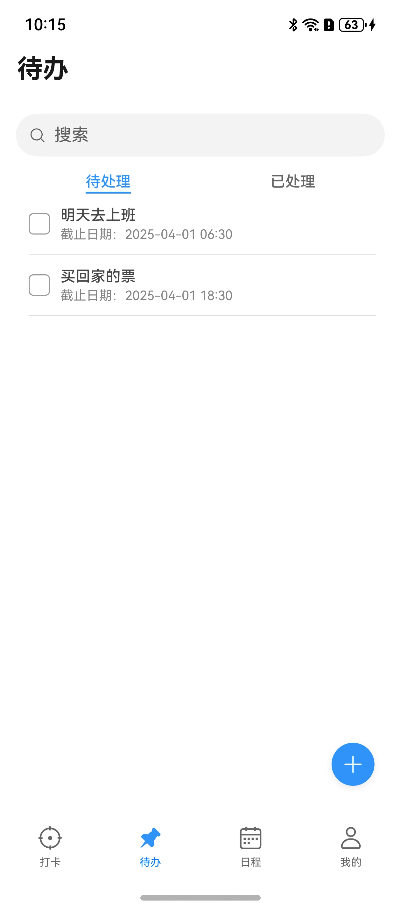
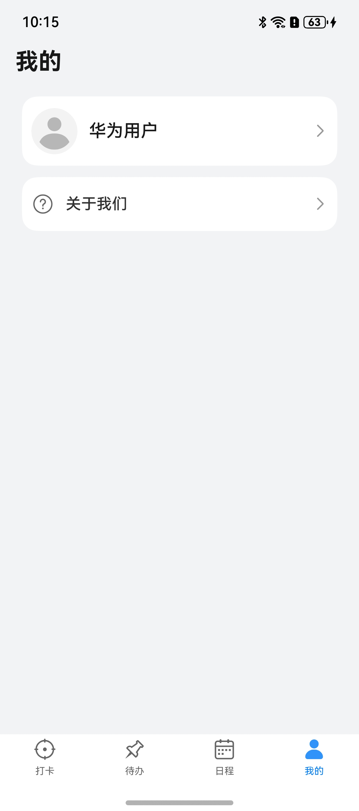

# 商务（办公考勤）行业模板快速入门

## 目录


- [功能介绍](#功能介绍)
- [环境要求](#环境要求)
- [快速入门](#快速入门)
- [示例效果](#示例效果)
- [权限要求](#权限要求)
- [开源许可协议](#开源许可协议)

## 功能介绍


本模板为商务办公考勤类应用提供了常用功能的开发样例，模板主要分打卡、待办、日程、我的四大模块：

* 打卡：提供考勤打卡、打卡记录查看、快捷打卡设置功能。

* 待办：提供日常待办任务的管理，支持待办创建、修改，列表显示待处理与已处理待办记录。

* 日程：提供日常日程管理，支持创建、修改日程以及同步日程至系统日历进行提醒。

* 我的：提供账号信息查看、头像修改、退出登录功能。

本模板已集成华为账号、地图、日历等服务，只需做少量配置和定制即可快速实现华为账号的登录、考勤打卡、待办和日程管理等功能。


| 打卡                             | 待办                            | 日程                              | 我的                          |
|--------------------------------|-------------------------------|---------------------------------|-----------------------------|
|  |  |  |  |


本模板主要页面及核心功能如下所示：

```ts
办公考勤模板
 |-- 打卡
 |    |-- 打卡
 |    |-- 打卡记录查看
 |    |-- 快捷打卡设置
 |-- 待办
 |    |-- 待处理列表
 |    |    |    └-- 搜索
 |    |-- 已处理列表
 |    |    |    └-- 搜索
 |    |-- 待办创建
 |    |    |    └-- 附件上传
 |    |-- 待办修改
 |    |    |-- 待办删除
 |    |    |-- 附件上传
 |    |    └-- 子代办创建
 |-- 日程
 |    |-- 搜索
 |    |-- 月日历视图
 |    |-- 周日历视图
 |    |-- 日程创建
 |    |    |    └-- 地图选点
 |    └-- 日程详情
 |              └-- 日程删除
 |              └-- 日程修改
 |              └-- 地图选点
 └-- 我的
      |-- 用户信息
      └-- 关于我们
```


本模板工程代码结构如下所示：

```ts
office_attendance
  |- commons                                         // 公共层
  |   |- commonlib/src/main/ets                      // 公共工具模块(har)
  |   |    |- constants 
  |   |    |     CheckInStatus.ets                   // 登录状态常量
  |   |    |     CommonContants.ets                  // 公共常量
  |   |    |     CommonEnum.ets                      // 公共枚举
  |   |    └- utils 
  |   |    |     AccountUtil.ets                     // 账号管理工具
  |   |    |     BreakpointType.ets                  // 断点类型  
  |   |    |     DataPreferencesUtils.ets            // 本地存储工具 
  |   |    |     DateUtil.ets                        // 日志工具 
  |   |    |     FormatUtil.ets                      // 日历、图片等格式管理工具
  |   |    |     GlobalRegister.ets                  // 全局对象注册容器
  |   |    |     LocationUtil.ets                    // 定位管理工具
  |   |    |     Logger.ets                          // 日志管理工具
  |   |    |     PermissionStatus.ets                // 权限状态工具
  |   |    |     RouterModule.ets                    // 路由管理类
  |   |    |     StringUtil.ets                      // 字符串工具
  |   |    |     VibratorUtil.ets                    // 打卡震动工具
  |   |    |     WindowUtil.ets                      // 窗口管理工具
  |   |    |- viewmodel 
  |   |    |     AppStorageData.ets                  // 应用公共数据类型
  |   |    |     MainEntryVM.ets                     // 路由工具
  |   |  
  |   |- componentlib/src/main/ets                   // 公共组件模块(har)
  |   |     └- components 
  |   |     |    BlankBackground.ets                 // 弹框背景组件             
  |   |     |    CalenderView.ets                    // 日历组件         
  |   |     |    CustomDialog.ets                     // 弹框组件          
  |   |     |    TitleBar.ets                        // 公共头组件    
  |   |     └- types      
  |   |          DateElement.ets                     // 年月日数据类型         
  |   |          DateTimeElement.ets                 // 年月日时分秒数据类型 
  |   |   
  |   └- network/src/main/ets                        // 网络模块(har)
  |        |- apis                                   // 网络接口  
  |        |- mocks                                  // 数据mock   
  |        |- models                                 // 网络库封装    
  |        └- types                                  // 请求和响应类型   
  |
  |- product                                         // 应用层  
  |   └- phone/src/main/ets                          // 主包(hap)    
  |        |- constants        
  |        |    Constants.ets                        // 导航常量                                                                                 
  |        |- entryability                                                                     
  |        |    EntryAbility.ets                     // 应用入口页                                     
  |        |- pages                              
  |        |    Login.ets                            // 账号登录页面
  |        |    MainEntry.ets                        // 主页面
  |        |- phoneformability                       
  |        |    PhoneFormAbility.ets                 // 打卡卡片
  |        └- servicecard                                   
  |             |- pages       
  |             |    AttendanceCard.ets              // 考勤组件
  |             |- view       
  |             |    CardListComponent.ets           // 考勤记录组件 
  |             └- viewmodel       
  |                  CardListParameter.ets           // 考勤记录参数           
  |                                            
  └- scenes                                          // 特性场景层
      |- account/src/main/ets                        // 账号场景组件（har）     
      |    |- accountbinding  
      |    |    About.ets                            // 关于页面
      |    |    LoginView.ets                        // 账号登录页
      |    |    MineView.ets                         // 我的主页面                       
      |    └- api    
      |         RequestProxy.ets                     // 登录接口代理对象                                        
      |- agency/src/main/ets                         // 账号绑定场景组件（har）
      |    |- agency                                 // 常量
      |    |    └- components                             
      |    |         AgencyTaskCalender.ets          // 待办时间设置组件
      |    |         AttachUpload.ets                // 待办附件上传组件
      |    |         PlanTimeSetting.ets             // 待办计划时间组件
      |    |         TimeSelector.ets                // 待办计划时间选择组件                              
      |    |    AddAgencyTask.ets                    // 待办新增页面
      |    |    AgencyTaskListItem.ets               // 待办列表组件
      |    |    EditAgencyTask.ets                   // 待办编辑页面
      |    |    AgencyTaskView.ets                   // 待办主页面
      |    |- api                                    // 待办接口代理
      |    └- types                                  // interface类型定义 
      |- checkin/src/main/ets                        // 签到场景组件（har）
      |    |- api                                    // 签到接口代理    
      |    |- checkin                               
      |    |    |- components   
      |    |    |    CheckInComponent.ets            // 签到组件             
      |    |    |    CheckInHistory.ets              // 签到历史组件        
      |    |    |    CheckInHistoryItem.ets          // 签到单行记录组件        
      |    |    |    CheckInSettings.ets             // 签到设置组件
      |    |    |    CheckInTimeDetail.ets           // 签到详情组件        
      |    |    |    CheckInTimeDetailItem.ets       // 签到单条记录组件
      |    |    └- util
      |    |         CheckInChannelUtil.ets          // 签到渠道工具
      |    |         ServiceCardNotificationUtil.ets // 服务卡片通知工具                             
      |    |    CheckInView.ets                      // 签到主页面
      |    └- types                                  // interface类型定义
      └- schedule/src/main/ets                       // 账号绑定场景组件（har）
           |- api                                    // 日程接口代理   
           |- constants                              // 常量        
           |- schedule                      
           |    └- components         
           |         ReminderDialog.ets              // 日程提醒组件
           |         ScheduleForm.ets                // 日程新增/编辑表单组件
           |         ScheduleItem.ets                // 日程记录卡片组件
           |         ScheduleTitle.ets               // 日程头组件
           |    EditSchedule.ets                     // 日程编辑页面
           |    NewSchedule.ets                      // 日程新增页面
           |    ScheduleDetail.ets                   // 日程详情月面
           |    ScheduleView.ets                     // 日程主页面
           |- types                                  // interface类型定义
           └- utils                                
               ScheduleUtils.ets                     // 日程日历操作工具
```


## 环境要求

### 软件
* DevEco Studio版本：DevEco Studio 5.0.0 Release及以上
* HarmonyOS SDK版本：HarmonyOS 5.0.0 Release SDK及以上
### 硬件
* 设备类型：华为手机（直板机）
* HarmonyOS版本：HarmonyOS 5.0.0 Release及以上


## 快速入门

###  配置工程
在运行此模板前，需要完成以下配置：

1. 在DevEco Studio中打开此模板。

2. 在AppGallery Connect创建应用，将包名配置到模板中。

   a. 参考[创建应用](https://developer.huawei.com/consumer/cn/doc/app/agc-help-createharmonyapp-0000001945392297)。

   b. 返回应用列表页面，查看应用的包名。

   c. 将模板工程根目录下AppScope/app.json5文件中的bundleName替换为创建应用的包名。

3. 配置华为账号服务。

   a. 将应用的client ID配置到phone模块的module.json5文件，详细参考：[配置Client ID](https://developer.huawei.com/consumer/cn/doc/harmonyos-guides/account-client-id)。

   b. 添加公钥指纹，详细参考：[配置应用证书指纹](https://developer.huawei.com/consumer/cn/doc/app/agc-help-signature-info-0000001628566748#section5181019153511)。

   c. 如需获取用户真实手机号，需要申请phone权限，详细参考：[配置scope权限](https://developer.huawei.com/consumer/cn/doc/harmonyos-guides/account-config-permissions)，并在端侧使用快速验证手机号码Button进行[验证获取手机号码](https://developer.huawei.com/consumer/cn/doc/harmonyos-guides/account-get-phonenumber)。

4. 配置地图服务。

   a. 将应用的client ID配置到phone模块的module.json5文件，如果华为账号服务已配置，可跳过此步骤。

   b. 添加公钥指纹，如果华为账号服务已配置，可跳过此步骤。

   c. [开通地图服务](https://developer.huawei.com/consumer/cn/doc/harmonyos-guides/map-config-agc)。

###  定制工程
本工程目前纯端侧运行，应用打开后操作数据在内存中保存，应用关闭后数据自动消失，如需实现端云开发，请参考如下步骤进行修改：
1. 在commons/network/src/main/ets/apis/HttpApis.ets文件中添加云侧方法实现。

2. 配置commons/common_lib/src/main/ets/constants/CommonContants.ets文件中BASE_URL为实际调用云侧地址。

3. 修改scenes/account、scenes/agency、scenes/checkin、scenes/schedule模块中RequestProxy.ets中方法，调用上述添加的方法。

###  运行调试工程
1. 连接调试手机和PC。

2. 对应用签名：由于模板中集成了华为账号、地图等服务，所以需要采用[手工签名](https://developer.huawei.com/consumer/cn/doc/harmonyos-guides-V5/ide-signing-V5#section297715173233)。

3. 菜单选择“Run > Run 'phone' ”或者“Run > Debug 'phone' ”，运行或调试模板工程。

## 示例效果
[功能展示录屏](./screenshots/screen recording.mp4)


## 权限要求
* 获取位置权限：ohos.permission.APPROXIMATELY_LOCATION
* 网络权限：ohos.permission.INTERNET
* 震动权限：ohos.permission.VIBRATE
* 后台任务权限：ohos.permission.KEEP_BACKGROUND_RUNNING
* 隐私窗口权限：ohos.permission.PRIVACY_WINDOW


## 开源许可协议

该代码经过[Apache 2.0 授权许可](http://www.apache.org/licenses/LICENSE-2.0)。

