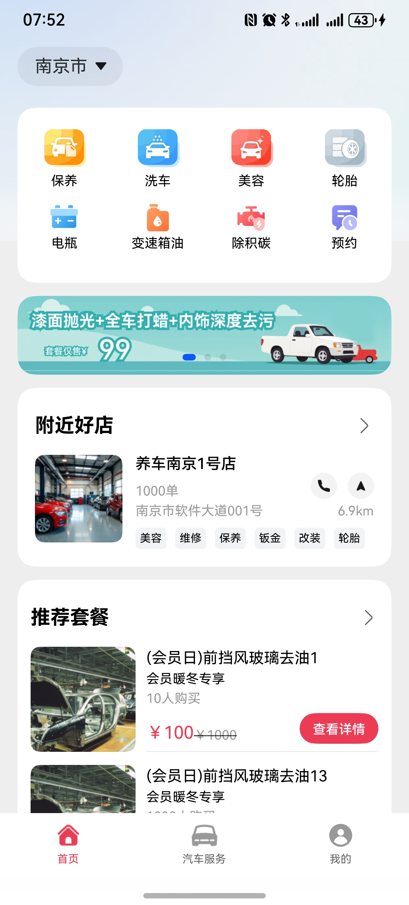
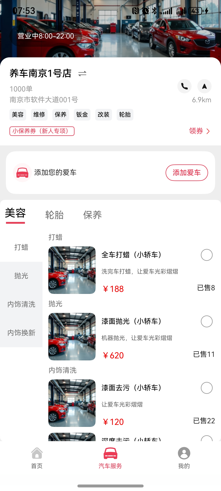
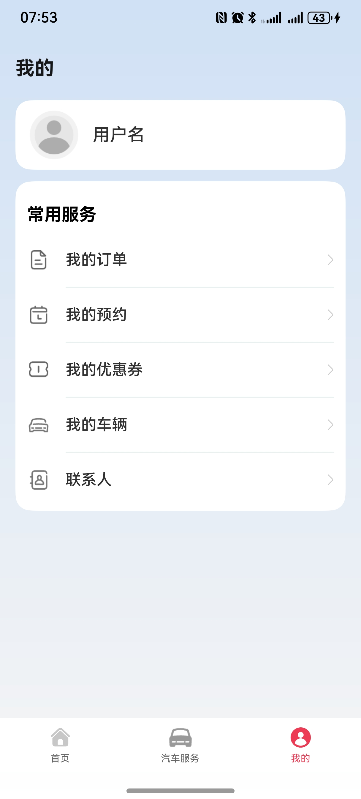
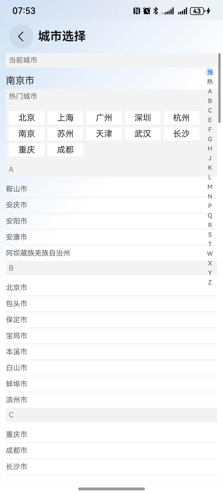
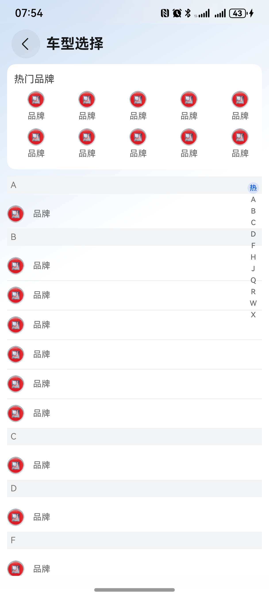
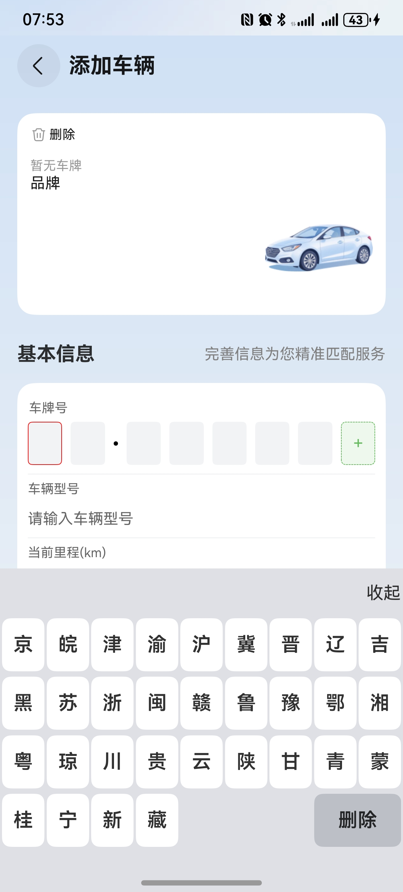

# 汽车（美容）行业模板

## 目录

- [功能介绍](#功能介绍)
- [环境要求](#环境要求)
- [快速入门](#快速入门)
- [示例效果](#示例效果)
- [权限要求](#权限要求)
- [开源许可协议](#开源许可协议)


## 功能介绍


本模板为汽车美容保养类应用提供了常用功能的开发样例，模板主要分首页、汽车服务和我的三大模块：

* 首页：提供附近店铺和推荐套餐的展示，支持保养、美容、预约等功能。

* 汽车服务：展示不同的优惠券、以及详细展示汽车美容、轮胎护理、保养等服务功能。

* 我的：展示我的订单、我的预约、我的优惠券、我的车辆、联系人信息

本模板已集成华为账号、地图服务，只需做少量配置和定制即可快速实现华为账号登录、店铺定位、基于位置查找店铺等功能。


| 首页                                      | 汽车服务                                        | 我的                              |
|-----------------------------------------|---------------------------------------------|---------------------------------|
|  |  |  |


| 城市选择                                      | 品牌选择                                         | 车牌键盘                                  |
|-------------------------------------------|----------------------------------------------|---------------------------------------|
|  |  |  |

本模板主要页面及核心功能如下所示：

```ts
汽车美容模板
 |-- 首页
 |    |-- 功能选择
 |    |      |-- 保养
 |    |      |-- 美容
 |    |      |-- 电瓶
 |    |      |-- 除积碳
 |    |      |-- 洗车
 |    |      |-- 轮胎 
 |    |      |-- 变速箱油
 |    |      |-- 预约
 |    |-- 滚动广告
 |    |    └-- 广告详情
 |    |-- 附近好店
 |    |    └-- 门店列表
 |    |-- 推荐套餐
 |    |    └-- 套餐列表
 |    |
 |-- 汽车服务
 |    |-- 店铺介绍
 |    |-- 领券
 |    |-- 添加爱车
 |    |
 |    |-- 服务项目
 |    |      |-- 美容
 |    |      |-- 轮胎
 |    |      └-- 保养
 |    |
 └-- 我的
      |-- 我的订单
      |-- 我的预约
      |-- 我的优惠券
      |-- 我的车辆
      └-- 联系人信息
           └-- 添加联系人信息
```


本模板工程代码结构如下所示：

```ts
car_beauty_care
  |- commons                                       // 公共层
  |   |- commonlib/src/main/ets                    // 公共工具模块(har)
  |   |    |- constants 
  |   |    |     CommonContants.ets                // 公共常量
  |   |    |     CommonEnum.ets                    // 公共枚举
  |   |    |     Constants.ets                     // 异常类常量 
  |   |    |     ShowToast.ets                     // 错误提示处理工具
  |   |    |- model 
  |   |    |     CommonModel.ets                   // 地理位置获取
  |   |    └- utils 
  |   |          AccountUtil.ets                   // 账号管理工具
  |   |          FormatUtil.ets                    // 日历、图片等格式管理工具
  |   |          LocateUtil                        // 定位工具类
  |   |          Logger.ets                        // 日志管理工具
  |   |          PermissionUtil.ets                // 授权申请类
  |   |          PickerUtil.ets                    // 相机工具类
  |   |          PromptActionClass.ets             // 操作管理类
  |   |          RouterModule.ets                  // 路由管理类
  |   |          
  |   |- componentlib/src/main/ets                 // 公共组件模块(har)
  |   |    |- components 
  |   |    |     AddCar.ets                        // 添加爱车组件
  |   |    |     ShopMap.ets                       // 店铺地图
  |   |    |     TitleBarView.ets                  // 标题栏
  |   |    └- dialog 
  |   |    |     BindPhoneDialog.ets               // 手机号验证
  |   |    | 
  |   └- network/src/main/ets                      // 网络模块(har)
  |        |- apis                                 
  |        |     HttpApis                          // 通信封装
  |        |     
  |        |- constants                            
  |        |     NetworkEnums.ets                  // 地址常量
  |        |  
  |        |- mocks                                  
  |        |     HttpApisMock.ets                  // 模拟用户信息
  |        |     MockRequestMap.ets                // 模拟用户发送请求
  |        |  
  |        |- models                                 
  |        |     AxiosHttpModel.ets                // 网络请求封装
  |        |     AxiosRequest.ets                // 请求实例 
  |        |
  |        └- types                                 
  |        |     RequestTypes.ets                  // 请求类型
  |        |     ResponseTypes.ets                 // 响应类型
  |        |    
  |- products                                      // 公共入口层
  |   |- entry/src/main/ets                   
  |   |    |- components  
  |   |    |     AtomicWeb.ets                     // WebView 组件  
  |   |    |     Drawer.component.ets              // 商品列表组件  
  |   |    |     MineView.ets                      // 我的
  |   |    |     ProductCardComponent.ets          // 产品卡片 
  |   |    |     ProductDetail.ets                 // 产品细节 
  |   |    |     ShoppingCar.ets                   // 购物车 
  |   |    |  
  |   |    |- constants 
  |   |    |     Constants.ets                     // 汽车服务常量
  |   |    |  
  |   |    |- entryability 
  |   |    |     EntryAbility.ets                  // 应用窗口初始化
  |   |    |  
  |   |    |- pages 
  |   |    |     |- car
  |   |    |          CarView.ets                  // 车辆展示页面   
  |   |    |     |- home
  |   |    |          HomeView.ets                 // 车辆展示页面    
  |   |    |     |- mine
  |   |    |          MineView.ets                 // 我的页面
  |   |    |  
  |   |    └- types 
  |   |          Types.ets                         // 列表服务接口 
  |   |                                         
  |- scenes                                         // 特性层
  |   |- cityselect/src/main/ets                   // 城市选择模块
  |   |    |- components                           
  |   |    |    CitySelectView.ets                 // 城市选择页面 
  |   |    └- model                               
  |   |    |    CityData.ets                       // 城市数据信息
  |   |    |    
  |   |- contact/src/main/ets                       
  |   |    |- components                            
  |   |    |    AddContact.ets                     // 添加联系人
  |   |    |    ContactCard.ets                    // 联系人卡片
  |   |    |    ContactPage.ets                    // 联系人页面
  |   |    └- mode                               
  |   |    |    ContactModel.ets                   // 联系人模型
  |   |    |    ContactVM.ets                      // 添加联系人逻辑
  |   |    |     
  |   |- couPon/src/main/ets                       // 优惠券模块
  |   |    |- components                            
  |   |    |    CouponCard.ets                     // 优惠券卡片 
  |   |    |    CouponDetail.ets                   // 优惠券细节
  |   |    |    CouponDialog.ets                   // 优惠券展示 
  |   |    |    MyCouponList.ets                   // 优惠券展示列表   
  |   |    └- mode                               
  |   |    |    CouponModel.ets                    // 优惠券模型
  |   |    |    CouponVM.ets                       // 优惠券处理逻辑   
  |   |    | 
  |   |- garage/src/main/ets                       // 优惠券模块
  |   |    |- components                           
  |   |    |    CarSelect.ets                      // 汽车选择
  |   |    |    CaragePage.ets                     // 仓库页面
  |   |    |    SettingCard.ets                    // 车辆设置 
  |   |    |- constants                           
  |   |    |    car.ets                            // 汽车品牌常量 
  |   |    └- mode                               
  |   |    |    VehicleModel.ets                   // 汽车模型
  |   |    |    VehicleVM.ets                      // 汽车逻辑处理   
  |   |       
  |   |- makeAppointment/src/main/ets              // 预约模块 
  |   |    |- components                 
  |   |    |    AppointmentCard.ets                // 预约展示卡片
  |   |    |    AppointmentTimePicker.ets          // 预约时间选择
  |   |    |    AppointmentView.ets                // 预约展示 
  |   |    |    AppointSuccess.ets                 // 预约成功 
  |   |    |    MyAppointment.ets                  // 我的预约 
  |   |    |    ReservedCard.ets                   // 预约卡片 
  |   |    |    ReservedCardList.ets               // 预约卡片列表   
  |   |    └- model                               
  |   |    |    AppointmentModel.ets               // 预约模型 
  |   |    |    AppointmentVM.ets                  // 预约逻辑  
  |   |     
  |   |- order/src/main/ets                        // 订单模块 
  |   |    |- components                 
  |   |    |    ConfirmOrder.ets                   // 确认订单
  |   |    |    OrderCard.ets                      // 订单卡片
  |   |    |    OrderCardList.ets                  // 订单列表
  |   |    |    PendingPayment.ets                 // 等待付款
  |   |    |    PendingPayOrder.ets                // 待付款订单
  |   |    |    ProductItem.ets                    // 产品信息
  |   |    └- model                               
  |   |    |    OrderVM.ets                        // 订单处理逻辑
  |   |    
  |   |- package/src/main/ets                      // 推荐套餐模块
  |   |    |- components                 
  |   |    |    PackageDetailView.ets              // 套餐详情 
  |   |    |    PackagesCardView.ets               // 套餐卡片
  |   |    |    PackageView.ets                    // 套餐列表
  |   |    └- model                               
  |   |    |    packageModel.ets.                  // 套餐类模型
  |   |    |    PackageVM.ets.ets                  // 套餐逻辑处理
  |   |        
  |   |- product/src/main/ets                      // 服务产品模块
  |   |    └- model                               
  |   |         ProductData.ets                    // 产品类信息 
  |   |         ProductVM.ets                      // 服务产品逻辑处理
  |   |   
  |   |- shop/src/main/ets                         // 店铺模块
  |   |    |- components                 
  |   |    |    ShopCardView.ets                   // 店铺卡片
  |   |    |    ShopView.ets                       // 门店展示列表
  |   |    └- model                               
  |   |    |    LocationVM.ets                     // 城市位置信息及店铺处理逻辑
  |   |    |    ShopModel.ets                      // 店铺类属性 
  |   |- carKeyboard/src/main/ets                  // 自定义车牌键盘
  |   |    |- components                 
  |   |    |    CarKeyboard.ets                    // 自定义车牌键盘
```


## 环境要求
### 软件
* DevEco Studio版本：DevEco Studio 5.0.0 Release及以上
* HarmonyOS SDK版本：HarmonyOS 5.0.0 Release SDK及以上
### 硬件
* 设备类型：华为手机（直板机）
* HarmonyOS版本：HarmonyOS 5.0.0 Release及以上


## 快速入门

###  配置工程
在运行此模板前，需要完成以下配置：

1. 在DevEco Studio中打开此模板。

2. 在AppGallery Connect创建应用，将包名配置到模板中。

   a. 参考[创建应用](https://developer.huawei.com/consumer/cn/doc/app/agc-help-createharmonyapp-0000001945392297)。

   b. 返回应用列表页面，查看应用的包名。

   c. 将模板工程根目录下AppScope/app.json5文件中的bundleName替换为创建应用的包名。

3. 配置华为账号服务。

   a. 将应用的client ID配置到entry模块的module.json5文件，详细参考：[配置Client ID](https://developer.huawei.com/consumer/cn/doc/harmonyos-guides/account-client-id)。

   b. 添加公钥指纹，详细参考：[配置应用证书指纹](https://developer.huawei.com/consumer/cn/doc/app/agc-help-signature-info-0000001628566748#section5181019153511)。

4. 配置地图服务。

   a. 将应用的client ID配置到entry模块的module.json5文件，如果华为账号服务已配置，可跳过此步骤。

   b. 添加公钥指纹，如果华为账号服务已配置，可跳过此步骤。

   c. [开通地图服务](https://developer.huawei.com/consumer/cn/doc/harmonyos-guides/map-config-agc)。


## 示例效果

[功能展示录屏](./picture/car_video.mp4)

## 权限要求

* 获取位置权限：ohos.permission.APPROXIMATELY_LOCATION，ohos.permission.LOCATION。
* 网络权限：ohos.permission.INTERNET

### 定制说明
1. 一键登录功能在我的页面点击默认头像可以实现跳转
2. 点击用户名可以跳转到修改头像和昵称页面
3. 目前在未登录状态下就可以实现预约、购买、领取优惠券等功能，建议在预约、购买、领取优惠券等场景下增加一键登录跳转提示

## 开源许可协议

该代码经过[Apache 2.0 授权许可](http://www.apache.org/licenses/LICENSE-2.0)。

