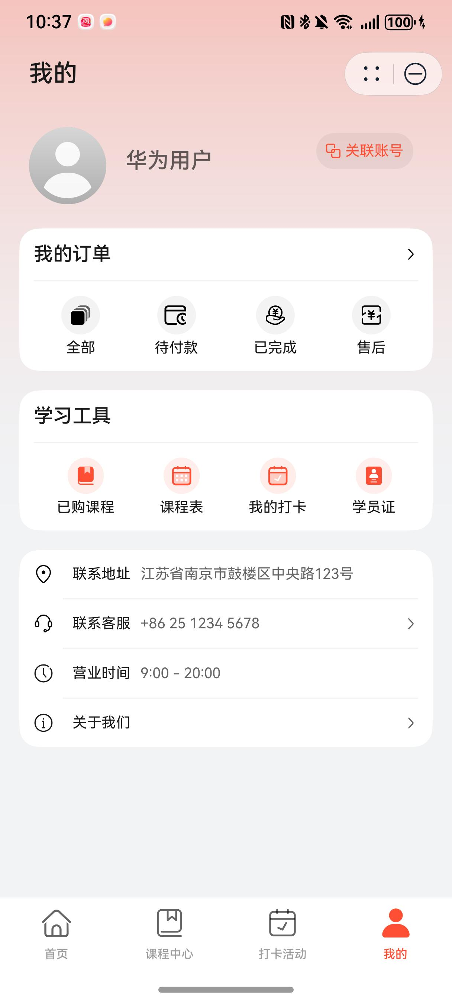
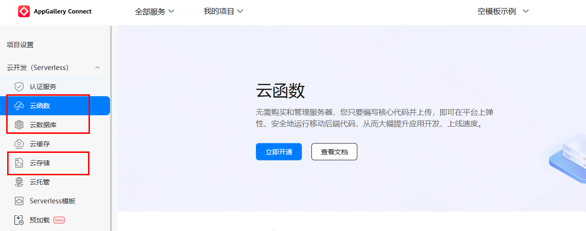
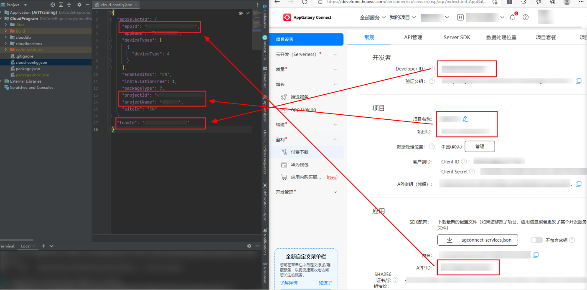
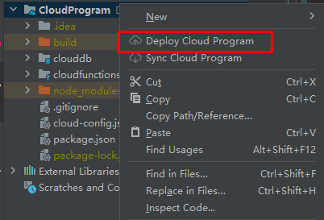
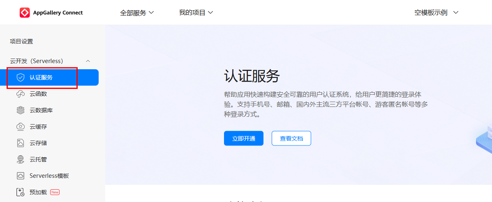
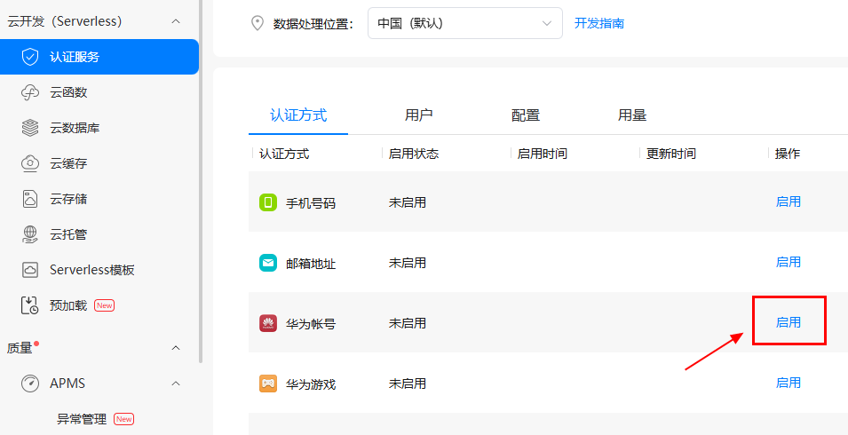
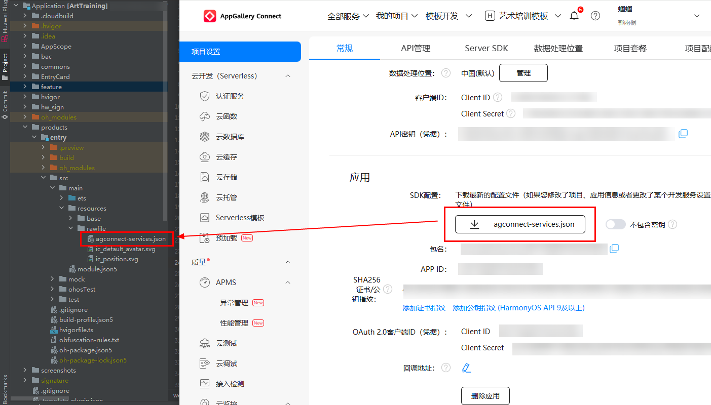
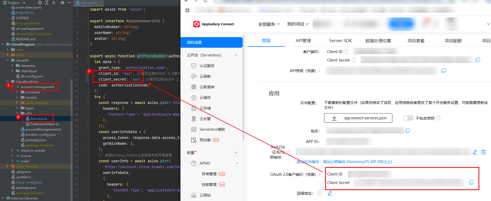
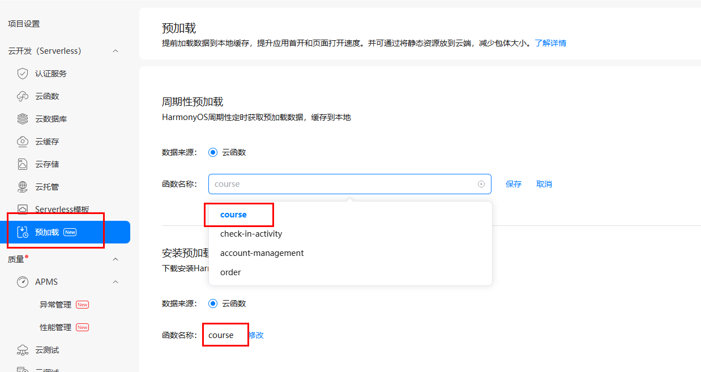

# 教育（艺术培训）行业模板快速入门

## 目录

- [功能介绍](#功能介绍)
- [环境要求](#环境要求)
- [快速入门](#快速入门)
- [示例效果](#示例效果)
- [权限要求](#权限要求)
- [开源许可协议](#开源许可协议)

## 功能介绍

本模板为艺术培训类元服务提供了常用功能的开发样例，模板主要分首页、课程中心、打卡活动和我的四大模块：

- 首页：提供课程中心、直播课程、关于我们和附近门店功能入口，展示直播课程列表和热门课程列表，展示门店位置地图和门店信息。
- 课程中心：展示用户可购买的课程列表，支持课程搜索、过滤和排序功能，支持课程详情查看和下单。
- 打卡活动：展示用户可参与的打卡列表，支持参与打卡活动并上传打卡内容，支持查看历史打卡记录。
- 我的：展示用户个人头像及昵称，支持个人资料编辑，支持订单管理、个人课程和打卡活动查看、课程表查看、学员卡查看等。

本模板为端云一体化模板，已集成华为账号、地图、日历、支付等服务，只需做少量配置和定制即可快速实现课程购买、打卡活动参与、课程表查看等功能。

| 首页                                   | 课程中心                                 | 打卡活动                                  | 我的                                   |
| -------------------------------------- | ---------------------------------------- | ----------------------------------------- | -------------------------------------- |
|  |  |  |  |

本模板主要页面及核心功能如下所示：

```ts
艺术培训模板
  |-- 首页	
  |    |-- 轮播图		
  |    |-- 核心功能入口(专栏列表、热门课程、关于我们、附近门店)	
  |    |-- 直播课程列表
  |    |-- 热门课程列表
  |    └-- 商家信息	
  |  
  |-- 课程中心
  |    |-- 课程列表
  |    |-- 课程详情页
  |    |-- 预下单页
  |    └-- 下单完成页
  |  
  |-- 打卡活动
  |    |-- 活动详情页
  |    |-- 打卡详情页
  |    └-- 提交打卡页
  |  	
  └-- 我的
       |-- 用户信息
       |    └--用户资料页
       |-- 订单
       |    |--订单列表页
       |    └--订单详情页
       |-- 学习工具
       |    |--已购课程页
       |    |--查看课表页
       |    |--个人打卡页
       |    └--学员证
       └-- 商家信息
```

本模板代码工程结构如下图所示：

```ts
ArtTraining
  |-- Application                      // 客户端工程文件
  |    |-- AppScope                                  
  |    | 
  |    |-- commons                     // 公共能力层              
  |    |     |-- commonlib             // 工具方法、常量、公共类型定义封装                     
  |    |     |-- componentlib          // 公共组件、弹窗封装                          
  |    |     └-- network               // 网络库及mock封装    
  |    |                
  |    |-- EntryCard   
  |    |                                 
  |    |-- feature                     // 基础特性层              
  |    |     |-- checkin               // 打卡活动模块                    
  |    |     |-- courses               // 课程中心模块                    
  |    |     |-- home                  // 首页模块                 
  |    |     └-- mine                  // 我的模块
  |    |                 
  |    |-- products                    // 产品层               
  |    |     └-- entry                 // 主入口模块
  |    |                  
  |    |-- screenshots                 // README.md中的图片和视频资源
  |    |                  
  |    └-- README.md                   // 项目介绍及启动指导                
  |                                      
  └-- CloudProgram                     // 服务端工程文件                                  
       |-- clouddb                     // 云数据库            
       |     |-- dataentry             // mock数据                    
       |     └-- objecttype            // 数据结构定义
       |                     
       └-- cloudfunctions              // 云函数                   
             |-- account-management    // 账号管理函数                             
             |-- check-in-activity     // 打卡活动函数                            
             |-- course                // 课程函数                 
             └-- order                 // 订单函数                
```


## 环境要求

### 软件

- DevEco Studio版本：DevEco Studio 5.0.2 Release及以上
- HarmonyOS SDK版本：HarmonyOS 5.0.2 Release SDK及以上

### 硬件

- 设备类型：华为手机（直板机）
- HarmonyOS版本：HarmonyOS 5.0.2 Release及以上

## 快速入门

###  配置工程

在运行此模板前，需要完成以下配置：

1. 在DevEco Studio中， 菜单选择“File > Open”，选择“ArtTraining/Application”，打开此模板。


2. 在AppGallery Connect创建元服务，将包名配置到模板中。

   a. 参考[创建元服务](https://developer.huawei.com/consumer/cn/doc/app/agc-help-createharmonyapp-0000001945392297)为元服务创建APPID，并进行关联。

   b. 返回应用列表页面，查看元服务的包名。

   c. 将模板工程根目录下AppScope/app.json5文件中的bundleName替换为创建元服务的包名。

3. 配置云侧工程。

   a. 开通“云函数”，“云数据库”，“云存储”服务。若首次开通需设置“数据处理位置”，选择“中国”并将其设为“默认”。

   

   b. 修改配置文件“CloudProgram/cloud-config.json”。依次修改cloud-config.json中的appId、appName、projectId、projectName和teamId，相关信息查询参考[查看应用基本信息](https://developer.huawei.com/consumer/cn/doc/app/agc-help-appinfo-0000001100014694) 。

   

   c. 在项目中选中CloudProgram，右击选择“Deploy Cloud Program”，即可部署云数据库和云函数，请确保上传完成并成功。IDE提示success后可前往AGC的对应服务查看已部署的数据。

   

   d. 在AppGallery Connect进入“我的项目”，开通认证服务并启用华为账号认证方式。

   

   在认证服务中启用华为账号认证方式，填写“项目设置”中获取的**应用级别**的clientId和clientSecret。详细指导参考[开通认证服务](https://developer.huawei.com/consumer/cn/doc/AppGallery-connect-Guides/agc-auth-enable-service-0000001274125746) 。

   

   e. 在“项目设置”中下载SDK配置文件，并保存在工程的`Application/products/entry/src/main/resources/rawfile`文件夹中，替换原示例的`agconent-services.json`，不可修改名称。

   


4. 配置华为账号服务。

   a. 将元服务的client ID配置到entry模块的module.json5文件，详细参考：[配置Client ID](https://developer.huawei.com/consumer/cn/doc/atomic-guides/account-atomic-client-id)。

   b. 添加公钥指纹，详细参考：[配置应用证书指纹](https://developer.huawei.com/consumer/cn/doc/app/agc-help-signature-info-0000001628566748#section5181019153511)。

   c. （可选）如需获取用户真实手机号，需要申请phone权限，详细参考：[配置scope权限](https://developer.huawei.com/consumer/cn/doc/atomic-guides/account-guide-atomic-permissions)，未申请时云侧可采用mock账号。

   d. （可选） 如需获取用户真实手机号，需要在云函数“account-management”中配置client_id和client_secret。

   

5. [开通地图服务](https://developer.huawei.com/consumer/cn/doc/harmonyos-guides/map-config-agc)。

6. 配置支付服务。

   华为支付当前仅支持商户接入，在使用服务前，需要完成商户入网、开发服务等相关配置，本模板仅提供了端侧集成的示例。详细参考：[支付服务接入准备](https://developer.huawei.com/consumer/cn/doc/harmonyos-guides/payment-preparations)。

7. 配置预加载服务。

   a. [开通预加载服务](https://developer.huawei.com/consumer/cn/doc/AppGallery-connect-Guides/agc-preload-enable-0000001834523102)。

   b. 为预加载绑定步骤3.c部署的云函数“course”。

   

### 运行调试工程

1. 连接调试手机和PC。

2. 对元服务[手工签名](https://developer.huawei.com/consumer/cn/doc/harmonyos-guides/ide-signing)。

3. 菜单选择“Run > Run 'entry' ”或者“Run > Debug 'entry' ”，运行或调试模板工程。

## 示例效果

* [首页录屏](screenshots/video_home.mp4)

* [课程中心录屏](screenshots/video_course.mp4)

* [打卡活动录屏](screenshots/video_checkin.mp4)

* [我的录屏](screenshots/video_mine.mp4)

## 权限要求

* 获取位置权限：ohos.permission.APPROXIMATELY_LOCATION，ohos.permission.LOCATION。
* 网络权限：ohos.permission.INTERNET
* 日历读写权限：ohos.permission.READ_CALENDAR, ohos.permission.WRITE_CALENDAR


## 开源许可协议

该代码经过[Apache 2.0 授权许可](http://www.apache.org/licenses/LICENSE-2.0)。