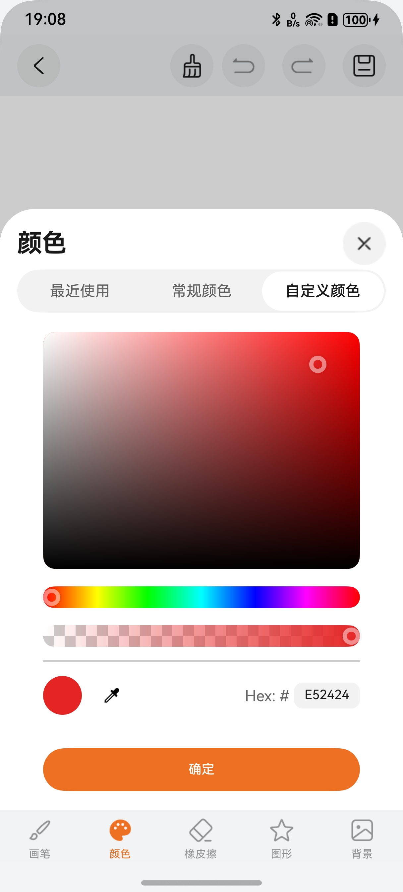
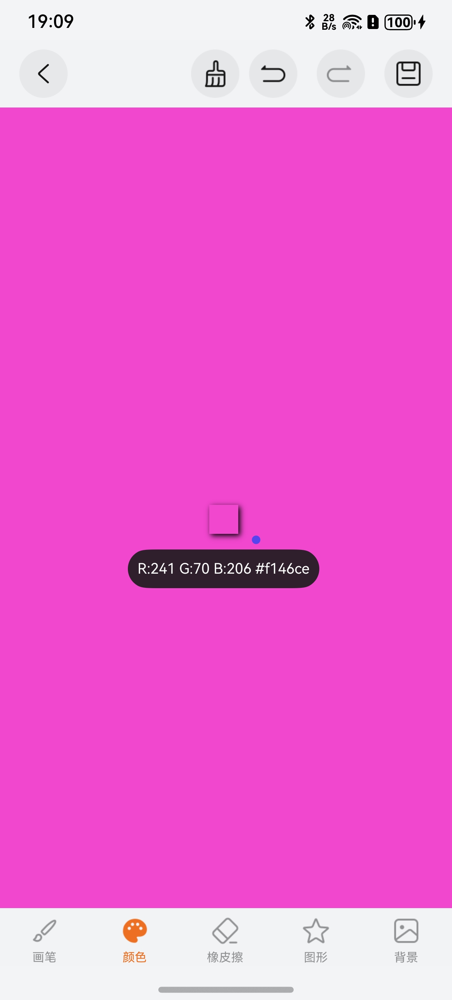

# 绘画颜色选择器组件快速入门

## 目录

- [简介](#简介)
- [约束与限制](#约束与限制)
- [使用](#使用)
- [API参考](#API参考)
- [示例代码](#示例代码)

## 简介

本组件提供专业的颜色选择功能，支持HSB颜色模型、透明度调节、颜色吸取、实时颜色预览等功能，适用于绘画、设计等场景。

|                              颜色选择                              |                             颜色吸取                             |
|:--------------------------------------------------------------:|:------------------------------------------------------------:|
|  |  |

主要功能：
- **HSB颜色选择器**：支持色相（Hue）、饱和度（Saturation）、亮度（Brightness）独立调节
- **透明度调节**：支持Alpha通道调节，实现半透明效果
- **颜色吸取工具**：可从画布中实时取色，支持触摸移动实时预览
- **实时颜色预览**：显示当前选中颜色和RGB值

## 约束与限制

### 环境

- DevEco Studio版本：DevEco Studio 5.0.5 Release及以上
- HarmonyOS SDK版本：HarmonyOS 5.0.5 Release SDK及以上
- 设备类型：华为手机（包括双折叠和阔折叠）
- 系统版本：HarmonyOS 5.0.3(15)及以上

### 权限

无


## 使用

1. 安装组件。

   如果是在DevEco Studio使用插件集成组件，则无需安装组件，请忽略此步骤。

   如果是从生态市场下载组件，请参考以下步骤安装组件。

   a. 解压下载的组件包，将包中所有文件夹拷贝至您工程根目录的xxx目录下。

   b. 在项目根目录build-profile.json5添加painting_color_selector模块。

   ```json
   // 项目根目录下build-profile.json5填写painting_color_selector路径。其中xxx为组件存放的目录名
   "modules": [
     {
       "name": "painting_color_selector",
       "srcPath": "./xxx/painting_color_selector"
     }
   ]
   ```

   c. 在项目根目录oh-package.json5添加依赖。
   ```json
   // xxx为组件存放的目录名称
   "dependencies": {
     "painting_color_selector": "file:./xxx/painting_color_selector"
   }
   ```
   
   d. 在项目的命令窗口执行命令,
 
   ```
   ohpm i  
   ```
   
   确保组件内的依赖  color-picker  (颜色选择器组件)完成下载。


2. 在项目entry模块的src/main/ets/entryability/EntryAbility.ets文件中，给吸色功能初始化Context（必须）

   ```typescript
   import { ColorGlobalContext } from 'painting_color_selector';
   
   onWindowStageCreate(windowStage: window.WindowStage): void {
     // ... 其他代码
     
     // 初始化UI上下文（颜色吸取功能必需）
     windowStage.loadContent('pages/Index', (err) => {
       if (err.code) {
         return;
       }
       // 初始化颜色选择器的UI上下文
       ColorGlobalContext.initUIContext(windowStage.getMainWindowSync().getUIContext());
     });
   }
   ```

3. 引入组件。

    ```typescript
    import { ColorSelector, ColorShow, ColorGlobalContext } from 'painting_color_selector';
    ```
   
4. 调用组件，详细参数配置说明参见[API参考](#API参考)。

    ```typescript
    //颜色选择器组件
    ColorSelector({
      color: this.vm.brushColor,
      drawingId: 'paintingCanvas',
      touchX: this.vm.touchX,
      touchY: this.vm.touchY,
      RGB: this.vm.rgb,
      RGBChange: (rgb: number[]) => {
        this.vm.updateRGB(rgb);
      },
      selectColorChange: (color: string) => {
        this.vm.updateSelectColor(color);
      },
      colorChange: (color: string) => {
        this.vm.confirmColor(color, this.canvasContext);
      },
      colorSampling: () => {
        this.vm.startColorSampling();
        // 开始吸色，滚动到顶部（画布区域）
        this.scroller.scrollEdge(Edge.Top);
      }
    })
    ```

    ```typescript
   //颜色显示组件
    ColorShow({
      color: this.vm.selectColor,
      r: this.vm.rgb[0],
      g: this.vm.rgb[1],
      b: this.vm.rgb[2],
      touchX: this.vm.touchX,
      touchY: this.vm.touchY,
      maxWidth: this.vm.canvasWidth
    })
    ```

## API参考

### 接口

#### ColorSelector

ColorSelector(options: [ColorSelectorOptions](#ColorSelectorOptions对象说明))

颜色选择器组件，提供完整的颜色选择功能。

**参数：**

| 参数名     | 类型                                                    | 是否必填 | 说明         |
|:--------|:------------------------------------------------------|:-----|:-----------|
| options | [ColorSelectorOptions](#ColorSelectorOptions对象说明) | 否    | 颜色选择器的参数。 |

#### ColorShow

ColorShow(options: [ColorShowOptions](#ColorShowOptions对象说明))

颜色显示组件，用于实时显示选中的颜色和RGB值。

**参数：**

| 参数名     | 类型                                              | 是否必填 | 说明         |
|:--------|:------------------------------------------------|:-----|:-----------|
| options | [ColorShowOptions](#ColorShowOptions对象说明) | 是    | 颜色显示的参数。 |

### ColorSelectorOptions对象说明

| 参数名               | 类型                       | 是否必填 | 默认值       | 说明                                                    |
|:------------------|:-------------------------|:-----|:----------|:------------------------------------------------------|
| color             | string                   | 是    | '#ffffff' | 初始颜色值，支持Hex格式（如#FFFFFF或#80FFFFFF，前两位为透明度）           |
| drawingId         | string                   | 否    | -         | 画布组件ID，用于颜色吸取功能。不传值则不显示吸色图标和功能                      |
| touchX            | number                   | 否    | 0         | 触摸点X坐标，用于颜色吸取时的实时定位                                  |
| touchY            | number                   | 否    | 0         | 触摸点Y坐标，用于颜色吸取时的实时定位                                  |
| RGB               | number[]                 | 否    | -         | RGB颜色值数组，格式为[R, G, B]，范围0-255                        |
| RGBChange         | (RGB: number[]) => void  | 否    | -         | RGB值变化的回调函数，实时触发                                      |
| selectColorChange | (color: string) => void  | 否    | -         | 选中颜色变化的回调函数（不含透明度），实时触发                             |
| colorChange       | (color: string) => void  | 否    | -         | 颜色确认的回调函数（含透明度），点击"确定"按钮时触发                         |
| colorSampling     | () => void               | 否    | -         | 颜色吸取的回调函数，点击吸管图标时触发。通常用于切换到吸色模式                    |

**注意事项：**
1. 需要设置正确的 `drawingId` 参数，该ID应与目标画布组件的ID一致。
2. `touchX` 和 `touchY` 需要实时更新，以确保颜色吸取的准确性。
3. 颜色吸取功能会频繁读取像素数据，建议在必要时才启用。
4. 如果不需要颜色显示组件,可以不传RGB,RGBRGBChange,selectColorChange属性,只获取单个触点的颜色数据
5. 使用颜色吸取功能前，确保 `ColorGlobalContext` 已正确初始化UI上下文。
6. 当把颜色选择组件集成到其他组件 / 页面结构中时，需保证组件的保活特性：若未做保活处理（如通过 bindSheet、dialog 承载的组件消失后），颜色值将无法被持续正确处理，且在颜色吸取模式下仅能获取单个触点的颜色数据。

### ColorShowOptions对象说明

| 参数名      | 类型     | 是否必填 | 默认值 | 说明                                           |
|:---------|:-------|:-----|:----|:---------------------------------------------|
| color    | string | 是    | ''  | 显示的颜色值，支持Hex格式（如#FFFFFF）                   |
| r        | number | 否    | 255 | 红色通道值（0-255）                                |
| g        | number | 否    | 255 | 绿色通道值（0-255）                                |
| b        | number | 否    | 255 | 蓝色通道值（0-255）                                |
| touchX   | number | 否    | 255 | 触摸点X坐标，用于计算显示位置                             |
| touchY   | number | 否    | 255 | 触摸点Y坐标，用于计算显示位置                             |
| maxWidth | number | 否    | 255 | 画布最大宽度，用于智能调整显示位置避免超出边界。建议传入画布实际宽度以获得最佳效果 |

**位置计算逻辑：**
- X轴：根据 `touchX` 和 `maxWidth` 智能调整，避免超出右边界
  - 当 `touchX < maxWidth - 160` 时，显示在触摸点左侧80px
  - 当 `touchX >= maxWidth - 160` 时，显示在触摸点左侧160px
- Y轴：根据 `touchY` 智能调整，避免超出顶部边界
  - 当 `touchY < 80` 时，显示在触摸点下方72px
  - 当 `touchY >= 80` 时，显示在触摸点上方100px

### ColorGlobalContext

全局上下文工具类，用于获取UI上下文。

**方法：**

| 方法名                              | 参数类型      | 返回类型      | 说明                                |
|:---------------------------------|:----------|:----------|:----------------------------------|
| initUIContext(context: UIContext) | UIContext | void      | 初始化UI上下文，必须在应用启动时调用（颜色吸取功能必需）    |
| getUIContext()                   | -         | UIContext | 获取UI上下文对象，用于颜色吸取时获取画布像素数据        |

## 示例代码

```typescript
import { ColorSelector, ColorShow } from 'painting_color_selector';

// ViewModel - 数据和业务逻辑
@ObservedV2
class PaintingViewModel {
  @Trace brushColor: string = '#000000';
  @Trace selectColor: string = '#fff';
  @Trace bgColor: string = '#fff';
  @Trace rgb: number[] = [0, 0, 0];
  @Trace touchX: number = 0;
  @Trace touchY: number = 0;
  @Trace isColorSampling: boolean = false;
  @Trace canvasWidth: number = 0;
  @Trace isCanvasTouching: boolean = false;

  // 限制坐标在画布范围内
  clampX(x: number, width: number): number {
    return Math.max(0, Math.min(x, width));
  }

  // 设置背景色
  setBackgroundColor() {
    this.bgColor = this.brushColor;
  }

  // 更新触摸坐标
  updateTouchPosition(x: number, y: number, canvasWidth: number, canvasHeight: number) {
    this.touchX = this.clampX(x, canvasWidth);
    this.touchY = this.clampX(y, canvasHeight);
  }

  // 开始吸色
  startColorSampling() {
    this.isColorSampling = true;
  }

  // 停止吸色
  stopColorSampling() {
    this.isColorSampling = false;
  }

  // 设置画布触摸状态
  setCanvasTouching(touching: boolean) {
    this.isCanvasTouching = touching;
  }

  // 更新RGB值
  updateRGB(rgb: number[]) {
    this.rgb = rgb;
  }

  // 更新选中的颜色
  updateSelectColor(color: string) {
    this.selectColor = color;
  }

  // 确认颜色选择
  confirmColor(color: string, canvasContext: CanvasRenderingContext2D) {
    this.brushColor = color;
    canvasContext.strokeStyle = color;
  }
}

@Entry
@ComponentV2
struct ColorSelectorSample3 {
  @Local vm: PaintingViewModel = new PaintingViewModel();
  private canvasContext: CanvasRenderingContext2D = new CanvasRenderingContext2D(new RenderingContextSettings(true));
  private scroller: Scroller = new Scroller();

  build() {
    NavDestination() {
      Scroll(this.scroller) {
        Column() {
          // 画布区域
          Column() {
            // 工具栏
            Row({ space: 16 }) {
              Circle()
                .width(30)
                .height(30)
                .fill(this.vm.brushColor)
              Button('设置背景色')
                .onClick(() => {
                  this.vm.setBackgroundColor();
                })
            }
            .width('100%')
              .padding(16)
              .justifyContent(FlexAlign.Start)

            // 画布
            Stack() {
              Canvas(this.canvasContext)
                .width('100%')
                .height(300)
                .backgroundColor(this.vm.bgColor)
                .id('paintingCanvas')
                .onReady(() => {
                  this.canvasContext.strokeStyle = this.vm.brushColor;
                  this.vm.canvasWidth = this.canvasContext.width;
                  this.canvasContext.lineWidth = 5;
                })
                .onTouch((event: TouchEvent) => {
                  if (this.vm.isColorSampling) {
                    if (event.type === TouchType.Down) {
                      this.vm.setCanvasTouching(true);
                      this.vm.updateTouchPosition(event.touches[0].x, event.touches[0].y,
                        this.canvasContext.width, this.canvasContext.height);
                    } else if (event.type === TouchType.Move) {
                      this.vm.updateTouchPosition(event.touches[0].x, event.touches[0].y,
                        this.canvasContext.width, this.canvasContext.height);
                    } else if (event.type === TouchType.Up) {
                      this.vm.setCanvasTouching(false);
                      this.vm.stopColorSampling();
                      // 吸色完成，滚动到底部（颜色选择器）
                      this.scroller.scrollEdge(Edge.Bottom);
                    }
                  } else {
                    // 绘画逻辑
                    if (event.type === TouchType.Down) {
                      this.vm.setCanvasTouching(true);
                      this.canvasContext.beginPath();
                      this.canvasContext.moveTo(event.touches[0].x, event.touches[0].y);
                    } else if (event.type === TouchType.Move) {
                      this.canvasContext.lineTo(event.touches[0].x, event.touches[0].y);
                      this.canvasContext.stroke();
                    } else if (event.type === TouchType.Up) {
                      this.vm.setCanvasTouching(false);
                    }
                  }
                })

              // 颜色显示
              if (this.vm.isColorSampling) {
                ColorShow({
                  color: this.vm.selectColor,
                  r: this.vm.rgb[0],
                  g: this.vm.rgb[1],
                  b: this.vm.rgb[2],
                  touchX: this.vm.touchX,
                  touchY: this.vm.touchY,
                  maxWidth: this.vm.canvasWidth
                })
              }
            }
            .width('100%')
          }
          .width('100%')
            .id('canvasArea')

          // 颜色选择器
          Column() {
            ColorSelector({
              color: this.vm.brushColor,
              drawingId: 'paintingCanvas',
              touchX: this.vm.touchX,
              touchY: this.vm.touchY,
              RGB: this.vm.rgb,
              RGBChange: (rgb: number[]) => {
                this.vm.updateRGB(rgb);
              },
              selectColorChange: (color: string) => {
                this.vm.updateSelectColor(color);
              },
              colorChange: (color: string) => {
                this.vm.confirmColor(color, this.canvasContext);
              },
              colorSampling: () => {
                this.vm.startColorSampling();
                // 开始吸色，滚动到顶部（画布区域）
                this.scroller.scrollEdge(Edge.Top);
              }
            })
          }
          .width('100%')
            .padding(16)
            .id('colorSelectorArea')
        }
        .width('100%')
      }
      .scrollable(this.vm.isCanvasTouching ? ScrollDirection.None : ScrollDirection.Vertical)
        .scrollBar(BarState.Off)
        .padding({ left: 16, right: 16 })
        .width('100%')
        .height('100%')
    }
    .title('完整绘画应用')
      .backgroundColor($r('sys.color.background_secondary'))
  }
}
```
