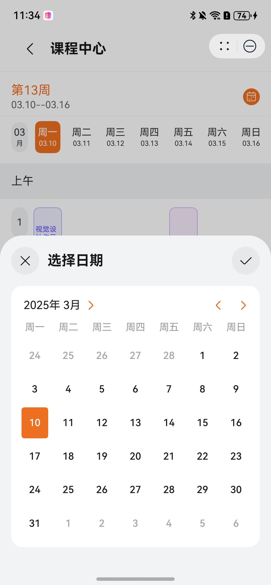

# 课程助手行业模板快速入门

## 目录

- [功能介绍](#功能介绍)
- [环境要求](#环境要求)
- [快速入门](#快速入门)
- [示例效果](#示例效果)
- [权限要求](#权限要求)
- [开源许可协议](#开源许可协议)

## 功能介绍

本模板为课程助手类元服务提供了常用功能的开发样例，模板主要分首页和我的两大模块：

- 首页：展示今日课程、明日课程，以及学期所有课程。进入课程支持根据签到地点、签到码进行签到。
- 我的：展示账号相关信息，支持修改用户昵称、头像。

本模板已集成华为账号、定位服务，只需做少量配置和定制即可快速实现华为账号的登录、基于位置签到等功能。

| 首页                | 我的                |
| ------------------- | ------------------- |
|  |  |

功能清单如下：

```ts
课程助手
 |-- 首页
 |    |-- 上课签到
 |    |-- 课表展示卡片
 |    |    |-- 今日课表
 |    |    └-- 明日课表
 |    |-- 课表中心
 |-- 课表中心
 |    └-- 学周信息
 |    └-- 学周选择
 |    └-- 课表展示
 |    └-- 课程详情
 |-- 签到中心
 |    └-- 签到码输入
 |    └-- 点击签到
 └-- 我的
      └-- 用户信息
           |-- 修改头像
           └-- 关联解绑账号
```

工程目录结构如下：

```ts
SchoolLife
  ├─commons/commonLib/src/main
  │  ├───ets
  │  │   ├───constants
  │  │   │       CommonContants.ets // 公共常量
  │  │   │       CommonEnums.ets    // 公共枚举
  │  │   │
  │  │   ├───type
  │  │   │       CommonType.ets     // 公共类
  │  │   │       RouterInfo.ets     // 路由参数类
  │  │   │
  │  │   └───utils
  │  │           AccountUtil.ets    // 账号工具类
  │  │           ColorUtil.ets      // 颜色工具类
  │  │           CourseUtil.ets     // 课程工具类
  │  │           FileUtil.ets       // 文件工具类
  │  │           FormatUtil.ets     // 日期格式化工具类
  │  │           Logger.ets         // 日志工具类
  │  │           NumberUtil.ets     // 数字工具类
  │  │           PermissionUtil.ets // 权限工具类
  │  │           RouterModule.ets   // 路由工具类
  │  │           ScheduleConfigUtil.ets   // 课程配置工具类
  │  └─resources
  ├─commons/componentLib/src/main
  │   ├───ets
  │   │   ├───components
  │   │   │       CardWrapper.ets               // 卡片Wrapper
  │   │   │       index.ets            
  │   │   │       LoadingComponentWrapper.ets   // Loading组件容器
  │   │   │       LoadingPageWrapper.ets        // Loading页面容器
  │   │   │       NavigateBar.ets               // 自定义NavBar
  │   │   │       SegmentButtonAdapter.ets      
  │   │   │       SimpleCapsuleButton.ets       // 简易CapsuleButton
  │   │   │
  │   │   └───constant
  │   │           ComponentConst.ets            // 公共组件常量/方法
  │   └─resources
  ├─commons/network/src/main
  │   ├───ets
  │   │   ├───apis
  │   │   │       CourseApi.ets     // 课程Api
  │   │   │       UserApi.ets       // 用户Api    
  │   │   │
  │   │   ├───constants
  │   │   │       NetworkEnums.ets  // 网络常量
  │   │   │
  │   │   ├───mocks
  │   │   │       HttpApisMock.ets     // Mock数据
  │   │   │       MockRequestMap.ets   // Mock数据
  │   │   │
  │   │   ├───models
  │   │   │   │   AxiosHttpModel.ets   // 网络请求
  │   │   │   │   AxiosRequest.ets     // 网络请求
  │   │   │   │
  │   │   │   ├───request  // 请求体结构
  │   │   │   │
  │   │   │   └───response // 响应体结构
  │   │   │
  │   │   └───types
  │   │           ResponseTypes.ets    // 公共网络请求类
  │   └─resources
  │─features/tab/home/src/main   
  │   ├───ets
  │   │   ├───component
  │   │   │       ClassSignInButton.ets   // 签到按钮组件
  │   │   │       DayCourseInfoCard.ets   // 首页课表卡片组件
  │   │   │
  │   │   ├───mapper
  │   │   │       ResponseMapper.ets      // 响应Mapper
  │   │   │
  │   │   ├───pages
  │   │   │       HomePage.ets            // 首页
  │   │   └───viewmodel
  │   │           HomePageVM.ets          // 首页 ViewModel
  │   │    
  │   └─resources
  │─features/tab/mine/src/main   
  │   └───ets
  │       ├───pages
  │       │       MinePage.ets            // 我的
  │       └───viewmodel
  │               MinePageVM.ets          // 我的 ViewModel
  │
  │─features/service/classSignIn/src/main
  │   └───ets
  │       ├───pages
  │       │       ClassSignInPage.ets     // 签到页
  │       └───viewmodel
  │               ClassSignInVM.ets       // 签到页 ViewModel
  │    
  │─features/service/courseSchedule/src/main   
  │   └───ets
  │       ├───pages
  │       │       CourseDetailPage.ets    // 课表详情页
  │       │       CourseSchedulePage.ets  // 课表中心页
  │       └───mapper
  │               DataMapper.ets          // 数据映射工具类
  │─compnent/ui_schedule_flow   // 课表流组件
  └─compnent/ui_verify_code     // 验证码组件
```

## 环境要求

### 软件

- DevEco Studio版本：DevEco Studio 5.0.1 Release及以上
- HarmonyOS SDK版本：HarmonyOS 5.0.1 Release及以上

### 硬件

* 设备类型：华为手机（直板机）
* HarmonyOS版本：HarmonyOS 5.0.0.123 Release及以上


## 快速入门

###  配置工程

在运行此模板前，需要完成以下配置：

1. 在DevEco Studio中打开此模板。

2. 在AppGallery Connect创建元服务，将包名配置到模板中。

   a. 参考[创建元服务](https://developer.huawei.com/consumer/cn/doc/app/agc-help-createharmonyapp-0000001945392297)为元服务创建APPID，并进行关联。

   b. 返回应用列表页面，查看元服务的包名。

   c. 将模板工程根目录下AppScope/app.json5文件中的bundleName替换为创建元服务的包名。

3. 配置华为账号服务。

   a. 将元服务的client ID配置到entry模块的module.json5文件，详细参考：[配置Client ID](https://developer.huawei.com/consumer/cn/doc/atomic-guides-V5/account-atomic-client-id-V5)。

   b. 添加公钥指纹，详细参考：[配置应用证书指纹](https://developer.huawei.com/consumer/cn/doc/app/agc-help-signature-info-0000001628566748#section5181019153511)。

   c. 如需获取用户真实手机号，需要申请phone权限，详细参考：[配置scope权限](https://developer.huawei.com/consumer/cn/doc/atomic-guides-V5/account-guide-atomic-permissions-V5)，并在端侧使用快速验证手机号码Button进行[验证获取手机号码](https://developer.huawei.com/consumer/cn/doc/atomic-guides-V5/account-guide-atomic-get-phonenumber-V5)。

4. 配置定位服务。

   a. 将元服务的client ID配置到entry模块的module.json5文件，如果华为账号服务已配置，可跳过此步骤。

   b. 添加公钥指纹，如果华为账号服务已配置，可跳过此步骤。

   c. [开通地图服务](https://developer.huawei.com/consumer/cn/doc/harmonyos-guides-V5/map-config-agc-V5#section16133115441516)。

5. （可选）如果从应用自己服务器请求数据，需要配置服务器请求信息。
   打开SchoolLife\commons\commonLib\src\main\ets\constants\CommonContants.ets文件，将BASE_URL修改为请求服务器的地址。

6. 修改自定义开学时间
   打开SchoolLife\commons\commonLib\src\main\ets\utils\ScheduleConfigUtil.ets，修改开学时间semesterStartTime为最近日期，即可看到正常课表信息

###  运行调试工程

1. 连接调试手机和PC。

2. 对元服务签名：由于模板中集成了华为账号、地图等服务，所以需要采用[手工签名](https://developer.huawei.com/consumer/cn/doc/harmonyos-guides-V5/ide-signing-V5#section297715173233)。

3. 配置多模块调试：由于本模板存在多个模块，运行时需确保所有模块安装至调试设备。

   a. 运行模块选择“entry”。

   b. 下拉框选择“Edit Configurations”，在“Run/Debug Configurations”界面，选择“Deploy Multi Hap”页签，勾选上模板中所有模块。

   

   c. 点击"Run"，运行模板工程。

## 示例效果

界面展示
 

录屏展示

| 签到                       | 课表中心                     |
|--------------------------|--------------------------|
| [签到功能](doc/record_1.mp4) | [课表中心](doc/record_2.mp4) |

## 权限要求

- 获取位置权限：ohos.permission.APPROXIMATELY_LOCATION、ohos.permission.LOCATION
- 网络权限：ohos.permission.INTERNET

## 开源许可协议

该代码经过[Apache 2.0 授权许可](http://www.apache.org/licenses/LICENSE-2.0)。