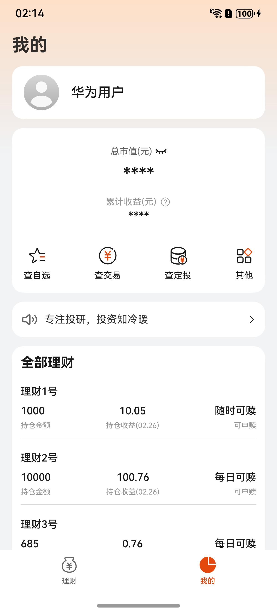
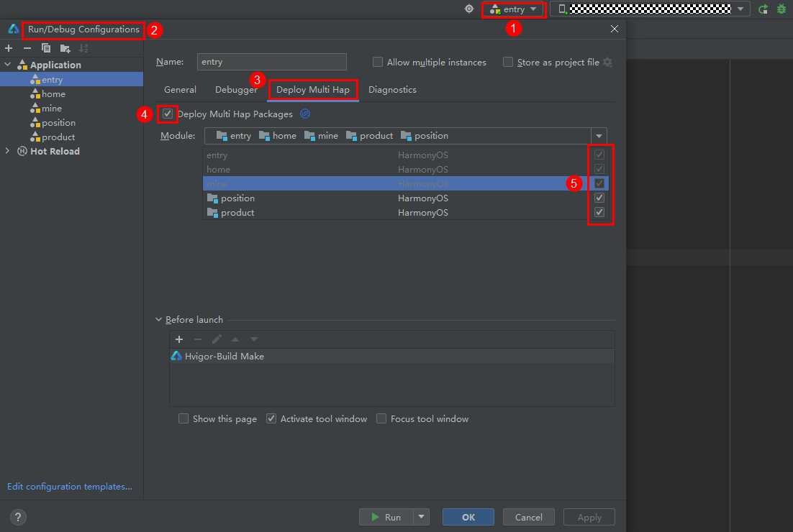

# 金融理财(理财)行业模板快速入门

## 目录

- [功能介绍](#功能介绍)
- [环境要求](#环境要求)
- [快速入门](#快速入门)
- [示例效果](#示例效果)
- [权限要求](#权限要求)
- [开源许可协议](#开源许可协议)

## 功能介绍

本模板为理财类应用提供了常用功能的开发样例，模板主要分理财和我的两大模块：

* 理财：提供公告、热销商品的展示等。

* 我的：展示持仓、交易、协议，提供账号的管理、产品的赎回、追加购买等。

本模板已集成华为账号、支付等服务，只需做少量配置和定制即可快速实现华为账号的登录和购买商品等功能。

| 理财                           | 我的                           |
| ------------------------------ | ------------------------------ |
|  |  |

本模板主要页面及核心功能如下所示：

```ts
金融理财模板
 |-- 首页
 |    └-- 顶部轮播
 |    └-- 基础服务
 |    |    └-- 活钱管理
 |    |    |    |-- 产品列表
 |    |    |    |-- 产品详情
 |    |    |    |-- 产品定投
 |    |    |    └-- 购买产品
 |    |    └-- 稳健低波
 |    |    |    |-- 产品列表
 |    |    |    |-- 产品详情
 |    |    |    |-- 产品定投
 |    |    |    └-- 购买产品
 |    |    └-- 稳健增值
 |    |    |    |-- 产品列表
 |    |    |    |-- 产品详情
 |    |    |    |-- 产品定投
 |    |    |    └-- 购买产品
 |    |    └-- 投资增益
 |    |    |    |-- 产品列表
 |    |    |    |-- 产品详情
 |    |    |    |-- 产品定投
 |    |    |    └-- 购买产品
 |    |    └-- 投资回报
 |    |         |-- 产品列表
 |    |         |-- 产品详情
 |    |         |-- 产品定投
 |    |         └-- 购买产品
 |    └-- 滚动公告
 |    └-- 灵活取用
 |    |    |-- 产品列表
 |    |    |-- 产品详情
 |    |    |-- 产品定投
 |    |    └-- 购买产品
 |    └-- 理财夜市
 |    |    |-- 产品列表
 |    |    |-- 产品详情
 |    |    |-- 产品定投
 |    |    └-- 购买产品
 |    └-- 理财资讯
 |         └-- 资讯列表
 └-- 我的
      └-- 账号
      |    |-- 账号登录
 |    |    |-- 账号详情
 |    |    └-- 账号信息修改
 |    └-- 收益信息
 |    └-- 自选产品
 |    |    |-- 产品列表
 |    |    |-- 产品详情
 |    |    |-- 产品定投
 |    |    └-- 购买产品
 |    └-- 产品交易
 |    |    └-- 交易列表
 |    |    └-- 交易详情
 |    └-- 定投产品
 |    |    └-- 定投列表
 |    |    └-- 定投详情
 |    └-- 其他
 |    |    └-- 理财账号详情
 |    |    └-- 隐私列表
 |    |    └-- 隐私协议
 |    └-- 滚动公告
 |    └-- 持仓列表
           └-- 持仓详情
           └-- 持仓赎回
           └-- 追加购买
```

本模板工程代码结构如下所示：

```ts
FinancialManagement
  |- commons                                       // 公共层
  |   |- commonlib/src/main/ets                    // 公共工具模块(har)
  |   |    |- constants 
  |   |    |     CommonContants.ets                // 公共常量
  |   |    |     CommonEnum.ets                    // 公共枚举
  |   |    |- models 
  |   |    |     RouterModule.ets                  // 路由管理类
  |   |    |- types 
  |   |    |     Types.ets                         // 公共类型
  |   |    └- utils 
  |   |          AccountUtil.ets                   // 账号管理工具
  |   |          FormatUtil.ets                    // 日历、图片等格式管理工具
  |   |          Logger.ets                        // 日志管理工具
  |   |          PickerUtil.ets                    // 图片管理类
  |   |          PopViewUtils.ets                  // 公共弹窗
  |   |          PreferenceUtil.ets                // 首选项管理
  |   |          WindowUtil.ets                    // 窗口管理工具
  |   |  
  |   |- componentlib/src/main/ets                 // 公共组件模块(har)
  |   |     └- components 
  |   |          CommonCharts.ets                  // 公共图表            
  |   |          CommonTextVisibility.ets          // 公共文本隐藏         
  |   |          CommonTimeLine.ets                // 公共时间线 
  |   |          CommonFilter.ets                  // 公共销售状态栏   
  |   |          CommonNavTitle.ets                // 公共标题
  |   |          CommonNoticeBoard.ets             // 公共公告栏  
  |   |          CommonProductProfile.ets          // 公共产品档案栏  
  |   |          CommonRow.ets                     // 公共行  
  |   |          CommonRuleLine.ets                // 公共规则行 
  |   |          CommonSaveButton.ets              // 公共按钮      
  |   |   
  |   └- network/src/main/ets                      // 网络模块(har)
  |        |- apis                                 // 网络接口  
  |        |- mocks                                // 数据mock   
  |        |- models                               // 网络库封装    
  |        |- types                                // 请求和响应类型   
  |        └- utils                                // 工具  
  |
  |- entry                                         // 应用层主包(hap)  
  |   └-  src/main/ets                                               
  |        |- entryability                                                               
  |        |- entryformability                                                        
  |        |- pages                              
  |        |    MainEntry.ets                      // 主页面
  |        |- types                                // interface接口定义
  |        |- viewModels                           // 与页面一一对应的vm层          
  |        └- widget                               // 卡片页面 
  |                                            
  |- scenes                                        // 特性层
  |   |- position/src/main/ets                     // 持仓模块(hsp)
  |   |    |- components                           // 抽离组件
  |   |    |- constants                            // 常量         
  |   |    |- pages                               
  |   |    |    FinancialAccount.ets               // 账号页
  |   |    |    FinancialAgreement.ets             // 协议页
  |   |    |    InvestmentRecordInfo.ets      // 定投记录详情页
  |   |    |    MyRegularChoice.ets                // 自选列表页
  |   |    |    MyRegularInvestment.ets            // 定投列表页
  |   |    |    MyRegularInvestmentInfo.ets        // 定投详情页
  |   |    |    Other.ets                          // 其他页
  |   |    |    PositionInfo.ets                   // 持仓详情页
  |   |    |    PositionRecord.ets                 // 持仓记录页
  |   |    |    Preview.ets                        // 预览页
  |   |    |    Redemption.ets                     // 赎回页
  |   |    |    RevenueInfo.ets                    // 收益详情页
  |   |    |    TransactionInfo.ets                // 交易详情页
  |   |    |    TransactionList.ets                // 交易列表页
  |   |    |    TransactionSearch.ets              // 交易搜索页
  |   |    |- types                                // interface类型定义
  |   |    └- viewModels                           // 与页面一一对应的vm层          
  |   |     
  |   |- product/src/main/ets                      // 理财产品模块(hsp)
  |   |    |- components                           // 抽离组件   
  |   |    |- constants                            // 常量     
  |   |    |- pages                               
  |   |    |    FinancialInformation.ets           // 理财资讯页
  |   |    |    HistoricalPerformance.ets          // 历史收益页
  |   |    |    Privacy.ets                        // 协议页
  |   |    |    ProductInfo.ets                    // 产品详情页
  |   |    |    ProductList.ets                    // 产品列表页
  |   |    |    ProductSearch.ets                  // 产品搜索页
  |   |    |    Purchase.ets                       // 购买页
  |   |    |    Rule.ets                           // 产品规则页
  |   |    |- types                                // interface类型定义
  |   |    └- viewModels                           // 与页面一一对应的vm层  
  |   └- tab    
           |- home/src/main/ets                    // 理财tab页功能组合(hsp)
           |   |- components                       // 抽离组件 
           |   |- pages                               
           |   |   HomePage.ets                    // 理财首页
           |   |   InformationInfo.ets             // 资讯详情页
           |   |- types                            // interface类型定义
           |   └- viewModels                       // 与页面一一对应的vm层 
           | 
           └- mine/src/main/ets                    // 我的tab页功能组合(hsp)
               |- components                       // 抽离组件 
               └- pages                               
               |   EditNamePage.ets                // 修改昵称页
               |   EditPhonePage.ets               // 修改手机号页
               |   MinePage.ets                    // 我的页
               |   PersonalInformationPage.ets     // 个人信息页
               |   QuickLoginPage.ets              // 登录页
               └- viewModels                       // 与页面一一对应的vm层 
```

## 环境要求

### 软件

* DevEco Studio版本：DevEco Studio 5.0.2 Release及以上
* HarmonyOS SDK版本：HarmonyOS 5.0.1(13) Release SDK及以上

### 硬件

* 设备类型：华为手机（直板机）
* HarmonyOS版本：HarmonyOS 5.0.2 Release及以上

## 快速入门

### 配置工程

在运行此模板前，需要完成以下配置：

1. 在DevEco Studio中打开此模板。

2. 在AppGallery Connect创建应用，将包名配置到模板中。

   a. 参考[创建应用](https://developer.huawei.com/consumer/cn/doc/app/agc-help-createharmonyapp-0000001945392297)
   为应用创建APPID，并进行关联。

   b. 返回应用列表页面，查看应用的包名。

   c. 将模板工程根目录下AppScope/app.json5文件中的bundleName替换为创建应用的包名。

3. 配置华为账号服务。

   a. 将应用的client
   ID配置到entry模块的module.json5文件，详细参考：[配置Client ID](https://developer.huawei.com/consumer/cn/doc/harmonyos-guides/account-client-id)。

   b.
   添加公钥指纹，详细参考：[配置应用证书指纹](https://developer.huawei.com/consumer/cn/doc/app/agc-help-signature-info-0000001628566748#section5181019153511)。

   c.
   如需获取用户真实手机号，需要申请phone权限和quickLoginMobilePhone权限，详细参考：[配置scope权限](https://developer.huawei.com/consumer/cn/doc/harmonyos-guides/account-config-permissions)。

4. 配置支付服务。

   华为支付当前仅支持商户接入，在使用服务前，需要完成商户入网、开发服务等相关配置，本模板仅提供了端侧集成的示例。详细参考：[支付服务接入准备](https://developer.huawei.com/consumer/cn/doc/harmonyos-guides/payment-preparations)。

### 运行调试工程

1. 连接调试手机和PC。

2. 对应用签名：由于模板中集成了华为账号等服务，所以需要采用[手工签名](https://developer.huawei.com/consumer/cn/doc/harmonyos-guides-V5/ide-signing-V5#section297715173233)。

3. 配置多模块调试：由于本模板存在多个模块，运行时需确保所有模块安装至调试设备。

   a. 运行模块选择“entry”。

   b. 下拉框选择“Edit Configurations”，在“Run/Debug Configurations”界面，选择“Deploy Multi Hap”页签，勾选上模板中所有模块。

   

   c. 点击"Run"，运行模板工程。

## 示例效果

[功能展示录屏](./screenshots/功能展示录屏.mp4)

## 权限要求

* 网络权限：ohos.permission.INTERNET

## 开源许可协议

该代码经过[Apache 2.0 授权许可](http://www.apache.org/licenses/LICENSE-2.0)。