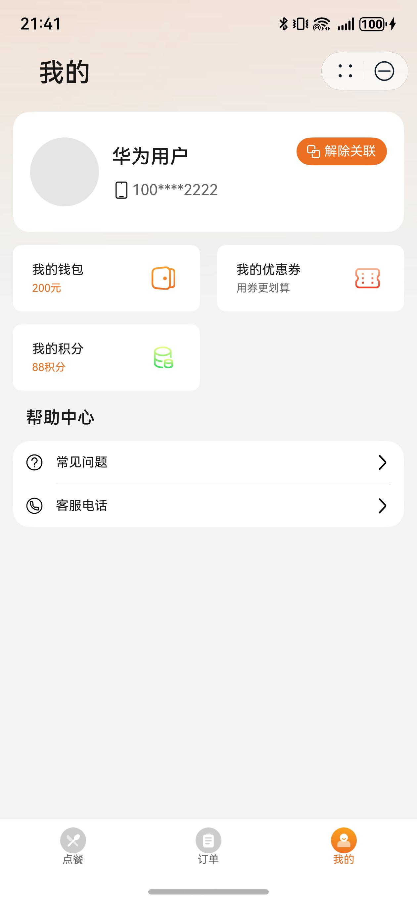

# 餐饮（点餐）行业模板快速入门

## 目录
- [功能介绍](#功能介绍)
- [环境要求](#环境要求)
- [快速入门](#快速入门)
- [示例效果](#示例效果)
- [权限要求](#权限要求)
- [开源许可协议](#开源许可协议)

## 功能介绍
本模板为餐饮点餐类元服务提供了常用功能的开发样例，模板主要分点餐、订单和我的三大模块：
- 点餐：提供店铺、优惠券、商品详情、购物车的展示，支持提交订单。
- 订单：支持对不同状态下订单的管理。
- 我的：展示账号相关信息，支持钱包、优惠券和积分的查看，以及帮助中心。
  本模板已集成预加载、华为账号、地图、华为支付、通话等服务，只需做少量配置和定制即可快速实现页面的快速加载、华为账号的登录、商家位置定位导航、购买餐饮和联系商家等功能。

| 点餐                                        | 订单                                     | 我的                                   |
| ------------------------------------------- |----------------------------------------|--------------------------------------|
|  |  |  |


本模板主要页面及核心功能清单如下所示：
```ts
餐饮点餐模板
 |-- 点餐
 |    |-- 店铺信息
 |    |    |-- 店铺详情
 |    |    |-- 店铺位置和导航
 |    |    └-- 店铺电话
 |    |-- 优惠券
 |    |    |-- 店铺优惠
 |    |    └-- 优惠券列表
 |    |-- 商品列表
 |    |    |-- 搜索商品
 |    |    |-- 商品详情
 |    |    |-- 商品规格
 |    |    └-- 加入购物车
 |    |-- 购物车
 |    |    |-- 清空购物车
 |    |    |-- 修改购物车商品
 |    |    └-- 下单
 |    └-- 提交订单
 |         └-- 订单支付
 |-- 订单列表
 |    └-- 订单详情
 |    └-- 订单支付
 └-- 我的
      |-- 用户信息
      |    |-- 修改头像
      |    └-- 关联解绑账号
      |-- 我的中心
      |    |-- 我的钱包
      |    |-- 我的优惠券
      |    └-- 我的积分
      └-- 帮助中心
           |-- 常见问题
           └-- 客服电话
```

本模板工程代码结构如下所示：
```
agcit_huawei_catering_orders
  ├─commons/common/src/main
  │  ├─ets
  │  │  ├─axiosHttpRequest
  │  │  │      AxiosHttp.ets                  // 网络请求封装
  │  │  │      AxiosModel.ets                 // 网络请求对象
  │  │  │      AxiosRequest.ets               // 网络请求定义
  │  │  │      HttpRequestApi.ets             // 网络请求接口
  │  │  ├─cardManager
  │  │  │      CardManager.ets                // 卡片管理
  │  │  │      EntryContext.ets               // 应用上下文
  │  │  │      SubscriberClass.ets            // 卡片公共事件
  │  │  ├─components
  │  │  │      BusinessTimeDialog.ets         // 店铺休息弹窗
  │  │  │      CallTelDialog.ets              // 拨打电话弹窗
  │  │  │      CouponCardComp.ets             // 优惠券卡片组件
  │  │  │      HwMap.ets                      // 店铺地图
  │  │  │      NavHeaderBar.ets               // navigation页面抬头
  │  │  │      OrderGoodsCard.ets             // 订单商品卡片组件
  │  │  │      PayTypeDialog.ets              // 支付弹窗
  │  │  │      SheetHeaderComp.ets            // 半模态页面标题栏
  │  │  ├─constants
  │  │  │      Common.ets                     // 公共常量
  │  │  ├─mock
  │  │  │      MockData.ets                   // 接口mock数据
  │  │  │      MockResponse.ets               // 接口mock请求
  │  │  ├─models
  │  │  │      RequestModel.ets               // 网络请求参数对象
  │  │  │      ResponseModel.ets              // 网络请求响应对象
  │  │  │      RouterModel.ets                // 路由参数对象
  │  │  │      TabBarModel.ets                // 底部导航栏对象
  │  │  └─utils
  │  │         Utils.ets                      // 公共方法
  │  └─resources
  │─features/order/src/main   
  │  ├─ets
  │  │  ├─components
  │  │  │      ContainerComp.ets               // 点餐主体页面组件
  │  │  │      CustomSelectDialog.ets          // 数据选择半模态弹窗
  │  │  │      GoodInfoComp.ets                // 商品信息组件
  │  │  │      MyCarComp.ets                   // 购物车组件
  │  │  │      MyCarListComp.ets               // 购物车列表组件
  │  │  │      OrderListComp.ets               // 订单内商品列表组件
  │  │  │      ShopDiscountComp.ets            // 店铺折扣组件
  │  │  │      TitleComp.ets                   // 点餐标题栏组件
  │  │  │      TopComp.ets                     // 顶部组件
  │  │  ├─models
  │  │  │      DiscountModel.ets               // 店铺折扣对象
  │  │  │      MustGoodsController.ets         // 必选品控制对象
  │  │  └─pages
  │  │         ConfirmOrderPage.ets            // 确认订单页面
  │  │         GoodDetailPage.ets              // 商品详情页面
  │  │         MerchantDetailPage.ets          // 店铺详情页面
  │  │         OrderPage.ets                   // 点餐页面
  │  │         PreviewImagePage.ets            // 图片预览页面
  │  │         RemarksPage.ets                 // 添加备注页面
  │  │         SelectCouponPage.ets            // 选择优惠券页面
  │  └─resources
  │─features/order_list/src/main   
  │  ├─ets
  │  │  ├─components
  │  │  │      ButtonListComp.ets              // 卡片按钮组件
  │  │  │      CommonTab.ets                   // 订单列表tab组件
  │  │  │      OrderCard.ets                   // 订单卡片组件
  │  │  │      OrderTypeComp.ets               // 订单详情顶部组件
  │  │  │      PaymentDetailsComp.ets          // 订单支付详情组件
  │  │  │      ReductionCardComp.ets           // 订单优惠详情组件
  │  │  │      StoreInfoCardComp.ets           // 商户卡片组件
  │  │  ├─models
  │  │  │      Model.ets                       // 订单列表里的数据对象
  │  │  └─pages
  │  │         Index.ets                       // 订单列表页面
  │  │         OrderDetailPage.ets             // 订单详情页面
  │  └─resources
  │─features/personal_center/src/main   
  │  ├─ets
  │  │  └─pages
  │  │         AnswerPage.ets                  // 常见问题页面
  │  │         FrequentQuestionPage.ets        // 问题答复页面
  │  │         Index.ets                       // 我的页面
  │  │         MyCouponsPage.ets               // 我的优惠券页面
  │  └─resources
  │─preload
  │      handler.js                            // 预加载函数
  │      package.json                          // 预加载函数信息
  └─products/phone/src/main   
     ├─ets
     │  ├─components
     │  │      CustomTabBar.ets                // 自定义底部tab栏组件
     │  ├─entryability
     │  │      EntryAbility.ets                // 应用程序入口
     │  ├─entryformability
     │  │      EntryFormAbility.ets            // 卡片程序入口
     │  ├─pages
     │  │      HomePage.ets                    // 主页面
     │  │      Index.ets                       // 入口页面
     │  └─widget/pages
     │         WidgetCard.ets                  // 卡片页面
     └─resources
```

## 环境要求
### 软件
* DevEco Studio版本：DevEco Studio 5.0.0 Release及以上
* HarmonyOS SDK版本：HarmonyOS 5.0.0 Release SDK及以上
### 硬件
* 设备类型：华为手机（直板机）
* HarmonyOS版本：HarmonyOS 5.0.0 Release及以上


## 快速入门
###  配置工程
在运行此模板前，需要完成以下配置：

1. 在DevEco Studio中打开此模板。

2. 在AppGallery Connect创建元服务，将包名配置到模板中。

   a. 参考[创建元服务](https://developer.huawei.com/consumer/cn/doc/app/agc-help-createharmonyapp-0000001945392297)为元服务创建APPID，并进行关联。

   b. 返回应用列表页面，查看元服务的包名。

   c. 将模板工程根目录下AppScope/app.json5文件中的bundleName替换为创建元服务的包名。

3. 配置服务器域名。

   本模板接口均采用mock数据，由于元服务包体大小有限制，部分图片资源将从云端拉取，所以需为模板项目[配置服务器域名](https://developer.huawei.com/consumer/cn/doc/atomic-guides-V5/agc-help-harmonyos-server-domain-V5)，“httpRequest合法域名”需要配置为：`https://agc-storage-drcn.platform.dbankcloud.cn`

4. 配置华为账号服务。

   a. 将元服务的client ID配置到phone[entry]模块的module.json5文件，详细参考：[配置Client ID](https://developer.huawei.com/consumer/cn/doc/atomic-guides-V5/account-atomic-client-id-V5)。

   b. 添加公钥指纹，详细参考：[配置应用证书指纹](https://developer.huawei.com/consumer/cn/doc/app/agc-help-signature-info-0000001628566748#section5181019153511)。

   c. 如需获取用户真实手机号，需要申请phone权限，详细参考：[配置scope权限](https://developer.huawei.com/consumer/cn/doc/atomic-guides-V5/account-guide-atomic-permissions-V5)。在端侧使用快速验证手机号码Button进行[验证获取手机号码](https://developer.huawei.com/consumer/cn/doc/atomic-guides-V5/account-guide-atomic-get-phonenumber-V5)。

5. 配置地图服务。

   a. 将元服务的client ID配置到phone[entry]模块的module.json5文件，如果华为账号服务已配置，可跳过此步骤。

   b. 添加公钥指纹，如果华为账号服务已配置，可跳过此步骤。

   c. [开通地图服务](https://developer.huawei.com/consumer/cn/doc/harmonyos-guides-V5/map-config-agc-V5#section16133115441516)。
6. 配置支付服务。

   华为支付当前仅支持商户接入，在使用服务前，需要完成商户入网、开发服务等相关配置，本模板仅提供了端侧集成的示例。详细参考：[支付服务接入准备](https://developer.huawei.com/consumer/cn/doc/harmonyos-guides-V5/payment-preparations-V5)。

7. 配置预加载服务。

   a. [开通预加载](https://developer.huawei.com/consumer/cn/doc/AppGallery-connect-Guides/agc-preload-enable-0000001834523102)。

   b. [开通云函数](https://developer.huawei.com/consumer/cn/doc/AppGallery-connect-Guides/agc-preload-enable-cloudfunction-0000001834682910)。

   c. 打包云函数包：进入工程preload目录，将目录下的文件压缩为zip文件。

   d. [创建云函数](https://developer.huawei.com/consumer/cn/doc/AppGallery-connect-Guides/agc-preload-develop-cloudfunction-traditional-0000002035974992#section444315422578)。

   * “函数名称”为“preload”
   * “触发方式”为“事件调用”
   * “触发器类型”为“HTTP触发器”，其他保持默认
   * “代码输入类型”为“*.zip文件”，代码文件上传上一步打包的zip文件

   e. [配置预加载](https://developer.huawei.com/consumer/cn/doc/AppGallery-connect-Guides/agc-preload-configure-0000001848140816)：函数名称配置为上一步创建的云函数

8. （可选）如果从应用自己服务器请求数据，需要配置服务器请求信息。

   a. 打开CateringOrders\commons\common\src\main\ets\constants\Common.ets文件，将BASE_URL修改为请求服务器的地址。

   b. 打开CateringOrders\common\src\main\ets\AxiosHttpRequest\AxiosRequest.ets文件，将config.params配置为请求中的固定参数列表。


## 示例效果
界面展示
 

## 权限要求
- 获取位置权限：ohos.permission.APPROXIMATELY_LOCATION、ohos.permission.LOCATION
- 网络权限：ohos.permission.INTERNET

## 开源许可协议
该代码经过[Apache 2.0 授权许可](http://www.apache.org/licenses/LICENSE-2.0)。
