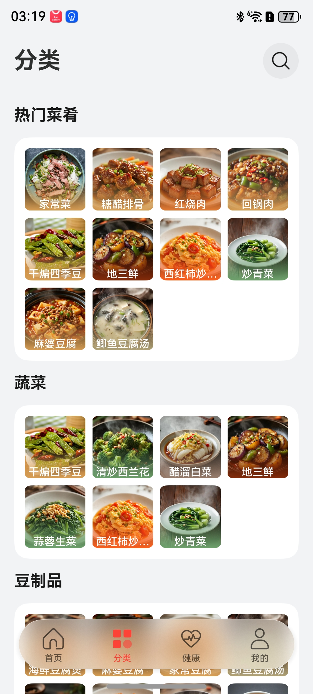
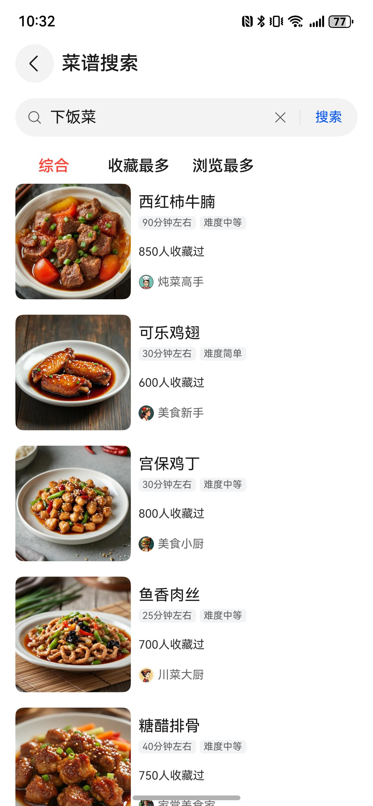
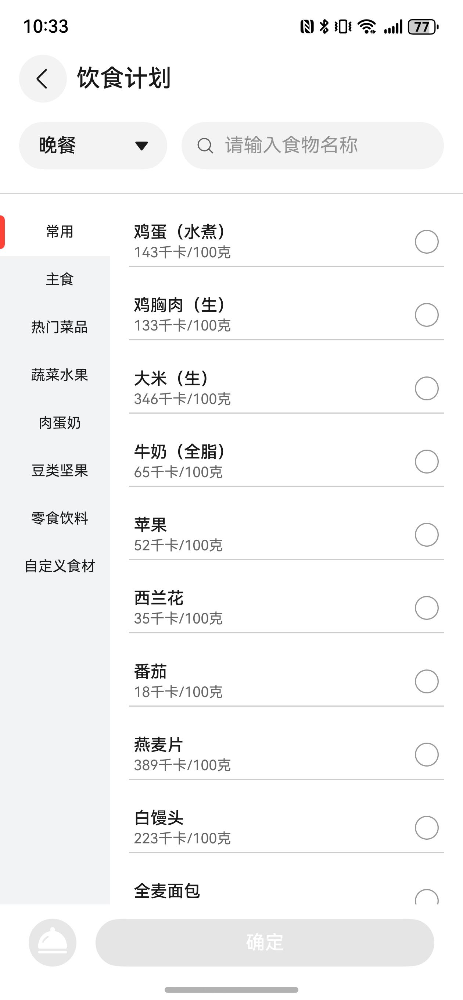
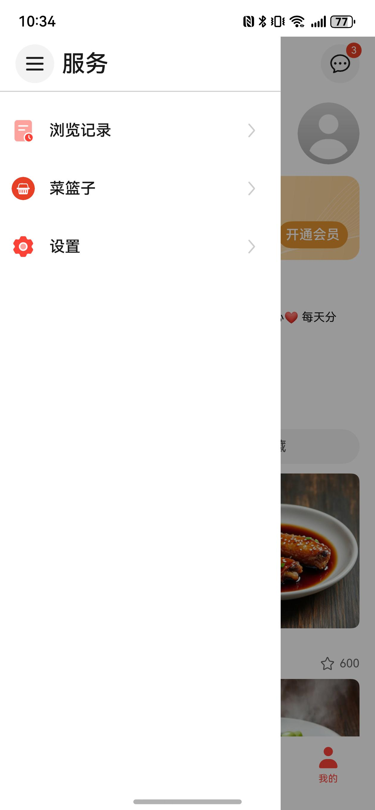

# 美食（菜谱）应用模板快速入门

## 目录

- [功能介绍](#功能介绍)
- [约束与限制](#约束与限制)
- [快速入门](#快速入门)
- [示例效果](#示例效果)
- [开源许可协议](#开源许可协议)

## 功能介绍

您可以基于此模板直接定制应用，也可以挑选此模板中提供的多种组件使用，从而降低您的开发难度，提高您的开发效率。

此模板提供如下组件，所有组件存放在工程根目录的components下，如果您仅需使用组件，可参考对应组件的指导链接；如果您使用此模板，请参考本文档。

| 组件                          | 描述               | 使用指导                                               |
|-----------------------------|------------------|----------------------------------------------------|
| 广告组件（aggregated_ads）        | 支持展示开屏广告         | [使用指导](components/aggregated_ads/README.md)        |
| 通用登录组件（aggregated_login）    | 支持华为账号一键登录及其他方式登录（微信、手机号登录）    | [使用指导](components/aggregated_login/README.md)      |
| 通用分享组件（aggregated_share）    | 支持分享到微信好友、朋友圈、QQ、微博等方式，支持碰一碰分享、生成海报、系统分享等功能    | [使用指导](components/aggregated_share/README.md)      |
| 通用会员组件（membership）            | 支持应用内支付实现会员开通的能力 | [使用指导](components/membership/README.md)            |
| 热量计算组件（calorie_calculation） | 支持统计饮食计划的卡路里     | [使用指导](components/calorie_calculation/README.md)   |
| 菜谱瀑布流组件（featured_recipes）   | 支持展示菜谱列表瀑布流      | [使用指导](components/featured_recipes/README.md)      |
| 搜索组件（home_search）           | 支持菜谱搜索的相关功能      | [使用指导](components/home_search/README.md)           |
| 分类列表组件（link_category）       | 支持按分类展示菜谱列表      | [使用指导](components/link_category/README.md)         |
| 个人中心组件（personal_homepage）   | 支持个人中心页面展示       | [使用指导](components/personal_homepage/README.md)     |
| 菜篮子组件（shopping_basket）      | 支持菜篮子相关功能        | [使用指导](components/shopping_basket/README.md)       |
| 上传菜谱组件（upload_recipe）       | 支持上传菜谱的功能        | [使用指导](components/upload_recipe/README.md)         |
| 通用应用内设置组件（app_setting）      | 支持设置基础设置项        | [使用指导](components/app_setting/README.md)           |
| 通用个人信息组件（collect_personal_info）     | 支持编辑头像、昵称、手机号等         | [使用指导](components/collect_personal_info/README.md) |
| 一镜到底组件（module_transition）         | 支持卡片展开、搜索、查看大图一镜到底                          | [使用指导](components/module_transition/README.md)        |
| 通用图片预览组件（image_preview）       | 支持预览图片、双指放大、缩小，滑动预览                         | [使用指导](components/image_preview/README.md)      |

本模板为美食菜谱类应用提供了常用功能的开发样例，模板主要分首页、分类、健康和我的四大模块：

- 首页：展示菜谱信息，支持按名称、类别搜索菜谱。
- 分类：按类别展示菜谱，支持搜索类别，查看详情、收藏菜谱。
- 健康：展示健康食谱和每日、每周热量，支持按时间段增加饮食计划，展示计划饮食的热量。
- 我的：展示账号相关信息，展示我的菜谱和上传菜谱，展示收藏的菜谱，展示浏览记录，以及设置等功能。

本模板已集成华为账号服务，只需做少量配置和定制即可快速实现华为账号的登录等功能。

| 首页                                                                | 分类                                                                    | 健康                                                                     | 我的                                                                |
|-------------------------------------------------------------------|-----------------------------------------------------------------------|------------------------------------------------------------------------|-------------------------------------------------------------------|
|  |  |  |  |

本模板主要页面及核心功能清单如下所示：

```ts
美食菜谱模板
 |-- 开屏页
 |-- 广告
 |-- 首页
 |    |-- banner
 |    |-- 搜索
 |    |-- 分类搜索
 |    |    |-- 综合搜索
 |    |    |-- 收藏最多
 |    |    └-- 浏览最多
 |    |-- 菜谱瀑布流
 |    |-- 博主详情
 |    └-- 博主关注
 |-- 分类
 |    |-- 分类列表
 |    |-- 菜谱详情
 |         |-- 收藏
 |         └-- 烹饪模式
 |-- 健康
 |    |-- 日/周热量
 |    └-- 饮食计算
 |    |     |-- 管理饮食计划
 |    |     |-- 食物自定义重量
 |    |     |-- 搜索食物
 |    |     └-- 添加自定义食物
 |    |-- 健康食谱
 |    |     |-- 健康食谱详情
 |    |     |-- 健康食谱推荐
 └-- 我的
      |-- 用户信息
      |    |-- 登录
      |    |-- 用户信息
      |    └-- 开通会员
      |         └-- 数字收银台
      |-- 我的菜谱
      |    |-- 新增菜谱
      |-- 我的收藏
      |-- 服务
      |    |-- 浏览记录
      |    └-- 设置
      |         |-- 个人信息
      |         |-- 隐私协议
      |         |-- 用户协议
      |         |-- 清除缓存
      |         └-- 退出登录
      └-- 通知
           
```

本模板工程代码结构如下所示：

```
Recipes
  ├─commons/commonlib/src/main
  │  ├─ets
  │  │  ├─components
  │  │  │      BaseHeader.ets                 // 一级页面标题组件
  │  │  │      BuildTitleBar.ets              // 二级页面标题组件
  │  │  │      HeaderMenuBuilder.ets          // 标题菜单内容组件
  │  │  │      HeaderRefreshBuilder.ets       // 刷新组件
  │  │  │      MenuItemBuilder.ets            // 下拉菜单选项
  │  │  ├─constants
  │  │  │      CommonContants.ets             // 公共常量
  │  │  │      CommonEnums.ets                // 公共枚举值
  │  │  │      GridRowColSetting.ets          // 栅格通用设置
  │  │  ├─models
  │  │  │      BreakpointModel.ets            // 栅格断点
  │  │  ├─types
  │  │  │      Types.ets                      // 公共抽象类
  │  │  └─utils
  │  │         AccountUtil.ets                // 账号工具类
  │  │         BaseViewModel.ets              // 基础类
  │  │         BreakpointUtils.ets            // 断点类
  │  │         ContextUtils.ets               // 全局context类
  │  │         DialogUtil.ets                 // 弹窗工具类
  │  │         FormatUtil.ets                 // 格式化工具类
  │  │         Logger.ets                     // 日志工具类
  │  │         PermissionUtil.ets             // 权限获取工具类
  │  │         PreferenceUtil.ets             // 数据持久化工具类
  │  │         RdbManager.ets                 // 关系型数据库工具类
  │  │         RouterModule.ets               // 路由工具类
  │  │         WindowUtil.ets                 // 窗口管理工具类
  │  └─resources
  ├─commons/network/src/main
  │  ├─ets
  │  │  ├─apis
  │  │  │      APIList.ets                    // 网络请求API
  │  │  │      HttpRequest.ets                // 网络请求
  │  │  ├─mocks
  │  │  │  └─MockData
  │  │  │         Calories.ets                // 热量mock数据
  │  │  │         Mine.ets                    // 我的mock数据
  │  │  │         Notice.ets                  // 通知mock数据
  │  │  │         RecipeList.ets              // 菜谱mock数据
  │  │  │      RequestMock.ets                // mock API
  │  │  └─types
  │  │         Calories.ets                   // 热量抽象类
  │  │         Member.ets                     // 会员抽象类
  │  │         Notice.ets                     // 通知抽象类
  │  │         Recipe.ets                     // 菜谱抽象类
  │  └─resources
  │─components/aggregated_ads/src/main   
  │  ├─ets
  │  │  ├─common
  │  │  │      Constant.ets                   // 常量类
  │  │  ├─components
  │  │  │      AdServicePage.ets              // 广告服务组件
  │  │  │      HwAdService.ets                // 华为广告
  │  │  ├─util
  │  │  │      UIUtil.ets                     // UI工具类
  │  │  └─viewmodel
  │  │         AggreagetedAdVM.ets            // 广告页面数据模型
  │  └─resources
  │─components/aggregated_login               // 通用登录组件
  │─components/app_setting                    // 通用应用内设置组件
  │─components/base_ui/src/main   
  │  ├─ets
  │  │  ├─components
  │  │  │      BaseTabs.ets                   // Tabs组件
  │  │  ├─models
  │  │  │      BaseViewModel.ets              // 基础模型
  │  │  │      BreakpointModel.ets            // 断点模型
  │  │  │      GridRowColSetting.ets          // 栅格通用设置
  │  │  └──types
  │  │         Index.ets                      // 数据类型
  │  └─resources
  │─components/calorie_calculation/src/main   
  │  ├─ets
  │  │  ├─components
  │  │  │      BarChart.ets                   // 协议弹窗组件
  │  │  │      CalorieCalculation.ets         // 热量计算组件
  │  │  │      CaloriesSummary.ets            // 热量汇总组件
  │  │  │      FoodDiary.ets                  // 饮食计划组件
  │  │  ├─types
  │  │  │      Index.ets                      // 数据类型
  │  │  └─viewModels
  │  │         CaloriesSummaryVM.ets          // 热量计算数据模型
  │  └─resources
  │─components/collect_personal_info          // 通用个人信息组件
  │─components/featured_recipes/src/main   
  │  ├─ets
  │  │  ├─components
  │  │  │      FeaturedRecipes.ets            // 菜谱瀑布流组件
  │  │  │      RecommendedCard.ets            // 菜谱卡片
  │  │  │─types
  │  │  │      Index.ets                      // 数据类型
  │  │  └─utils
  │  │         LazyDataSource.ets             // 懒加载对象
  │  │         Logger.ets                     // 日志工具
  │  │         ObservedArray.ets              // 数组监听工具
  │  └─resources
  │─components/home_search/src/main   
  │  ├─ets
  │  │  ├─components
  │  │  │      HomeSearch.ets                 // 搜索组件
  │  │  │      SearchKeys.ets                 // 热搜词组件
  │  │  │      SearchResult.ets               // 搜索结果组件
  │  │  └─types
  │  │         Index.ets                      // 数据类型
  │  └─resources
  │─components/image_preview                  // 通用图片预览组件
  │─components/link_category/src/main   
  │  ├─ets
  │  │  ├─components
  │  │  │      LinkCategory.ets               // 分类列表组件
  │  │  └─types
  │  │         Index.ets                      // 数据类型
  │  └─resources
  │─components/membership                     // 通用会员组件
  │─components/personal_homepage/src/main   
  │  ├─ets
  │  │  ├─components
  │  │  │      BloggerInfomation.ets          // 个人介绍组件
  │  │  │      PersonalHomepage.ets           // 个人中心组件
  │  │  └─types
  │  │         Index.ets                      // 数据类型
  │  └─resources
  │─components/shopping_basket/src/main   
  │  ├─ets
  │  │  ├─components
  │  │  │      IngredientList.ets             // 用料列表
  │  │  │      PurchaseIngredients.ets        // 用料组件
  │  │  │      ShoppingBasket.ets             // 菜篮子组件
  │  │  └─types
  │  │         Index.ets                      // 数据类型
  │  └─resources
  │─components/upload_recipe/src/main   
  │  ├─ets
  │  │  ├─components
  │  │  │      UploadRecipe.ets               // 上传菜谱组件
  │  │  ├─types
  │  │  │      Index.ets                      // 数据类型
  │  │  └─viewmodel
  │  │         UploadRecipeVM.ets             // 上传菜谱数据模型
  │  └─resources
  │─features/calories/src/main   
  │  ├─ets
  │  │  ├─pages
  │  │  │      CaloriesPage.ets               // 热量页面
  │  │  │      DietPlanPage.ets               // 饮食计划食物列表页面
  │  │  │      SearchFoodPage.ets             // 食物搜索页面
  │  │  ├─types
  │  │  │      Index.ets                      // 数据对象
  │  │  └─viewModels
  │  │         CaloriesPageVM.ets             // 热量页面数据模型
  │  │         DietPlanPageVM.ets             // 食物列表页面数据模型
  │  │         SearchFoodPageVM.ets           // 食物搜索页面数据模型
  │  └─resources
  │─features/classification/src/main   
  │  ├─ets
  │  │  ├─componets
  │  │  │      BasicInfo.ets                  // 菜谱基础信息
  │  │  │      BottomZone.ets                 // 详情底部互动区域
  │  │  │      CommentItem.ets                // 评论组件   
  │  │  ├─constants
  │  │  │      Enums.ets                      // 枚举数据 
  │  │  ├─pages
  │  │  │      ClassificationPage.ets         // 分类页面
  │  │  │      DishesPage.ets                 // 菜谱详情页面
  │  │  │      ShoppingBasketPage.ets         // 菜篮子页面
  │  │  ├─types
  │  │  │      Index.ets                      // 菜谱数据对象
  │  │  └─viewModels
  │  │         ClassificationVM.ets           // 分类页面数据模型
  │  │         DishesVM.ets                   // 菜谱详情页面数据模型
  │  └─resources
  │─features/home/src/main   
  │  ├─ets
  │  │  ├─pages
  │  │  │      BloggerProfilePage.ets         // 博主信息页面
  │  │  │      FollowersPage.ets              // 博主关注页面
  │  │  │      HomePage.ets                   // 首页页面
  │  │  │      SearchPage.ets                 // 搜索页面
  │  │  ├─types
  │  │  │      Index.ets                      // 首页数据对象
  │  │  └─viewModels
  │  │         BloggerProfilePageVM.ets       // 博主信息页面数据模型
  │  │         FollowersPageVM.ets            // 博主关注页面数据模型
  │  │         HomePageVM.ets                 // 首页页面数据模型
  │  │         SearchPageVM.ets               // 搜索页面数据模型
  │─features/mine/src/main   
  │  ├─ets
  │  │  ├─components
  │  │  │      ConfirmDialogComponent.ets     // 确认弹窗组件
  │  │  │      Recipes.ets                    // 菜谱卡片组件
  │  │  ├─mapper
  │  │  │      Index.ets                      // 数据映射
  │  │  ├─model
  │  │  │      Index.ets                      // 数据类型
  │  │  ├─pages
  │  │  │      BrowsingHistory.ets            // 浏览历史页面
  │  │  │      MemberCenterPage.ets           // 会员中心页面
  │  │  │      MinePage.ets                   // 我的页面
  │  │  │      MyCollection.ets               // 我的收藏页面
  │  │  │      NoticeCenterPage.ets           // 通知中心页面
  │  │  │      NoticeDetailPage.ets           // 通知详情页面
  │  │  │      PersonalInfo.ets               // 个人信息页面
  │  │  │      PrivacyPolicyDetailPage.ets    // 用户协议页面
  │  │  │      QuickLoginPage.ets             // 一键登录页面
  │  │  │      SettingsPage.ets               // 设置页面
  │  │  │      SideBarPage.ets                // 服务菜单页面
  │  │  │      TermsOfServicePage.ets         // 隐私政策页面
  │  │  │      UploadRecipe.ets               // 上传菜谱页面
  │  │  ├─types
  │  │  │      Index.ets                      // 抽象类
  │  │  └─viewModels
  │  │         BrowsingHistoryVM.ets          // 浏览历史页面数据模型
  │  │         MemberCenterPageVM.ets         // 会员中心页面数据模型
  │  │         MinePageVM.ets                 // 我的页面数据模型
  │  │         MyCollectionVM.ets             // 我的收藏页面数据模型
  │  │         MyRecipeVM.ets                 // 我的菜谱页面数据模型
  │  │         NoticeCenterPageVM.ets         // 通知中心页面数据模型
  │  │         SettingsPageVM.ets             // 设置页面数据模型
  │  │         UploadRecipeVM.ets             // 上传菜谱页面数据模型
  │  └─resources
  └─products/entry/src/main   
     ├─ets
     │  ├─entryability
     │  │      EntryAbility.ets               // 应用程序入口
     │  ├─entryformability
     │  │      EntryFormAbility.ets           // 卡片程序入口
     │  ├─pages
     │  │      Index.ets                      // 入口页面
     │  │      LaunchAdPage.ets               // 广告页面
     │  │      LaunchPage.ets                 // 开屏页面
     │  │      MainEntry.ets                  // 主页面
     │  │      PrivacyPolicyPage.ets          // 隐私协议页面
     │  ├─types
     │  │      Types.ets                      // 抽象类
     │  ├─viewModels
     │  │      MainEntryVM.ets                // 入口页面数据
     │  └─widget/pages
     │         WidgetCard.ets                 // 卡片页面
     └─resources
```

## 约束与限制

### 环境

* DevEco Studio版本：DevEco Studio 6.0.2 Release及以上
* HarmonyOS SDK版本：HarmonyOS 6.0.2 Release SDK及以上
* 设备类型：华为手机（包括双折叠）、平板
* 系统版本：HarmonyOS 5.1.1(19)及以上

### 权限

- 网络权限：ohos.permission.INTERNET
- 跨应用关联权限: ohos.permission.APP_TRACKING_CONSENT
- 后台运行权限: ohos.permission.KEEP_BACKGROUND_RUNNING

## 快速入门

### 配置工程

在运行此模板前，需要完成以下配置：

1. 在AppGallery Connect创建应用，将包名配置到模板中。

   a. 参考[创建应用](https://developer.huawei.com/consumer/cn/doc/app/agc-help-create-app-0000002247955506)为应用创建APP ID，并将APP ID与应用进行关联。

   b. 返回应用列表页面，查看应用的包名。

   c. 将模板工程根目录下AppScope/app.json5文件中的bundleName替换为创建应用的包名。

2. 配置华为账号服务。

   a. 将应用的client ID配置到products/entry/src/main路径下的[module.json5](./products/entry/src/main/module.json5)文件中，详细参考：[配置Client ID](https://developer.huawei.com/consumer/cn/doc/harmonyos-guides/account-client-id)。

   b. 申请华为账号一键登录所需的权限，详细参考：[申请账号权限](https://developer.huawei.com/consumer/cn/doc/harmonyos-guides/account-config-permissions)。

3. 配置推送服务。

   a. [开启推送服务](https://developer.huawei.com/consumer/cn/doc/harmonyos-guides/push-config-setting)。

   b. 按照需要的权益[申请通知消息自分类权益](https://developer.huawei.com/consumer/cn/doc/harmonyos-guides/push-apply-right)。

   c. [端云调试](https://developer.huawei.com/consumer/cn/doc/harmonyos-guides/push-server)。

4. 配置App Linking服务。

   a. [开通App Linking服务](https://developer.huawei.com/consumer/cn/doc/harmonyos-guides/applinking-enable-applinking)

   b. [在开发者网站上关联应用](https://developer.huawei.com/consumer/cn/doc/harmonyos-guides/app-linking-startupapp#建立域名与应用关联关系)

   c. [在AGC为应用创建关联的网址域名](https://developer.huawei.com/consumer/cn/doc/harmonyos-guides/app-linking-startupapp#在agc为应用创建关联的网址域名)

   d. 在products/entry/src/main路径下的module.json5中配置关联的网址域名，详细参考：[在module.json5中配置关联的网址域名](https://developer.huawei.com/consumer/cn/doc/harmonyos-guides/app-linking-startupapp#在modulejson5中配置关联的网址域名)。

   e. 在products/entry/src/main/ets/entryability/EntryAbility.ets#handleAppLink方法中处理传入的链接，详细参考：[处理传入的链接](https://developer.huawei.com/consumer/cn/doc/harmonyos-guides/app-linking-startupapp#处理传入的链接)。

5. 配置广告服务。

   a. 如果仅调测广告，可使用测试广告位ID：开屏广告：testu7m3hc4gvm、原生广告：testq6zq98hecj。

   b. 申请正式的广告位ID。登录[鲸鸿动能媒体服务平台](https://developer.huawei.com/consumer/cn/service/ads/publisher/html/index.html?lang=zh)进行申请，具体操作详情请参见[展示位创建](https://developer.huawei.com/consumer/cn/doc/distribution/monetize/zhanshiweichuangjian-0000001132700049)。

6. 配置应用内支付服务。

   a. 您需[开通商户服务](https://developer.huawei.com/consumer/cn/doc/start/merchant-service-0000001053025967)才能开启应用内购买服务。商户服务里配置的银行卡账号、币种，用于接收华为分成收益。

   b. 使用应用内购买服务前，需要打开应用内购买服务开关，此开关是应用级别的，即所有使用IAP Kit功能的应用均需执行此步骤，详情请参考[打开应用内购买服务API开关](https://developer.huawei.com/consumer/cn/doc/app/switch-0000001958955097)。

   c. 开启应用内购买服务开关后，开发者需进一步激活应用内购买服务，具体请参见[激活服务和配置事件通知](https://developer.huawei.com/consumer/cn/doc/app/parameters-0000001931995692)。

7. 配置会员商品信息，详情请参考[配置商品信息](https://developer.huawei.com/consumer/cn/doc/harmonyos-guides/iap-config-product)。

8. 对应用进行[手工签名](https://developer.huawei.com/consumer/cn/doc/harmonyos-guides/ide-signing#section297715173233)。

9. 添加手工签名所用证书对应的公钥指纹，详细参考：[配置公钥指纹](https://developer.huawei.com/consumer/cn/doc/app/agc-help-cert-fingerprint-0000002278002933)。

### 运行调试工程

1. 连接调试手机和PC。

2. 菜单选择“Run > Run 'entry' ”或者“Run > Debug 'entry' ”，运行或调试模板工程。

## 示例效果

| 快捷搜索                                                             | 菜谱详情                                                             | 饮食计划                                                             | 服务菜单                                                             |
|------------------------------------------------------------------|------------------------------------------------------------------|------------------------------------------------------------------|------------------------------------------------------------------|
|  |  |  |  |

## 开源许可协议

该代码经过[Apache 2.0 授权许可](http://www.apache.org/licenses/LICENSE-2.0)。
