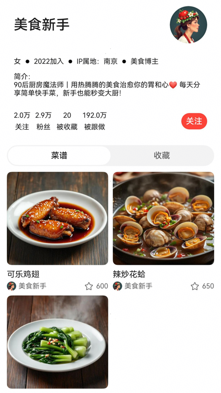
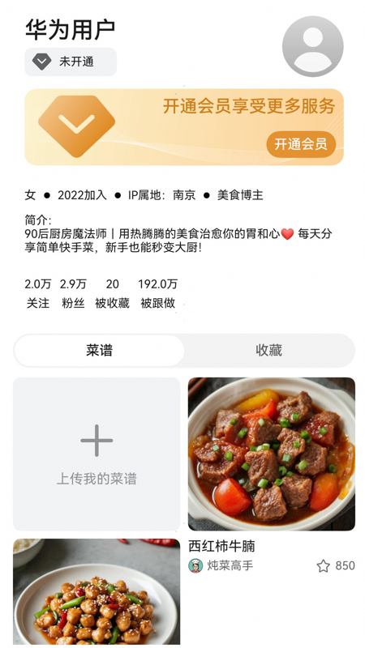
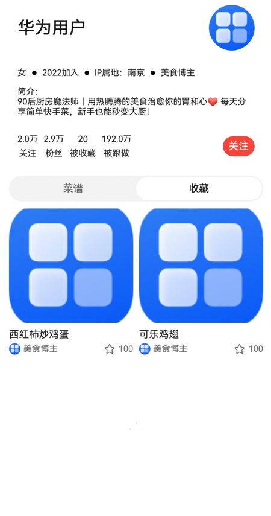

# 个人中心组件快速入门

## 目录
- [简介](#简介)
- [约束与限制](#约束与限制)
- [使用](#使用)
- [API参考](#API参考)
- [示例代码](#示例代码)

## 简介

本组件提供了个人中心的功能，包含个人简介、发布菜谱和收藏菜谱的相关功能，如果是用户信息支持展示登录和未登录状态。提供用户会员标签、开通会员和上传菜谱插槽，用于自定义相关内容。

| 博主详情                                                       | 登录状态                                                       |
|------------------------------------------------------------|------------------------------------------------------------|
|  |  |

## 约束与限制

### 环境

- DevEco Studio版本：DevEco Studio 5.0.4 Release及以上
- HarmonyOS SDK版本：HarmonyOS 5.0.4 Release SDK及以上
- 设备类型：华为手机（包括双折叠和阔折叠）、华为平板
- 系统版本：HarmonyOS 5.0.4(16)及以上

### 权限

- 无

## 使用

1. 安装组件。  
   如果是在DevEco Studio使用插件集成组件，则无需安装组件，请忽略此步骤。
   如果是从生态市场下载组件，请参考以下步骤安装组件。  
   a. 解压下载的组件包，将包中所有文件夹拷贝至您工程根目录的xxx目录下。  
   b. 在项目根目录build-profile.json5并添加base_ui、featured_recipes、aggregated_ads和personal_homepage模块。
   ```typescript
   // 在项目根目录的build-profile.json5填写base_ui、featured_recipes、aggregated_ads和personal_homepage路径。其中xxx为组件存在的目录名
   "modules": [
     {
       "name": "base_ui",
       "srcPath": "./xxx/base_ui",
     },
     {
       "name": "featured_recipes",
       "srcPath": "./xxx/featured_recipes",
     },
     {
       "name": "personal_homepage",
       "srcPath": "./xxx/personal_homepage",
     },
     {
       "name": "aggregated_ads",
       "srcPath": "./xxx/aggregated_ads",
     }
   ]
   ```
   c. 在项目根目录oh-package.json5中添加依赖
   ```typescript
   // xxx为组件存放的目录名称
   "dependencies": {
     "base_ui": "file:./xxx/base_ui",
     "featured_recipes": "file:./xxx/featured_recipes",
     "personal_homepage": "file:./xxx/personal_homepage",
     "aggregated_ads": "file:../aggregated_ads"
   }
   ```
   
2. 引入组件。

   ```typescript
   import { PersonalHomepage } from 'personal_homepage';
   ```

3. 调用组件，详细参数配置说明参见[API参考](#API参考)。

   ```typescript
   PersonalHomepage({
       recipeList: this.vm.recipeList,
       currentIndex: this.vm.currentIndex,
       isToDelete: this.isToDelete,
       uploadBuilderParam: (): void => {
          // 上传菜谱插槽
       },
       onClickCb: (id: number, index: number) => {
         // 跳转菜谱详情
       },
       jumpBloggerInfo: (id: number) => {
         // 跳转博主详情
       },
       deleteRecipes: (ids: number[]) => {
         // 删除菜谱
       },
       changeDeleteState: (isToDelete: boolean) => {
         // 切换删除状态
       },
       changeSelect: (id: number, flag: boolean) => {
         // 切换tab
       },
     })
   ```

## API参考

### 接口

PersonalHomepage(options?: PersonalHomepageOptions)

展示个人中心组件。

**参数：**

| 参数名     | 类型                                                      | 必填 | 说明         |
|---------|---------------------------------------------------------|----|------------|
| options | [PersonalHomepageOptions](#PersonalHomepageOptions对象说明) | 否  | 展示个人中心的参数。 |

### PersonalHomepageOptions对象说明

| 名称           | 类型                                        | 必填 | 说明           |
|--------------|-------------------------------------------|----|--------------|
| recipeList   | [RecipeBriefInfo](#RecipeBriefInfo对象说明)[] | 是  | 菜谱列表         |
| currentIndex | number                                    | 是  | tab栏索引       |
| isToDelete   | boolean                                   | 否  | 删除场景时是否是删除状态 |

### BloggerInfo对象说明

| 名称                | 类型                | 必填 | 说明     |
|-------------------|-------------------|----|--------|
| id                | number            | 是  | 博主序号   |
| name              | string            | 是  | 博主名称   |
| avatar            | ResourceStr       | 是  | 博主头像   |
| profile           | string            | 是  | 博主简介   |
| sex               | string            | 是  | 博主性别   |
| createdAccount    | string            | 是  | 创建日期   |
| ipLocation        | string            | 是  | IP归属地  |
| bloggerType       | string            | 是  | 博主标签   |
| followers         | number            | 是  | 关注数    |
| fans              | number            | 是  | 粉丝数    |
| beFavorite        | number            | 是  | 被收藏    |
| beFollowed        | number            | 是  | 被跟做    |
| myRecipeList      | RecipeBriefInfo[] | 是  | 我的菜谱数据 |
| collectRecipeList | RecipeBriefInfo[] | 是  | 我的收藏数据 |

### RecipeBriefInfo对象说明

| 名称           | 类型     | 必填 | 说明     |
|--------------|--------|----|--------|
| id           | number | 是  | 菜谱序号   |
| title        | string | 是  | 菜谱名称   |
| description  | string | 否  | 菜谱描述   |
| category     | string | 否  | 菜谱分类   |
| cookingTime  | number | 否  | 菜谱制作时间 |
| difficulty   | string | 否  | 菜谱难度   |
| authorId     | number | 是  | 作者id序号 |
| author       | string | 是  | 作者名称   |
| authorAvatar | string | 是  | 作者头像   |
| thumbnail    | string | 是  | 菜谱缩略图  |
| views        | number | 否  | 浏览数    |
| likes        | number | 是  | 收藏数    |
| video        | string | 是  | 视频链接   |
| coverUrl     | string | 否  | 封面链接   |
| heatness     | number | 否  | 热度     |

### 事件

支持以下事件：

#### onClickCb

onClickCb(callback: (id: number, index: number) => void)

跳转菜谱详情

#### jumpBloggerInfo

jumpBloggerInfo(callback: (id: number) => void)

跳转博主详情

#### deleteRecipes

deleteRecipes(callback: (ids: number[]) => void)

删除场景时，点击删除按钮触发事件

#### changeDeleteState

changeDeleteState(isToDelete: boolean)

删除场景时，长按菜谱触发删除选中

#### changeSelect

changeSelect(callback: (id: number, flag: boolean) => void)

切换tab栏

## 示例代码

### 示例1

```typescript
import { promptAction } from '@kit.ArkUI';
import { LazyDataSource } from 'featured_recipes';
import { BloggerInfo, PersonalHomepage, RecipeBriefInfo } from 'personal_homepage';

@Entry
@ComponentV2
struct Index {
   @Local bloggerInfo: BloggerInfo = new BloggerInfo()
   @Local currentIndex: number = 1
   @Local recipeList: LazyDataSource<RecipeBriefInfo> = new LazyDataSource();

   aboutToAppear(): void {
      this.bloggerInfo.updateData(0, '华为用户', $r('app.media.startIcon'),
      '90后厨房魔法师｜用热腾腾的美食治愈你的胃和心❤️ 每天分享简单快手菜，新手也能秒变大厨！', '女', '2022加入',
      'IP属地：南京', '美食博主', 20000, 29000, 20, 1920000)
      this.recipeList.pushArrayData([{
         id: 1,
         title: '西红柿炒鸡蛋',
         authorId: 1,
         author: '美食博主',
         authorAvatar: 'startIcon',
         thumbnail: 'startIcon',
         likes: 100,
      } as RecipeBriefInfo, {
         id: 2,
         title: '可乐鸡翅',
         authorId: 1,
         author: '美食博主',
         authorAvatar: 'startIcon',
         thumbnail: 'startIcon',
         likes: 100,
      } as RecipeBriefInfo])
   }

   build() {
      RelativeContainer() {
         PersonalHomepage({
            recipeList: this.recipeList,
            currentIndex: this.currentIndex,
            uploadBuilderParam: (): void => {
               // 上传菜谱插槽
            },
            onClickCb: (id: number, index: number) => {
               // 跳转菜谱详情
               promptAction.showToast({ message: '跳转菜谱详情' })
            },
            deleteRecipes: (ids: number[]) => {
               // 删除菜谱
               promptAction.showToast({ message: '删除菜谱' })
            },
            changeDeleteState: (isToDelete: boolean) => {
               // 切换删除状态
               promptAction.showToast({ message: '切换删除状态' })
            },
            changeSelect: (id: number, flag: boolean) => {
               // 未登录时跳转登录
               promptAction.showToast({ message: '切换tab' })
            },
            jumpBloggerInfo: (id: number) => {
               // 跳转博主详情
               promptAction.showToast({ message: '跳转关注页面' })
            },
         })
      }
      .height('100%')
      .width('100%')
      .padding({ top: 45 })
   }
}
```


