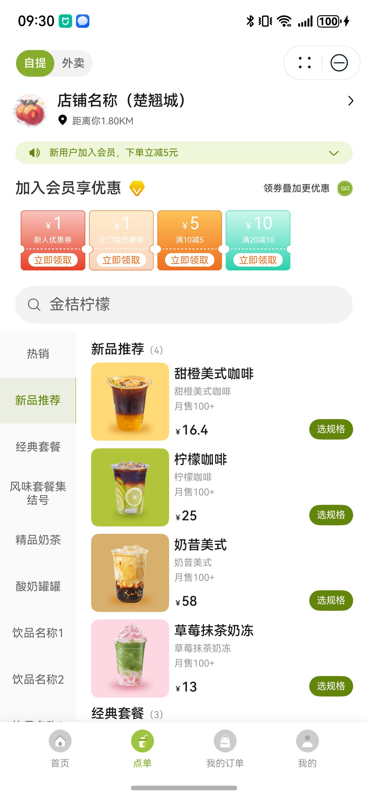
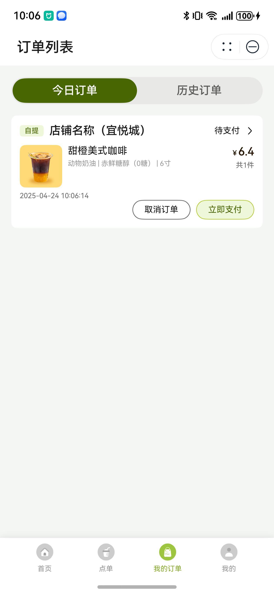

# 餐饮（茶饮）行业模板快速入门

## 目录
- [功能介绍](#功能介绍)
- [环境要求](#环境要求)
- [快速入门](#快速入门)
- [示例效果](#示例效果)
- [权限要求](#权限要求)
- [开源许可协议](#开源许可协议)

## 功能介绍
本模板为餐饮茶饮类元服务提供了常用功能的开发样例，模板主要分首页、点单、我的订单和我的四大模块：
- 首页：展示账号相关信息、选择点单方式、选择店铺、展示优惠活动和会员活动。
- 点单：提供店铺、优惠券、商品详情、购物车的展示，支持提交订单。
- 我的订单：支持对不同状态下订单的管理。
- 我的：展示账号相关信息，支持会员信息、优惠券和积分的查看，支持外卖配置地址管理，以及联系客服。

本模板已集成华为账号、地图、华为支付、通话等服务，只需做少量配置和定制即可快速实现华为账号的登录、商家位置定位导航、购买茶饮和联系商家等功能。

| 首页                                     | 点单                                      | 我的订单                                         | 我的                                   |
|----------------------------------------|-----------------------------------------|----------------------------------------------|--------------------------------------|
|  |  |  |  |


本模板主要页面及核心功能清单如下所示：
```ts
餐饮茶饮点单模板
 |-- 首页
 |    |-- banner
 |    |-- 用户信息
 |    |-- 配送方式
 |    |    └-- 店铺列表
 |    |-- 店铺活动
 |    └-- 会员广告
 |-- 点单
 |    |-- 店铺信息
 |    |    |-- 店铺详情
 |    |    |-- 店铺位置和导航
 |    |    └-- 店铺电话
 |    |-- 优惠券
 |    |    |-- 店铺优惠
 |    |    └-- 优惠券列表
 |    |-- 商品列表
 |    |    |-- 搜索商品
 |    |    |-- 商品详情
 |    |    └-- 商品规格
 |    |-- 购物车
 |    |    |-- 清空购物车
 |    |    |-- 修改购物车商品
 |    |    └-- 下单
 |    └-- 提交订单
 |-- 我的订单
 |    |-- 订单列表
 |    |    |-- 今日订单
 |    |    └-- 历史订单
 |    └-- 订单详情
 └-- 我的
      |-- 用户信息
      |    |-- 关联解绑账号
      |    └-- 完善信息
      |-- 店铺会员
      |    |-- 茶力值
      |    |-- 会员码
      |    |-- 优惠券
      |    └-- 积分
      └-- 帮助中心
           |-- 地址管理
           └-- 联系客服
```

本模板工程代码结构如下所示：
```
TeaDrinkOrders
  ├─commons/common/src/main
  │  ├─ets
  │  │  ├─axiosHttpRequest
  │  │  │      AxiosHttp.ets                  // 网络请求封装
  │  │  │      AxiosModel.ets                 // 网络请求对象
  │  │  │      AxiosRequest.ets               // 网络请求定义
  │  │  │      HttpRequest.ets                // 网络请求接口封装
  │  │  │      HttpRequestApi.ets             // 网络请求接口
  │  │  ├─cardManager
  │  │  │      CardManager.ets                // 卡片管理类
  │  │  ├─components
  │  │  │      AddAddressComp.ets             // 新增地址组件
  │  │  │      BusinessTimeDialog.ets         // 店铺休息弹窗
  │  │  │      CallTelSheet.ets               // 拨打电话弹窗
  │  │  │      CouponCardComp.ets             // 优惠券卡片组件
  │  │  │      EmptyComp.ets                  // 空数据组件
  │  │  │      HwMap.ets                      // 店铺地图
  │  │  │      HwMapComp.ets                  // 地图组件
  │  │  │      LoadingDialog.ets              // 加载中组件
  │  │  │      MemberCodePage.ets             // 会员码页面
  │  │  │      NavHeaderBar.ets               // navigation页面抬头
  │  │  │      OrderDetailCards.ets           // 订单详情卡片组件
  │  │  │      PayTypeDialog.ets              // 支付弹窗
  │  │  │      PkgGoodComp.ets                // 套餐内商品组件
  │  │  │      PreviewImagePage.ets           // 图片预览弹窗
  │  │  │      SheetHeaderComp.ets            // 半模态页面标题栏
  │  │  ├─constants
  │  │  │      Common.ets                     // 公共常量
  │  │  │      RouterMap.ets                  // 路由页面常量
  │  │  ├─mock
  │  │  │      MockData.ets                   // 接口mock数据
  │  │  │      MockResponse.ets               // 接口mock请求
  │  │  ├─models
  │  │  │      ParamsModel.ets                // 参数对象
  │  │  │      RequestModel.ets               // 网络请求参数对象
  │  │  │      ResponseModel.ets              // 网络请求响应对象
  │  │  │      RouterModel.ets                // 路由参数对象
  │  │  │      StorageModel.ets               // AppStorage参数对象
  │  │  │      TabBarModel.ets                // 底部导航栏对象
  │  │  └─utils
  │  │         CalculatorUtils.ets            // 计算方法
  │  │         Logger.ets                     // 日志方法
  │  │         PermissionUtil.ets             // 权限申请方法
  │  │         PreferenceUtil.ets             // 首选项方法
  │  │         Utils.ets                      // 公共方法
  │  │         WindowModel.ets                // 窗口方法
  │  └─resources
  │─features/home/src/main   
  │  ├─ets
  │  │  ├─components
  │  │  │      SelectStoreComp.ets             // 店铺选择组件
  │  │  └─pages
  │  │         HomePage.ets                    // 首页页面
  │  │         SelectStorePage.ets            // 店铺选择页面
  │─features/mine/src/main   
  │  ├─ets
  │  │  ├─components
  │  │  │      MembershipComp.ets              // 会员信息组件
  │  │  │      MenuComp.ets                    // 菜单组件
  │  │  │      UserInfoComp.ets                // 用户信息组件
  │  │  └─pages
  │  │         AddAddressPage.ets              // 新增地址页面
  │  │         AddressMgPage.ets               // 问题答复页面
  │  │         MinePage.ets                    // 我的页面
  │  │         MyCouponsPage.ets               // 优惠券页面
  │  │         UserInfoPage.ets                // 用户信息页面
  │  └─resources
  │─features/order/src/main   
  │  ├─ets
  │  │  ├─components
  │  │  │      AddAddressSheetComp.ets         // 新增地址半模态组件
  │  │  │      AddressSheetComp.ets            // 选择地址半模态组件
  │  │  │      CouponComp.ets                  // 优惠券组件
  │  │  │      GoodInfoComp.ets                // 商品信息组件
  │  │  │      GoodsListComp.ets               // 商品列表组件
  │  │  │      MyCarComp.ets                   // 购物车组件
  │  │  │      MyCarListComp.ets               // 购物车列表组件
  │  │  │      PackageCarListComp.ets          // 套餐内商品列表组件
  │  │  │      SpecSheetComp.ets               // 规格模态窗口组件
  │  │  │      TitleComp.ets                   // 点单标题栏组件
  │  │  └─pages
  │  │         ConfirmOrderPage.ets            // 确认订单页面
  │  │         GoodDetailPage.ets              // 商品详情页面
  │  │         MerchantDetailPage.ets          // 店铺详情页面
  │  │         OrderPage.ets                   // 点单页面
  │  └─resources
  │─features/order_list/src/main   
  │  ├─ets
  │  │  ├─components
  │  │  │      OrderListComp.ets               // 订单列表组件
  │  │  │      OrderTypeComp.ets               // 订单状态组件
  │  │  └─pages
  │  │         OrderDetailPage.ets             // 订单详情页面
  │  │         OrderListPage.ets               // 订单列表页面
  │  └─resources
  └─products/phone/src/main   
     ├─ets
     │  ├─components
     │  │      CustomTabBar.ets                // 自定义底部tab栏组件
     │  ├─entryability
     │  │      EntryAbility.ets                // 应用程序入口
     │  ├─entryformability
     │  │      EntryFormAbility.ets            // 卡片程序入口
     │  ├─pages
     │  │      Index.ets                       // 入口页面
     │  │      IndexPage.ets                   // 主页面
     │  └─widget/pages
     │         WidgetCard.ets                  // 卡片页面
     └─resources
```

## 环境要求
### 软件
* DevEco Studio版本：DevEco Studio 5.0.0 Release及以上
* HarmonyOS SDK版本：HarmonyOS 5.0.0 Release SDK及以上
### 硬件
* 设备类型：华为手机（直板机）
* HarmonyOS版本：HarmonyOS 5.0.0 Release及以上


## 快速入门
###  配置工程
在运行此模板前，需要完成以下配置：

1. 在DevEco Studio中打开此模板。

2. 在AppGallery Connect创建元服务，将包名配置到模板中。

   a. 参考[创建元服务](https://developer.huawei.com/consumer/cn/doc/app/agc-help-createharmonyapp-0000001945392297)为元服务创建APPID，并进行关联。

   b. 返回应用列表页面，查看元服务的包名。

   c. 将模板工程根目录下AppScope/app.json5文件中的bundleName替换为创建元服务的包名。

3. 配置服务器域名。

   本模板接口均采用mock数据，由于元服务包体大小有限制，部分图片资源将从云端拉取，所以需为模板项目[配置服务器域名](https://developer.huawei.com/consumer/cn/doc/atomic-guides/agc-help-harmonyos-server-domain)，“httpRequest合法域名”需要配置为：`https://agc-storage-drcn.platform.dbankcloud.cn`

4. 配置华为账号服务。

   a. 将元服务的client ID配置到phone[entry]模块的module.json5文件，详细参考：[配置Client ID](https://developer.huawei.com/consumer/cn/doc/atomic-guides/account-atomic-client-id)。

   b. 添加公钥指纹，详细参考：[配置应用证书指纹](https://developer.huawei.com/consumer/cn/doc/app/agc-help-signature-info-0000001628566748#section5181019153511)。

   c. 如需获取用户真实手机号，需要申请phone权限，详细参考：[配置scope权限](https://developer.huawei.com/consumer/cn/doc/atomic-guides/account-guide-atomic-permissions)。在端侧使用快速验证手机号码Button进行[验证获取手机号码](https://developer.huawei.com/consumer/cn/doc/atomic-guides/account-guide-atomic-get-phonenumber)。

5. 配置地图服务。

   a. 将元服务的client ID配置到phone[entry]模块的module.json5文件，如果华为账号服务已配置，可跳过此步骤。

   b. 添加公钥指纹，如果华为账号服务已配置，可跳过此步骤。

   c. [开通地图服务](https://developer.huawei.com/consumer/cn/doc/harmonyos-guides/map-config-agc)。
6. 配置支付服务。

   华为支付当前仅支持商户接入，在使用服务前，需要完成商户入网、开发服务等相关配置，本模板仅提供了端侧集成的示例。详细参考：[支付服务接入准备](https://developer.huawei.com/consumer/cn/doc/harmonyos-guides/payment-preparations)。

7.  （可选）如果从应用自己服务器请求数据，需要配置服务器请求信息。

a. 打开TeaDrinkOrders\commons\common\src\main\ets\constants\Common.ets文件，将BASE_URL修改为请求服务器的地址。

b. 打开TeaDrinkOrders\common\src\main\ets\AxiosHttpRequest\AxiosRequest.ets文件，将config.params配置为请求中的固定参数列表。

### 运行调试工程

1. 连接调试手机和PC。

2. 对元服务[手工签名](https://developer.huawei.com/consumer/cn/doc/harmonyos-guides/ide-signing)。

3. 菜单选择“Run > Run 'entry' ”或者“Run > Debug 'entry' ”，运行或调试模板工程。


## 示例效果
1. 主要功能  
[主要功能展示](screenshots/ScreenRecord_1.mp4) 

2. 到店自取流程   
[到店自取流程展示](screenshots/ScreenRecord_2.mp4) 

3. 外卖配送流程  
[外卖配送流程展示](screenshots/ScreenRecord_3.mp4) 

## 权限要求
- 获取位置权限：ohos.permission.APPROXIMATELY_LOCATION、ohos.permission.LOCATION
- 网络权限：ohos.permission.INTERNET

## 开源许可协议
该代码经过[Apache 2.0 授权许可](http://www.apache.org/licenses/LICENSE-2.0)。
