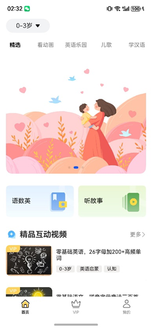
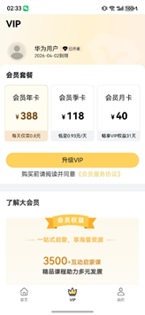
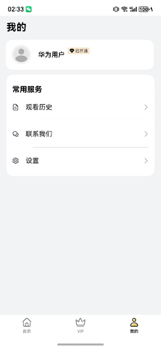

# 儿童教育行业模版

## 目录
- [功能介绍](#功能介绍)
- [环境要求](#环境要求)
- [快速入门](#快速入门)
- [示例效果](#示例效果)
- [权限要求](#权限要求)
- [开源许可协议](#开源许可协议)


## 功能介绍
本模板为儿童教育类应用提供了常用功能的开发样例，模板主要分首页、VIP和我的三大模块：

1、首页：通过精选、看动画、英语乐园、儿歌、学汉语多个Tab页展示不同类型的视频内容。

2、vip：提供会员信息展示，以及会员套餐的开通。

3、我的：提供登录，会员信息、观看历史管理，联系我们等功能。

本模板已集成华为账号服务，只需做少量配置和定制即可快速实现华为账号登录。


| 首页                                                    | 会员                                                   | 我的                                                    |
|-------------------------------------------------------|------------------------------------------------------|-------------------------------------------------------|
|  |  |  |

本模板主要页面及核心功能如下所示：

```ts
儿童教育模板
 |-- 首页
 |    |-- 精选
 |    |    |-- 轮播图
 |    |    |-- 语数英、听故事
 |    |    |-- 精品互动视频
 |    |    |    └-- 视频专辑
 |    |    |-- 热门动画榜
 |    |    |    └-- 视频专辑 
 |    |    |-- 音频故事专区
 |    |    |    └-- 视频专辑 
 |    |    |-- 经典故事
 |    |    |    └-- 视频专辑
 |    |-- 看动画
 |    |    |-- 超级汽车、国学、科普百科、多米
 |    |    |-- XXX第四季
 |    |    |    └-- 视频专辑 
 |    |    |-- XXX每周更新
 |    |    |    └-- 视频专辑 
 |    |    |-- 趣味百科
 |    |    |    └-- 视频专辑 
 |    |    |
 |    |-- 英语乐园
 |    |    |-- 原版英语儿歌
 |    |    |    └-- 视频专辑 
 |    |-- 儿歌
 |    |    |-- 律动儿歌
 |    |    |    |-- 视频专辑
 |    |    |-- 经典童谣
 |    |    |    |-- 视频专辑
 |    └-- 学汉语
 |         |-- 听故事 学叙事
 |         |    └-- 视频专辑
 |         |-- 三字经 磨耳朵
 |              └-- 视频专辑
 |-- VIP
 |    |-- 会员开通状态
 |    |    └-- 已开通、未开通 
 |    |-- 会员套餐 
 |    |    |-- 会员年卡
 |    |    |-- 会员季卡
 |    |    |-- 会员月卡
 |    |-- 开通会员、升级会员 
 |    |    └-- 会员服务协议
 |    └-- 会员介绍
 |    |    └-- 了解大会员
 └-- 我的
      |-- 用户信息
      |    |-- 华为账号一键登录
      |    └-- 头像昵称修改
      └-- 常用服务
           |-- 观看历史
           |-- 联系我们
           └-- 设置
                |-- 隐私协议
                └-- 时间管理
```


本模板工程代码结构如下所示：

```ts
ChildrenEducation
  |- commons                                       // 公共层
  |   |- datasource/src/main/ets/components        // 公共资源
  |   |    |- homepage 
  |   |    |     CartoonPageData.ets                // 看动画静态数据
  |   |    |     ChinesePageData.ets                // 学汉语静态数据
  |   |    |     EnglishChildrenSongsData.ets       // 英语乐园静态数据
  |   |    |     SelectedPageData.ets               // 精选静态数据
  |   |    |     SingSongPageData.ets               // 儿歌静态数据
  |   |    |- minepage 
  |   |    |     MinePageData.ets                   // 我的静态数据
  |   |    └- vippage 
  |   |          VipPageData.ets                    // VIP静态数据
  |   |  
  |   └- utils/src/main/ets                        // 公共组件模块(hsp)
  |        |- constants 
  |        |     CommonBanner.ets                 //  Banner页        
  |        |     CommonButton.ets                 //  公共按钮 
  |        |- player                              //  播放器页面
  |        |     AudioPlayPage                       
  |        |     PlayControl                         
  |        |     VideoPlayPage                       
  |        |- uicomponents                        
  |        |     FeedTitle                        // 区域顶部公共组件          
  |        |     GridLine                                 
  |        |     IconAndCount                     // 更新集数         
  |        |     NoMore                           // 没有更多         
  |        |     PlateType                        // 内容类型       
  |        |     TagLabelCard                     // 内容标签组件          
  |        |     Title                            // 标题     
  |        └- utils                               // 工具类
  |              AuthUtil.ets                         
  |              DateFormatUtil.ets               // 日期格式化   
  |              DateUtil.ets                     // 日期处理   
  |              GlobalContext.ets                // 全局变量   
  |              LogUtil.ets                      // 日志工具   
  |              ObjectUtil.ets                          
  |              StringUtil.ets                   // 字符串处理
  |
  |- product/phone                                //  
  |   └-  src/main/ets                                               
  |        |- entryability
  |             MainEntry.ets                      // 主页面                                                               
  |        |- entryformability                                                        
  |        └- pages                              
  |             Index.ets                          // 入口页面
  |
  |                                            
  |- scenes/services                              
  |   |- cartoon/src/main/ets                     
  |   |    |- components                          
  |   |    |    AnimationAnthology.ets            
  |   |    |    CoreButtons.ets                   
  |   |    |    FunEncyclopedia.ets                   
  |   |    └- views                               
  |   |         CartoonPage.ets                    // 看动画列表页
  |   |
  |   |- chinese/src/main/ets                      
  |   |    |- components                          
  |   |    |    SingStory.ets                      // 听故事
  |   |    └- views                               
  |   |         ChinesePage.ets                    // 学汉语列表页
  |   |
  |   |- englishZone/src/main/ets                 
  |   |    └- views                               
  |   |         EnglishZonePage.ets                // 英语乐园列表页
  |   |
  |   |- selected/src/main/ets                   
  |   |    |- components                         
  |   |    |    AudioStoryZone.ets            
  |   |    |    Banner.ets                    
  |   |    |    HobbyCategory.ets                     
  |   |    |    NoMore.ets                          
  |   |    |    PremiumVideo.ets                    
  |   |    └- views                               
  |   |         SelectedPage.ets               // 精选列表页
  |   |
  |   |- sing/src/main/ets                     
  |   |    └- views                               
  |   |         SingPage.ets                   // 儿歌列表页
  |   |     
  └- scenes/tabs    
      |- homepage                              // 酒店tab页功能组合(hsp)
      |    └- views                               
      |        HomePage.ets                    // 首页tab页
      | 
      |- minepage                              
      |    └- views                               
      |        MinePage.ets                    // 我的tab页
      | 
      └- vippage                               // vip的tab页功能组合(hsp)
           └- views                               
               VipPage.ets                     // vip的tab页
```

## 环境要求
### 软件
* DevEco Studio版本：DevEco Studio 5.0.2 Release及以上
* HarmonyOS SDK版本：HarmonyOS 5.0.1(13) Release SDK及以上
### 硬件
* 设备类型：华为手机（直板机）
* HarmonyOS版本：HarmonyOS 5.0.0 Release及以上

## 快速入门
### 配置工程
在运行此模板前，需要完成以下配置：

1. 在DevEco Studio中打开此模板。

2. 在AppGallery Connect创建应用，将包名配置到模板中。

   a. 参考[创建HarmonyOS应用/元服务](https://developer.huawei.com/consumer/cn/doc/app/agc-help-createharmonyapp-0000001945392297)为应用创建APPID，并进行关联。

   b. 返回应用列表页面，查看应用的包名。

   c. 将模板工程根目录下AppScope/app.json5文件中的bundleName替换为创建应用的包名。

3. 配置华为帐号服务。

   a. 将应用的client ID配置到entry模块的module.json5文件，详细参考：配置[Client ID](https://developer.huawei.com/consumer/cn/doc/atomic-guides-V5/account-atomic-client-id-V5)。

   b. 添加公钥指纹，详细参考：[配置应用证书指纹](https://developer.huawei.com/consumer/cn/doc/app/agc-help-signature-info-0000001628566748#section5181019153511)。

### 定制说明
1. 建议在未登录状态下可以免费视频播放，但VIP视频先跳转登录页面再进行播放
2. 观看历史和时长控制同上

### 运行调试工程
1. 连接调试手机和PC。

2. 对应用签名：由于模板中集成了华为账号服务，所以需要采用[手工签名](https://developer.huawei.com/consumer/cn/doc/harmonyos-guides/ide-signing)。

3. 菜单选择“Run > Run 'phone' ”或者“Run > Debug 'phone' ”，运行或调试模板工程。

## 示例效果
## 视频播放列表
[功能展示录屏](./screenshots/功能展示录屏.mp4)

## 权限要求
网络权限: ohos.permission.INTERNET
身份认证权限: ohos.permission.ACCESS_BIOMETRIC
获取数据网络信息权限: ohos.permission.GET_NETWORK_INFO


## 开源许可协议
该代码经过[Apache 2.0 授权许可](https://www.apache.org/licenses/LICENSE-2.0)。