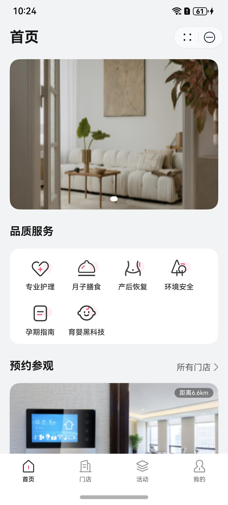
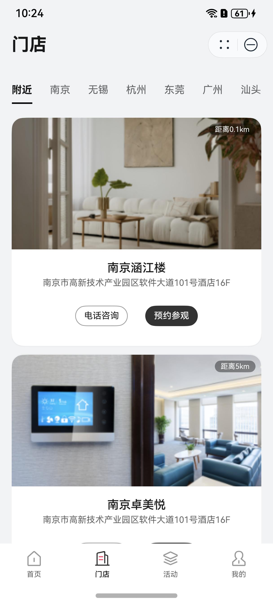
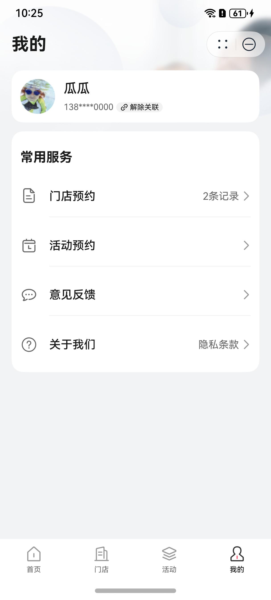

# 母婴(月子中心)行业模板

## 目录

- [功能介绍](#功能介绍)
- [环境要求](#环境要求)
- [快速入门](#快速入门)
- [示例效果](#示例效果)
- [权限要求](#权限要求)
- [开源许可协议](#开源许可协议)


## 功能介绍

本模板为母婴行业（月子中心）类应用提供了常用功能的开发样例，模板主要分为首页、门店、活动和我的四大模块：

* 首页：提供品牌服务信息、附近门店情况的展示，支持电话咨询、参观预约等功能。

* 门店：根据附近或者城市获取门店信息，提供门店详情和套餐价目介绍，支持参观预约、地址导航、日程添加、手机号关联和电话咨询等功能。

* 活动：根据附近或者城市、活动类型获取活动信息，提供活动详情介绍，支持活动报名、电话咨询等功能。

* 我的：支持展示用户信息和隐私条款，支持门店、活动预约记录的管理、意见反馈、华为账号一键登录等功能。

本模板已集成华为账号、地图等服务，只需做少量配置和定制即可快速实现华为账号的登录、定位导航和预约门店、活动等功能。


| 首页                         | 门店                         | 活动                         | 我的                         |
|----------------------------|----------------------------|----------------------------|----------------------------|
|  |  |  |  |


本模板主要页面及核心功能如下所示：

```ts
母婴模板
 |-- 华为账号静默登录
 |-- 首页
 |    |-- Banner
 |    |-- 服务列表
 |    |    └-- 服务详情介绍
 |    └-- 预约参观
 |         └-- 附近门店列表
 |              |-- 门店详情
 |              |-- 门店距离
 |              |-- 预约参观
 |              |-- 地址导航
 |              |-- 电话咨询
 |              |-- 添加日程
 |              └-- 手机号关联
 |-- 门店
 |    |-- 城市位置筛选
 |    └-- 门店列表
 |         |-- 门店详情    
 |         |-- 门店距离    
 |         |-- 预约参观    
 |         |-- 地址导航    
 |         |-- 电话咨询    
 |         |-- 添加日程    
 |         └-- 手机号关联    
 |-- 活动
 |    |-- 城市位置选择
 |    |-- 活动类型选择
 |    └-- 活动列表
 |         |-- 活动详情
 |         |-- 活动报名   
 |         └-- 手机号关联 
 |         |-- 添加日程
 |         |-- 电话咨询  
 └-- 我的
      |-- 用户信息
      |    |-- 头像、昵称设置
      |    |-- 华为账号一键登录
      |-- 门店预约记录
      |    |-- 预约列表
      |    |-- 预约详情
      |    |-- 地址导航 
      |    |-- 电话咨询 
      |    |-- 添加日程 
      |    └-- 取消预约
      |-- 活动预约记录
      |    |-- 预约列表
      |    |-- 预约详情
      |    |-- 地址导航 
      |    |-- 电话咨询  
      |    └-- 取消预约
      |-- 意见反馈
      └-- 关于我们
           |-- 隐私政策
           |-- 第三方信息共享清单
           └-- 个人信息收集清单
```


本模板工程代码结构如下所示：

```ts
postpartum_care_center
  ├─components/uicomponents/src/main
  │  ├─ets
  │  │  ├─components
  │  │  │      AssociatePhone.ets            // 手机号关联组件
  │  │  │      BindPhoneDialog.ets           // 手机号绑定弹窗
  │  │  │      Booking.ets                   // 门店预约参观组件
  │  │  │      BookingSuccess.ets            // 门店预约参观成功组件
  │  │  │      CalenderAddition.ets          // 日程添加组件
  │  │  │      StoreCard.ets                 // 门店卡片组件 
  │  │  │      StoreDetail.ets               // 门店详情组件
  │  │  │      TitleTop.ets                  // 顶部标题组件
  │  │  │  
  │  │  ├─constants
  │  │  │      Constants.ets                 // 公共常量
  │  │  │
  │  │  ├─model
  │  │  │      ActivityTypeItem.ets          // 活动数据模型
  │  │  │      CityItem.ets                  // 城市数据模型
  │  │  │      StoreBookingRecordItem.ets    // 门店预约记录模型
  │  │  │      StoreListClass.ets            // 门店列表类
  │  │  │      StoreModel.ets                // 门店数据模型
  │  │  │  
  │  │  └─viewmodel
  │  │          MainEntryVM.ets              // 公共VM层                                   
  │  └─resources  
  │
  ├─components/utils/src/main
  │  ├─ets
  │  │  ├─constants
  │  │  │      CommonContants.ets            // 公共常量
  │  │  │      CommonEnums.ets               // 日志打印
  │  │  │
  │  │  ├─model
  │  │  │  └─activity
  │  │  │            ActivityBookingRecordModel.ets // 数据请求模型
  │  │  │            ActivityModel.ets              // 数据响应模型
  │  │  │      BookingRec.ets                // 预约记录模型
  │  │  │      ServiceItem.ets               // 服务介绍模型
  │  │  │
  │  │  └─utils
  │  │          AccountUtil.ets              // 账号工具类
  │  │          BookingUtil.ets              // 预约工具类
  │  │          CalendarUtil.ets             // 日程工具类
  │  │          CommonUtil.ets               // 公共类
  │  │          FormatUtil.ets               // 格式化工具类
  │  │          LocateUtil.ets               // 定位工具类
  │  │          LocationPermissionUtil.ets   // 定位权限类
  │  │          Logger.ets                   // 日志工具类
  │  │          PermissionUtil.ets           // 权限工具类
  │  │          RouterModule.ets             // 路由模块
  │  │                                       
  │  └─resources                             
  │                                                                                
  │─products/src/main                           
  │  ├─ets   
  │  │  ├─contants
  │  │  │      Constants.ets                 // 常量          
  │  │  │                                            
  │  │  ├─entryability                        
  │  │  │      EntryAbility.ets              
  │  │  │                                    
  │  │  ├─model                   
  │  │  │      TabListItem.ets               // Tab页签数据模型             
  │  │  │                                    
  │  │  └─pages                              
  │  │         MainEntry.ets                 // 主入口页面
  │  │                                       
  │  └─resources 
  │                            
  │─scenes/activities/src/main                     
  │  ├─ets                                    
  │  │  ├─pages                              
  │  │  │      activities.ets                // 活动页面 
  │  │  │                                    
  │  │  ├─view                          
  │  │  │      ActivityBooking.ets           // 活动预约报名 
  │  │  │      ActivityBookingSuccess.ets    // 活动预约报名成功
  │  │  │      ActivityCard.ets              // 活动卡片组件
  │  │  │      ActivityDetail.ets            // 活动详情组件
  │  │  │      ActivityList.ets              // 活动列表组件                             
  │  │  │
  │  │  └─viewmodel                           
  │  │          ActivityEntryVM.ets          // 活动页面VM
  │  │                                        
  │  └─resources    
  │                                          
  │─scenes/home/src/main                     
  │  ├─ets                                    
  │  │  ├─constants                              
  │  │  │      Constants.ets                  // 常量 
  │  │  │                                    
  │  │  ├─model                          
  │  │  │      ServiceGridItem.ets           // 服务介绍栅格数据模型 
  │  │  │                                     
  │  │  ├─pages                               
  │  │  │      Home.ets                      // 主页
  │  │  │      ServiceDetail.ets             // 服务详情页
  │  │  │                                     
  │  │  └─view                           
  │  │          Banner.ets                   // 首页Banner
  │  │          NearbyStores.ets             // 附近门店组件
  │  │          SeviceGrids.ets              // 服务介绍栅格组件
  │  │
  │  └─resources                              
  │
  │─scenes/mine/src/main                     
  │  ├─ets                                                                     
  │  │  └─pages                               
  │  │     └─privacy
  │  │               InfoSharingListPage.ets               // 第三方信息共享列表页面
  │  │               PersonalInfoCollectListPage.ets       // 个人信息收集列表页面
  │  │               PrivacyListPage.ets                   // 隐私条例页
  │  │               PrivacyPolicyPage.ets                 // 隐私政策页面
  │  │          ActivityBookingDetailPage.ets       // 活动预约报名记录详情页
  │  │          ActivityBookingListPage.ets         // 活动预约报名记录列表页
  │  │          FeedbackPage.ets                    // 意见反馈页
  │  │          Mine.ets                            // 我的页面
  │  │          StoreBookingDetail.ets              // 门店预约记录详情页
  │  │          StoreBookingRecordsPage.ets         // 门店预约记录列表页
  │  │          SubmitSuccessPage.ets               // （反馈意见）提交成功页 
  │  │   
  │  └─resources     
  │                                             
  └─scenes/stores/src/main                        
     ├─ets                                    
     │  ├─constants                              
     │  │      Constants.ets                 // 常量 
     │  │                                    
     │  ├─model                          
     │  │      CityItem.ets                  // 城市数据模型 
     │  │                                     
     │  ├─pages                               
     │  │      Stores.ets                    // 门店页面
     │  │                                     
     │  └─view                           
     │         StoreList.ets                 // 门店列表组件
     │
     └─resources
```


## 环境要求

### 软件
* DevEco Studio版本：DevEco Studio 5.0.0 Release及以上
* HarmonyOS SDK版本：HarmonyOS 5.0.0 Release SDK及以上
### 硬件
* 设备类型：华为手机（直板机）
* HarmonyOS版本：HarmonyOS 5.0.0 Release及以上


## 快速入门
###  配置工程
在运行此模板前，需要完成以下配置：

1. 在DevEco Studio中打开此模板。

2. 在AppGallery Connect创建应用，将包名配置到模板中。

   a. 参考[创建应用](https://developer.huawei.com/consumer/cn/doc/app/agc-help-createharmonyapp-0000001945392297)为应用创建APPID，并进行关联。

   b. 返回应用列表页面，查看应用的包名。

   c. 将模板工程根目录下AppScope/app.json5文件中的bundleName替换为创建应用的包名。

3. 配置华为账号服务。

   a. 将应用的client ID配置到phone模块的module.json5文件，详细参考：[配置Client ID](https://developer.huawei.com/consumer/cn/doc/harmonyos-guides/account-client-id)。

   b. [申请调试证书](https://developer.huawei.com/consumer/cn/doc/app/agc-help-add-debugcert-0000001914263178)，用于配置公钥指纹和调试时对应用签名。

   c. 添加公钥指纹，详细参考：[配置应用证书指纹](https://developer.huawei.com/consumer/cn/doc/app/agc-help-signature-info-0000001628566748#section5181019153511)。

   d. 如需获取用户真实手机号，需要申请phone权限，详细参考：[配置scope权限](https://developer.huawei.com/consumer/cn/doc/harmonyos-guides/account-config-permissions)，并在端侧使用快速验证手机号码Button进行[验证获取手机号码](https://developer.huawei.com/consumer/cn/doc/harmonyos-guides/account-get-phonenumber)。

4. 配置地图服务。

   a. 将应用的client ID配置到phone模块的module.json5文件，如果华为账号服务已配置，可跳过此步骤。

   b. 添加公钥指纹，如果华为账号服务已配置，可跳过此步骤。

   c. [开通地图服务](https://developer.huawei.com/consumer/cn/doc/harmonyos-guides/map-config-agc)。

### 定制说明
建议在用户未登录状态下允许查看门店、活动，门店预约、活动预约功能须先跳转登录页面登录成功后才能操作。跳转登录功能可参考QuickLoginPage.ets文件中的实现。

###  运行调试工程
1. 连接调试手机和PC。

2. 对应用签名：由于模板中集成了华为账号、地图等服务，所以需要采用[手工签名](https://developer.huawei.com/consumer/cn/doc/harmonyos-guides-V5/ide-signing-V5#section297715173233)。

3. 菜单选择“Run > Run 'phone' ”或者“Run > Debug 'phone' ”，运行或调试模板工程。


## 示例效果
-  [功能展示录屏](./screenshots/功能展示.mp4)

## 权限要求

* 获取位置权限：ohos.permission.APPROXIMATELY_LOCATION，ohos.permission.LOCATION
* 网络权限：ohos.permission.INTERNET
* 日历日程权限：ohos.permission.READ_CALENDAR，ohos.permission.WRITE_CALENDAR

## 开源许可协议

该代码经过[Apache 2.0 授权许可](http://www.apache.org/licenses/LICENSE-2.0)。

