# 医保模板

## 目录

- [功能介绍](#功能介绍)
- [环境要求](#环境要求)
- [快速入门](#快速入门)
- [示例效果](#示例效果)
- [权限要求](#权限要求)
- [开源许可协议](#开源许可协议)

## 功能介绍

本模板为医保元服务提供了常用功能的开发样例，模板主要分首页、服务、医保码、资讯、和我的五大模块：

* 首页：主要提供医保码展示，长辈模式，以及热点查询，便民服务等功能

* 服务：展示全部服务列表，支持搜索所需服务。

* 资讯：展示当前医保相关资讯，支持上拉刷新、下拉加载、以及跳转h5查看资讯详情

* 医保码：展示当前账号绑定的医保码，

* 我的：展示个人信息、关于我们，切换头像，并支持意见反馈。

本模板已集成华为账号、定位、地图等服务，只需做少量配置和定制即可快速实现华为账号的登录、位置定位等功能，从而快速完成相关功能的实现。

| 首页                           | 服务                              | 我的                           | 资讯                           |
|------------------------------|---------------------------------|------------------------------|------------------------------|
| 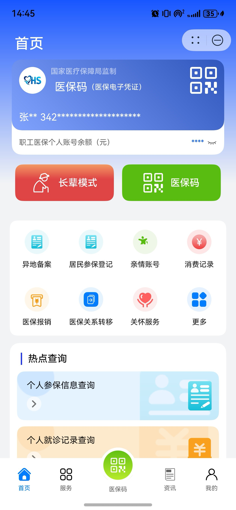 | 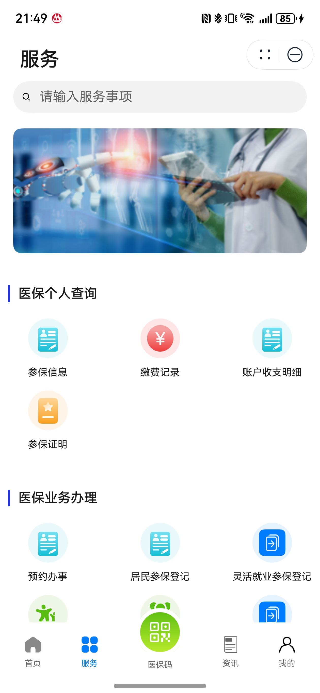 | 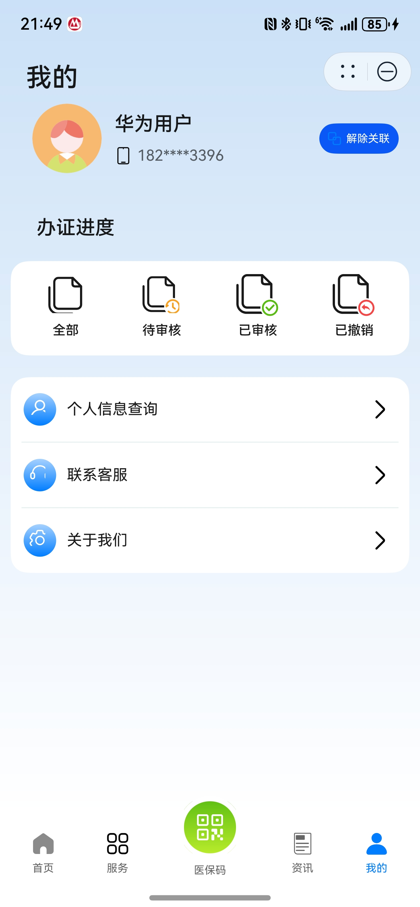 | 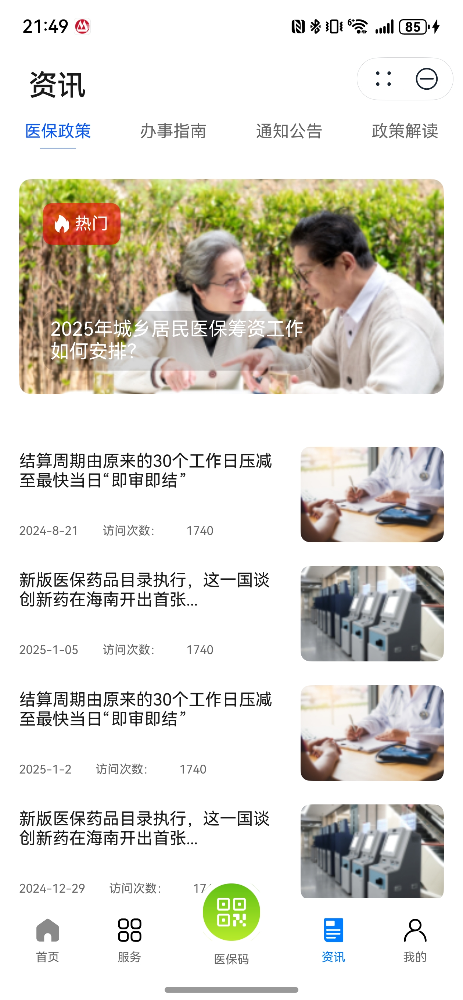 |

本模板主要页面及核心功能如下所示：

```ts
家政模板
 |-- 首页
 |    |-- 医保信息
 |    |-- 长辈模式
 |    |-- 医保码
 |    |-- 热点查询
 |    |     |-- 个人参保信息查询
 |    |     |-- 个人就诊记录查询
 |    |     |-- 个人账户明细查询
 |    └-- 便民服务
 |          |-- 医保地图
 |          |-- 医保机构
 |          |-- 定点医院
 |          |-- 药品查询
 |-- 服务
 |    |-- 个人医保查询
 |          |-- 参保信息
 |          |-- 缴费记录 
 |          |-- 账户收支明细 
 |          |-- 参保证明 
 |    |-- 医保业务办理
 |          |-- 异地备案
 |          |-- 亲情账号 
 |          |-- 城乡居民参保登记 
 |          |-- 灵活就业参保登记
 |          |-- 家庭共济 
 |          |-- 医保关系转移接续 
 |    |-- 医保公共查询
 |          |-- 定点医疗机构
 |          |-- 定点零售药店 
 |          |-- 账户收支明细 
 |          |-- 参保信息
 └-- 我的
      |-- 用户信息
      |     |-- 个人信息
      |     └-- 编辑资料
      |-- 办证进度
      |     |-- 待审核
      |     |-- 已审核
      |     |-- 已撤销
      |-- 个人信息
      └-- 联系客服
      └-- 关于我们
            └-- 意见反馈
            └-- 反馈记录
```

本模板工程代码结构如下所示：

```ts
├──commons
│   ├──common                                // 公共能力层
│     ├──src/main/ets                        // 基础能力
│     │  ├──axios                            // 网络请求封装
│     │  └──AxiosHttpRequest                 // 业务请求
│     │  └──AxiosMockData                    // 网络请求mock接口
│     │  └──basicDataSource                  // 懒加载数据源
│     │  └──constants                        // 公共常量
│     │  └──h5                               // h5页面封装
│     │  └──imagePreview                     // 图片预览公共组件
│     │  └──permissionRequest                // 获取权限工具类
│     │  └──quickLogin                       // 华为账号一键登录
│     │  └──utils                            // 公共方法
│     └──Index.ets                           // 对外接口类
│   ├──components                            // 细化业务组件
│     ├──src/main/ets                        // 基础能力
│     │  ├──AboutUs                          // 关于我们组件
│     │  └──CertificationProgress            // 暂无数据公共组件
│     │  └──ConvenientService                // 便民服务组件
│     │  └──DrugInquiry                      // 药品查询组件
│     │  └──HotServiceCard                   // 热门服务组件
│     │  └──InstitutionsPage                 // 医疗机构组件
│     │  └──MedicalPersonCardInfo            // 个人医保信息卡片组件
│     │  └──OlderModel                       // 长辈模式组件
│     │  └──OnlineReservation                // 在线预约组件
│     │  └──ReservationSheet                 // 在线预约记录组件
│     └──Index.ets                           // 对外接口类  
├──feature                                   // 基础特性层
│  ├──home/src/main/ets                      // 首页（包含卡证识别，智能填充，花瓣地图）
│  │  ├──commonconstants      
│  │  ├──model    
│  │  ├──pages                               // 首页入口
│  │  ├──views    
│  ├──home/src/main/resources                // 资源文件目录
│  ├──home/Index.ets                         // 对外接口类
│  ├──service/src/main/ets                   // 全部服务
│  │  ├──view                                // 全部服务入口
│  ├──instantDelivery/src/main/resources     // 资源文件目录
│  ├──instantDelivery/Index.ets              // 对外接口类
│  ├──information/src/main/ets               // 资讯
│  │  ├──view                                // 资讯入口
│  ├──information/src/main/resources         // 资源文件目录
│  ├──mine/src/main/ets                      // 我的（包含一键登录）
│  │  ├──components
│  │  └──pages                               // 我的入口页   
│  │  └──utils
│  └──mine/src/main/resources                // 资源文件目录
└──products                                  // 产品定制层
   ├──phone/src/main/ets                      
   │  ├──entryability                        // 主入口生命周期（包含预加载） 
   │  └──pages                               // 首页主入口 
   │  └──components                          // 首页公共组件  
   │  └──entryformability                    // 服务卡片入口生命周期 
   │  └──widget                              // 服务卡片    
   └──phone/src/main/resources               // 资源文件目录
```

## 环境要求

### 软件

* DevEco Studio版本：DevEco Studio 5.0.0 Release及以上
* HarmonyOS SDK版本：HarmonyOS 5.0.0 Release SDK及以上

### 硬件

* 设备类型：华为手机（直板机）
* HarmonyOS版本：HarmonyOS 5.0.0 Release及以上

## 快速入门

### 配置工程

在运行此模板前，需要完成以下配置：

1. 在DevEco Studio中打开此模板。

2. 在AppGallery Connect创建元服务，将包名配置到模板中。

   a. 参考[创建元服务](https://developer.huawei.com/consumer/cn/doc/app/agc-help-createharmonyapp-0000001945392297)
   为元服务创建APPID，并进行关联。

   b. 返回应用列表页面，查看元服务的包名。

   c. 将Application/AppScope/app.json5文件中的bundleName替换为创建元服务的包名。

3. 配置签名。

   a. 参考[开通地图服务](https://developer.huawei.com/consumer/cn/doc/harmonyos-guides/map-config-agc) 依次开通地图服务、位置服务、定位服务。
   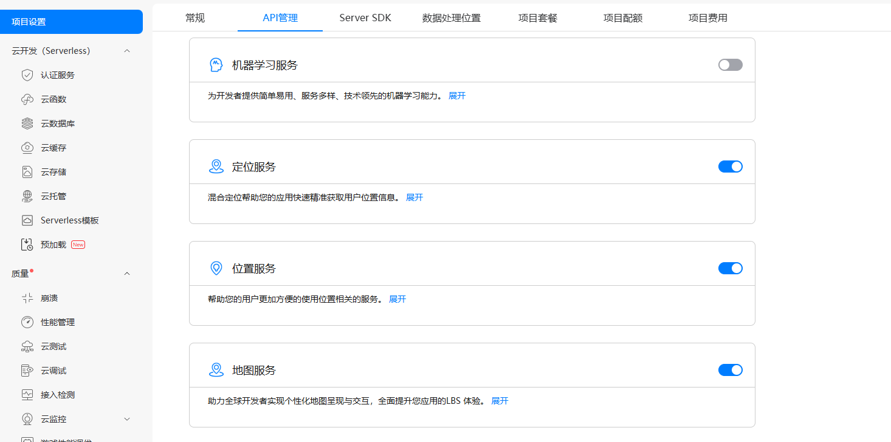

   b. 为元服务进行[手工签名](https://developer.huawei.com/consumer/cn/doc/harmonyos-guides-V5/ide-signing-V5#section297715173233)。

   c. 添加公钥指纹，详细参考：[配置应用证书指纹](https://developer.huawei.com/consumer/cn/doc/app/agc-help-signature-info-0000001628566748#section5181019153511)。

4. 本模板是端云一体模版，采用云函数接口的方式mock请求数据，所以需要部署云函数以及云数据库。

   a. [开通元函数服务](https://developer.huawei.com/consumer/cn/doc/harmonyos-guides/cloudfoundation-enable-function)和[开通云数据库服务](https://developer.huawei.com/consumer/cn/doc/harmonyos-guides/cloudfoundation-enable-database)

   b. 在CloudProgram/cloud-config.json文件中配置相关信息，依次填写当前项目的appId、appName、projectId、teamId、projectName，相关信息查询参考[查看应用基本信息](https://developer.huawei.com/consumer/cn/doc/app/agc-help-appinfo-0000001100014694) 。
   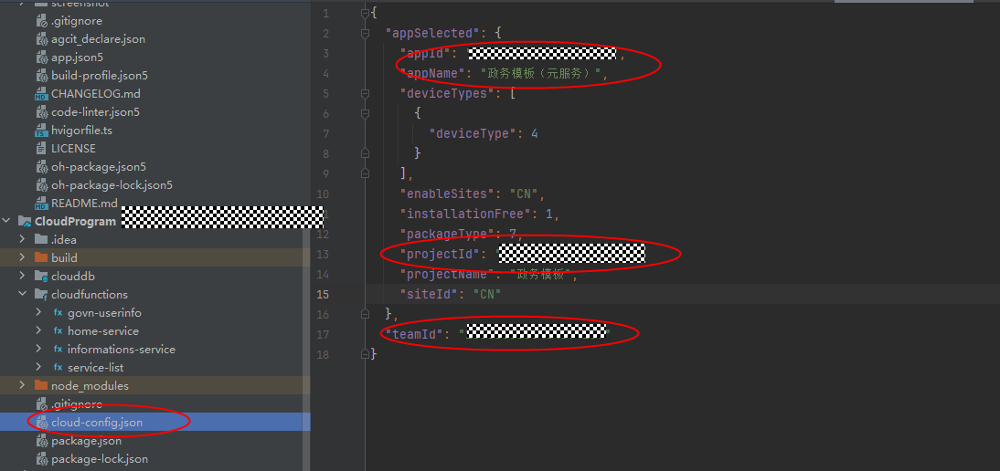
   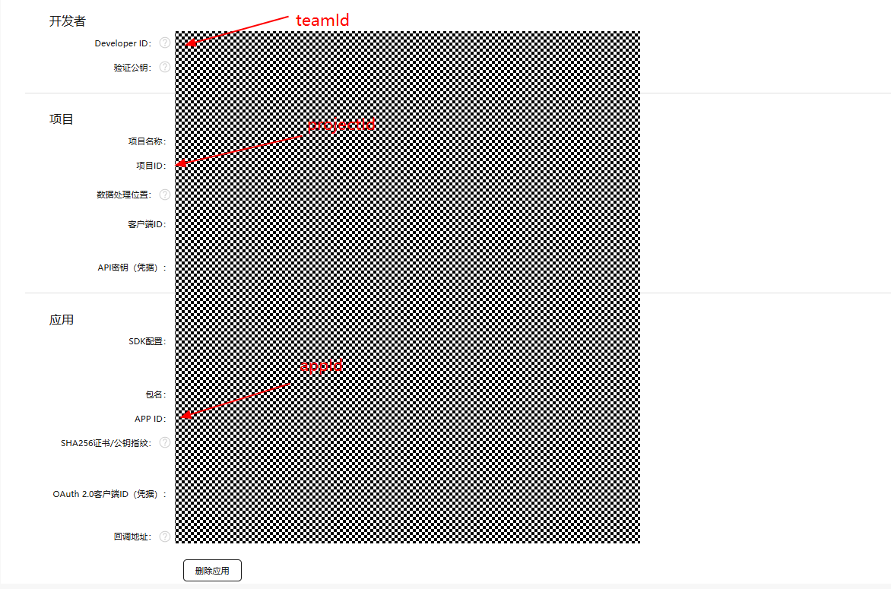

   c.  部署云数据库。右击clouddb选择“deploy Cloud db”进行部署，部署成功之后可以在AGC上查看数据库状态。
   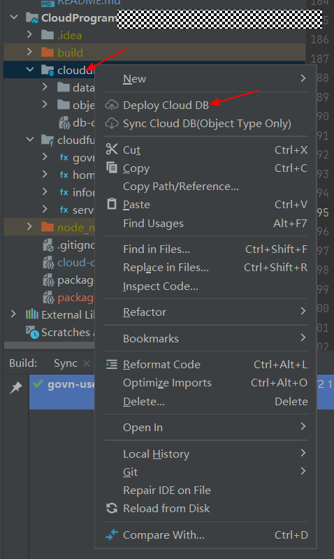
   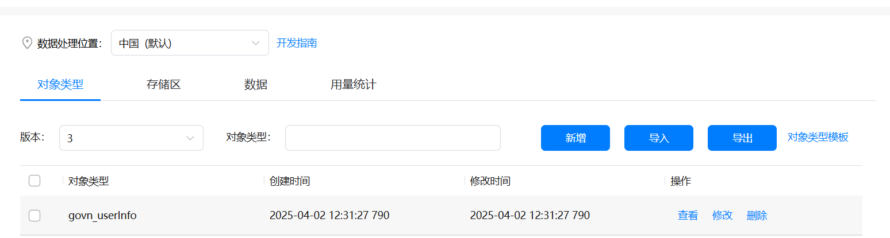

   d. 部署云函数。右击goven-userinfo，点击Deploy 'goven-userinfo'部署云函数，类似操作部署home-service、informations-service和service-list。
   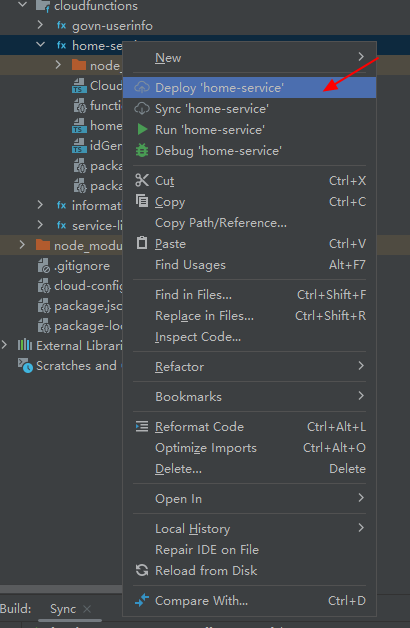

   e. 云函数部署成功，可以在AGC上查看相关记录。
   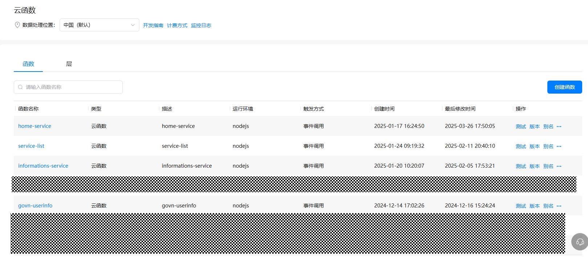
5. 配置预加载。

   a. [开通预加载服务](https://developer.huawei.com/consumer/cn/doc/AppGallery-connect-Guides/agc-preload-enable-0000001834523102) 。

   b. 为预加载绑定签名部署的云函数home-service。
   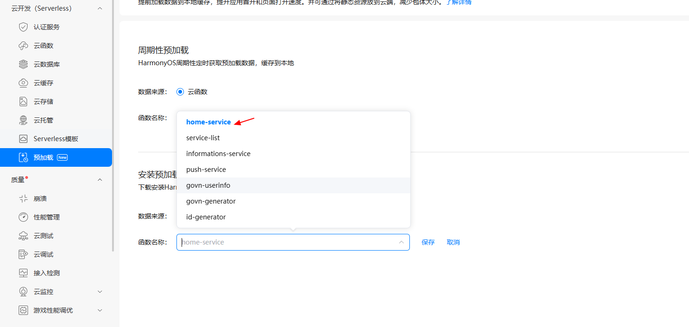

6. 配置华为账号服务。

   a. 将元服务的client ID配置到Application/product/entry模块的module.json5文件，详细参考：[配置Client ID](https://developer.huawei.com/consumer/cn/doc/atomic-guides/account-atomic-client-id)。

   b. 添加公钥指纹，详细参考：[配置应用证书指纹](https://developer.huawei.com/consumer/cn/doc/app/agc-help-signature-info-0000001628566748#section5181019153511)。

   c. 如需获取用户真实手机号，需要申请phone权限，详细参考：[配置scope权限](https://developer.huawei.com/consumer/cn/doc/atomic-guides/account-guide-atomic-permissions)，并在端侧使用快速验证手机号码Button进行[验证获取手机号码](https://developer.huawei.com/consumer/cn/doc/atomic-guides/account-guide-atomic-get-phonenumber)。

7. 为元服务[配置服务器域名](https://developer.huawei.com/consumer/cn/doc/atomic-guides/agc-help-harmonyos-server-domain)，配置httpRequest合法域名即可。


### 运行调试工程

1. 连接调试手机和PC。

2. 对元服务[手工签名](https://developer.huawei.com/consumer/cn/doc/harmonyos-guides-V5/ide-signing-V5#section297715173233)。

3. 菜单选择“Run > Run 'entry' ”或者“Run > Debug 'entry' ”，运行或调试模板工程。

## 示例效果

1. [首页](https://agc-storage-drcn.platform.dbankcloud.cn/v0/zwmb-xlw7o/video%2F1.mp4?token=e4952413-5cc9-4e65-a7ce-189956cd5462)

2. [服务](https://agc-storage-drcn.platform.dbankcloud.cn/v0/zwmb-xlw7o/video%2F2.mp4?token=817c37a1-0cba-4508-ad2b-c725c9b8dd36)

3. [资讯](https://agc-storage-drcn.platform.dbankcloud.cn/v0/zwmb-xlw7o/video%2F3.mp4?token=d1f6be36-ec66-4a4b-adec-444168512942)

4. [我的](https://agc-storage-drcn.platform.dbankcloud.cn/v0/zwmb-xlw7o/video%2F4.mp4?token=a23c05d9-baa1-45f6-b082-63bd0554cbc0)


## 权限要求

* 获取位置权限：ohos.permission.APPROXIMATELY_LOCATION
* 网络权限：ohos.permission.INTERNET

## 开源许可协议

该代码经过[Apache 2.0 授权许可](http://www.apache.org/licenses/LICENSE-2.0)。
