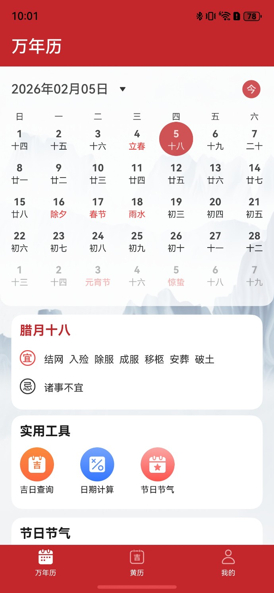
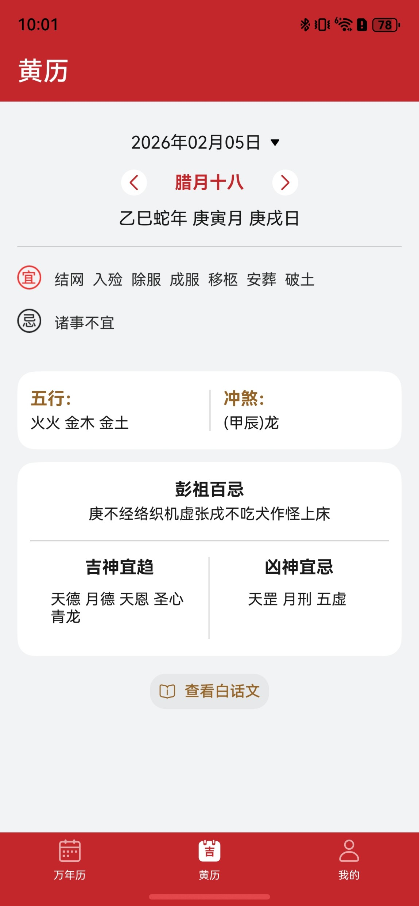
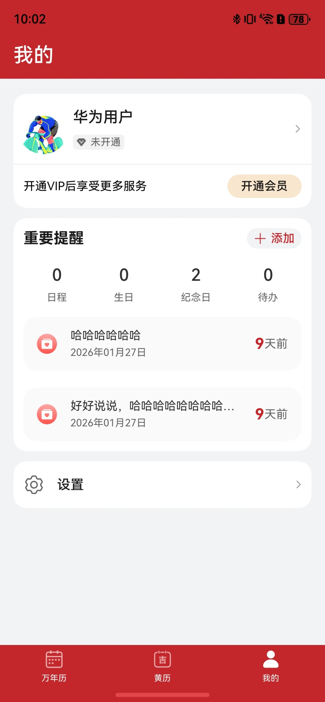

# 生活服务（日历）应用模板快速入门

## 目录

- [功能介绍](#功能介绍)
- [约束与限制](#约束与限制)
- [快速入门](#快速入门)
- [示例效果](#示例效果)
- [权限](#权限)
- [开源许可协议](#开源许可协议)

## 功能介绍

您可以基于此模板直接定制应用，也可以挑选此模板中提供的多种组件使用，从而降低您的开发难度，提高您的开发效率。

本模板提供如下组件，所有组件存放在工程根目录的components下，如果您仅需使用组件，可参考对应组件的指导链接；如果您使用此模板，请参考本文档。

| 组件                          | 描述                                          | 使用指导                                             |
|-----------------------------|---------------------------------------------|--------------------------------------------------|
| 多功能日历组件（base_calendar）      | 展示当前日期日历、自定义头部项插槽、节日、节气展示颜色等相关的能力           | [使用指导](components/base_calendar/README.md)       |
| 黄历组件（calendar_almanac）      | 日历黄历组件，支持日期动态选择，阴历阳历，五行等信息展示                | [使用指导](components/calendar_almanac/README.md)    |
| 日程提醒（calendar_events）       | 日历重要提醒，支持新增以及编辑日历，生日，纪念日，待办。支持日程添加到系统日历提醒中  | [使用指导](components/calendar_events/README.md)     |
| 多功能日期计算组件（date_calculation） | 本组件日期计算的相关能力，包括日期间隔，日期计算，阴阳转换等功能            | [使用指导](components/date_calculation/README.md)    |
| 节日节气（festival_solar）        | 本组件提供了节日节气展示的相关功能                           | [使用指导](components/festival_solar/README.md)      |
| 简易登录组件（login_info）          | 本组件提供了用户信息展示，登录，个人信息编辑，华为账号一键登录，开通会员入口的相关功能 | [使用指导](components/login_info/README.md)          |
| 宜忌查询组件（yiji_query）          | 查询开始日期到结束日期内的吉日以及忌日的相关功能                    | [使用指导](components/yiji_query/README.md)          |
| 城市限行组件（traffic_restriction） | 查询定位城市限行信息                                  | [使用指导](components/traffic_restriction/README.md) |
| 历史上的今天（today_history）       | 查询历史上的今天                                 | [使用指导](components/today_history/README.md)       |
| 通用会员组件（membership）  | 通用会员组件                                | [使用指导](components/membership/README.md)       |
### 模板
本模板为日历应用提供了常用功能的开发样例，模板主要分为万年历、黄历、和我的三大模块：

* 万年历：主要提供日历服务查询、吉日工具查询、日期查询、节日节气查询等功能。

* 黄历：根据选择日历展示黄历内容，支持切换日期查看今日宜以及今日忌。

* 我的：展示个人信息、华为账号一键登录、切换主题等。

| 万年历                                                   | 黄历                                                      | 我的                           
|-------------------------------------------------------|---------------------------------------------------------|------------------------------ 
|  |  |   

本模板主要页面及核心功能如下所示：

```ts
日历模板
 |-- 万年历
 |    |-- 日历选择
 |    |-- 吉日查询
 |    |-- 日期计算
 |    |-- 节日节气
 |    └-- 宜忌展示
 |-- 黄历
 |    |-- 日期切换
 |    |-- 宜忌展示
 |    |-- 五行、冲煞 
 |    |-- 彭祖百忌
 └-- 我的
 |     |-- 个人信息
 |     └-- 设置
 |       └-- 主题切换
 |       └-- 隐私协议
 |       └-- 用户协议  
```

本模板工程代码结构如下所示：

```ts
Application
├──├──commons
│   ├──common                                // 公共能力层
│     ├──src/main/ets                        // 基础能力
│     │  └──components                       // 公共组件
│     │  └──dividerTmp                       // 下划线公共组件
│     │  └──https                            // 网络请求库
│     │  └──models                           // 公共接口常量
│     │  └──quickLogin                       // 华为账号一键登录
│     │  └──style                            // 公共样式
│     │  └──utils                            // 工具类
│     │  └──viewmodels                       // 接口层
│     └──Index.ets                           // 对外接口类
│  ├──router_module                          // 全局路由组件
├──├──components                             // 公共组件
│   ├──base_apis                             // 通用组件（模态框，弹窗，选择器等）
│   ├──base_calendar                         // 日历组件
│   ├──calendar_almanac                      // 黄历组件
│   ├──calendar_events                       // 重要提醒组件
│   ├──date_calculation                      // 日期计算组件
│   ├──festival_solar                        // 节日节气组件
│   ├──login_info                            // 登录组件组件
│   ├──membership                            // 通用会员组件
│   ├──traffic_restriction                   // 城市限行组件
│   ├──yiji_query                            // 宜忌查询组件
├──features                                  // 基础特性层
│  ├──almanac/src/main/ets                   // 黄历
│  │  ├──pages                               // 首页入口
│     │  ├──AlmanacView                      // 黄历入口
│  ├──almanac/src/main/resources             // 资源文件目录
│  ├──almanac/Index.ets                      // 对外接口类
│  ├──perpetual/src/main/ets                 // 万年历
│  │  ├──components                          // 万年历组件
│  │  ├──pages                               
│     │  ├──PerpetualCalendar                // 万年历组件入口
│  ├──perpetual/src/main/resources           // 资源文件目录
│  ├──perpetual/Index.ets                    // 对外接口类
│  ├──mine/src/main/ets                      // 我的（包含一键登录）
│  │  └──pages                               // 我的入口页
│     │  ├──MinePage                         // 登录
│  │  └──components                          // 我的页面入口
│  └──mine/src/main/resources                // 资源文件目录
└─product/entry/src/main   
   ├─ets
   │  ├─widget
   │  │  ├──pages            
   │  │      ├──WidgetCard.ets       // 服务卡片    
   │  ├─entryability
   │  │      ├──EntryAbility.ets             // 应用程序入口
   │  ├─page
   │  │  ├──Index.ets                        // 入口
   │  │  ├──PrivacyPage.ets                  // 隐私协议   
   │  │  ├──SafePage.ets                     // 隐私协议弹窗  
   │  │  ├──SplashPage.ets                   // 闪屏页        
   │  │  ├──TabContainer.ets                 // tab页入口
   └─resources
```

## 注意事项

* 本模版提供的均是模拟数据，所有服务跳转到的页面均为本地mock页面或者lunar三方库提供的数据，实际开发中请以具体业务为准。
* 本模版登录中获取验证码场景为模拟场景，真实场景以业务实际场景为准。
* 本模版在未配置华为账号一键登录的情况下为保证正常使用本模版，均采用模拟用户信息登录，实际开发中请以具体业务为准。

## 约束与限制

### 环境

- DevEco Studio版本：DevEco Studio 6.0.2 Release及以上
- HarmonyOS SDK版本：HarmonyOS 6.0.2 Release SDK及以上
- 设备类型：华为手机（包括双折叠和阔折叠）、平板
- 系统版本：HarmonyOS 5.0.5(17)及以上

### 权限

* 网络权限：ohos.permission.INTERNET
* 获取位置权限：ohos.permission.APPROXIMATELY_LOCATION、ohos.permission.LOCATION
* 日历权限：ohos.permission.WRITE_CALENDAR、ohos.permission.READ_CALENDAR

## 快速入门

### 配置工程

在运行此模板前，需要完成以下配置：

1. 在AppGallery Connect创建应用，将包名配置到模板中。

   a. 参考[创建HarmonyOS应用](https://developer.huawei.com/consumer/cn/doc/app/agc-help-create-app-0000002247955506)为应用创建APP ID，并将APP ID与应用进行关联。

   b. 返回应用列表页面，查看应用的包名。

   c. 将模板工程根目录下AppScope/app.json5文件中的bundleName替换为创建应用的包名。

2. [开通地图服务](https://developer.huawei.com/consumer/cn/doc/harmonyos-guides/map-config-agc)。

3. 配置华为账号服务。

   a. 将应用的client ID配置到product/entry/src/main模块的[module.json5](./product/entry/src/main/module.json5)文件，详细参考：[配置Client ID](https://developer.huawei.com/consumer/cn/doc/harmonyos-guides/account-client-id)。

   b. 申请华为账号一键登录所需的quickLoginMobilePhone权限，详细参考：[配置scope权限](https://developer.huawei.com/consumer/cn/doc/harmonyos-guides/account-config-permissions)。

4. 对应用进行[手工签名](https://developer.huawei.com/consumer/cn/doc/harmonyos-guides/ide-signing#section297715173233)。

5. 添加手工签名所用证书对应的公钥指纹。详细参考：[配置应用签名证书指纹](https://developer.huawei.com/consumer/cn/doc/app/agc-help-cert-fingerprint-0000002278002933)

6. 本模板提供了通过应用内支付实现会员开通的能力（自动续期订阅会员及非续期订阅会员），开发者可以根据业务需要快速实现应用会员开通。若要体验应用内支付实现会员开通相关功能需要开发者自行配置相关参数以及服务，详情见[使用指导](components/membership/README.md)
### 运行调试工程

1. 连接调试手机和PC。

2. 菜单选择“Run > Run 'entry' ”或者“Run > Debug 'entry' ”，运行或调试模板工程。

## 示例效果

1. [万年历]([home.mp4](screenshot%2Fhome.mp4))

2. [黄历]([huangli.mp4](screenshot%2Fhuangli.mp4))

3. [我的]([mine.mp4](screenshot%2Fmine.mp4))

## 开源许可协议

该代码经过[Apache 2.0 授权许可](http://www.apache.org/licenses/LICENSE-2.0)。
