# 政务模板

## 目录

- [功能介绍](#功能介绍)
- [环境要求](#环境要求)
- [快速入门](#快速入门)
- [示例效果](#示例效果)
- [权限要求](#权限要求)
- [开源许可协议](#开源许可协议)

## 功能介绍

本模板为政务应用提供了常用功能的开发样例，模板主要分首页、办事、互动、和我的四大模块：

* 首页：主要提供服务查询，身份码，资讯公告，热门服务，我的收藏，最近使用，专题服务等功能

* 服务：展示全部服务列表，支持搜索所需服务。

* 资讯：提供民声在线，客服问答等相关功能

* 我的：展示个人信息、关于我们，并支持意见反馈。

本模板已集成华为账号、广告、定位、推送等服务，只需做少量配置和定制即可快速实现华为账号的登录、定位、推送等功能，从而快速完成相关功能的实现。

| 首页                           | 办事                               | 我的                           | 互动                                  |
| ------------------------------ | ---------------------------------- | ------------------------------ | ------------------------------------- |
| 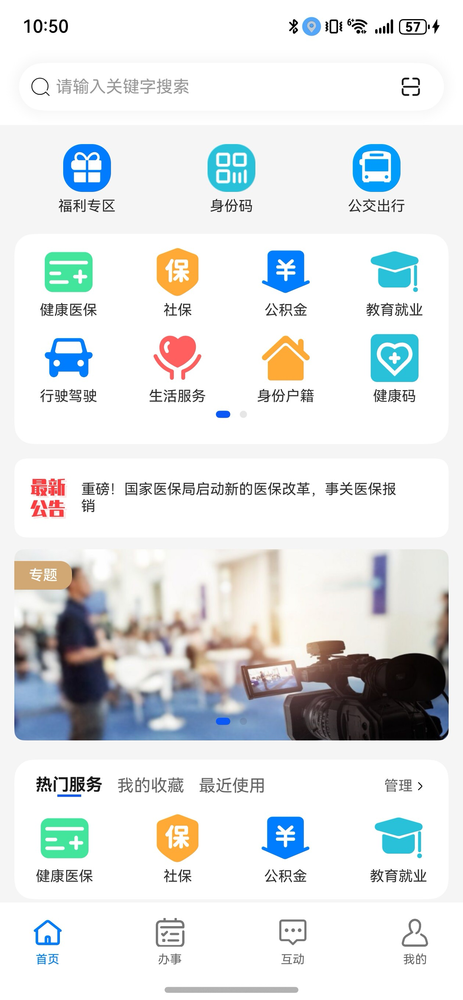 | 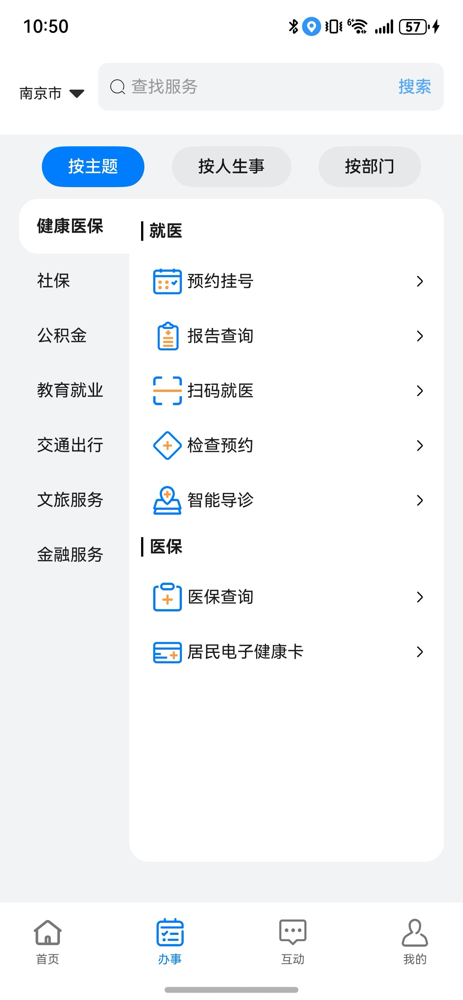 | 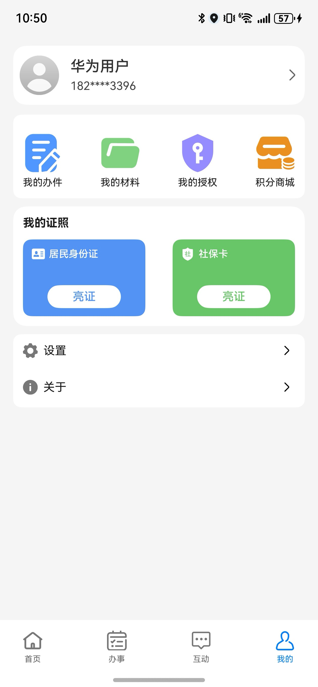 | 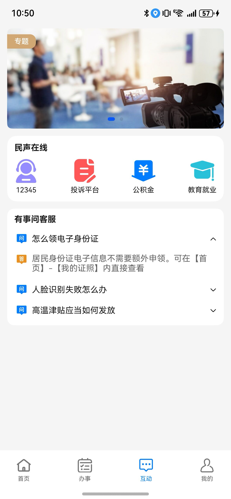 |

本模板主要页面及核心功能如下所示：

```ts
政务模板
 |-- 首页
 |    |-- 福利专区
 |    |-- 身份码
 |    |-- 公交出行
 |    |-- 区域banner
 |    |     |-- 健康医保
 |    |     |-- 社保
 |    |     |-- 公积金
 |    |     |-- 教育就业
 |    |     |-- 行驶驾驶
 |    └-- 资讯公告
 |          |-- 资讯滚动
 |          |-- 新闻轮播
 |-- 办事
 |    |-- 按主题
 |          |-- 健康医保
 |          |-- 公积金 
 |          |-- 教育就业 
 |          |-- 行驶驾驶 
 |    |-- 按人生事
 |          |-- 生活服务
 |          |-- 身份户籍 
 |          |-- 文旅体育 
 |          |-- 优待抚恤
 |          |-- 不动产 
 |          |-- 婚育 
 |    |-- 按部门
 |          |-- 司法公正
 |          |-- 出境入境 
 |          |-- 其他 
 └-- 我的
      |-- 用户信息
      |     |-- 个人信息
      |     └-- 退出登录
      |-- 民声在线
      |     |-- 我的办件
      |     |-- 我的材料
      |     |-- 我的授权
      |     |-- 积分商城
      |-- 我的证照
      |     |-- 居民身份证
      |     |-- 社保卡
      └-- 设置
      └-- 关于
```

本模板工程代码结构如下所示：

```ts
Application
├──├──commons
│   ├──common                                // 公共能力层
│     ├──src/main/ets                        // 基础能力
│     │  └──cloudFunction                    // 云函数
│     │  └──dividerTmp                       // 下划线公共组件
│     │  └──Interface                        // 公共接口常量
│     │  └──Model                            // 公共接口常量
│     │  └──Utils                            // 公共方法
│     └──Index.ets                           // 对外接口类
│   ├──components                            // 细化业务组件
│     ├──src/main/ets/components             // 基础能力
│     │  ├──AboutUs                          // 关于我们组件
│     │  └──buildSwiperArea                  // 轮播组件
│     │  └──CodeMockPage                     // 身份码展示组件
│     │  └──FeedbackList                     // 反馈列表组件
│     │  └──PersonInformation                // 个人信息
│     │  └──PrivacyPolicyPage                // 隐私政策
│     │  └──ScanCodeResult                   // 扫码结果
│     │  └──TermsOfServicePage               // 隐私服务
│     │  └──NoDataPage                       // 暂无数据组件
│     │  └──Suggestion                       // 问题反馈组件
│     └──Index.ets                           // 对外接口类
│   ├──H5                                    // h5页面
│     ├──src/main/ets/pages                  // 基础能力
│     │  ├──H5                               // h5公共页面
│     │  ├──utils                            // h5工具类
│     └──Index.ets                           // 对外接口类 
├──features                                  // 基础特性层
│  ├──home/src/main/ets                      // 首页
│  │  ├──pages                               // 首页入口
│     │  ├──home                             // 首页入口
│     │  ├──ServiceManage                    // 全部服务管理
│     │  ├──ServiceSearch                    // 全部服务搜索
│  ├──home/src/main/resources                // 资源文件目录
│  ├──home/Index.ets                         // 对外接口类
│  ├──office/src/main/ets                    // 全部服务
│  │  ├──pages                               // 全部服务入口
│     │  ├──OfficePage                       // 全部服务入口
│     │  ├──SiteList                         // 位置选择
│  ├──office/src/main/resources              // 资源文件目录
│  ├──office/Index.ets                       // 对外接口类
│  ├──interaction/src/main/ets               // 互动
│  │  ├──pages                               // 互动入口
│     │  ├──InteractionPage                  // 互动入口
│  ├──interaction/src/main/resources         // 资源文件目录
│  ├──mine/src/main/ets                      // 我的（包含一键登录）
│  │  └──pages                               // 我的入口页
│     │  ├──Login                            // 登录
│     │  ├──LoginWithHuaweiID                // 华为账号一键登录
│     │  ├──Message                          // 消息页面
│     │  ├──MinePage                         // 我的页面主入口
│     │  ├──Settings                         // 全部设置
│  └──mine/src/main/resources                // 资源文件目录
└─products/entry/src/main   
   ├─ets
   │  ├─entrybackupability
   │  │      ├──EntryBackupAbility            
   │  ├─entryability
   │  │      ├──EntryAbility.ets              // 应用程序入口
   │  ├─pages
   │  │  ├─components
   │  │  │   ├──CustomTabBar.ets             // 自定义底部tab栏组件
   │  │  ├──MainPage                         // 首页
   │  │  ├──SplashFullScreenAdPage           // 广告页
   │  │  ├──SplashPage                       // 闪屏页
   └─resources     
CloudProgram
├──clouddb                                   // 云数据库
│  ├──dataentry                              // 云数据库描述文件
│  │  ├──d_govn_template_userInfo            // 用户信息描述文件
│  ├──objecttype                             // 云数据库描述文件
│  │  ├──govn_template_userInfo              // 用户信息部署文件
├──cloudfunctions                            // 云函数
│  ├──govn-template-push                     // 消息通知云函数
│  ├──govn-template-userinfo                 // 用户信息云函数
```

## 注意事项

* 本模版均提供的是模拟数据，所有服务跳转到的页面均为本地mock页面，提示暂无数据，实际开发中请按照业务为准！
* 本模版登录中获取验证码获取场景为模拟场景，真实场景以业务实际场景为准
* 本模版在未配置华为账号一键登录的情况下为保证正常使用本模版，均采用模拟用户信息登录，实际开发中请按照业务为准！

## 环境要求

### 软件

* DevEco Studio版本：DevEco Studio 5.0.0 Release及以上
* HarmonyOS SDK版本：HarmonyOS 5.0.0 Release SDK及以上

### 硬件

* 设备类型：华为手机（直板机）
* HarmonyOS版本：HarmonyOS 5.0.0 Release及以上

## 快速入门

### 配置工程

在运行此模板前，需要完成以下配置：

1. 在DevEco Studio中打开此模板。

2. 在AppGallery Connect创建应用，将包名配置到模板中。

   a. 参考[创建HarmonyOS应用](https://developer.huawei.com/consumer/cn/doc/app/agc-help-createharmonyapp-0000001945392297)为应用创建APPID，并进行关联。

   b. 返回应用列表页面，查看应用的包名。

   c. 将Application/AppScope/app.json5文件中的bundleName替换为创建应用的包名。

3. 配置签名。

   a. 参考[开通推送服务](https://developer.huawei.com/consumer/cn/doc/harmonyos-guides/push-config-setting) ，依次在“API管理”处开通位置服务、定位服务。

   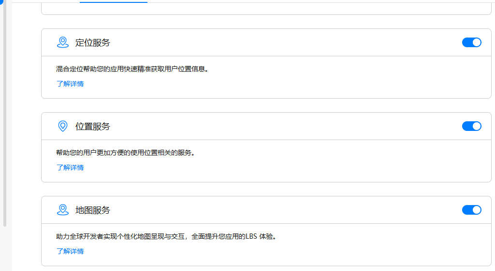

   b. 为应用进行[手工签名](https://developer.huawei.com/consumer/cn/doc/harmonyos-guides/ide-signing)。

   c. 添加公钥指纹，详细参考：[配置应用证书指纹](https://developer.huawei.com/consumer/cn/doc/app/agc-help-signature-info-0000001628566748#section5181019153511)。

4. 本模板是端云一体模版，采用云函数接口的方式mock请求数据，所以需要部署云函数以及云数据库。

   a. [开通元函数服务](https://developer.huawei.com/consumer/cn/doc/harmonyos-guides/cloudfoundation-enable-function)和[开通云数据库服务](https://developer.huawei.com/consumer/cn/doc/harmonyos-guides/cloudfoundation-enable-database)。

   b. 在CloudProgram/cloud-config.json文件中配置相关信息，依次填写当前项目的appId、appName、projectId、teamId、projectName，相关信息查询参考[查看应用基本信息](https://developer.huawei.com/consumer/cn/doc/app/agc-help-appinfo-0000001100014694) 。

   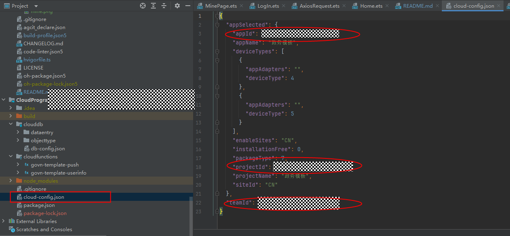

   

   c.  部署云数据库。右击clouddb选择“deploy Cloud db”进行部署，部署成功之后可以在AGC上查看数据库状态。

   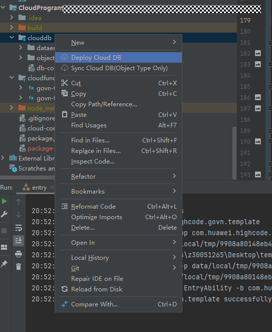

   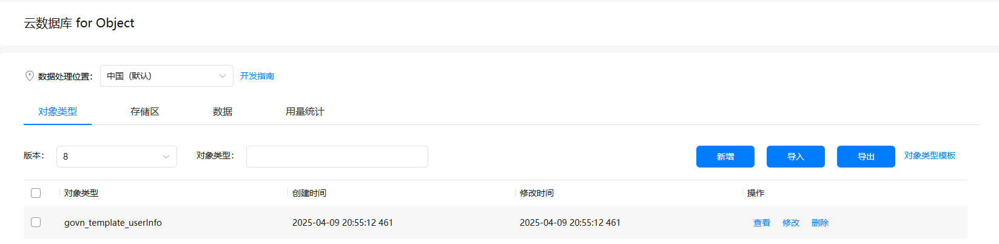

   d. 部署云函数。右击govn-template-userinfo，点击Deploy 'govn-template-userinfo'部署云函数，类似操作部署govn-template-push。

   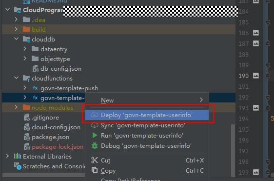

   e. 云函数部署成功，可以在AGC上查看相关记录。

   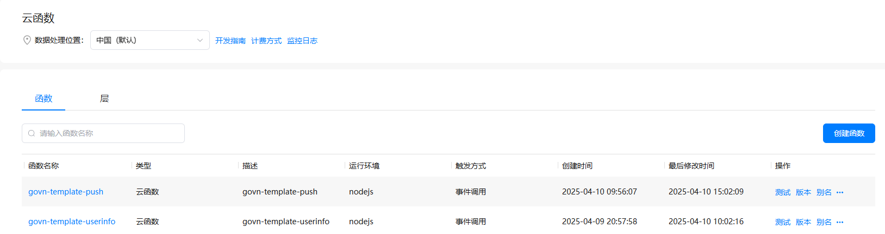

5. 配置华为账号服务。

   a. 将应用的client ID配置到Application/product/entry模块的module.json5文件，详细参考：[配置Client ID](https://developer.huawei.com/consumer/cn/doc/harmonyos-guides/account-client-id)。

   b. 添加公钥指纹，详细参考：[配置应用证书指纹](https://developer.huawei.com/consumer/cn/doc/app/agc-help-signature-info-0000001628566748#section5181019153511)。

   c. 配置scope权限：[配置scope权限](https://developer.huawei.com/consumer/cn/doc/harmonyos-guides/account-config-permissions)。

   d.在cloudfunctions/govn-template-userinfo/AxiosApi.ts文件中配置client_id、client_secret。client_id、client_secret信息的查询请参考[查看应用基本信息](https://developer.huawei.com/consumer/cn/doc/app/agc-help-appinfo-0000001100014694)。

   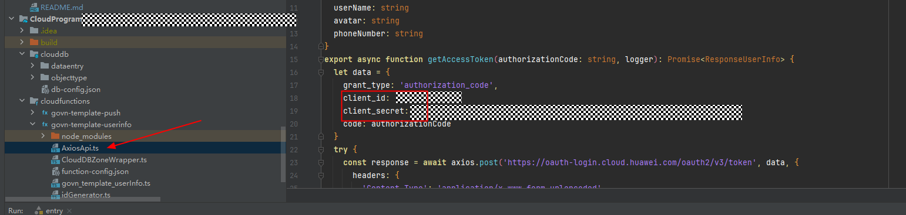

   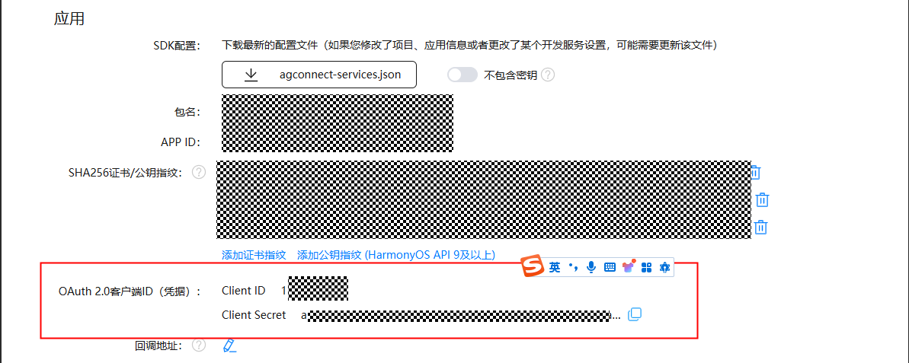

6. 配置推送服务。
   a. 参考API Console操作指南的[“服务账号密钥”](https://developer.huawei.com/consumer/cn/doc/start/api-0000001062522591#section14931730144919)获取推送服务API的服务账号秘钥（项目级凭证）。

   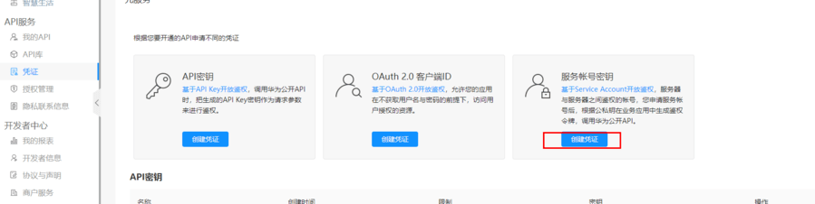

   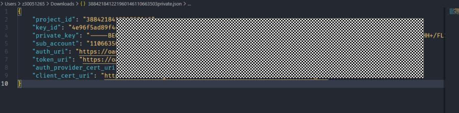

   b. 获取JWT，根据获取的服务账号密钥信息，填入JWT文件中的对应位置
   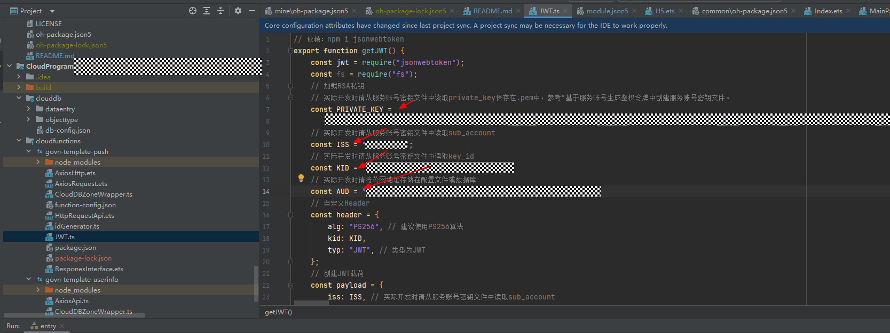
   c. 推送成功

   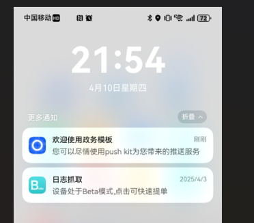

### 运行调试工程

1. 连接调试手机和PC。

2. 对应用[手工签名](https://developer.huawei.com/consumer/cn/doc/harmonyos-guides/ide-signing#section297715173233)。

3. 菜单选择“Run > Run 'entry' ”或者“Run > Debug 'entry' ”，运行或调试模板工程。

## 示例效果

1. [首页](https://agc-storage-drcn.platform.dbankcloud.cn/v0/zwmb-xlw7o/ec370eec6b2c307ace23ec30997c946d_SVID_20250425_105644_1.mp4?token=939df71c-83cf-4f96-8bef-83ea3d8bd2b4)

2. [办事](https://agc-storage-drcn.platform.dbankcloud.cn/v0/zwmb-xlw7o/e7a500caed5d709d0d8980ee999923c5_SVID_20250425_105702_1.mp4?token=7410ac3b-2fa6-4177-ae06-01f6cf675bc8)

3. [互动](https://agc-storage-drcn.platform.dbankcloud.cn/v0/zwmb-xlw7o/dbb08dd40ff780c7a907634985b7445a_SVID_20250425_105712_1.mp4?token=76ea109f-b9ea-48b2-b444-fc35c98b71d9)

4. [我的](https://agc-storage-drcn.platform.dbankcloud.cn/v0/zwmb-xlw7o/8c0d7bad3db17897c5d86552fd5678fc_SVID_20250425_105722_1.mp4?token=a5a755c7-5331-440b-aa44-70b544e45231)

## 权限要求

* 获取位置权限：ohos.permission.APPROXIMATELY_LOCATION
* 网络权限：ohos.permission.INTERNET

## 开源许可协议

该代码经过[Apache 2.0 授权许可](http://www.apache.org/licenses/LICENSE-2.0)。

