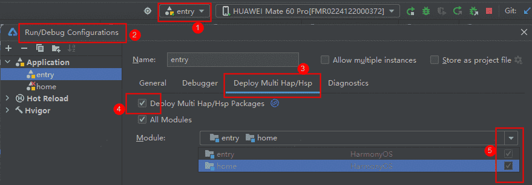

# 生活服务(综合家政服务)元服务模板快速入门

## 目录

- [功能介绍](#功能介绍)
- [约束与限制](#约束与限制)
- [快速入门](#快速入门)
- [示例效果](#示例效果)
- [开源许可协议](#开源许可协议)

## 功能介绍

您可以基于此模板直接定制元服务，也可以挑选此模板中提供的多种组件使用，从而降低您的开发难度，提高您的开发效率。

此模板提供如下组件，所有组件存放在工程根目录的components下，如果您仅需使用组件，可参考对应组件的指导链接；如果您使用此模板，请参考本文档。

| 组件                               | 描述                               | 使用指导                                               |
|:---------------------------------|:---------------------------------|:---------------------------------------------------|
| 通用地址管理组件（address_management）     | 提供新增、编辑、删除地址相关功能                 | [使用指导](components/address_management/README.md)    |
| 通用元服务关联账号组件（atomicservice_login） | 提供元服务关联账号，解除关联的功能                | [使用指导](components/atomicservice_login/README.md)   |
| 通用分类列表组件（category_list）          | 提供以宫格或者列表形式分类展示信息的功能             | [使用指导](components/category_list/README.md)         |
| 通用城市选择组件（city_select）            | 提供基于当前定位，搜索城市的功能                 | [使用指导](components/city_select/README.md)           |
| 通用个人信息组件（collect_personal_info）  | 提供支持编辑头像、昵称、姓名、性别、手机号、生日、个人简介等功能 | [使用指导](components/collect_personal_info/README.md) |
| 通用拨号组件（dial_panel）               | 提供拉起拨号面板以及一键拨号的功能                | [使用指导](components/dial_panel/README.md)            |
| 表单组件（module_form）                | 提供以表单形式录入信息的功能                   | [使用指导](components/module_form/README.md)           |
| 时间选择弹窗组件（module_time_select）     | 提供通过底部弹窗选择日期时间的功能                | [使用指导](components/module_time_select/README.md)    |
| 通用搜索组件（search）                   | 提供搜索服务的功能                        | [使用指导](components/search/README.md)                |
| 一镜到底组件（module_transition）        | 提供卡片展开、搜索、查看大图一镜到底效果             | [使用指导](components/module_transition/README.md)     |

本模板为家政类元服务提供了常用功能的开发样例，模板主要分首页、全部服务和我的三大模块：

* 首页：提供主要商品轮播图、常用类别菜单和精选服务列表，支持城市切换、商品搜索、商品价格咨询以及商品购买。

* 全部服务：展示全部品类的商品列表，支持切换城市、搜索商品。

* 我的：展示个人信息、我的订单、服务和工具以及部分商品列表，支持修改个人信息、管理订单、管理地址等。

本模板已集成华为账号、支付等服务，只需做少量配置和定制即可快速实现元服务关联账号、购买商品等功能。

<div style='overflow-x:auto'>
  <table style='min-width:800px'>
    <tr>
      <th></th>
      <th>直板机</th>
      <th>折叠屏</th>
    </tr>
    <tr>
      <th scope='row'>首页</th>
      <td valign='top'></td>
      <td valign='top'></td>
    </tr>
    <tr>
      <th scope='row'>全部服务</th>
      <td valign='top'></td>
      <td valign='top'></td>
    </tr>
    <tr>
      <th scope='row'>我的</th>
      <td valign='top'></td>
      <td valign='top'></td>
    </tr>
  </table>
</div>


本模板主要页面及核心功能如下所示：

```text
家政模板
 |-- 首页
 |    |-- 切换城市
 |    |-- 搜索
 |    |-- 轮播图
 |    |-- 品类菜单
 |    |     |-- 日常保洁
 |    |     |-- 家电维修
 |    |     |-- 保姆月嫂
 |    |     └-- 管道疏通
 |    └-- 精选服务
 |          |-- 服务列表
 |          |-- 服务详情
 |          |-- 下单页面
 |          |-- 待支付
 |          └-- 支付成功
 |-- 全部服务
 |    |-- 切换城市
 |    |-- 全部分类
 |    └-- 搜索
 |
 └-- 我的
      |-- 用户信息
      |     |-- 账号关联
      |     |-- 个人信息展示
      |     └-- 编辑资料
      |-- 我的订单
      |     |-- 全部订单
      |     |-- 待付款
      |     |-- 待使用
      |     └-- 退款售后
      |-- 服务与工具
      |     |-- 地址管理
      |     └-- 公共服务
      └-- 服务列表
```

本模板工程代码结构如下所示：

```text
HouseholdService
├─commons                           
│  └─lib_foundation/src/main/ets                        // 应用基础lib                                       
│       ├─common
│       │   ├─AppPrivacyUtils.ets                       // 隐私弹框           
│       │   ├─Constant.ets                              // 常量定义 
│       │   ├─ForemUtils.ets                            // 服务卡片工具类 
│       │   ├─GoodDataSource.ets                        // 商品datasource定义
│       │   ├─GridRowColSetting.ets                     // 栅格通用设置
│       │   ├─PushUtils.ets                             // 服务通知模拟
│       │   └─WindowUtils.ets                           // 窗口管理类
│       ├─http         
│       │   ├─ApiManage.ets                             // 服务端接口定义 
│       │   ├─AxiosBase.ets                             // 接口调用基础类            
│       │   ├─MockAdapter.ets                           // mock拦截器            
│       │   ├─MockApi.ets                               // mock接口       
│       │   └─MockData.ets                              // mock数据             
│       ├─login                                      
│       │   └─LoginUtil.ets                             // 登录工具类  
│       ├─model                              
│       │   ├─IRequest.ets                              // 接口请求定义          
│       │   ├─IResponse.ets                             // 接口响应定义                      
│       │   └─ObserveModel.ets                          // 状态管理类                    
│       ├─router         
│       │   └─RouterModule.ets                          // 路由管理     
│       └─uicomponent
│           ├─CommonCard.ets                            // 卡片组件    
│           ├─NavHeaderBar.ets                          // 通用页面标题组件    
│           ├─ServiceCard.ets                           // 精选服务卡片组件    
│           ├─UIBackBtn.ets                             // 返回按钮
│           ├─UIDialog.ets                              // 通用确认弹窗
│           └─UIOrderPart.ets                           // 订购组件           
│
├─components
│  ├─address_management/src/main/ets                    // 通用地址管理组件  
│  │    ├─common            
│  │    │   └─CustomTypes.ets                           // 枚举值定义  
│  │    ├─components
│  │    │   └─FormInputItem.ets                         // 表单              
│  │    ├─http
│  │    │   └─Api.ets                                   // 接口调用                      
│  │    ├─models
│  │    │   ├─AddressDTO.ets                            // 地址定义               
│  │    │   └─ParsedAddressDTO.ets                      // 解析后地址定义                
│  │    ├─pages
│  │    │   ├─AddressFormSheetPage.ets                  // 编辑地址页面                         
│  │    │   └─AddressListPage.ets                       // 地址管理页面
│  │    ├─utils
│  │    │   ├─AddressFormSheet.ets                      // 编辑地址                         
│  │    │   ├─LoadingMask.ets                           // 加载遮罩                         
│  │    │   ├─RouterUtils.ets                           // 路由工具                         
│  │    │   ├─SimpleDialog.ets                          // 弹窗工具                         
│  │    │   └─WindowListener.ets                        // 窗口监听                           
│  │    └─viewmodels   
│  │        ├─AddressFormSheetContext.ets               // 地址参数定义                    
│  │        ├─AddressVM.ets                             // 地址管理viewmodel                    
│  │        ├─FinalAvoidAreaVM.ets                      // 避让区域viewmodel                    
│  │        └─SimpleDialogContentVM.ets                 // 弹窗参数定义                    
│  │   
│  ├─atomicservice_login/src/main/ets                   // 通用元服务关联账号组件  
│  │    ├─common            
│  │    │   └─Constant.ets                              // 常量定义  
│  │    ├─components
│  │    │   └─PhoneFunctionButton.ets                   // 关联场景化button组件                                 
│  │    ├─model 
│  │    │   └─UserInfo.ets                              // 展示信息定义                             
│  │    ├─utils
│  │    │   ├─AccountUtils.ets                          // 账号接口类                                                 
│  │    │   └─Utils.ets                                 // 关联API类                           
│  │    └─views                   
│  │        └─AtomicserviceLogin.ets                    // 元服务关联账号组件
│  │
│  ├─category_list/src/main/ets                         // 通用分类列表组件                     
│  │    ├─common
│  │    │   ├─BasicDataSource.ets                       // 懒加载数据定义                    
│  │    │   ├─Constant.ets                              // 常量定义                     
│  │    │   ├─GridRowColSetting.ets                     // 栅格通用定义  
│  │    │   └─Utils.ets                                 // 分类API类            
│  │    └─components
│  │    │   └─CategoryList.ets                          // 分类列表页面
│  │    └─types                   
│  │        └─Index.ets                                 // 分类项定义 
│  │
│  ├─city_select/src/main/ets                           // 通用城市选择组件  
│  │    ├─common
│  │    │   ├─CitySampleData.ets                        // 城市数据定义                    
│  │    │   ├─Constant.ets                              // 常量定义                     
│  │    │   ├─GridRowColSetting.ets                     // 栅格通用定义            
│  │    │   ├─Location.ets                              // 定位方法定义            
│  │    │   └─Model.ets                                 // 公共模型  
│  │    ├─components
│  │    │   ├─CityTag.ets                               // 城市按钮            
│  │    │   ├─CityTagAndIcon.ets                        // 定位按钮 
│  │    │   └─CityTags.ets                              // 城市按钮组合
│  │    ├─view 
│  │    │   └─CitySelectView.ets                        // 城市选择页面                                                          
│  │    └─viewmodel   
│  │        ├─CitySelectViewModel.ets                   // 城市选择viewmodel                                     
│  │        └─SearchViewModel.ets                       // 城市搜索viewmodel                   
│  │
│  ├─collect_personal_info/src/main/ets                 // 通用个人信息组件  
│  │    ├─common
│  │    │   ├─ConfigModel.ets                           // 配置模型                    
│  │    │   ├─Constant.ets                              // 常量定义                     
│  │    │   ├─CustomModifier.ets                        // 样式定义                     
│  │    │   ├─DataModel.ets                             // 数据定义                     
│  │    │   ├─ErrorMsgMap.ets                           // 错误码定义                     
│  │    │   ├─FormModel.ets                             // 表单定义                     
│  │    │   ├─GridRowColSetting.ets                     // 栅格通用定义            
│  │    │   ├─Util.ets                                  // 公共方法定义               
│  │    │   └─WindowModel.ets                           // 窗口模型  
│  │    ├─components
│  │    │   ├─ChooseAvatar.ets                          // 头像编辑 
│  │    │   ├─ChooseData.ets                            // 日期编辑 
│  │    │   ├─EnterPhoneNumber.ets                      // 号码编辑 
│  │    │   ├─EnterTextArea.ets                         // 文本输入 
│  │    │   ├─EnterTextInput.ets                        // 文本输入 
│  │    │   └─SelectDialog.ets                          // 选择弹窗             
│  │    ├─viewmodels
│  │    │   └─PersonalInfoViewVM.ets                    // 个人信息viewmodel                      
│  │    └─views
│  │        ├─ListCard.ets                              // 个人信息项               
│  │        └─PersonalInfoView.ets                      // 个人信息页面                    
│  │
│  ├─dial_panel/src/main/ets                            // 通用拨号组件  
│  │    ├─common              
│  │    │   └─CustomTypes.ets                           // 类型定义  
│  │    ├─components 
│  │    │   └─DialPanelSheet.ets                        // 拨号组件             
│  │    ├─utils
│  │    │   ├─BusinessErrorFactory.ets                  // 错误码类                     
│  │    │   └─WindowListener.ets                        // 窗口管理                     
│  │    └─viewmodels
│  │        ├─DialPanelContentVM.ets                    // 拨号viewmodel
│  │        ├─FinalAvoidAreaVM.ets                      // 窗口避让viewmodel
│  │        └─WindowSizeVM.ets                          // 窗口尺寸viewmodel   
│  │
│  ├─module_base/src/main/ets                                          
│  │      ├─common 
│  │      │   ├─CommonUtils.ets                         // 公共方法  
│  │      │   ├─Constant.ets                            // 常量定义                           
│  │      │   ├─ObserveModel.ets                        // 状态管理类               
│  │      │   ├─PopViewUtils.ets                        // 公共弹窗
│  │      │   ├─SystemSceneUtils.ets                    // 系统方法                     
│  │      │   ├─Type.ets                                // 模型定义            
│  │      │   └─WindowUtils.ets                         // 应用上下文方法                
│  │      └─uicomponent
│  │          ├─GoodCard.ets                            // 商品卡片                                            
│  │          ├─UIEmpty.ets                             // 空白组件          
│  │          └─UILoading.ets                           // 空白组件                         
│  │
│  ├─module_form/src/main/ets                           // 表单组件            
│  │    ├─common                                        
│  │    │   ├─Constant.ets                              // 常量定义           
│  │    │   └─Utils.ets                                 // 方法定义           
│  │    ├─components                                    
│  │    │   ├─FormAddress.ets                           // 表单-地址填写           
│  │    │   ├─FormAvatar.ets                            // 表单-头像编辑                 
│  │    │   ├─FormDate.ets                              // 表单-日期选择            
│  │    │   ├─FormGender.ets                            // 表单-性别选择        
│  │    │   ├─FormInput.ets                             // 表单-输入框    
│  │    │   └─FormTextReadOnly.ets                      // 表单-只读文本          
│  │    └─pages                          
│  │        └─FormItem.ets                              // 表单组件            
│  │
│  ├─module_time_select/src/main/ets                    // 时间选择弹窗组件            
│  │    ├─common                        
│  │    │   ├─CommonUtils.ets                           // 方法定义              
│  │    │   ├─Constant.ets                              // 常量定义          
│  │    │   ├─Model.ets                                 // 模型定义                 
│  │    │   └─TimeUtils.ets                             // 时间工具类                     
│  │    ├─components                  
│  │    │   └─TimeSelect.ets                            // 时间选择view                    
│  │    └─viewmodel                  
│  │        └─TimeSelectVM.ets                          // 时间选择viewmodel 
│  │        
│  ├─search/src/main/ets                                // 通用搜索组件              
│  │    ├─common
│  │    │   ├─BasicDataSource.ets                       // 懒加载数据定义                    
│  │    │   ├─Constant.ets                              // 常量定义                     
│  │    │   ├─GridRowColSetting.ets                     // 栅格通用定义               
│  │    │   ├─LoadingUtil.ets                           // 加载遮罩               
│  │    │   └─PopViewUtils.ets                          // 公共弹窗  
│  │    ├─components
│  │    │   ├─GuessLike.ets                             // 猜你想搜组件                 
│  │    │   ├─HistorySearch.ets                         // 历史管理组件                     
│  │    │   ├─HotSearch.ets                             // 热搜榜组件               
│  │    │   ├─SearchAutoComplete.ets                    // 搜索联想组件  
│  │    │   ├─SearchBar.ets                             // 搜索框组件  
│  │    │   └─SearchResult.ets                          // 搜索结果组件              
│  │    ├─https
│  │    │   ├─Apis.ets                                  // Mock接口 
│  │    │   └─MockData.ets                              // Mock数据                  
│  │    ├─types               
│  │    │   └─Type.ets                                  // 数据定义              
│  │    ├─viewmodel                       
│  │    │   └─SearchViewModel.ets                       // 搜索viewmodel                       
│  │    └─views   
│  │        ├─ResultPage.ets                            // 搜索结果页面                                    
│  │        └─SearchView.ets                            // 搜索页面             
│  │
│  ├─module_transition/src/main/ets                     // 一镜到底组件              
│  │    ├─constants            
│  │    │   └─LongTakeTransitionConstants.ets           // 常量定义  
│  │    ├─customtransition
│  │    │   ├─CardLongTakeDelegate.ets                  // 卡片展开组件                 
│  │    │   └─ImageLongTakeDelegate.ets                 // 查看大图组件              
│  │    ├─sessions
│  │    │   └─LongTakeAnimationProperties.ets.ets       // 一镜到底配置                  
│  │    └─utils               
│  │        ├─ComponentAttrUtils.ets.ets                // 获取组件信息                    
│  │        ├─CustomNavigationUtils.ets.ets             // 转场流程定义                     
│  │        ├─LoneTakeAnimationsTransition.ets          // 过渡动画管理类               
│  │        ├─LongTakeTransitionParam.ets               // 过渡动画参数定义         
│  │        ├─Options.ets                               // 会话全局配置选项                     
│  │        ├─SnapShotImage.ets                         // 快照类               
│  │        ├─Utils.ets                                 // 工具类      
│  │        └─WindowUtils.ets                           // 窗口管理类                            
│  │ 
├─features
│  ├─business_home/src/main/ets                         // 首页模块             
│  │    ├─components 
│  │    │   ├─Advertisement.ets                         // 广告组件                     
│  │    │   └─ServiceText.ets                           // 价格文本组件             
│  │    ├─pages                     
│  │    │   ├─CitySelectPage.ets                        // 城市选择页面         
│  │    │   ├─GoodDetail.ets                            // 商品详情页面              
│  │    │   ├─HomePage.ets                              // 首页           
│  │    │   └─OrderPage.ets                             // 下单页面         
│  │    └─viewmodel                     
│  │        ├─HomeVM.ets                                // 首页viewmodel 
│  │        └─OrderVM.ets                               // 下单viewmodel       
│  │   
│  └─business_mine/src/main/ets                         // 我的模块             
│        ├─components
│        │   ├─OrderCard.ets                            // 订单卡片组件                                       
│        │   └─OrderList.ets                            // 订单列表组件       
│        ├─pages                                         
│        │   ├─CommonService.ets                        // 公共服务页面            
│        │   ├─EditPersonal.ets                         // 编辑个人资料页面          
│        │   ├─Mine.ets                                 // 我的页面     
│        │   ├─MyOrderDetail.ets                        // 订单详情       
│        │   ├─MyOrderList.ets                          // 订单列表        
│        │   └─OfficialWeb.ets                          // 官网H5       
│        └─viewmodel
│            ├─CountDownVM.ets                          // 倒计时viewmodel                                            
│            ├─MineVM.ets                               // 我的viewmodel        
│            ├─MyOrderDetailVM.ets                      // 订单详情viewmodel              
│            └─MyOrderVM.ets                            // 订单列表viewmodel  
│
└─products
   └─entry/src/main/ets       
        ├─common                         
        │   └─WantUtils.ets                             // Want工具类            
        ├─components                         
        │   └─AllCategory.ets                           // 分类页面        
        ├─entryability                                       
        │   └─EntryAbility.ets                          // UIAbility生命周期
        ├─entryformability                             
        │   └─EntryFormAbility.ets                      // FormExtensionAbility生命周期
        ├─pages                                        
        │   ├─Index.ets                                 // 入口页面
        │   └─Main.ets                                  // 主页面
        └─widget/pages                                 
            ├─common                         
            │   └─ConstantS.ets                         // 服务卡片常量   
            ├─model                         
            │   └─Model.ets                             // 服务卡片数据模型
            ├─pages
            │   ├─MiddleCard.ets                        // 2*4卡片                        
            │   └─MiniCard.ets                          // 2*2卡片 
            └─util                         
                ├─DataUtil.ets                          // 日期工具类                        
                └─FormUtils.ets                         // 服务卡片管理类 
```

## 约束与限制

### 环境

* DevEco Studio版本：DevEco Studio 6.1.1 Release及以上
* HarmonyOS SDK版本：HarmonyOS 6.1.1 Release SDK及以上
* 设备类型：华为手机（包括双折叠和阔折叠）、平板
* 系统版本：HarmonyOS 6.0.0(20)及以上

### 权限

* 位置权限：ohos.permission.APPROXIMATELY_LOCATION
* 网络权限：ohos.permission.INTERNET
* 振动权限：ohos.permission.VIBRATE
* 读取日历权限：ohos.permission.READ_CALENDAR
* 写入日历权限：ohos.permission.WRITE_CALENDAR

## 快速入门

### 配置工程

在运行此模板前，需要完成以下配置：

1. 在AppGallery Connect创建元服务，将包名配置到模板中。

   a. 参考[创建元服务](https://developer.huawei.com/consumer/cn/doc/app/agc-help-create-atomic-service-0000002247795706)为元服务创建APP ID，并将APP ID与元服务进行关联。

   b. 返回应用列表页面，查看元服务的包名。

   c. 将模板工程根目录下AppScope/app.json5文件中的bundleName替换为创建元服务的包名。

2. 配置华为账号服务。

   a. 将元服务的Client ID配置到products/entry/src/main/module.json5文件，详细参考：[配置Client ID](https://developer.huawei.com/consumer/cn/doc/atomic-guides/account-atomic-client-id)。

   b. 将元服务的Client ID配置到commons/lib_foundation/src/main/ets/common/Constant.ets文件中。

   ```
   export enum CurAppInfo {
     CLIENT_ID = 'xxx', // Client_id
   }
   ```

   c. 如需获取用户真实手机号，需要申请账号权限，详细参考：[申请账号权限](https://developer.huawei.com/consumer/cn/doc/atomic-guides/account-guide-atomic-permissions)，并在端侧使用快速验证手机号码Button进行[验证获取手机号码](https://developer.huawei.com/consumer/cn/doc/atomic-guides/account-guide-atomic-get-phonenumber)。

   d. 地址管理组件支持从华为账号中导入收货地址，这需要您完成账号权限的申请并满足一系列开发前提。详细参考：[收货地址能力开发前提](https://developer.huawei.com/consumer/cn/doc/harmonyos-guides/account-choose-address-dev#section1061219267293)。 您如果跳过该项配置，仅会导致地址编辑页面的 '从华为账号导入' 按钮不可用。

3. 配置推送服务。

   a. [开通推送服务](https://developer.huawei.com/consumer/cn/doc/atomic-guides/push-as-prepare)。

   b. 开通服务并选择订阅模板，获取模板ID，详细参考：[开通服务通知并选择订阅模板](https://developer.huawei.com/consumer/cn/doc/atomic-guides/push-as-service-noti)。

   c. 将模板ID填充到commons/lib_foundation/src/main/ets/common/Constant.ets中。

   ```
   export enum CurAppInfo {
     PUSH_TEMPLATE_ID = 'xxx',// 推送服务通知模板ID
   }
   ```
   
   d. 本地推送模拟，在/commons/lib_foundation/src/main/ets/common/PushUtils.ets中实现通过华为推送服务REST API本地模拟云测推送能力，主要用于开发测试阶段。详细参考：[服务通知](https://developer.huawei.com/consumer/cn/doc/harmonyos-references/push-api-service-noti#section215111311776)。

   [说明]
   本模板只包含客户端侧代码的实现，如需完整体验推送能力，还需要补充服务端开发。详细参考：[推送基于账号的订阅消息](https://developer.huawei.com/consumer/cn/doc/atomic-guides/push-as-send-sub-noti)。

4. 配置地图服务。

   地址管理组件支持并依赖地图服务的区划选择与地点选取能力，这需要您提前开通地图服务并完成手动签名。详细参考：[地图服务开发准备](https://developer.huawei.com/consumer/cn/doc/harmonyos-guides/map-config-agc)

5. （可选）配置横幅广告服务。

   a. 若需接入正式广告，需要申请正式的广告位ID。可在应用发布前进入[流量变现官网](https://developer.huawei.com/consumer/cn/monetize)，点击“开始变现”，登录[鲸鸿动能媒体服务平台](https://developer.huawei.com/consumer/cn/service/ads/publisher/html/index.html?lang=zh#/error?errorCode=91000023)进行申请，具体操作详情请参见[展示位创建](https://developer.huawei.com/consumer/cn/doc/monetize/zhanshiweichuangjian-0000001132700049)。

   b. 如果仅调测广告，可使用测试广告位ID：testw6vs28auh3。

   c. 将申请的广告位ID配置到commons/lib_foundation/src/main/ets/common/Constant.ets文件中。

   ```
   export enum AdInfo {
     AD_INFO = 'xxx', // 广告位ID
   }
   ```

6. （可选）配置服务器域名。

   a. 当前模板接口均采用mock数据，若是使用服务端接口请求，需要改造http请求的相关代码：commons/foundation/src/main/ets/http/AxiosBase.ets，将服务端请求基础url填充到commons/lib_foundation/src/main/ets/common/Constant.ets中。

   ```
   export enum CurAppInfo {
     BASE_URL = 'xxx',// 推送服务通知模板ID
   }
   ```

   b. 由于元服务包体大小有限制，部分图片资源将从云端拉取，需为模板项目[配置服务器域名](https://developer.huawei.com/consumer/cn/doc/atomic-guides/agc-help-harmonyos-server-domain)，“httpRequest合法域名”需要配置为：`https://agc-storage-drcn.platform.dbankcloud.cn`

7. （可选）如使用支付能力，需要配置支付服务。

   a. 华为支付当前仅支持商户接入，在使用服务前，需要完成商户入网、开通服务等相关配置。详细参考：[支付服务接入准备](https://developer.huawei.com/consumer/cn/doc/harmonyos-guides/payment-preparations)。

   b. 当前模板仅提供端侧集成示例，修改端侧文件：features/business_home/src/main/ets/viewmodel/OrderVM.ets，主要修改点如下：

   ```
   // 付款
   payOrder() {
      CommonUtils.showLoading();
      const jumpParam = this.buildJumpParam();
      // todo: 传入false，不走mock
      SystemSceneUtils.requestPaymentPromise(false, this.uiAbilityContext).then(() => {
         payOrder(this._orderId).then(() => {
            CommonUtils.hideLoading();
            RouterModule.push({ url: RouterMap.SUCCESS_PAY, param: jumpParam });
         })
      })
   }
   ```
   c. 修改端侧文件：components/module_base/src/main/ets/common/Utils.ets，主要修改点如下：
   ```
   // 调用华为支付
   static requestPaymentPromise(ignoreRequestPayment: boolean, context: common.UIAbilityContext): Promise<void> {
      if (ignoreRequestPayment) {
         return new Promise((resolve) => resolve());
      }
      // todo: 补充订购信息
      const orderStr = '{}';
      return paymentService.requestPayment(context, orderStr)
      .then(() => {
         Logger.info('succeeded in paying');
      })
      .catch((error: BusinessError) => {
         Logger.error(`failed to pay, error.code: ${error.code}, error.message: ${error.message}`);
         promptAction.showToast({ message: '拉起支付失败' });
      });
   }
   ```

8. AppLinking（扫码直达）服务接入。

   a. 当前仅支持企业开发者接入，在使用服务前，需要完成开通App Linking服务、创建元服务链接等配置。详细参考：[使用App Linking实现元服务跳转](https://developer.huawei.com/consumer/cn/doc/atomic-guides/atomic-applinking)。

   b. 拉起元服务的方式：[通过openLink接口拉起](https://developer.huawei.com/consumer/cn/doc/atomic-guides/atomic-applinking#section4402128111710) 、[通过系统浏览器或ArkWeb拉起](https://developer.huawei.com/consumer/cn/doc/atomic-guides/atomic-applinking#section151221828161112) 、通过系统扫码拉起。

      想要通过扫码拉起元服务，需要在[创建元服务链接](https://developer.huawei.com/consumer/cn/doc/atomic-guides/atomic-applinking#section48651523147) 的时候关联二维码，并配置跳转元服务的二维码链接。

   c. 客户端代码开发：扫码直达由系统提供能力，需要在EntryAbility的onCreate和onNewWant方法中根据链接的参数进行页面跳转处理。
   
9. （可选）智能填充服务，需要[申请接入智能填充服务](https://developer.huawei.com/consumer/cn/doc/harmonyos-guides/scenario-fusion-introduction-to-smart-fill#section1167564853816)。

10. 对元服务进行[手工签名](https://developer.huawei.com/consumer/cn/doc/harmonyos-guides/ide-signing#section297715173233)。

11. 添加手工签名所用证书对应的公钥指纹。详细参考：[配置公钥指纹](https://developer.huawei.com/consumer/cn/doc/app/agc-help-cert-fingerprint-0000002278002933)。

### 运行调试工程

1. 连接调试手机和PC。

2. 配置多模块调试：由于本模板存在多个模块，运行时需确保所有模块安装至调试设备。

   a. 运行模块选择“entry”。

   b. 下拉框选择“Edit Configurations”，在“Run/Debug Configurations”界面，选择“Deploy Multi Hap”页签，勾选上模板中所有模块。

   

   c. 点击"Run"，运行模板工程。

## 示例效果

1. **首页**

  

2. **购买流程**

  

3. **全部服务**

  

4. **我的-编辑资料**

  

5. **我的-订单管理**

  

6. **我的-服务与工具等**

  

7. **AppLinking扫码直达**

  

## 开源许可协议

该代码经过[Apache 2.0 授权许可](http://www.apache.org/licenses/LICENSE-2.0)。
