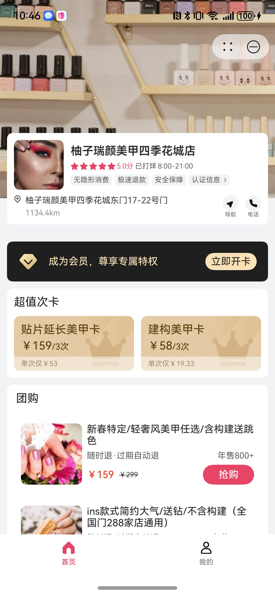
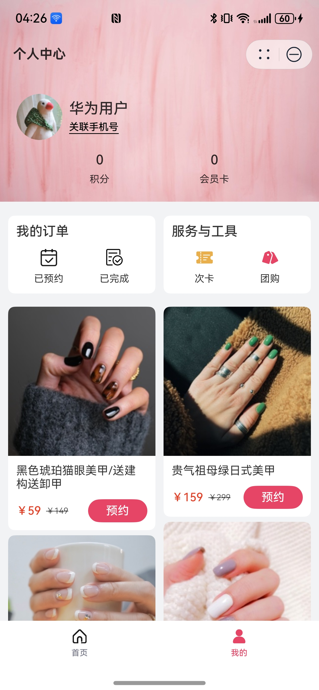

# 生活服务(美业)行业模板

## 目录

- [功能介绍](#功能介绍)
- [环境要求](#环境要求)
- [快速入门](#快速入门)
- [示例效果](#示例效果)
- [权限要求](#权限要求)
- [开源许可协议](#开源许可协议)

## 功能介绍

本模板为美容行业（美甲美睫）类元服务提供了常用功能的开发样例，模板主要分首页和我的两大模块：

- 首页：提供商品卡、团购、推荐商品的展示，支持购买和预约。
- 我的：展示会员卡信息，支持订单、商品卡、团购信息的管理。

本模板已集成华为账号、推送、华为支付等服务，只需做少量配置和定制即可快速实现华为账号的登录、预约提醒、购买商品等功能。

| 首页                        | 我的                        |
|---------------------------|---------------------------|
|  |  |

本模板主要页面及核心功能如下所示：

```ts
美业模板
 |-- 华为账号登录
 |    |-- 授权
 |    └-- 解绑
 |-- 首页
 |    |-- Banner
 |    |-- 店铺信息
 |    |-- 开通会员
 |    |-- 次卡
 |    |     |-- 次卡详情
 |    |     |-- 提交订单
 |    |     └-- 下单成功
 |    |-- 团购
 |    |     |-- 团购详情
 |    |     |-- 提交订单
 |    |     └-- 下单成功
 |    └-- 商品列表
 |          |-- 商品详情
 |          |-- 预约页面
 |          └-- 预约成功
 └-- 我的
      |-- 用户信息
      |     |-- 个人信息
      |     |-- 积分
      |     └-- 会员卡
      |-- 我的订单
      |     |-- 已预约
      |     └-- 已完成
      |-- 服务与工具
      |     |-- 次卡管理
      |     └-- 团购管理
      └-- 商品列表
```

本模板工程代码结构如下所示：

```
LifeBeauty
  ├─commons/utils/src/main
  │  ├─ets
  │  │  ├─common
  │  │  │      Constant.ets                  // 公共常量
  │  │  │      Logger.ets                    // 日志打印
  │  │  │      PopViewUtils.ets              // 公共弹窗
  │  │  │      Utils.ets                     // 公共方法
  │  │  │
  │  │  ├─http
  │  │  │      ApiManage.ets                 // 服务端接口管理
  │  │  │      AxiosBase.ets                 // 请求基础能力
  │  │  │      MockApi.ets                   // 接口Mock
  │  │  │      MockData.ets                  // 数据Mock
  │  │  │
  │  │  ├─model
  │  │  │      IRequest.ets                  // 数据请求模型
  │  │  │      IResponse.ets                 // 数据响应模型
  │  │  │      Model.ets                     // UI监听数据模型
  │  │  │
  │  │  ├─router
  │  │  │      RouterModule.ets              // 路由模块
  │  │  │
  │  │  └─uicomponent
  │  │          DialogBindPhone.ets          // 关联手机号弹窗
  │  │          DialogCancelBind.ets         // 取消关联手机号弹窗
  │  │          DialogReBind.ets             // 换绑手机号弹窗
  │  │          GoodCard.ets                 // 商品卡片
  │  │          Login.ets                    // 登录模块
  │  │          NoticeDialog.ets             // 通知弹窗
  │  │          UIBackBtn.ets                // 通用的返回按钮组件
  │  │          UIEmpty.ets                  // 通用的空页面组件
  │  │          UIOrderPart.ets              // 通用的订购组件
  │  │                                       
  │  └─resources                             
  │                                          
  │                                          
  │─entry/src/main                           
  │  ├─ets                                   
  │  │  ├─entryability                        
  │  │  │      EntryAbility.ets              
  │  │  │                                    
  │  │  ├─entryformability                   
  │  │  │      EntryFormAbility.ets          
  │  │  │                                    
  │  │  ├─pages                              
  │  │  │      Index.ets                     // 入口页面
  │  │  │      Main.ets                      // 主页面
  │  │  │                                    
  │  │  └─simplewidget                       // 卡片页面 
  │  │                                       
  │  └─resources                              
  │                                           
  │─features/home/src/main                     
  │  ├─ets                                    
  │  │  ├─common                              
  │  │  │      Constant.ets                  // 常量 
  │  │  │      UIComponent.ets               // 通用组件
  │  │  │      Utils.ets                     // 工具类
  │  │  │                                    
  │  │  ├─components                          
  │  │  │      ActiveMemberModule.ets        // 开通会员卡 
  │  │  │      DialogBookSuccess.ets         // 预约成功
  │  │  │      DialogBusiness.ets            // 营业执照弹窗
  │  │  │      DialogCall.ets                // 拨号弹窗
  │  │  │      GroupModule.ets               // 首页团购
  │  │  │      SingleVisitModule.ets         // 首页次卡
  │  │  │      StoreList.ets                 // 店铺列表
  │  │  │                                     
  │  │  ├─pages                               
  │  │  │      BookGood.ets                  // 预约服务
  │  │  │      GoodDetail.ets                // 商品详情页
  │  │  │      GroupDetail.ets               // 团购详情页
  │  │  │      HomePage.ets                  // 首页
  │  │  │      SingleCardDetail.ets          // 次卡详情页
  │  │  │      SubmitOrder.ets               // 下单页面
  │  │  │      SuccessPay.ets                // 付款成功页面
  │  │  │                                     
  │  │  └─viewmodel                           
  │  │          HomeBaseVM.ets               // 首页VM
  │  │                                        
  │  └─resources                              
  │                                           
  └─features/mine/src                         
     ├─ets                                    
     │  ├─common                              
     │  │      Constant.ets                  // 常量 
     │  │                                    
     │  ├─components                          
     │  │      BookCard.ets                  // 预约管理卡片 
     │  │      DialogCancelAppointment.ets   // 取消预约弹窗
     │  │      DialogQRCode.ets              // 二维码弹窗
     │  │                                    
     │  └─pages                              
     │          AppointmentList.ets          // 我的预约列表
     │          BookGroupDetail.ets          // 我的团购详情
     │          GroupList.ets                // 我的团购列表
     │          Mine.ets                     // 我的
     │          SingleVisitList.ets          // 我的次卡列表
     │                                       
     └─resources                             

```

## 环境要求

### 软件

* DevEco Studio版本：DevEco Studio 5.0.0 Release及以上
* HarmonyOS SDK版本：HarmonyOS 5.0.0 Release SDK及以上

### 硬件

* 设备类型：华为手机（直板机）
* HarmonyOS版本：HarmonyOS 5.0.0 Release及以上

## 快速入门

### 配置工程

在运行此模板前，需要完成以下配置：

1. 在DevEco Studio中打开此模板。

2. 在AppGallery Connect创建元服务，将包名配置到模板中。

   a. 参考[创建元服务](https://developer.huawei.com/consumer/cn/doc/app/agc-help-createharmonyapp-0000001945392297)
   为元服务创建APPID，并进行关联。

   b. 返回应用列表页面，查看元服务的包名。

   c. 将模板工程根目录下AppScope/app.json5文件中的bundleName替换为创建元服务的包名。

   d. 将commons/utils/src/main/ets/common/Constant.ets文件中的BUNDLE_NAME替换为创建元服务的包名。
   ```
   export enum CurAppInfo {
     BUNDLE_NAME = 'com.atomicservice.xxx',// 包名
   }
   ```

3. 本模板中使用了华为账号、华为支付等服务，需要[添加公钥指纹](https://developer.huawei.com/consumer/cn/doc/app/agc-help-signature-info-0000001628566748#section5181019153511)。

4. 配置华为账号服务。

   a. 将元服务的client
   ID配置到entry模块的module.json5文件，详细参考：[配置Client ID](https://developer.huawei.com/consumer/cn/doc/atomic-guides-V5/account-atomic-client-id-V5)。

   b. 将元服务的client ID配置到commons/utils/src/main/ets/common/Constant.ets文件中。

   ```
   export enum CurAppInfo {
     CLIENT_ID = 'xxxxxxxx', // client_id
   }
   ```
   c.获取华为账号相关授权，详细参考：[配置scope权限](https://developer.huawei.com/consumer/cn/doc/atomic-guides-V5/account-guide-atomic-permissions-V5)。


5. 配置推送服务。

   a. [开通推送服务](https://developer.huawei.com/consumer/cn/doc/atomic-guides-V5/push-as-prepare-V5)。

   b. [开通服务通知并选择订阅模板](https://developer.huawei.com/consumer/cn/doc/atomic-guides-V5/push-as-service-noti-V5)。

   c.将模板ID填充到commons/utils/src/main/ets/common/Constant.ets中。

   ```
   export enum CurAppInfo {
     PUSH_TEMPLATE_ID = 'xxxxxxxxxxxx',// 推送，服务通知模板id
   }
   ```
   [说明]
   本模板只包含客户端侧代码的实现，如需完整体验推送能力，还需要补充服务端开发。详细参考：[推送基于账号的订阅消息](https://developer.huawei.com/consumer/cn/doc/atomic-guides-V5/push-as-send-sub-noti-V5)。

6. （可选）如使用支付能力，需要配置支付服务。

   a. 华为支付当前仅支持商户接入，在使用服务前，需要完成商户入网、开通服务等相关配置。

   b. 当前模板仅提供端侧集成示例，修改端侧文件：features/home/src/main/ets/pages/SubmitOrder.ets，主要修改点如下：

   ```
   // 设置参数为false，使得不绕过华为支付
   private ignoreRequestPayment: boolean = false;
   
   // 调用华为支付客户端
   requestPaymentPromise(): Promise<void> {
      if (this.ignoreRequestPayment) {
         return new Promise((resolve) => resolve());
      }
      const orderStr = '{}'; // 补充订购信息
      return paymentService.requestPayment(this.context, orderStr)
         .then(() => {
            console.info('succeeded in paying');
         })
         .catch((error: BusinessError) => {
            console.error(`failed to pay, error.code: ${error.code}, error.message: ${error.message}`);
            this.getUIContext().getPromptAction().showToast({ message: '拉起支付失败' });
         });
   }
   ```
   更多详细内容参考：[支付服务接入准备](https://developer.huawei.com/consumer/cn/doc/harmonyos-guides-V5/payment-preparations-V5)。

7. （可选）配置服务器域名。

   a. 当前模板接口均采用mock数据，若是使用服务端接口请求，需要改造http请求的相关代码：commons/utils/src/main/ets/http/AxiosBase.ets。

   b. [配置服务器域名](https://developer.huawei.com/consumer/cn/doc/atomic-guides-V5/agc-help-harmonyos-server-domain-V5)
   ，“httpRequest合法域名”需要配置为：`https://agc-storage-drcn.platform.dbankcloud.cn`

### 运行调试工程

1. 连接调试手机和PC。

2. 对元服务签名：由于模板中集成了华为账号、地图等功能，所以需要采用[手工签名](https://developer.huawei.com/consumer/cn/doc/harmonyos-guides-V5/ide-signing-V5#section297715173233)。

3. 菜单选择“Run > Run 'entry' ”或者“Run > Debug 'entry' ”，运行或调试模板工程。

## 示例效果

1. 订购和预约

   [点击观看视频](screenshots/订购和预约.mp4)

2. 我的管理

   [点击观看视频](screenshots/我的管理.mp4)

## 权限要求

- 获取位置权限：ohos.permission.APPROXIMATELY_LOCATION、ohos.permission.LOCATION
- 日历日程读写权限：ohos.permission.READ_CALENDAR、ohos.permission.WRITE_CALENDAR
- 网络权限：ohos.permission.INTERNET

## 开源许可协议

该代码经过[Apache 2.0 授权许可](http://www.apache.org/licenses/LICENSE-2.0)。
