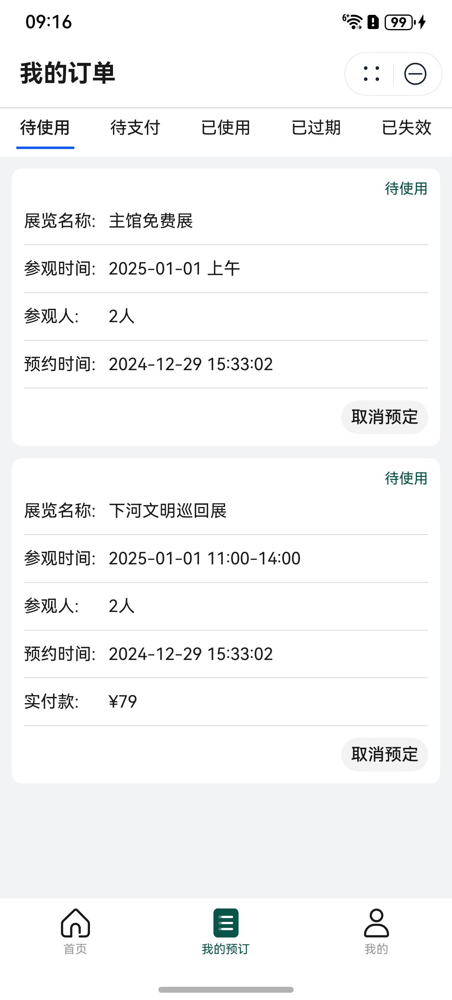
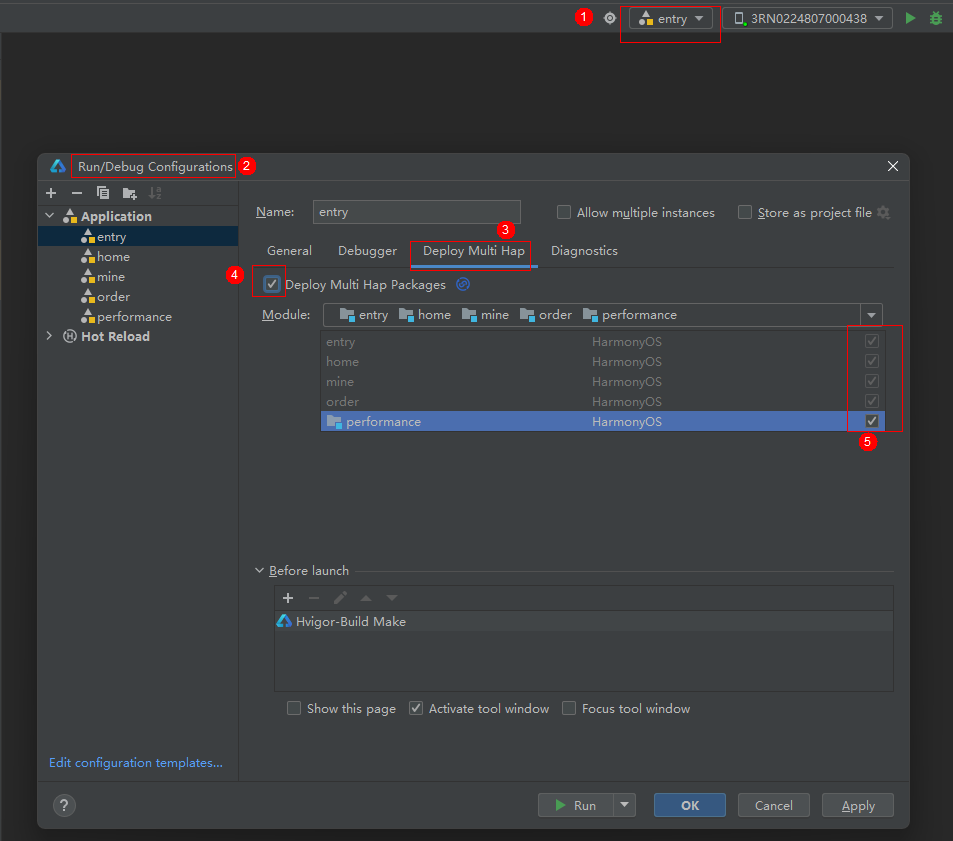

# 娱乐票务(博物馆)行业模板快速入门

## 目录

- [功能介绍](#功能介绍)
- [环境要求](#环境要求)
- [快速入门](#快速入门)
- [示例效果](#示例效果)
- [权限要求](#权限要求)
- [开源许可协议](#开源许可协议)

## 功能介绍

本模板为博物馆票务类元服务提供了常用功能的开发样例，模板主要分首页、我的预定和我的三大模块：

* 首页：提供用户信息、推荐展览的展示，支持常用参观人编辑、参观预约、特展购票以及讲解服务、省博介绍、场馆地图、停车缴费等的查看。

* 我的预定：展示不同类型的订单，以及订单的处理。

* 我的：支持账号关联、个人信息的编辑及隐私政策的查看。

本模板已集成华为账号、地图、支付等服务，只需做少量配置和定制即可快速实现华为账号的登录及展览预定等功能。

| 首页                           | 会员                               | 我的                           |
|------------------------------|----------------------------------|------------------------------|
|  |  |  |

本模板主要页面及核心功能如下所示：

```ts
博物馆模板
 |-- 首页
 |    |-- 顶部图片
 |    |-- 用户信息
 |    |    └-- 常用参观人
 |    |         └-- 常用参观人编辑
 |    |
 |    |-- 基础服务
 |    |    |-- 参观预约
 |    |    |    |-- 时间选择
 |    |    |    |-- 信息确认
 |    |    |    └-- 参观预约
 |    |    └-- 特展购票
 |    |         |-- 展览列表
 |    |         |-- 展览详情
 |    |         |-- 预定特展
 |    |         └-- 提交订单
 |    └-- 更多功能
 |    |   |-- 讲解服务
 |    |   |    └-- 服务介绍
 |    |   |-- 省博介绍
 |    |   |    └-- 省博历史
 |    |   |-- 场馆地图
 |    |   |    └-- 地图
 |    |   └-- 停车缴费
 |    |        └-- 缴费政策
 |    |
 |    └-- 推荐展览
 |         └-- 展览详情
 |
 |-- 我的预定
 |    |-- 订单列表
 |    └-- 订单详情
 |
 |
 |
 └-- 我的
      |-- 顶部图片
      |-- 用户信息
      |-- 关联账号
      |-- 个人信息
      |    └-- 信息编辑
      |-- 隐私政策    
      └-- 推荐展览    
```

本模板工程代码结构如下所示：

```ts
MuseumTicket
  |- commons                                       // 公共层
  |   |- commonlib/src/main/ets                    // 公共工具模块(har)
  |   |    |- constants 
  |   |    |     CommonContants.ets                // 公共常量
  |   |    |     CommonEnum.ets                    // 公共枚举
  |   |    |- types 
  |   |    |     Types.ets                         // 公共类型
  |   |    └- utils 
  |   |          AccountUtil.ets                   // 账号管理工具
  |   |          FormatUtil.ets                    // 日历、图片等格式管理工具
  |   |          Logger.ets                        // 日志管理工具
  |   |          NextDaysUtil.ets                  // 生成模拟时间工具
  |   |          PermissionUtil.ets                // 权限管理工具
  |   |          PopViewUtils.ets                  // 公共弹窗
  |   |          PreferenceUtil.ets                // Preference存储和获取
  |   |          RouterModule.ets                  // 路由管理类
  |   |          WindowUtil.ets                    // 窗口管理工具
  |   |           
  |   |   
  |   |- network/src/main/ets                      // 网络模块(har)
  |   |    |- apis                                 // 网络接口  
  |   |    |- mocks                                // 数据mock
  |   |    |- constants                            // api路径常量    
  |   |    |- models                               // 网络库封装    
  |   |    └- types                                // 请求和响应类型 
  |   └- uicalendarpicker                          // 日历组件
  |
  |- products/entry                                // 应用层主包(hap)  
  |   └-  src/main/ets                                               
  |        |- entryability                                                               
  |        |- entryformability                                                        
  |        |- pages                              
  |        |    EmptyPage.ets                      // 入口页面
  |        |    MainEntry.ets                      // 主页面
  |        |- types                                // interface接口定义
  |        |- viewmodels                           // 与页面一一对应的vm层          
  |        └- widget                               // 卡片页面
  |                                            
  └- features                                      // 特性层
      |- home/src/main/ets                         // 首页模块(hsp)
      |    |- components                           // 抽离组件         
      |    |- pages                               
      |    |    HomePage.ets                       // 首页
      |    |    ExplainPage.ets                    // 讲解服务详情页
      |    |    IntroducePage.ets                  // 省博介绍详情页
      |    |    MapPage.ets                        // 场馆地图详情页
      |    |    ParkingPage.ets                    // 停车缴费详情页
      |    |- types                                // interface类型定义
      |    └- viewmodels                           // 与页面一一对应的vm层          
      |     
      |- mine/src/main/ets                         // 我的模块(hsp)
      |    |- components                           // 抽离组件      
      |    |- pages                               
      |    |    AddVisitorPage.ets                 // 常用参观人添加页
      |    |    EditVisitorPage.ets                // 常用参观人编辑页
      |    |    MinePage.ets                       // 我的页面
      |    |    PrivacyPage.ets                    // 隐私政策详情页
      |    |    ProfileEditPage.ets                // 个人信息编辑页
      |    |    VisitorPage.ets                    // 常用参观人展示页
      |    └- viewmodels                           // 与页面一一对应的vm层  
      |  
      |- order/src/main/ets                         // 预订模块(hsp)    
      |    |- pages                               
      |    |    ContactsPage.ets                   // 参观预约选择常用参观人页
      |    |    MyOrders.ets                       // 订单列表页
      |    |    OrderInfo.ets                      // 预约信息页
      |    |    OrderSuccess.ets                   // 预约成功页
      |    |    OrderTicket.ets                    // 参观预约页
      |    |    TicketDetail.ets                   // 订单详情页
      |    |- types                                // interface类型定义
      |    └- viewmodels                             
      |         MyOrdersVM.ets                     // 订单相关的VM层
      |         OrderTicketVM.ets                  // 预订相关的VM层   
      | 
      └- performance/src/main/ets                  // 特展模块(hsp)
           |- components                           // 抽离组件    
           |- pages                               
           |    BuyInfo.ets                        // 购票信息页
           |    BuySuccess.ets                     // 购票成功页
           |    BuyTicket.ets                      // 购票页
           |    PerformanceDetail.ets              // 特展详情页
           |    PerformancePage.ets                // 特展列表页
           |    TicketOwner.ets                    // 购票常用参观人添加页
           |- types                                // interface类型定义
           └- viewmodels                             
                BuyVM.ets                          // 购票相关的VM层
                PerformanceVM.ets                  // 特展相关的VM层  
       
  
```

## 环境要求

### 软件

* DevEco Studio版本：DevEco Studio 5.0.0 Release及以上
* HarmonyOS SDK版本：HarmonyOS 5.0.0 Release SDK及以上

### 硬件

* 设备类型：华为手机（直板机）
* HarmonyOS版本：HarmonyOS 5.0.0 Release及以上

## 快速入门

### 配置工程

在运行此模板前，需要完成以下配置：

1. 在DevEco Studio中打开此模板。

2. 在AppGallery Connect创建元服务，将包名配置到模板中。

   a. 参考[创建元服务](https://developer.huawei.com/consumer/cn/doc/app/agc-help-createharmonyapp-0000001945392297)为元服务创建APPID，并进行关联。

   b. 返回应用列表页面，查看元服务的包名。

   c. 将模板工程根目录下AppScope/app.json5文件中的bundleName替换为创建元服务的包名。

3. 配置服务器域名。

   本模板接口均采用mock数据，由于元服务包体大小有限制，部分图片资源将从云端拉取，所以需为模板项目[配置服务器域名](https://developer.huawei.com/consumer/cn/doc/atomic-guides/agc-help-harmonyos-server-domain)，“httpRequest合法域名”需要配置为：`https://agc-storage-drcn.platform.dbankcloud.cn`

4. 配置华为账号服务。

   a. 将元服务的client ID配置到entry模块的module.json5文件，详细参考：[配置Client ID](https://developer.huawei.com/consumer/cn/doc/atomic-guides/account-atomic-client-id)。

   b. 添加公钥指纹，详细参考：[配置应用证书指纹](https://developer.huawei.com/consumer/cn/doc/app/agc-help-signature-info-0000001628566748#section5181019153511)。

   c. 如需获取用户真实手机号，需要申请phone权限，详细参考：[配置scope权限](https://developer.huawei.com/consumer/cn/doc/atomic-guides/account-guide-atomic-permissions)。

5. 配置地图服务。

   a. 将元服务的client ID配置到entry模块的module.json5文件，如果华为账号服务已配置，可跳过此步骤。

   b. 添加公钥指纹，如果华为账号服务已配置，可跳过此步骤。

   c. [开通地图服务](https://developer.huawei.com/consumer/cn/doc/harmonyos-guides/map-config-agc)。

6. 配置支付服务。

   华为支付当前仅支持商户接入，在使用服务前，需要完成商户入网、开发服务等相关配置，本模板仅提供了端侧集成的示例。详细参考：[支付服务接入准备](https://developer.huawei.com/consumer/cn/doc/harmonyos-guides/payment-preparations)

### 运行调试工程

1. 连接调试手机和PC。

2. 对元服务签名：由于模板中集成了华为账号、地图等服务，所以需要采用[手工签名](https://developer.huawei.com/consumer/cn/doc/harmonyos-guides/ide-signing#section297715173233)。

3. 配置多模块调试：由于本模板存在多个模块，运行时需确保所有模块安装至调试设备。

   a. 运行模块选择“entry”。

   b. 下拉框选择“Edit Configurations”，在“Run/Debug Configurations”界面，选择“Deploy Multi Hap”页签，勾选上模板中所有模块。

   

   c. 点击"Run"，运行模板工程。

## 示例效果

[功能展示录屏](./screenshots/功能展示录屏.mp4)

## 权限要求

* 网络权限：ohos.permission.INTERNET

## 开源许可协议

该代码经过[Apache 2.0 授权许可](http://www.apache.org/licenses/LICENSE-2.0)。
