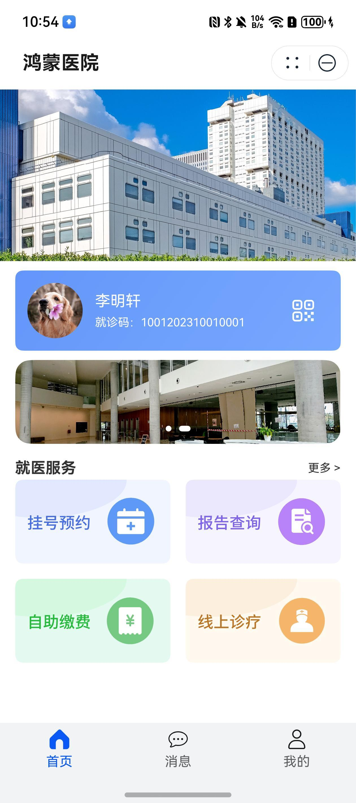
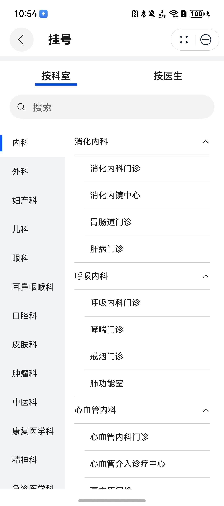
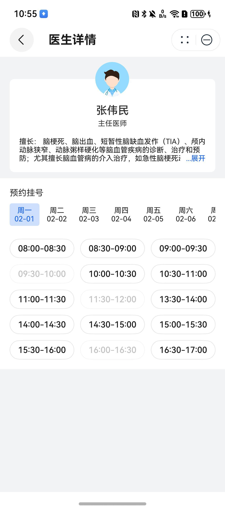

# 医疗(医院)行业模板快速入门

## 目录

- [功能介绍](#功能介绍)
- [环境要求](#环境要求)
- [快速入门](#快速入门)
- [示例效果](#示例效果)
- [权限要求](#权限要求)
- [开源许可协议](#开源许可协议)

## 功能介绍

本模板为医疗类元服务提供了常用功能的开发样例，模板主要分首页、消息和我的三大模块：

* 首页：提供就诊人基本信息，以及常用服务的入口。
* 消息：支持查看医院动态信息，以及我接收到的消息。
* 我的：支持账户管理，登录后可以管理就诊人信息，查询挂号记录和就诊报告。

本模板已集成华为账号、地图、支付、推送等服务，只需做少量配置和定制即可快速实现华为账号的登录并一键获取账号的手机号和头像、医院位置定位导航和缴费等功能。


| 首页                                  | 按科室挂号                            | 按医生挂号                            |
| ------------------------------------- | ------------------------------------- | ------------------------------------- |
|  |  |  |

| 挂号支付                                  | 报告查询                                  |
|---------------------------------------|---------------------------------------|
|  |  |

本模板主要页面及核心功能如下所示：

```ts
医院
 |-- 首页
 |    |-- 医院大图
 |    |-- 滚动公告
 |    |-- 默认就诊人
 |    |-- 就医服务
 |    |    |-- 挂号预约
 |    |    |    |-- 医院列表
 |    |    |    |-- 科室选择
 |    |    |    |-- 医生选择
 |    |    |    |-- 排班信息
 |    |    |    └-- 医生主页
 |    |    |    └-- 挂号订单创建
 |    |    |    └-- 支付
 |    |    |-- 报告查询
 |    |    |    |-- 就诊人切换
 |    |    |    |-- 报告查看
 |    |    └-- 自助缴费
 |    |    └-- 线上诊疗
 |-- 消息
 |    └-- 医院动态
 |    └-- 我的消息
 |    |    └-- 消息详情查看
 |    |    └-- 消息推送
 └-- 我的
      |-- 账号管理
      |-- 就诊人管理
      |-- 挂号记录
      |-- 报告查询
```

本模板工程遵循MVVM（Model-View-ViewModel）的设计模式，将不同职责的代码分别放在以下目录中：

* api：用于存放发起网络请求的接口定义和实现。所有的HTTP请求都在这里进行封装，便于维护和管理。
* model：用于存放网络请求、UI界面等需要的实体类。所有的数据模型在此定义，以便在View和ViewModel中进行使用。
* viewmodel：用于存放所有业务逻辑。例如UI部分逻辑和发起网络请求等。ViewModel不仅负责数据的获取，还负责将数据传递给View进行显示，并响应用户交互。在部分组件中，ViewModel是单例的，用于在多个页面中共享数据。
* components：用于存放页面构建相关的代码。涉及到页面逻辑部分，会调用ViewModel处理，其本身不涉及任何业务逻辑。如无特殊情况，本模板页面均使用ComponentsV2装饰器实现。
* view：用于存放自定义UI组件。所有的自定义控件、组合控件等都在此定义，以便在多个页面中复用。
* constant：用于存放常量。

本模板详细工程代码结构如下所示：

```text
MedicalCare
  |- common                                             // 公共能力层：存放公共基础能力集合
  |   └- common/src/main/ets
  |       |- api                                        
  |       |    BaseApi.ets                              // 所有api层基类，负责发起网络请求并处理加载对话框、回调、日志等。
  |       |       
  |       |- components                                 
  |       |    CollapsibleText.ets                      // 可点击展开和折叠的文本框
  |       |    CommonWebPage.ets                        // 用于展示网页的页面
  |       |    MapPage.ets                              // 用于展示地图的页面
  |       |    CommonNavDestination.ets                 // 自定义NavDestination
  |       |    RadioSheetBuilder.ets                    // Radio列表选项组件
  |       |    CommonEmptyView.ets                      // 列表空页面
  |       |
  |       |- model                                      
  |       |    BaseResponse.ets                         // 所有网络请求的公共响应类
  |       |
  |       |- exceptions                                 
  |       |    BaseError.ets                            // 抛出异常使用的异常类
  |       |
  |       |- utils                                      
  |       |    AuthenticationUtil.ets                   // 元服务静默登录
  |       |    DataUtil.ets                             // 数据处理类
  |       |    HttpUtil.ets                             // 封装axios的网络请求工具
  |       |    LoadingDialogUtil.ets                    // 用于任意界面展示加载中对话框
  |       |    LogUtil.ets                              // 日志打印
  |       |    PreferenceUtil.ets                       // Preference存储和获取
  |       |    ResourceUtil.ets                         // 资源文件获取
  |       |    RouterUtil.ets                           // 用于页面间路由
  |       |    ToastUtil.ets                            // 用于弹出Toast
  |       |
  |       └- viewmodel                                 
  |            BaseViewModel.ets                        // 所有ViewModel的基类，定义了一些通用操作
  |
  |- features                                           // 基础特性层：用于存放基础特性集合
  |   |- appointment/src/main/ets                       // 预约挂号模块
  |   |    |- api                                      
  |   |    |    AppointmentApi.ets                      // 预约挂号相关API
  |   |    |
  |   |    |- components                                
  |   |    |    AppointmentEntryPage.ets                // 预约挂号入口页面
  |   |    |    AppointmentInfoConfirmPage.ets          // 预约信息确认页面
  |   |    |    AppointmentMainPage.ets                 // 预约挂号选择科室和医生界面
  |   |    |    AppointmentOrderlistPage.ets            // 预约订单列表页面
  |   |    |    AppointmentOrderPage.ets                // 预约订单详情页面
  |   |    |    DepartmentAppointmentPage.ets           // 科室医生选择页面
  |   |    |    DepartmentSelectPage.ets                // 科室选择子页面
  |   |    |    DoctorInfoPage.ets                      // 医生主页页面
  |   |    |    DoctorSelectPage.ets                    // 医生选择子页面
  |   |    |    HospitalSelectPage.ets                  // 医院选择子页面
  |   |    |
  |   |    |- constant                                 
  |   |    |    Constant.ets                            // 预约挂号模块常量
  |   |    |
  |   |    |- model                                     // 实体类定义
  |   |    |
  |   |    |- view                                      
  |   |    |    CollapseListView.ets                    // 可折叠列表
  |   |    |    DateSelectView.ets                      // 日期选择View
  |   |    |    DoctorInfoView.ets                      // 医生信息View
  |   |    |    DoctorProfileView.ets                   // 医生简介View
  |   |    |    SearchBarView.ets                       // 搜索栏View
  |   |    |    TimeSlotView.ets                        // 时间段选择View
  |   |    |
  |   |    └- viewmodel                                 
  |   |         AppointmentViewModel.ets                // 预约挂号ViewModel
  |   |
  |   |- notification/src/main/ets                      // 消息通知模块
  |   |    |- api                                       
  |   |    |    NotificationApi.ets                     // 消息通知相关API
  |   |    |
  |   |    |- components                                
  |   |    |    MyNotificationPage.ets                  // 我的消息页面
  |   |    |    NotificationPage.ets                    // 通知页面
  |   |    |
  |   |    |- constant                                  // 常量
  |   |    |- model                                     // 实体类
  |   |    └- viewmodel                                 // ViewModel类
  |   |
  |   |- patient/src/main/ets                           // 就诊人模块
  |   |    |- api                                      
  |   |    |    PatientApi.ets                          // 就诊人相关API
  |   |    |
  |   |    |- components                                
  |   |    |    PatientDetailPage.ets                   // 就诊人编辑页面
  |   |    |    PatientListPage.ets                     // 就诊人列表页面
  |   |    |
  |   |    |- model                                     // 就诊人相关实体类
  |   |    |
  |   |    |- view                                      
  |   |    |    PatientCardView.ets                     // 就诊人卡片View
  |   |    |
  |   |    └- viewmodel                                 // 就诊人相关ViewModel
  |   |
  |   └- report/src/main/ets                           
  |        |- api                                       
  |        |    ReportApi.ets                           // 报告查询相关API
  |        |
  |        |- components                                 
  |        |    ReportQueryPage.ets                     // 报告查询页面
  |        |
  |        |- model                                     
  |        └- viewmodel        
  |   └- personal/src/main/ets                           
  |        |- api                                       
  |        |    UserApi.ets                             // 个人中心相关API
  |        |
  |        |- components                                 
  |        |    PersonalPage.ets                        // 个人中心页面
  |        |
  |        |- model                                     
  |        └- viewmodel                           
  |
  └- products                                           // 产品定制层：用于针对不同设备形态进行功能集成              
      └- phone/src/main/ets                             // 应用入口
           |- api                                       
           |    UserApi.ets                             // 用户相关API
           |
           |- components                               
           |    HomePage.ets                            // 首页
           |    MyPage.ets                              // 我的页面
           |
           |- entryability                             
           |    EntryAbility.ets                        // 主入口Ability
           |
           |- model                                      
           |    Bannerlnfo.ets                          // 轮播图数据模型
           |    UserModel.ets                           // 用户数据模型
           |
           |- pages                                     
           |    Index.ets                               // 应用首页（承载Tabs）
           |
           |- viewmodel                                 
           |    AppointmentStatusWidgetViewModel.ets    // 预约信息服务卡片ViewModel
           |    HomeViewModel.ets                       // 首页ViewModel
           |    UserViewModel.ets                       // 用户页ViewModel
           |
           └- widget                                    // 服务卡片
                |- ability                               
                |    AppointmentStatusWidgetAbility.ets // 预约状态卡片Ability
                |
                └- pages                                 
                     AppointmentStatusWidgetCard.ets    // 预约状态卡片
```


## 环境要求

### 软件
* DevEco Studio版本：DevEco Studio 5.0.2 Release及以上
* HarmonyOS SDK版本：HarmonyOS 5.0.2(14) Release SDK及以上
### 硬件
* 设备类型：华为手机（直板机）
* HarmonyOS版本：HarmonyOS 5.0.0 Release及以上

## 快速入门

### 配置工程


在运行此模板前，需要完成以下配置：

1. 在DevEco Studio中打开此模板。

2. 在AppGallery Connect创建元服务，将包名配置到模板中。

   a. 参考[创建元服务](https://developer.huawei.com/consumer/cn/doc/app/agc-help-createharmonyapp-0000001945392297)为元服务创建APPID，并进行关联。

   b. 返回应用列表页面，查看元服务的包名。

   c. 将模板工程根目录下AppScope/app.json5文件中的bundleName替换为创建元服务的包名。

3. 为元服务[配置服务器域名](https://developer.huawei.com/consumer/cn/doc/atomic-guides/agc-help-harmonyos-server-domain)，从而为用户使用元服务时，提供安全可靠的网络环境。

4. 配置华为账号服务。

   a. 将元服务的client ID配置到phone模块的module.json5文件，详细参考：[配置Client ID](https://developer.huawei.com/consumer/cn/doc/atomic-guides/account-atomic-client-id)。

   b. 添加公钥指纹，详细参考：[配置应用证书指纹](https://developer.huawei.com/consumer/cn/doc/app/agc-help-signature-info-0000001628566748#section5181019153511)。

   c. 如需获取用户真实手机号，需要申请phone权限，详细参考：[配置scope权限](https://developer.huawei.com/consumer/cn/doc/atomic-guides/account-guide-atomic-permissions)。

5. [配置推送服务](https://developer.huawei.com/consumer/cn/doc/atomic-guides/atomic-push-development)。

6. 配置支付服务。

   华为支付当前仅支持商户接入，在使用服务前，需要完成商户入网、开通服务等相关配置。当前模板仅提供了端侧集成示例，更多详细内容参考：[华为支付服务](https://developer.huawei.com/consumer/cn/doc/harmonyos-guides/payment-introduction)。

6. 配置地图服务用于展示医院位置并发起导航，详细内容参考：[地图服务](https://developer.huawei.com/consumer/cn/doc/harmonyos-guides/map-config-agc)。

###  运行调试工程
1. 连接调试手机和PC。

2. 对元服务签名：由于模板中集成了华为账号、地图等服务，所以需要采用[手工签名](https://developer.huawei.com/consumer/cn/doc/harmonyos-guides/ide-signing#section297715173233)。

3. 菜单选择“Run > Run 'phone' ”或者“Run > Debug 'phone' ”，运行或调试模板工程。

### 配置网络请求Mock

本模板使用了完善的网络请求Mock机制，可快速体验完整业务流程，支持模拟加载延迟、缓存响应等，支持一键切换至真实API。

当BaseApi中的isMock设置为true时，BaseApi会模拟网络请求，根据请求的URL和请求方法（GET、POST、PUT、DELETE）来拼接出对应的Mock数据文件路径。
请求方法会被映射为文件名的一部分，URL的每个部分会用.连接，并作为文件名的一部分，最终的文件名以.json结尾。对于一个GET请求，URL为/notification，那么会尝试读取src/main/resources/rawfile/get.notification.json文件。

在读取到数据后，BaseApi会自动使用setTimeout函数随机延迟一段时间，然后返回Json文件中的数据作为网络请求的响应。


## 示例效果
[挂号流程演示录屏](./screenshots/1.mp4)


## 权限要求

网络权限：ohos.permission.INTERNET

## 开源许可协议

该代码经过[Apache 2.0 授权许可](http://www.apache.org/licenses/LICENSE-2.0)。

