# 音频编辑应用模板快速入门

## 目录

- [功能介绍](#功能介绍)
- [约束与限制](#约束与限制)
- [快速入门](#快速入门)
- [示例效果](#示例效果)
- [开源许可协议](#开源许可协议)

## 功能介绍

您可以基于此模板直接定制应用，也可以挑选此模板中提供的多种组件使用，从而降低您的开发难度，提高您的开发效率。

本模板提供如下组件，所有组件存放在工程根目录的components下，如果您仅需使用组件，可参考对应组件的指导链接；如果您使用此模板，请参考本文档。

| 组件                                    | 描述                                       | 使用指导                                                 |
|:----------------------------------------|:-----------------------------------------|:-------------------------------------------------------|
| 音频调速组件（audio_adjust_speed）        | 提供音频播放速度调节功能                     | [使用指导](components/audio_adjust_speed/README.md)      |
| 音频调节组件（audio_adjust_tone）         | 提供音频音调调节功能                         | [使用指导](components/audio_adjust_tone/README.md)       |
| 音频裁剪组件（audio_crop）                | 提供音频片段裁剪功能                         | [使用指导](components/audio_crop/README.md)              |
| 音频提取组件（audio_extraction）          | 提供从视频中提取音频功能                     | [使用指导](components/audio_extraction/README.md)        |
| 音频格式转换组件（audio_format_conversion）| 提供多种音频格式互转功能                     | [使用指导](components/audio_format_conversion/README.md) |
| 会员中心组件（vip_center）                | 提供VIP会员开通、续费、权益展示等功能         | [使用指导](components/vip_center/README.md)              |
| 通用登录组件（aggregated_login）          | 提供华为账号一键登录及其他方式登录            | [使用指导](components/aggregated_login/README.md)        |
| 检测应用更新组件（check_app_update）      | 提供检测应用是否存在新版本功能                | [使用指导](components/check_app_update/README.md)        |
| 通用个人信息组件（collect_personal_info） | 支持编辑头像、昵称、姓名、性别等个人信息       | [使用指导](components/collect_personal_info/README.md)   |

本模板为音频编辑类应用提供了常用功能的开发样例，模板主要分音频编辑、作品列表和我的三大模块：

* 音频编辑：提供音频剪辑、调速、调节、合成、提取、格式转换、降噪等多种音频处理功能，支持多种音频格式。

* 作品列表：提供已编辑音频作品的管理功能，支持查看、播放、删除、保存等操作。

* 我的：提供个人信息管理、VIP会员中心、设置等功能。

本模板已集成华为账号登录、音频处理、MP4Parser等服务，只需做少量配置和定制即可快速实现音频编辑应用的核心功能。

|                              音频编辑                              |                             作品列表                              |                           我的                            |
|:--------------------------------------------------------------:|:-------------------------------------------------------------:|:-------------------------------------------------------:|
| 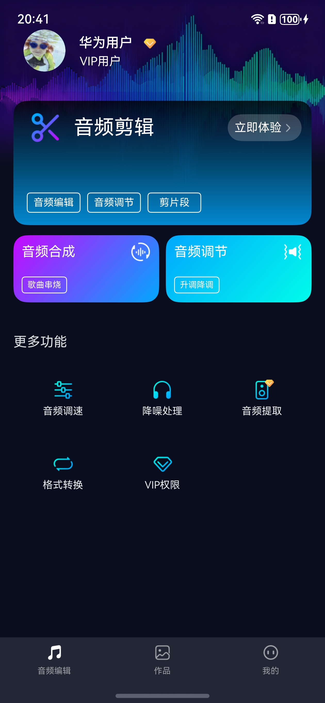 | 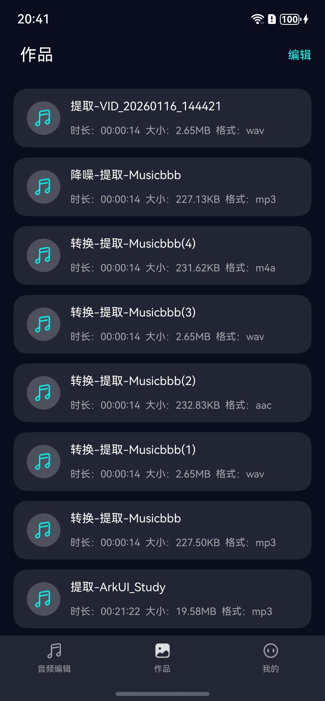 | 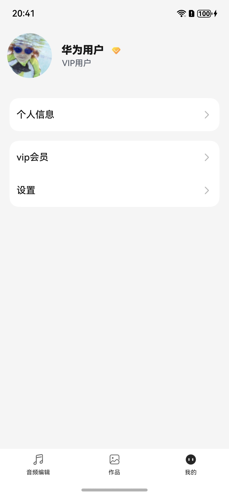 |

本模板主要页面及核心功能如下所示：

```text
音频编辑应用模板
  ├──音频编辑模块
  │   ├──音频剪辑
  │   │   ├── 音频波形展示
  │   │   ├── 片段选择裁剪
  │   │   ├── 实时预览播放
  │   │   └── 导出保存
  │   │
  │   ├──音频调速
  │   │   ├── 速度调节（0.5x-2.0x）
  │   │   ├── 实时预览
  │   │   └── 导出保存
  │   │
  │   ├──音频调节
  │   │   ├── 音调调节（赫兹）
  │   │   ├── 升调降调
  │   │   └── 导出保存
  │   │
  │   ├──音频合成
  │   │   ├── 多音频选择
  │   │   ├── 音频拼接合并
  │   │   └── 歌曲串烧
  │   │
  │   ├──音频提取
  │   │   ├── 视频文件选择
  │   │   ├── 音轨提取
  │   │   └── VIP权益限制
  │   │
  │   ├──格式转换
  │   │   ├── 多格式支持（MP3/WAV/M4A）
  │   │   └── 格式互转
  │   │
  │   └──降噪处理
  │       ├── 音频降噪
  │       └── 音质提升
  │
  ├──作品列表模块
  │   ├──作品管理
  │   │   ├── 作品列表展示
  │   │   ├── 作品播放预览
  │   │   ├── 批量选择
  │   │   ├── 删除作品
  │   │   └── 保存到相册
  │   │
  │   └──作品详情
  │       ├── 音频信息展示
  │       └── 播放控制
  │
  └──个人中心
      ├──登录
      │   ├── 华为账号登录
      │   └── 用户隐私协议同意
      │
      ├──VIP会员
      │   ├── 会员权益展示
      │   ├── 会员开通
      │   └── VIP功能解锁
      │
      ├──个人信息
      │   ├── 头像、昵称
      │   └── 个人资料编辑
      │
      └──常用服务
          └── 设置
              ├── 隐私设置
              ├── 清除缓存
              ├── 关于我们
              └── 退出登录
```

本模板工程代码结构如下所示：

```text
音频编辑应用模板
├──commons                                                // 公共模块
│  ├──common                                              // 基础模块
│  │    ├──constant                                       // 通用常量（Constants、RouterMap等）
│  │    ├──model                                          // 数据模型（UserInfo、BreakpointModel等）
│  │    ├──ui                                             // 通用UI组件（CommonHeader等）
│  │    └──util                                           // 通用工具方法
│  │
│  └──oh_router                                           // 路由模块（页面管理、路由跳转）
│
├──components                                             // 组件模块
│  ├──audio_adjust_speed                                  // 音频调速组件
│  ├──audio_adjust_tone                                   // 音频调节组件
│  ├──audio_crop                                          // 音频裁剪组件
│  ├──audio_synthesis                                     // 音频合成组件
│  ├──audio_extraction                                    // 音频提取组件
│  ├──audio_format_conversion                             // 音频格式转换组件
│  ├──audio_common                                        // 音频公共组件
│  ├──audio_worker                                        // 音频处理Worker
│  ├──base_apis                                           // 集成能力组件
│  ├──common_view                                         // 通用视图组件
│  ├──vip_center                                          // 会员中心组件
│  ├──aggregated_login                                    // 通用登录组件
│  ├──aggregated_payment                                  // 支付组件
│  ├──check_app_update                                    // 检测应用更新组件
│  └──collect_personal_info                               // 通用个人信息组件
│
├──features                                               // 功能模块
│  ├──audio_edit_home                                     // 音频编辑模块
│  │    ├──components                                     // 组件
│  │    ├──model                                          // 数据模型
│  │    ├──viewmodel                                      // 视图模型
│  │    ├──view                                           // 视图页面
│  │    │   ├──AutioEditHomePage.ets                      // 音频编辑首页
│  │    │   ├──AudioEditPage.ets                          // 音频编辑页
│  │    │   ├──AudioAdjustPage.ets                        // 音频调节页
│  │    │   ├──AudioSynthesisPage.ets                     // 音频合成页
│  │    │   ├──AudioExtractionHomePage.ets                // 音频提取页
│  │    │   ├──AudioFormatConversionPage.ets              // 格式转换页
│  │    │   └──SelectPage.ets                             // 音频选择页
│  │    └──util                                           // 工具类
│  │
│  ├──audio_work_list                                     // 作品列表模块
│  │    ├──components                                     // 组件
│  │    ├──view                                           // 视图页面
│  │    │   ├──WorkListPage.ets                           // 作品列表页
│  │    │   └──WorkDetailPage.ets                         // 作品详情页
│  │    └──util                                           // 工具类
│  │
│  └──person                                              // 个人中心模块
│       ├──comp                                           // 组件
│       ├──viewmodel                                      // 视图模型
│       └──views                                          // 视图页面
│           ├──MinePage.ets                               // 我的页面
│           ├──LoginPage.ets                              // 登录页面
│           ├──VipCenterPage.ets                          // VIP中心页面
│           ├──SetupPage.ets                              // 设置页面
│           ├──EditPersonalCenterPage.ets                 // 编辑个人中心
│           └──PrivacyAgreementPage.ets                   // 隐私协议页面
│
└──products                                               // 产品模块
   └──entry/src/main/ets                                  // 入口模块
        ├──entryability                                   // 入口能力
        │   └──EntryAbility.ets                           // 应用入口
        └──pages                                          // 页面
            ├──Index.ets                                  // 首页
            └──HomePage.ets                               // 主页（Tab容器）
```

## 约束与限制

### 环境

- DevEco Studio版本：DevEco Studio 5.0.5 Release及以上
- HarmonyOS SDK版本：HarmonyOS 5.0.3(15) Release SDK及以上
- 设备类型：华为手机（包括双折叠和阔折叠）
- 系统版本：HarmonyOS 5.0.3及以上

### 权限

- 网络权限：ohos.permission.INTERNET

### 调试

- 本组件不支持使用模拟器调试，请使用真机进行调试。

## 快速入门

### 配置工程

在运行此模板前，需要完成以下配置：

1. 在AppGallery Connect创建应用，将包名配置到模板中。

   a. 参考[创建HarmonyOS应用](https://developer.huawei.com/consumer/cn/doc/app/agc-help-create-app-0000002247955506)为应用创建APP ID，并将APP ID与应用进行关联。

   b. 返回应用列表页面，查看应用的包名。

   c. 将模板工程根目录下AppScope/app.json5文件中的bundleName替换为创建应用的包名。

2. 配置华为账号服务。

   a. 将应用的Client ID配置到products/entry/src/main路径下的module.json5文件中，详细参考：[配置Client ID](https://developer.huawei.com/consumer/cn/doc/harmonyos-guides/account-client-id)。

   b. 申请华为账号登录所需权限，详细参考：[申请账号权限](https://developer.huawei.com/consumer/cn/doc/harmonyos-guides/account-config-permissions)。

3. 对应用进行[手工签名](https://developer.huawei.com/consumer/cn/doc/harmonyos-guides/ide-signing#section297715173233)。

4. 添加手工签名所用证书对应的公钥指纹，详细参考：[配置公钥指纹](https://developer.huawei.com/consumer/cn/doc/app/agc-help-cert-fingerprint-0000002278002933)。

### 运行调试工程

1. 连接调试手机和PC。

2. 菜单选择"Run > Run 'entry' "或者"Run > Debug 'entry' "，运行或调试模板工程。

## 示例效果

### 音频编辑，作品列表模块

|                          音频提取                              |                                   音乐库                                    |                                     音频裁剪                                      |
|:-------------------------------------------------------------------:|:-----------------------------------------------------------------------------:|:---------------------------------------------------------------------------------:|
| 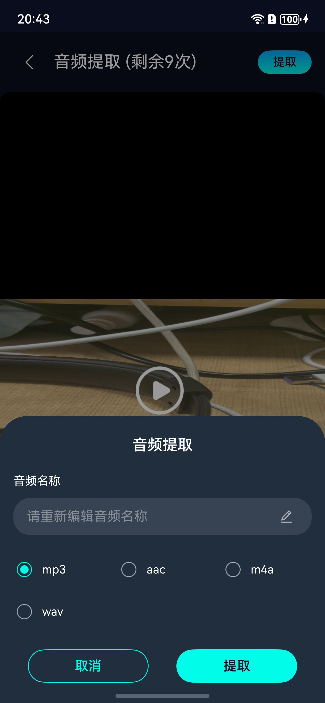  | 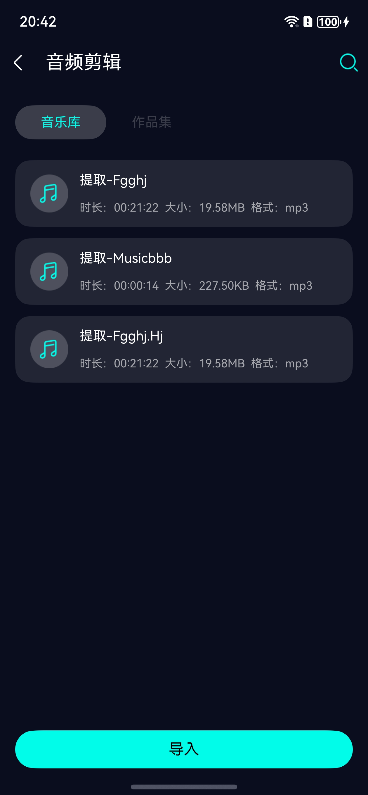 | 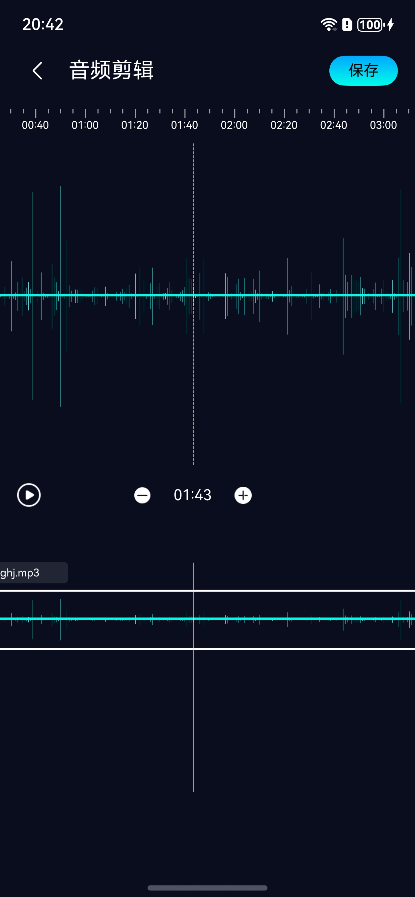 |

|                                音频调速                                 |                                   音频调节                                    |                                     音频合成                                      |
|:-------------------------------------------------------------------:|:-----------------------------------------------------------------------------:|:---------------------------------------------------------------------------------:|
| 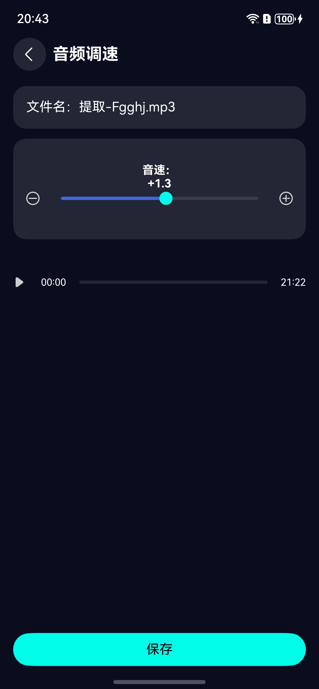 | 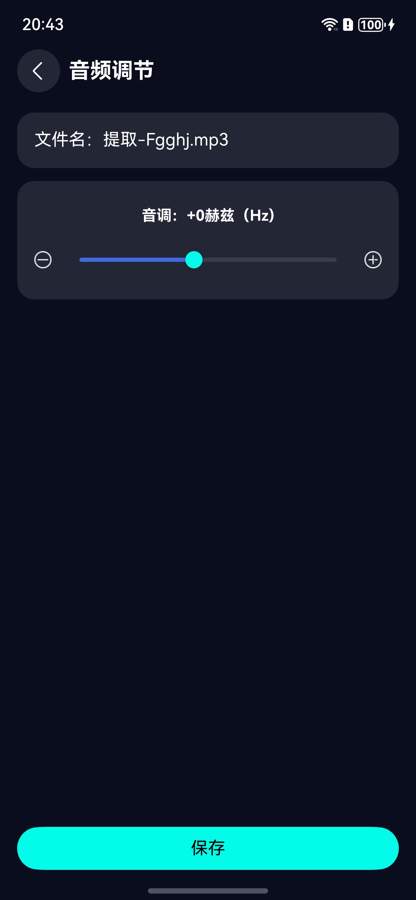 | 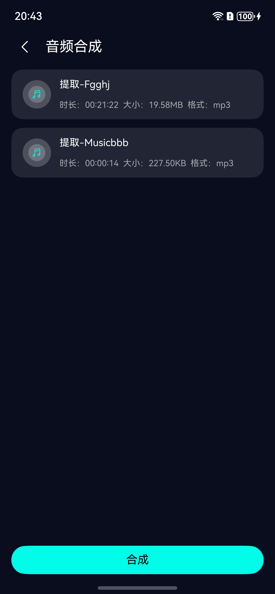 |

|                           降噪处理                               |                                   格式转换                                    |               作品详情                                                           |
|:-------------------------------------------------------------------:|:-----------------------------------------------------------------------------:|:---------------------------------------------------------------------------------:|
|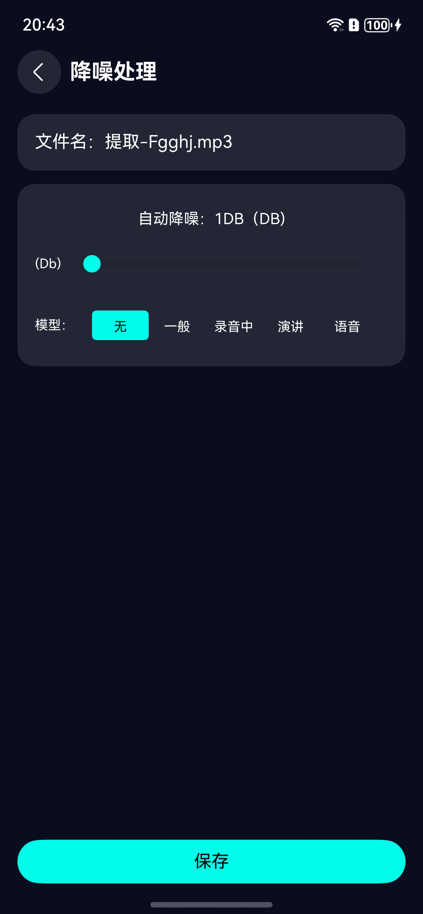 | 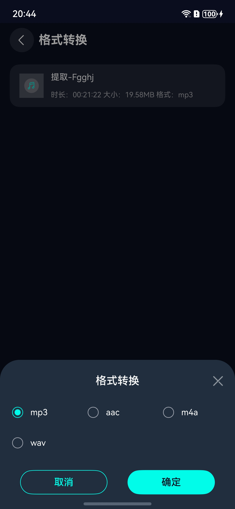 | 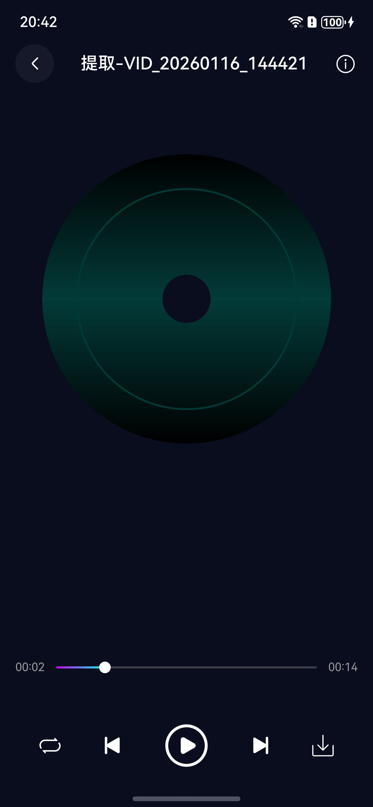 |


### 个人中心模块

|                             VIP会员中心                             |                              个人信息                              |                              设置                              |
|:----------------------------------------------------------------:|:--------------------------------------------------------------:|:--------------------------------------------------------------:|
|  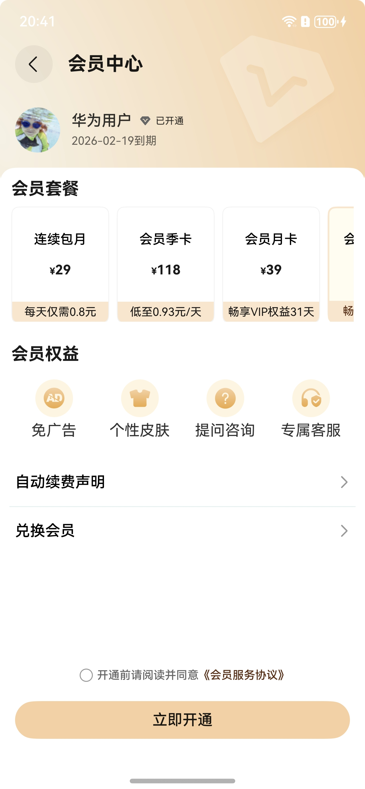 | 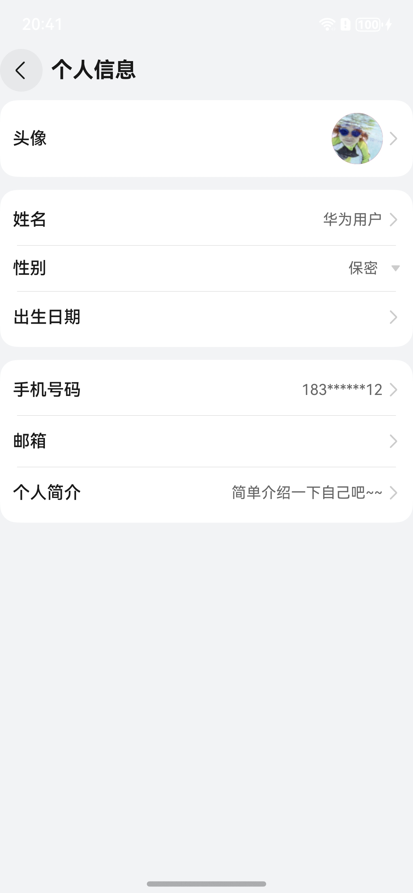 |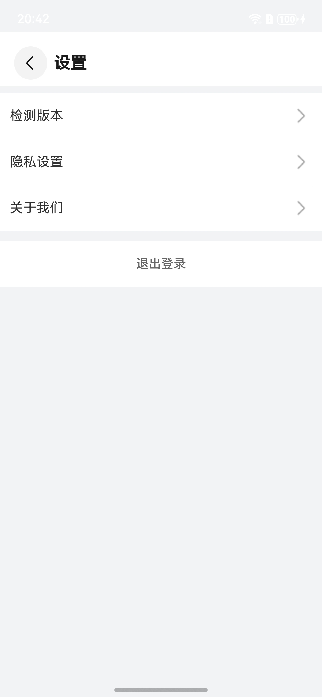 |


## 开源许可协议

该代码经过[Apache 2.0 授权许可](http://www.apache.org/licenses/LICENSE-2.0)。
