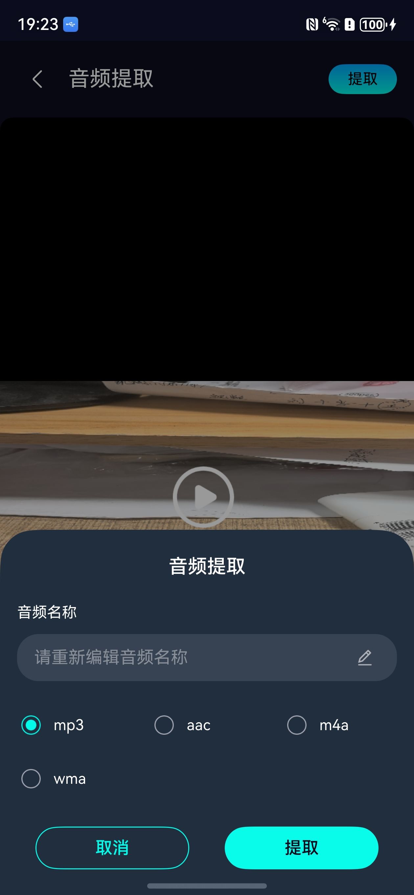

# 音频提取组件快速入门

## 目录

- [简介](#简介)
- [约束与限制](#约束与限制)
- [使用](#使用)
- [API参考](#API参考)
- [示例代码](#示例代码)

## 简介

本组件提供了从视频文件中提取音频的功能，支持视频预览播放、自定义输出格式、实时进度显示等功能。




## 约束与限制

### 环境

- DevEco Studio版本：DevEco Studio 5.0.5 Release及以上
- HarmonyOS SDK版本：HarmonyOS 5.0.5 Release SDK及以上
- 设备类型：华为手机（包括双折叠和阔折叠）
- 系统版本：HarmonyOS 5.0.1(13)及以上

### 权限

- 无

### 调试

- 本组件不支持使用模拟器调试，请使用真机进行调试。

## 使用

1. 安装组件

   如果是在 DevEco Studio 使用插件集成组件，则无需安装组件，请忽略此步骤。

   如果是从生态市场下载组件，请参考以下步骤安装组件。

   a. 解压下载的组件包，将包中所有文件夹拷贝至您工程根目录的 xxx 目录下。

   b. 在项目根目录 build-profile.json5 添加 audio_worker、audio_common、audio_extraction 模块。

    ```json5
    // 在项目根目录 build-profile.json5 填写 audio_worker、audio_common、 audio_extraction 路径。其中 xxx 为组件存放的目录名
    "modules": [
      {
        "name": "audio_extraction",
        "srcPath": "./xxx/audio_extraction"
      },
      {
        "name": "audio_common",
        "srcPath": "./xxx/audio_common"
      },
      {
        "name": "audio_worker",
        "srcPath": "./xxx/audio_worker",
        "targets": [
          {
            "name": "default",
            "applyToProducts": [
              "default"
            ]
          }
        ]
      }
    ]
    ```

   c. 在项目根目录 oh-package.json5 中添加依赖。

    ```json5
    // xxx 为组件存放的目录名称
    {
      "dependencies": {
        "audio_extraction": "file:./xxx/audio_extraction",
        "audio_common": "file:./XXX/audio_common"
      }
    }
    ```
   d. 在项目entry模块的src/main/ets/entryability/EntryAbility.ets文件中，给吸色功能初始化Context（必须）

   ```typescript
    
   import { CommonContext } from 'audio_common';
   
   // 初始化上下文
   onCreate(want: Want, launchParam: AbilityConstant.LaunchParam): void {
      CommonContext.setContext(this.context)
   }
   ```

2. 引入组件。

    ```typescript
    import { AudioExtractionPage } from 'audio_extraction';
    ```

3. 调用组件，详细参数配置说明参见[API参考](#API参考)。

## API参考

### 接口

#### AudioExtractionPage

AudioExtractionPage(options?: [AudioExtractionPageOptions](#AudioExtractionPageOptions对象说明))

音频提取页面组件，包含完整的视频选择、预览和音频提取功能界面。

### AudioExtractionPageOptions对象说明

| 参数名            | 类型                        | 是否必填 | 说明                                                               |
|----------------|---------------------------|----|------------------------------------------------------------------|
| resultCallBack | (outPath: string) => void | 否  | 提取完成回调，返回输出文件路径。可在此回调中获取输出文件信息、显示提示、保存到作品列表等操作。如不传入，组件将使用默认处理逻辑。 |
| backHandle     | () => void                | 否  | 返回按钮回调。点击页面左上角返回按钮时触发。如不传入，返回按钮将不执行任何操作。                         |
| vipLevel       | number                    | 否  | 提取次数限制。0：不可提取，1：10次提取，2：不限次数                                    |


## 示例代码

```
import { AudioExtractionPage } from 'audio_extraction';
import { promptAction, router } from '@kit.ArkUI';
import { fileIo, picker } from '@kit.CoreFileKit';
import { BusinessError } from '@kit.BasicServicesKit';

@Entry
@ComponentV2
struct Index {
   @Local resultCallBack: ((outPath: string) => void) | undefined = undefined;
   @Local backHandle: (() => void) | undefined = undefined;
   defaultResultCallBack = async (outPath: string) => {
      try {
         const documentSaveOptions = new picker.DocumentSaveOptions();
         let fileName = 'extracted_audio.mp3';
         const lastSeparator = outPath.lastIndexOf('/');
         if (lastSeparator != -1) {
            fileName = outPath.substring(lastSeparator + 1);
         }
         documentSaveOptions.newFileNames = [fileName];

         const documentViewPicker = new picker.DocumentViewPicker();
         documentViewPicker.save(documentSaveOptions).then(async (documentSaveResult: Array<string>) => {
            if (documentSaveResult && documentSaveResult.length > 0) {
               let uri = documentSaveResult[0];
               try {
                  let file = await fileIo.open(outPath, fileIo.OpenMode.READ_ONLY);
                  let destFile = await fileIo.open(uri, fileIo.OpenMode.READ_WRITE | fileIo.OpenMode.CREATE);
                  await fileIo.copyFile(file.fd, destFile.fd);
                  fileIo.closeSync(file.fd);
                  fileIo.closeSync(destFile.fd);
                  promptAction.showToast({ message: '保存成功' });
                  AlertDialog.show({
                     title: '保存成功',
                     message: '文件已保存到本地。\n源文件沙箱路径：' + outPath,
                     confirm: {
                        value: '确定',
                        action: () => {
                        }
                     }
                  })
               } catch (e) {
                  console.error('保存文件失败', JSON.stringify(e));
                  promptAction.showToast({ message: '保存失败' });
               }
            }
         }).catch((err: BusinessError) => {
            console.error('DocumentViewPicker save failed', JSON.stringify(err));
         });
      } catch (err) {
         console.error('defaultResultCallBack failed', JSON.stringify(err));
      }
   }
   handleBack = () => {
      if (this.backHandle) {
         this.backHandle();
      } else {
         router.back();
      }
   }

   build() {
      NavDestination() {
         Column() {
            AudioExtractionPage({
               resultCallBack: this.defaultResultCallBack,
               backHandle: this.handleBack,
               vipLevel: 2
            })
         }
         .width('100%')
            .height('100%')
            .backgroundColor('#0A0D1E')
      }
      .hideTitleBar(true)

         .onReady((context: NavDestinationContext) => {
         })
   }
}
```