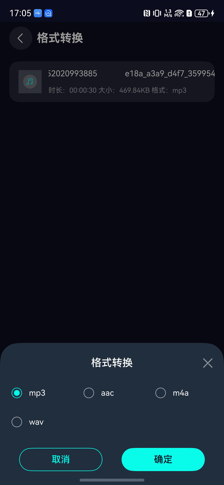

# 音频格式转换组件快速入门

## 目录

- [简介](#简介)
- [约束与限制](#约束与限制)
- [使用](#使用)
- [API参考](#API参考)
- [示例代码](#示例代码)

## 简介

本组件提供了音频格式转换功能，支持选择音频文件，将音频转换为多种常见格式（mp3、aac、m4a、wav），该组件只支持真机环境。




## 约束与限制

### 环境

- DevEco Studio版本：DevEco Studio 5.0.5 Release及以上
- HarmonyOS SDK版本：HarmonyOS 5.0.5 Release SDK及以上
- 设备类型：华为手机（包括双折叠和阔折叠）
- 系统版本：HarmonyOS 5.0.3(15)及以上

### 权限

- 无

### 调试

- 本组件不支持使用模拟器调试，请使用真机进行调试。


## 使用

1. 安装组件

   如果是在 DevEco Studio 使用插件集成组件，则无需安装组件，请忽略此步骤。

   如果是从生态市场下载组件，请参考以下步骤安装组件。

   a. 解压下载的组件包，将包中所有文件夹拷贝至您工程根目录的 XXX 目录下。

   b. 在项目根目录 build-profile.json5 添加 audio_worker、audio_common、audio_format_conversion 模块。

    ```
    // 在项目根目录 build-profile.json5 填写 audio_format_conversion、audio_worker、audio_common 路径。其中 XXX 为组件存放的目录名
    "modules": [
    {
      "name": "audio_common",
      "srcPath": "./XXX/audio_common"
    },
    {
      "name": "audio_format_conversion",
      "srcPath": "./XXX/audio_format_conversion"
    },
    {
      "name": "audio_worker",
      "srcPath": "./XXX/audio_worker",
      "targets": [
        {
          "name": "default",
          "applyToProducts": [
            "default"
          ]
        }
      ]
    }
    ]
    ```

   c. 在项目根目录 oh-package.json5 中添加依赖。

    ```
    // XXX 为组件存放的目录名称
    {
      "dependencies": {
          "audio_format_conversion": "file:./XXX/audio_format_conversion",
          "audio_common": "file:./XXX/audio_common"
      }
    }
    ```
2. 在项目entry模块的src/main/ets/entryability/EntryAbility.ets文件中，初始化上下文环境，数据持久化需要用到。

   ```typescript
    
   import { CommonContext } from 'audio_common';
   
   // 初始化上下文
   onCreate(want: Want, launchParam: AbilityConstant.LaunchParam): void {
      CommonContext.setContext(this.context)
   }
   ```
3. 引入组件。

    ```
   import { AudioFormatPage } from 'audio_format_conversion'
   ```
   
4. 调用组件，详细参数配置说明参见[API参考](#API参考)。

## API参考

### 接口

**AudioFormatPage(params: [AudioFormatPageParams](#AudioFormatPageParams对象说明)): void**

音频格式转换组件，提供音频格式选择、转换、保存等功能。

### AudioFormatPageParams对象说明

AudioFormatPage 组件的参数结构体。

| 字段名            | 类型                          | 是否必填 | 默认值                     | 说明                    |
|----------------|-----------------------------|----|-------------------------|-----------------------|
| musicTitle     | string                      | 是  | ''                      | 音频文件名称                |
| sourcePath     | string                      | 是  | ''                      | 源音频文件沙箱路径             |
| duration       | number                      | 是  | 0                       | 音频时长（毫秒）              |
| format         | string                      | 是  | ''                      | 音频转换格式（如 mp3、aac）     |
| backHandle     | () => void                  | 否  | () => {}                | 返回按钮回调函数              |
| resultCallBack | (outPath: string) => void   | 否  | (outPath: string) => {} | 音频转换完成后的回调函数，返回输出文件路径 |
| pageParams     | [TValueType](#TValueType)   | 否  | null                    | 页面参数（可选）              |

### TValueType

页面参数类型定义。

```typescript
type TValueType = string | boolean | number | null | Array<TValueType> | Object | Object[] | (() => void)
```

## 示例代码

```
import { AudioFormatPage } from 'audio_format_conversion'
import { audio } from '@kit.AudioKit'
import { FileUtil,ICallBack, MP4Parser } from 'audio_common'
import { common } from '@kit.AbilityKit'
import { promptAction } from '@kit.ArkUI'
import { picker } from '@kit.CoreFileKit'

interface AudioFileMetadata {
  streams: AudioStream[]
  format: AudioFormatInfo
}

interface AudioStream {
  codec_type: 'audio' | 'video' | 'subtitle'
  sample_rate: string
  channel_layout: string
}

interface AudioFormatInfo {
  duration: string
  format_name: string
}

interface StringCallBack {
  callBackResult: (code: string) => void
}

function getChannelLayout(ac: string): number {
  switch (ac) {
    case 'mono':
      return 1
    case 'stereo':
      return 2
    case '5.1':
      return 6
    case '7.1':
      return 8
    default:
      return 1
  }
}

function getMetaData(path: string, callBack: StringCallBack): void {
  MP4Parser.getMetaData(path, callBack)
}

function changeToPcm(
  context: Context,
  path: string,
  callBackPCM: (pcmPath: string, channelLayout: number, sampleRate: number) => void,
  error: () => void
): void {
  getMetaData(path, {
    callBackResult: (res: string) => {
      if (!res) {
        error()
        return
      }
      const tempData = JSON.parse(res) as AudioFileMetadata
      const streams = tempData.streams

      let sampleRate = ''
      let channelLayout = 0

      for (let index = 0; index < streams.length; index++) {
        const stream = streams[index]
        if (stream.codec_type === 'audio') {
          sampleRate = stream.sample_rate
          channelLayout = getChannelLayout(stream.channel_layout)
          break
        }
      }

      if (!sampleRate || channelLayout === 0) {
        error()
        return
      }

      const fileUtil = new FileUtil(context as common.UIAbilityContext)
      const pcmDir = fileUtil.getAudioPcmDir()
      const prefixName = fileUtil.splitFilePath(path)[1]
      const pcmPath = pcmDir + prefixName + '.pcm'
      const logPath = pcmDir + prefixName + '.log'
      fileUtil.deleteFileByPath(pcmPath)
      fileUtil.deleteFileByPath(logPath)

      const callBack: ICallBack = {
        callBackResult(code: number) {
          if (code === 0) {
            callBackPCM(pcmPath, channelLayout, Number(sampleRate))
          } else {
            error()
          }
        }
      }
      const ffmpegCmd = `ffmpeg -i ${path} -ar ${sampleRate} -ac ${channelLayout} -f f32le ${pcmPath} -progress ${logPath}`
      MP4Parser.ffmpegCmd(ffmpegCmd, callBack)
    }
  })
}

@Entry
@Component
struct Index {
  @State pcmPath: string = ''
  @State title: string = ''
  @State duration: number = 0
  @State sizePos: string = '0KB'
  @State format: string = ''
  @State sourcePath: string = '' //音频源文件文件沙箱路径
  @State sampleFormat: number = audio.AudioSampleFormat.SAMPLE_FORMAT_F32LE
  @State isLoading: boolean = true
  @State isReady: boolean = false
  private dialogController: CustomDialogController | null = null
  private context: common.UIAbilityContext = getContext(this) as common.UIAbilityContext

  aboutToAppear(): void {
    this.selectAudioFile()
  }
  getFormatSize(size: number) {
    if (!size) {
      return '0KB'
    }
    let tempSize = size / 1024 //转成KB
    let format = 'KB'
    if (tempSize > 1024) {
      tempSize = tempSize / 1024 //在转成MB
      format = 'MB'
    }
    // toPrecision(2) 会保留2位有效数字，这可能导致科学计数法，比如 480KB -> 4.8e+2KB
    // 改用 toFixed(2) 保留2位小数
    return `${tempSize.toFixed(2)}${format}`
  }

  selectAudioFile(): void {
    let audioSelectOptions = new picker.AudioSelectOptions();
    let audioPicker = new picker.AudioViewPicker(this.context);
    // 配置单选参数（关键步骤）
    audioSelectOptions.maxSelectNumber = 1; // 单选限制为1个文件
    audioPicker.select(audioSelectOptions).then(async (audioSelectResult: Array<string>) => {
      if (!audioSelectResult || audioSelectResult.length === 0) {
        promptAction.showToast({ message: '未选择音频文件' })
        return
      }
      const uri = audioSelectResult[0]
      try {
        const fileUtil = new FileUtil(this.context)
        const format = fileUtil.splitFilePath(uri)[2]
        const fileName = decodeURIComponent(fileUtil.splitFilePath(uri)[1]).replace(/\s+/g, '')
        const cacheDir = fileUtil.getAudioCacheDir()
        const targetPath = cacheDir + fileName + '.' + format
        await FileUtil.copyFileToDestPath(uri, targetPath)
        this.getAudioMetadata(targetPath, fileName + '.' + format, format)
      } catch (err) {
        promptAction.showToast({ message: '处理音频文件失败' })
      }
    })
  }

  getAudioMetadata(filePath: string, fileName: string, format: string): void {
    getMetaData(filePath, {
      callBackResult: (res: string) => {
        if (!res) {
          promptAction.showToast({ message: '获取音频信息失败' })
          return
        }

        try {
          const tempData = JSON.parse(res) as AudioFileMetadata
          const formatInfo = tempData.format
          const duration = formatInfo.duration ? Math.floor(parseFloat(formatInfo.duration) * 1000) : 0
          this.convertToPcm(filePath, fileName, duration, format)
        } catch (err) {
          promptAction.showToast({ message: '解析音频信息失败' })
        }
      }
    })
  }


  convertToPcm(filePath: string, fileName: string, duration: number, format: string): void {
    const callBack = (pcmPath: string, channelLayout: number, sampleRate: number) => {
      this.isLoading = false
      this.isReady = true
      this.sourcePath = filePath
      this.title = fileName
      this.duration =duration
      this.format = format
    }

    const errorBack = () => {
      promptAction.showToast({ message: '音频转换失败' })
    }

    changeToPcm(this.context, filePath, callBack, errorBack)
  }

  showSaveSuccessDialog(filePath: string): void {
    const fileName = filePath.substring(filePath.lastIndexOf('/') + 1)
    const displayPath = `文件已保存\n路径: ${filePath}\n文件名: ${fileName}`

    this.dialogController = new CustomDialogController({
      builder: SaveSuccessDialog({
        filePath: displayPath,
        onConfirm: () => {
          this.dialogController?.close()
        }
      }),
      autoCancel: true,
      alignment: DialogAlignment.Center,
      customStyle: true
    })
    this.dialogController.open()
  }

  build() {
    Column() {
      if (this.isLoading) {
        Column() {
          LoadingProgress()
            .width(50)
            .height(50)
            .color('#01FCEA')

          Text('正在处理音频文件...')
            .fontSize(14)
            .fontColor('#666666')
            .margin({ top: 16 })
        }
        .width('100%')
        .height('100%')
        .justifyContent(FlexAlign.Center)
        .backgroundColor('#0A0D1E')
      } else if (this.isReady) {
        AudioFormatPage({
          resultCallBack: (outPath: string) => {
            this.showSaveSuccessDialog(outPath)
          },
          backHandle: ()=>{},
          sourcePath: this.sourcePath,
          musicTitle: this.title,
          duration: this.duration,
          format: this.format,
          sizePos: this.sizePos
        })
      }
    }
    .width('100%')
    .height('100%')
  }
}

@CustomDialog
struct SaveSuccessDialog {
  controller?: CustomDialogController
  filePath: string = ''
  onConfirm: () => void = () => {}

  build() {
    Column() {
      Image($r('sys.media.ohos_ic_public_ok'))
        .width(48)
        .height(48)
        .fillColor('#00C853')
        .margin({ bottom: 16 })

      Text('保存成功')
        .fontSize(20)
        .fontWeight(FontWeight.Bold)
        .margin({ bottom: 12 })

      Text(this.filePath)
        .fontSize(12)
        .fontColor('#666666')
        .textAlign(TextAlign.Center)
        .margin({ bottom: 24 })
        .width('100%')
        .maxLines(5)

      Button('确定')
        .width('100%')
        .height(40)
        .backgroundColor('#01FCEA')
        .fontColor('#000000')
        .onClick(() => {
          this.onConfirm()
        })
    }
    .padding(24)
    .backgroundColor(Color.White)
    .borderRadius(16)
    .width('85%')
  }
}
```