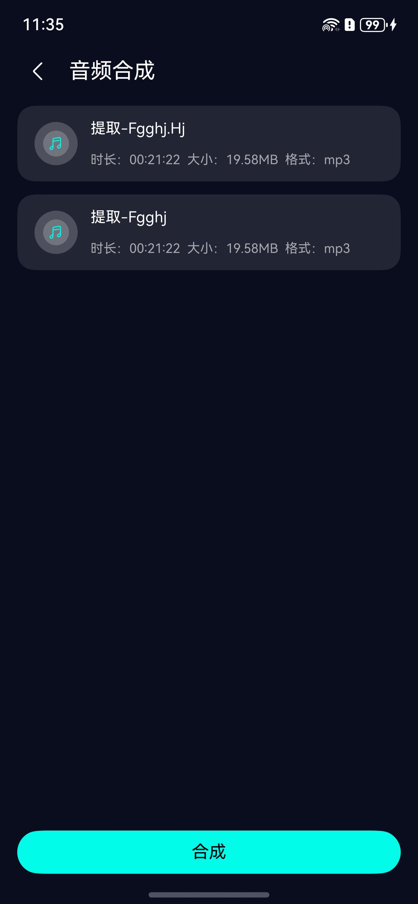

# 音频合成组件快速入门

## 目录

- [简介](#简介)
- [约束与限制](#约束与限制)
- [使用](#使用)
- [API参考](#API参考)
- [示例代码](#示例代码)

## 简介

本组件提供了音频合成功能，支持2-5多个音频合成功能。

<td valign='top'></td>


## 约束与限制

### 环境

- DevEco Studio版本：DevEco Studio 5.0.5 Release及以上
- HarmonyOS SDK版本：HarmonyOS 5.0.5 Release SDK及以上
- 设备类型：华为手机（包括双折叠和阔折叠）
- 系统版本：HarmonyOS 5.0.1(13)及以上

### 权限

- 无

### 调试

- 本组件不支持使用模拟器调试，请使用真机进行调试。

## 使用

1. 安装组件

   如果是在 DevEco Studio 使用插件集成组件，则无需安装组件，请忽略此步骤。

   如果是从生态市场下载组件，请参考以下步骤安装组件。

   a. 解压下载的组件包，将包中所有文件夹拷贝至您工程根目录的 xxx 目录下。

   b. 在项目根目录 build-profile.json5 添加 audio_synthesis、audio_common、audio_worker 模块。

    ```
    // 在项目根目录 build-profile.json5 填写 audio_synthesis、audio_common、audio_worker 路径。其中 xxx 为组件存放的目录名
    "modules": [
      {
        "name": "audio_synthesis",
        "srcPath": "./xxx/audio_synthesis"
      },
      {
        "name": "audio_common",
        "srcPath": "./xxx/audio_common",
      },
      {
      "name": "audio_worker",
      "srcPath": "./xxx/audio_worker",
      "targets": [
        {
          "name": "default",
          "applyToProducts": [
            "default"
          ]
        }
      ]
     }
    ]
    ```

   c. 在项目根目录 oh-package.json5 中添加依赖。

    ```json5
    // xxx 为组件存放的目录名称
    {
      "dependencies": {
        "audio_synthesis": "file:./xxx/audio_synthesis",
        "audio_common": "file:./xxx/audio_common",
      }
    }
    ```

2. 在项目entry模块的src/main/ets/entryability/EntryAbility.ets文件中，初始化Context。

   ```typescript
    
   import { CommonContext } from 'audio_common';
   
   // 初始化上下文
   onCreate(want: Want, launchParam: AbilityConstant.LaunchParam): void {
      CommonContext.setContext(this.context)
   }
   ```
3. 引入组件。

    ```typescript
    import { AudioSynthesis } from 'audio_synthesis';
    ```

4. 调用组件，详细参数配置说明参见[API参考](#API参考)。


## API参考

### 接口

#### AudioSynthesis

AudioSynthesis(options: AudioSynthesisOptions)

音频合成页面组件，包含完整的音频合成功能界面。

**参数：**

| 参数名            | 类型                                | 是否必填 | 说明              |
|----------------|-----------------------------------|------|-----------------|
| selectedMusicList   | Array<[MusicViewModel](#MusicViewModel)> | 是    | 选中的音频列表，支持2-5个音频文件            |
| resultCallBack | (outPath: string) => void         | 是    | 合成完成回调，返回合成后的音频文件路径 |
| backHandle     | () => void                        | 是    | 返回按钮回调          |

### MusicViewModel

音频文件信息模型，用于描述待合成的音频文件。

**属性：**

| 属性名            | 类型      | 说明                                      |
|----------------|---------|------------------------------------------|
| uri            | string  | 文件URI，音乐库中全局唯一标识                       |
| title          | string  | 音频文件名称                                  |
| duration       | number  | 音频时长（单位：毫秒）                             |
| size           | string  | 文件大小（如：'1.5MB'）                         |
| format         | string  | 音频格式（如：'mp3'、'wav'、'm4a'等）              |
| sourcePath     | string  | 音频源文件在沙箱中的路径                            |
| pcmName        | string  | PCM文件名称，用于设置PCM码流文件名                    |
| checkBoxStatus | boolean | 列表元素选中状态（用于作品集数据）                       |

## 示例代码

```
import { AudioSynthesis } from 'audio_synthesis'
import { picker } from '@kit.CoreFileKit'
import { fileIo } from '@kit.CoreFileKit'
import { media } from '@kit.MediaKit'
import { FileUtil } from 'audio_common'
import { common } from '@kit.AbilityKit'
import { promptAction } from '@kit.ArkUI'

@ObservedV2
class MusicViewModel {
  uri: string = ''
  title: string = ''
  duration: number = 0
  size: string = '0KB'
  format: string = ''
  sourcePath: string = ''
  pcmName: string = ''
  @Trace checkBoxStatus: boolean = false

  constructor(uri: string, title: string, duration: number, size: string, format: string, path: string) {
    this.uri = uri
    this.title = title
    this.duration = duration
    this.size = size
    this.format = format
    this.sourcePath = path
    this.pcmName = parsePath(uri, 0)
  }

  setCheckBoxStatus(status: boolean) {
    this.checkBoxStatus = status
  }
}

function parsePath(src: string, index: number): string {
  let arr = src.split('/')
  let lastStr = arr[arr.length - 1]
  let lastTemp = lastStr.split('.')
  return lastTemp[index]
}

@Entry
@ComponentV2
struct AudioSynthesisPage {
  @Local selectedMusicList: MusicViewModel[] = []
  @Local isLoading: boolean = true
  @Local isReady: boolean = false
  private dialogController: CustomDialogController | null = null
  private context: common.UIAbilityContext = getContext(this) as common.UIAbilityContext
  private fileUtil: FileUtil = new FileUtil(this.context)

  aboutToAppear(): void {
    this.selectAudioFiles()
  }

  async getAudioDuration(fd: number): Promise<number> {
    try {
      const avMetadataExtractor: media.AVMetadataExtractor = await media.createAVMetadataExtractor()
      avMetadataExtractor.fdSrc = { fd: fd }
      const avMetaData = await avMetadataExtractor.fetchMetadata()
      await avMetadataExtractor.release()
      return avMetaData && avMetaData.duration ? Number(avMetaData.duration) : 0
    } catch (err) {
      return 0
    }
  }

  async selectAudioFiles(): Promise<void> {
    try {
      const audioSelectOptions = new picker.AudioSelectOptions()
      audioSelectOptions.maxSelectNumber = 5
      const audioPicker = new picker.AudioViewPicker()
      const audioSelectResult: string[] = await audioPicker.select(audioSelectOptions)

      if (!audioSelectResult || audioSelectResult.length < 2) {
        promptAction.showToast({ message: '请选择2-5个音频文件' })
        return
      }

      if (audioSelectResult.length > 5) {
        promptAction.showToast({ message: '最多只能选择5个音频文件' })
        return
      }

      this.selectedMusicList = []
      const musicDir = this.fileUtil.getAudioCacheDir()

      for (let uri of audioSelectResult) {
        let fd: number = -1
        try {
          const pathArr = this.fileUtil.splitFilePath(uri)
          const fileName = pathArr[1]
          const format = pathArr[2]
          const sandboxPath = musicDir + fileName + '.' + format

          await FileUtil.copyFileToDestPath(uri, sandboxPath)

          const file = fileIo.openSync(sandboxPath, fileIo.OpenMode.READ_ONLY)
          fd = file.fd
          const stat = fileIo.statSync(fd)
          const size = stat.size > 1024 * 1024
            ? `${(stat.size / (1024 * 1024)).toFixed(2)}MB`
            : `${(stat.size / 1024).toFixed(2)}KB`
          const duration = await this.getAudioDuration(fd)

          this.selectedMusicList.push(new MusicViewModel(
            uri, fileName + '.' + format, duration, size, format, sandboxPath
          ))
        } catch (err) {
          promptAction.showToast({ message: '处理音频文件失败' })
        } finally {
          if (fd >= 0) fileIo.closeSync(fd)
        }
      }

      if (this.selectedMusicList.length >= 2) {
        this.isLoading = false
        this.isReady = true
      } else {
        promptAction.showToast({ message: '至少需要2个有效的音频文件' })
      }
    } catch (err) {
      promptAction.showToast({ message: '选择音频失败' })
    }
  }

  showSaveSuccessDialog(filePath: string): void {
    const fileName = filePath.substring(filePath.lastIndexOf('/') + 1)
    const displayPath = `文件已保存\n路径: ${filePath}\n文件名: ${fileName}`

    this.dialogController = new CustomDialogController({
      builder: SaveSuccessDialog({
        filePath: displayPath,
        onConfirm: () => {
          this.dialogController?.close()
        }
      }),
      autoCancel: true,
      alignment: DialogAlignment.Center,
      customStyle: true
    })
    this.dialogController.open()
  }

  build() {
    Column() {
      if (this.isLoading) {
        Column() {
          LoadingProgress()
            .width(50)
            .height(50)
            .color('#01FCEA')

          Text('正在处理音频文件...')
            .fontSize(14)
            .fontColor('#666666')
            .margin({ top: 16 })
        }
        .width('100%')
        .height('100%')
        .justifyContent(FlexAlign.Center)
        .backgroundColor('#0A0D1E')
      } else if (this.isReady) {
        AudioSynthesis({
          selectedMusicList: this.selectedMusicList,
          resultCallBack: (outPath: string) => {
            this.showSaveSuccessDialog(outPath)
          },
          backHandle: () => {
          }
        })
      }
    }
    .width('100%')
    .height('100%')
  }
}

@CustomDialog
struct SaveSuccessDialog {
  controller?: CustomDialogController
  filePath: string = ''
  onConfirm: () => void = () => {}

  build() {
    Column() {
      Image($r('sys.media.ohos_ic_public_ok'))
        .width(48)
        .height(48)
        .fillColor('#00C853')
        .margin({ bottom: 16 })

      Text('保存成功')
        .fontSize(20)
        .fontWeight(FontWeight.Bold)
        .margin({ bottom: 12 })

      Text(this.filePath)
        .fontSize(12)
        .fontColor('#666666')
        .textAlign(TextAlign.Center)
        .margin({ bottom: 24 })
        .width('100%')
        .maxLines(5)

      Button('确定')
        .width('100%')
        .height(40)
        .backgroundColor('#01FCEA')
        .fontColor('#000000')
        .onClick(() => {
          this.onConfirm()
        })
    }
    .padding(24)
    .backgroundColor(Color.White)
    .borderRadius(16)
    .width('85%')
  }
}
```