# 拍摄美化（影音编辑）应用模板快速入门

## 目录

- [功能介绍](#功能介绍)
- [约束与限制](#约束与限制)
- [快速入门](#快速入门)
- [示例效果](#示例效果)
- [开源许可协议](#开源许可协议)

## 功能介绍

您可以基于此模板直接定制应用，也可以挑选此模板中提供的多种组件使用，从而降低您的开发难度，提高您的开发效率。

本模板提供如下组件，所有组件存放在工程根目录的components下，如果您仅需使用组件，可参考对应组件的指导链接；如果您使用此模板，请参考本文档。

| 组件                               | 描述                                                                                | 使用指导                                                  |
|:---------------------------------|:----------------------------------------------------------------------------------|:------------------------------------------------------|
| 视频编辑组件（video_edit）               | 提供完整的视频编辑功能，包括视频裁剪、拼接、画中画、提词器、字幕添加等核心编辑能力                          | [使用指导](components/video_edit/README.md)     |
| 离线视频下载组件（offline_video_download） | 提供视频下载与播放管理功能，支持下载进度展示、播放控制、横竖屏切换等功能                                                            | [使用指导](components/offline_video_download/README.md)      |
| 会员中心组件（vip_center）               | 提供用户会员开通功能                                                                       | [使用指导](components/vip_center/README.md)             |
| 通用登录组件（aggregated_login）         | 提供华为账号一键登录及其他方式登录（微信、手机号登录）                                                                   | [使用指导](components/aggregated_login/README.md)     |
| 通用问题反馈组件（feedback）               | 提供通用的问题反馈功能                                                    | [使用指导](components/feedback/README.md) |
| 检测应用更新组件（check_app_update）       | 提供检测应用是否存在新版本功能                                                    | [使用指导](components/check_app_update/README.md) |
| 通用个人信息组件（collect_personal_info）  | 支持编辑头像、昵称、姓名、性别、手机号、生日、个人简介等                                                    | [使用指导](components/collect_personal_info/README.md) |

本模板为影音编辑类应用提供了常用功能的开发样例，模板主要分为三大模块：视频编辑、作品、我的。

本模板主要功能模块：

* 视频编辑：提供视频裁剪、拼接、画中画、字幕添加等编辑功能；支持视频帧预览、拖动排序、分割、缩放等操作；提供视频导出功能。

* 作品：展示和管理用户的视频作品和草稿，支持作品查看、编辑、分享和删除等操作。

* 我的：提供个人信息管理、会员服务、意见反馈、设置等功能。

本模板已集成华为账号、微信登录、会员服务、支付功能、消息管理、应用更新检查、意见反馈等服务，只需做少量配置和定制即可快速实现应用的核心功能。

|                          首页                           |                          作品                           |                           个人中心                            |
|:-----------------------------------------------------:|:-----------------------------------------------------:|:---------------------------------------------------------:|
| 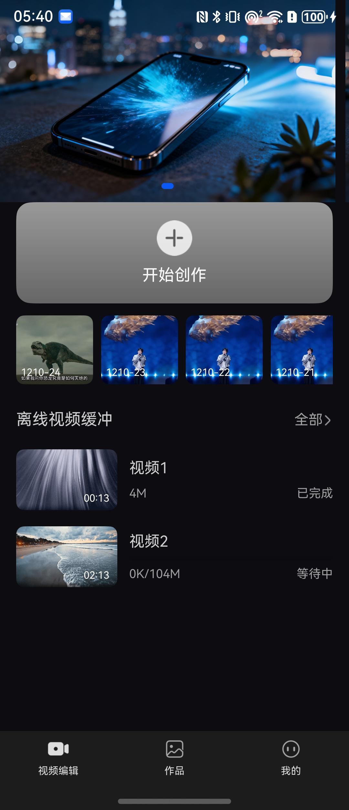 | 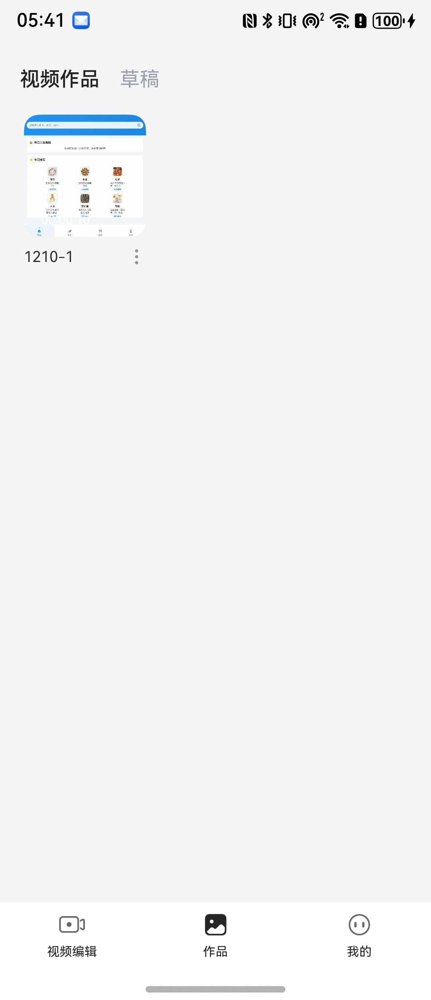 | 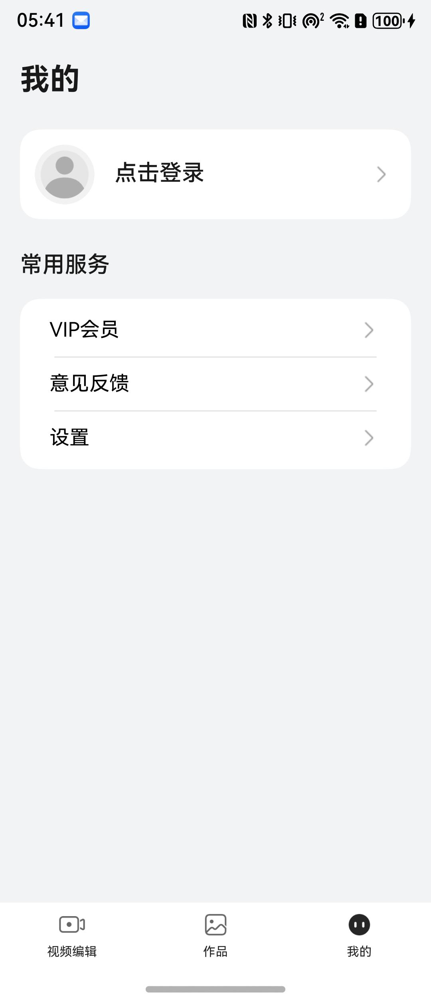 |


本模板主要页面及核心功能如下所示：

```text

影音编辑应用模板
  ├──视频编辑
  │   ├──视频素材管理
  │   │   ├── 从相册选择视频
  │   │   ├── 视频缩略图预览
  │   │   └── 草稿管理
  │   │
  │   ├──视频编辑功能
  │   │   ├── 视频裁剪
  │   │   ├── 视频拼接
  │   │   ├── 画中画编辑
  │   │   ├── 提词器功能
  │   │   ├── 字幕添加
  │   │   ├── 视频分割
  │   │   ├── 视频缩放
  │   │   └── 视频导出
  │   │
  │   └──离线视频
  │       ├── 视频下载管理
  │       ├── 下载进度展示
  │       ├── 在线播放
  │       ├── 离线播放
  │       ├── 播放控制
  │       └── 横竖屏切换
  │
  ├──作品
  │   ├──视频作品
  │   │   ├── 作品展示（网格布局）
  │   │   ├── 作品详情查看
  │   │   ├── 作品分享
  │   │   └── 作品删除
  │   │
  │   └──草稿箱
  │       ├── 草稿列表
  │       ├── 继续编辑
  │       └── 草稿删除
  │
  └──我的
      ├──登录
      │   ├── 华为账号登录
      │   ├── 微信登录
      │   ├── 手机号登录
      │   └── 用户隐私协议同意
      │
      ├──个人信息
      │   ├── 头像、昵称
      │   └── 个人资料编辑
      │
      ├──会员服务
      │   ├── 会员开通
      │   ├── 会员权益展示
      │   └── 支付功能（华为支付、支付宝、微信支付）
      │
      └──设置
          ├── 个人信息
          ├── 隐私设置
          ├── 意见反馈
          ├── 清除缓存
          ├── 应用更新检查
          ├── 关于我们
          └── 退出登录
```

本模板工程代码结构如下所示：

```text
影音编辑应用模板
├──commons                                                // 公共模块
│  ├──common                                              // 基础模块
│  │    ├──basic                                          // 基础类（BaseViewModel、GlobalContext、Logger等）
│  │    ├──constant                                       // 通用常量（Constants、RouterMap等）
│  │    ├──model                                          // 数据模型（UserInfo、FileInfo等）
│  │    ├──ui                                             // 通用UI组件（Header、WebView等）
│  │    └──util                                           // 通用工具方法（权限、缓存、文件、时间等工具类）
│  │
│  └──OHRouter                                            // 路由模块（页面管理、路由跳转）
│
├──components                                             // 组件模块
│  ├──video_edit                                          // 视频编辑组件
│  ├──video_common                                        // 视频通用组件
│  ├──offline_video_download                              // 离线视频下载组件
│  ├──vip_center                                          // 会员中心组件
│  ├──aggregated_login                                    // 通用登录组件
│  ├──aggregated_payment                                  // 支付组件
│  ├──feedback                                            // 通用问题反馈组件
│  ├──check_app_update                                    // 检测应用更新组件
│  ├──collect_personal_info                               // 个人信息收集组件
│  └──base_apis                                           // 基础API组件
│
├──features                                               // 功能模块
│  ├──home                                                // 视频编辑首页模块
│  │    ├──components                                     // 组件（草稿视频组件等）
│  │    ├──model                                          // 数据模型
│  │    ├──view                                           // 视图页面
│  │    │   ├──VideoEditHomePage.ets                      // 视频编辑首页
│  │    │   ├──OfflineVideoView.ets                       // 离线视频视图
│  │    │   └──SelectVideoPage.ets                        // 选择视频页面
│  │    └──viewmodel                                      // 视图模型
│  │
│  ├──work_list                                           // 作品列表模块
│  │    ├──components                                     // 组件（视频缩略图、网格布局等）
│  │    ├──view                                           // 视图页面
│  │    │   ├──WorkListPage.ets                           // 作品列表页面
│  │    │   └──WorkDetailPage.ets                         // 作品详情页面
│  │    └──viewmodel                                      // 视图模型
│  │
│  └──person                                              // 个人中心模块
│       ├──comp                                           // 组件（用户信息行等）
│       ├──constants                                      // 常量定义
│       ├──utils                                          // 工具方法
│       ├──viewmodel                                      // 视图模型
│       └──views                                          // 视图页面
│           ├──MinePage.ets                               // 我的页面
│           ├──LoginPage.ets                              // 登录页面
│           ├──SetupPage.ets                              // 设置页面
│           ├──EditPersonalCenterPage.ets                 // 编辑个人中心页面
│           ├──VipCenterPage.ets                          // 会员中心页面
│           ├──PrivacySettingsPage.ets                    // 隐私设置页面
│           ├──PrivacyAgreementPage.ets                   // 隐私协议页面
│           ├──PrivacyInfoCollectPage.ets                 // 隐私信息收集页面
│           ├──Privacy3rdPartySharePage.ets               // 第三方共享页面
│           └──AboutPage.ets                              // 关于页面
│
└──products                                               // 产品模块
   └──entry/src/main/ets                                  // 入口模块
        ├──entryability                                   // 入口能力
        │   └──EntryAbility.ets                           // 应用入口
        ├──pages                                          // 页面
        │   ├──HomePage.ets                               // 主页（Tab页面控制）
        │   └──Index.ets                                  // 首页
        └──viewmodels                                     // 视图模型
            └──IndexVM.ets                                // 首页视图模型

```

## 约束与限制

### 环境

- DevEco Studio版本：DevEco Studio 5.0.5 Release及以上
- HarmonyOS SDK版本：HarmonyOS 5.0.5 Release SDK及以上
- 设备类型：华为手机（包括双折叠和阔折叠）
- 系统版本：HarmonyOS 5.0.1(13)及以上

### 权限

- 网络权限：ohos.permission.INTERNET
- 振动权限：ohos.permission.VIBRATE

## 快速入门

### 配置工程

在运行此模板前，需要完成以下配置：

1. 在AppGallery Connect创建应用，将包名配置到模板中。

   a. 参考[创建HarmonyOS应用](https://developer.huawei.com/consumer/cn/doc/app/agc-help-create-app-0000002247955506)为应用创建APP ID，并将APP ID与应用进行关联。

   b. 返回应用列表页面，查看应用的包名。

   c. 将模板工程根目录下AppScope/app.json5文件中的bundleName替换为创建应用的包名。

2. 配置华为账号服务（可选）。

   a. 将应用的Client ID配置到entry模块的src/main路径下的module.json5文件中，详细参考：[配置Client ID](https://developer.huawei.com/consumer/cn/doc/harmonyos-guides/account-client-id)。

   b. 申请华为账号登录所需权限，详细参考：[申请账号权限](https://developer.huawei.com/consumer/cn/doc/harmonyos-guides/account-config-permissions)。

3. 接入微信SDK（可选）。

   前往微信开放平台申请AppID并配置鸿蒙应用信息，详情参考：[鸿蒙接入指南](https://developers.weixin.qq.com/doc/oplatform/Mobile_App/Access_Guide/ohos.html)。

4. 对应用进行[手工签名](https://developer.huawei.com/consumer/cn/doc/harmonyos-guides/ide-signing#section297715173233)。

5. 添加手工签名所用证书对应的公钥指纹，详细参考：[配置公钥指纹](https://developer.huawei.com/consumer/cn/doc/app/agc-help-cert-fingerprint-0000002278002933)。

### 运行调试工程

1. 连接调试手机和PC。

2. 菜单选择"Run > Run 'entry' "或者"Run > Debug 'entry' "，运行或调试模板工程。

## 示例效果

### 视频编辑模块

|                          视频编辑页面                           |                            合成编辑                             |                                  视频下载                                  |
|:---------------------------------------------------------:|:-----------------------------------------------------------:|:----------------------------------------------------------------------:|
| 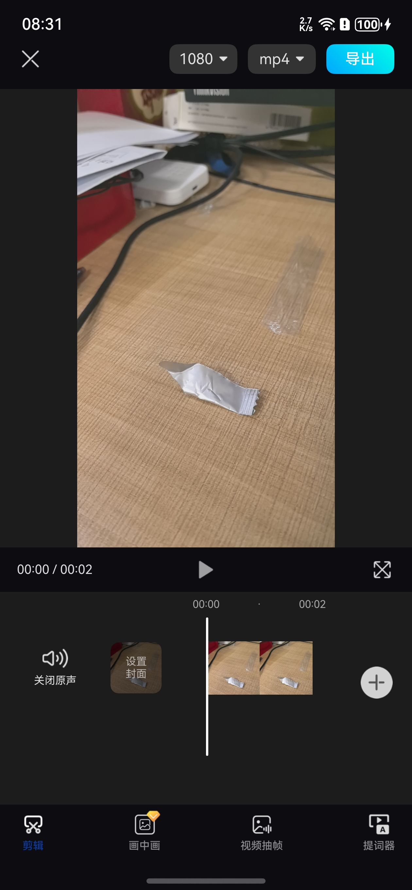 | 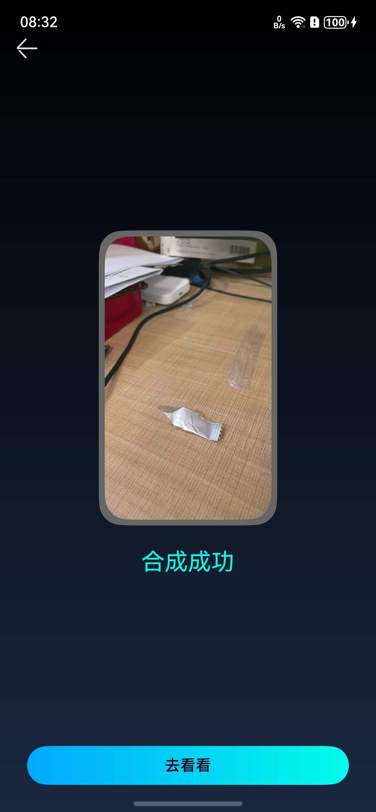 |     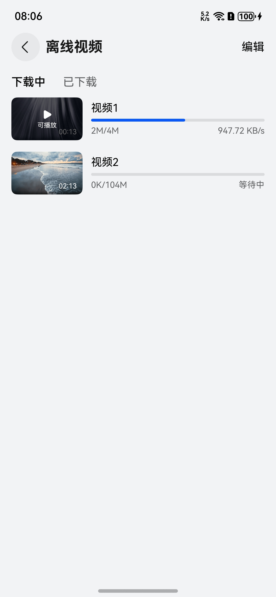      |

### 作品模块

|                             作品列表                              |                           草稿列表                            |                           作品播放                            |
|:-------------------------------------------------------------:|:---------------------------------------------------------:|:---------------------------------------------------------:|
| 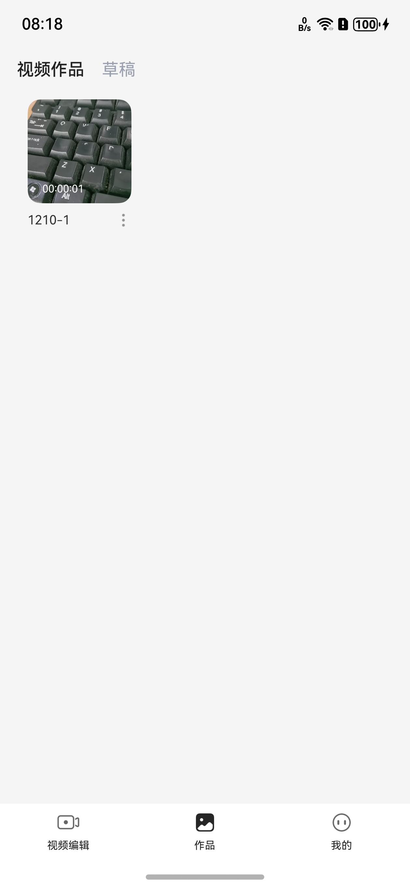 | 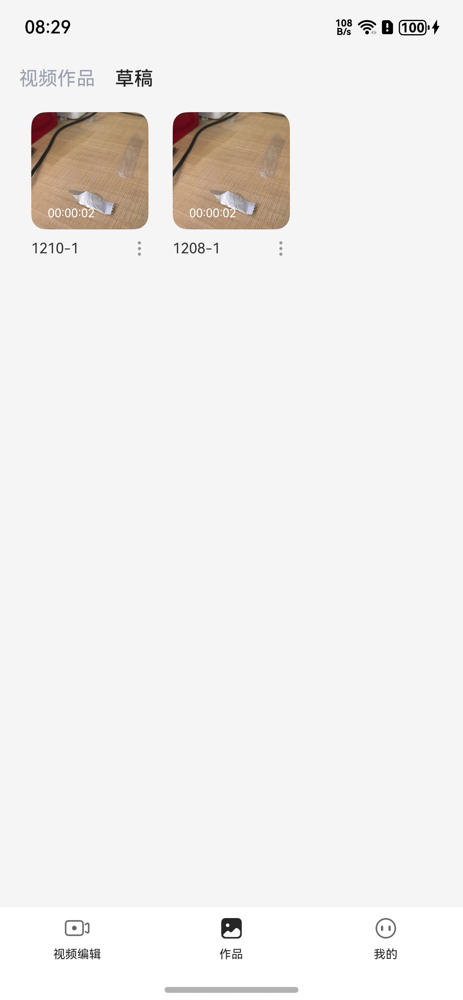 | 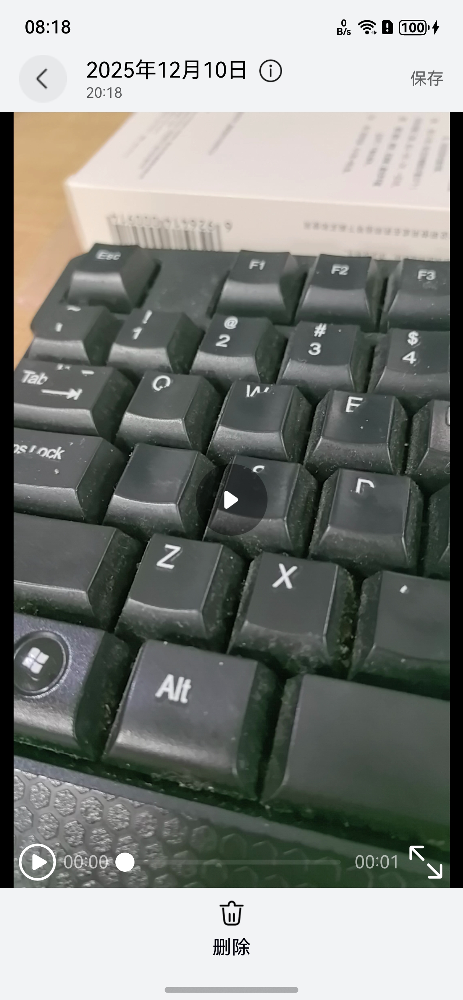 |

### 我的模块

|                               个人信息                                |                              问题反馈                               |                               设置                               |
|:-----------------------------------------------------------------:|:---------------------------------------------------------------:|:--------------------------------------------------------------:|
| 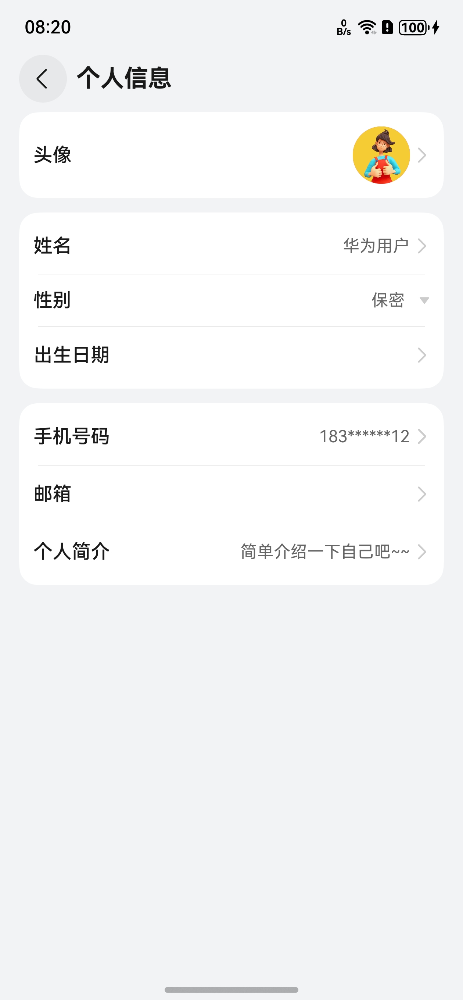 | 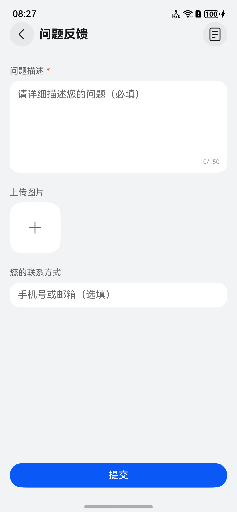 | 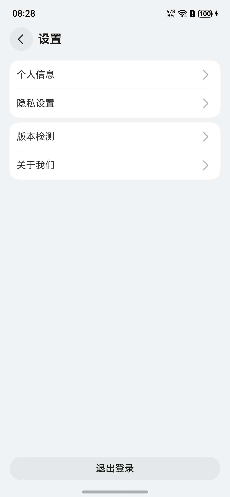 |

## 开源许可协议

该代码经过[Apache 2.0 授权许可](http://www.apache.org/licenses/LICENSE-2.0)。