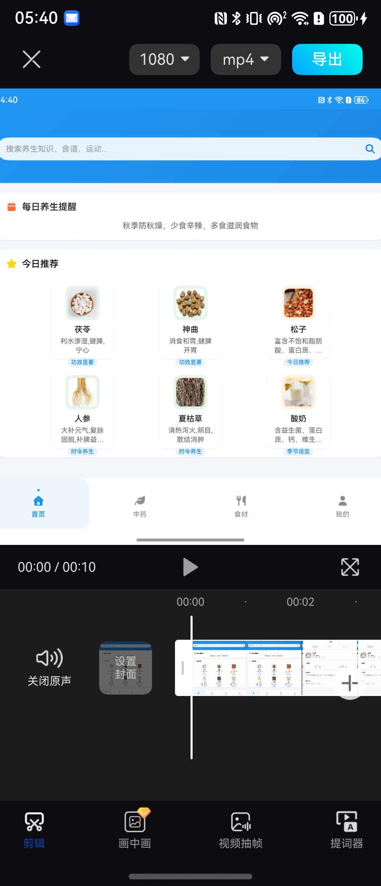
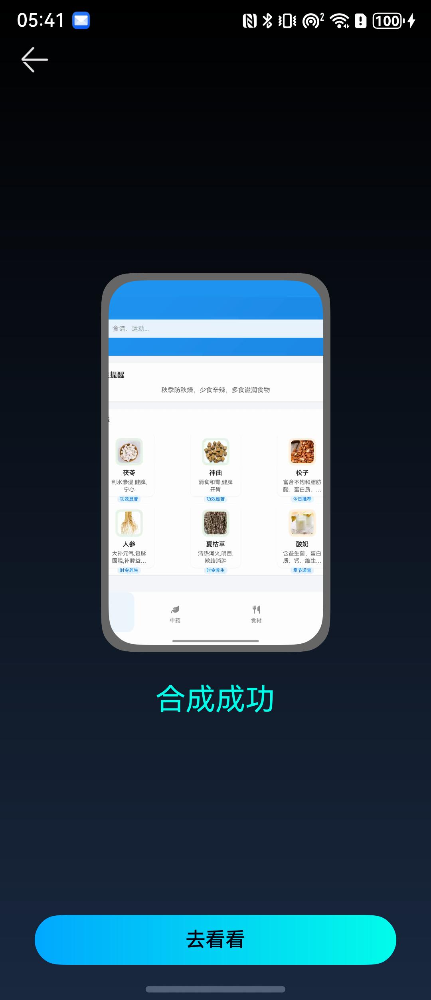

# 视频编辑组件快速入门

## 目录

- [简介](#简介)
- [约束与限制](#约束与限制)
- [使用](#使用)
- [API参考](#API参考)
- [示例代码](#示例代码)

## 简介

本组件提供了完整的视频编辑功能，包括视频裁剪、拼接、画中画、提词器、字幕添加等核心编辑能力，支持视频帧预览、拖动排序、分割、缩放等操作，并提供视频导出功能。

|                        视频编辑页面                         |                          合成编辑                           |
|:-----------------------------------------------------:|:-------------------------------------------------------:|
|  |  |

## 约束与限制

### 环境

- DevEco Studio版本：DevEco Studio 5.0.5 Release及以上
- HarmonyOS SDK版本：HarmonyOS 5.0.5 Release SDK及以上
- 设备类型：华为手机（包括双折叠和阔折叠）
- 系统版本：HarmonyOS 5.0.1(13)及以上

### 权限

- 网络权限：ohos.permission.INTERNET

### 资源依赖

组件内部使用了媒体资源，请确保应用资源目录包含必要的图标资源。

## 使用

1. 安装组件

   如果是在DevEco Studio使用插件集成组件，则无需安装组件，请忽略此步骤。

   如果是从生态市场下载组件，请参考以下步骤安装组件。

   a. 解压下载的组件包，将包中所有文件夹拷贝至您工程根目录的XXX目录下。

   b. 在项目根目录build-profile.json5添加`video_edit`和`video_common`模块。在项目根目录build-profile.json5填写video_edit路径。其中XXX为组件存放的目录名

   ```json
   {
     "modules": [
       {
       "name": "video_edit",
       "srcPath": "./XXX/video_edit"
       },
       {
       "name": "video_common",
       "srcPath": "./XXX/video_common"
       }
     ]
   }
   ```

   c. 在项目根目录oh-package.json5中添加依赖。XXX为组件存放的目录名称

   ```json
   {
     "dependencies": {
       "video_edit": "file:./XXX/video_edit"
     }
   }
   ```
   
   d. 在entry的entry\oh-package.json5添加
   ```
   "dependencies": {
   "@ohos/mp4parser": "2.0.6"
   }
   ```
2. 添加多线程配置文件

   a. 在entry\src\main\ets文件夹下创建名称为“workers”文件夹，在entry\src\main\ets\workers文件夹下创建名称为“FFmPegWorker.ets”文件

   b.在entry\src\main\ets\workers\FFmPegWorker.ets添加

   ```typescript
   import { ErrorEvent, MessageEvents, worker } from '@kit.ArkTS';
   import { MP4Parser } from '@ohos/mp4parser';

   // 创建 worker 线程端口
   const workerPort = worker.workerPort;

   // 使用命名类型，避免内联对象字面量类型
   interface WorkerMsg {
    id: number;
    k: 'ffmpeg' | 'clip' | 'merge';
    cmd?: string;
    start?: string;
    end?: string;
    input?: string;
    output?: string;
    txt?: string;
    out?: string;
   }

   interface WorkerReply {
    id: number;
    code: number;
   }

   // 接收主线程消息（JSON 字符串），解析后执行对应任务
   workerPort.onmessage = (e: MessageEvents): void => {
    let payload: string = e.data;
    let codeToSend = -1;
    try {
        const msg = JSON.parse(payload) as WorkerMsg;
        if (msg.k === 'ffmpeg') {
            const cmd = msg.cmd!;
            MP4Parser.ffmpegCmd(cmd, {
                callBackResult: (code: number) => {
                codeToSend = code;
                const reply: WorkerReply = { id: msg.id, code: codeToSend };
                workerPort.postMessage(JSON.stringify(reply));
                }
            });
            return;
        }
        if (msg.k === 'clip') {
            const start = msg.start!;
            const end = msg.end!;
            const input = msg.input!;
            const output = msg.output!;
            MP4Parser.videoClip(start, end, input, output, {
                callBackResult: (code: number) => {
                    codeToSend = code;
                    const reply: WorkerReply = { id: msg.id, code: codeToSend };
                    workerPort.postMessage(JSON.stringify(reply));
                }
            });
            return;
        }
        if (msg.k === 'merge') {
            const txt = msg.txt!;
            const out = msg.out!;
            MP4Parser.videoMultMerge(txt, out, {
                callBackResult: (code: number) => {
                    codeToSend = code;
                    const reply: WorkerReply = { id: msg.id, code: codeToSend };
                    workerPort.postMessage(JSON.stringify(reply));
                }
            });
            return;
        }
        // 未知任务类型
        const reply: WorkerReply = { id: msg.id, code: codeToSend };
        workerPort.postMessage(JSON.stringify(reply));
    } catch (err) {
        const fallback: WorkerReply = { id: -1, code: codeToSend };
        workerPort.postMessage(JSON.stringify(fallback));
    }
   }      

   // worker 线程错误回调
   workerPort.onerror = (err: ErrorEvent) => {}
   ```
   c. 在项目entry模块下build-profile.json5中添加workers路径配置。

   ```json
   {
       "buildOption": {
           "sourceOption": {
               "workers": [
                   "./src/main/ets/workers/FFmPegWorker.ets"
               ]
           }
       }
   }
   ```

3. 引入组件。

   ```typescript
   import { VideoEditDetailPage, VideoEditDetailVM, ExportVideoPage } from 'video_edit';
   ```

4. 调用组件，详细参数配置说明参见[API参考](#API参考)。

## API参考

### 接口

#### VideoEditDetailPage

VideoEditDetailPage(options?: VideoEditDetailPageOptions)

视频编辑详情页面组件。

**参数：**

| 参数名  | 类型                                                         | 是否必填 | 说明           |
| ------- | ------------------------------------------------------------ | ---- | -------------- |
| options | [VideoEditDetailPageOptions](#VideoEditDetailPageOptions对象说明) | 否   | 视频编辑页面参数 |

#### ExportVideoPage

ExportVideoPage(options?: ExportVideoPageOptions)

视频导出页面组件。

**参数：**

| 参数名  | 类型                                                   | 是否必填 | 说明         |
| ------- | ------------------------------------------------------ | ---- | ------------ |
| options | [ExportVideoPageOptions](#ExportVideoPageOptions对象说明) | 否   | 视频导出参数 |

### VideoEditDetailPageOptions对象说明

| 参数名    | 类型                            | 是否必填 | 说明           |
| --------- |-------------------------------| ---- | -------------- |
| pageParam | [TValueType](#TValueType对象说明) | 否   | 页面参数       |

### TValueType对象说明

| 类型                                                                          | 说明       |
|-----------------------------------------------------------------------------| ---------- |
| string, boolean, number,null,Array<TValueType>,Object,Object[],(() => void) |枚举|

### ExportVideoPageOptions对象说明

| 参数名       | 类型         | 是否必填 | 说明           |
| ------------ | ------------ | ---- | -------------- |
| exportData   | [exportVideo](#exportVideo对象说明)  | 是   | 导出视频数据   |

### exportVideo对象说明

导出视频数据模型。

| 参数名              | 类型                                      | 是否必填 | 说明           |
| ------------------- | ----------------------------------------- | ---- | -------------- |
| videoFormat         | string                                    | 是   | 视频格式       |
| videoResolution     | string                                    | 是   | 视频分辨率     |
| totalDuration       | number                                    | 是   | 总时长         |
| keyFrame            | string                                    | 是   | 关键帧         |
| basicVideoData      | [BasicVideoData](#BasicVideoData对象说明)[] | 是   | 基础视频数据   |
| exportPipVideo      | [exportPipVideo](#exportPipVideo对象说明)[] | 是   | 画中画视频数据 |
| exportSubTitle      | [exportSubTitle](#exportSubTitle对象说明)   | 是   | 字幕数据       |
| isVip               | boolean                                   | 是   | 是否VIP用户    |

### BasicVideoData对象说明

基础视频数据模型。

| 参数名      | 类型                   | 是否必填 | 说明       |
| ----------- |----------------------| ---- |----------|
| basicUrl    | string               | 是   | 视频URL    |
| frameList   | [frameListData](#frameListData)[] | 是   | 帧列表      |
| index       | number               | 是   | 索引       |
| startTime   | number               | 是   | 开始时间     |
| endTime     | number               | 是   | 结束时间     |
| duration    | number               | 是   | 时长       |
| leftShort   | number               | 是   | 左侧手柄移动距离 |
| scroller    | Scroller             | 是   | 滚动控制器    |

### frameListData

| 参数名       | 类型            | 是否必填 | 说明    |
|-----------| -------------- | --- |-------|
| index     | number         | 是   | 序列号   |
| mPixelMap | image.PixelMap | 是   | 图像数据       |
| url       | string         | 是   | 地址URI |

### exportPipVideo对象说明

画中画视频数据模型。

| 参数名      | 类型                   | 是否必填 | 说明           |
| ----------- |----------------------| ---- | -------------- |
| isEdit      | boolean              | 是   | 是否编辑       |
| isShape     | boolean              | 是   | 是否形状       |
| uri         | string               | 是   | 视频URI        |
| pipFrameList| [frameListData](#frameListData)[] | 是   | 帧列表         |
| startTime   | number               | 是   | 开始时间       |
| endTime     | number               | 是   | 结束时间       |
| duration    | number               | 是   | 时长           |
| keyFrame    | image.PixelMap       | 否   | 关键帧         |
| width       | number               | 是   | 宽度           |
| height      | number               | 是   | 高度           |
| offsetX     | number               | 是   | X偏移          |
| offsetY     | number               | 是   | Y偏移          |
| radiusX     | number               | 是   | X半径          |
| radiusY     | number               | 是   | Y半径          |
| srcWidth    | number               | 是   | 源宽度         |
| srcHeight   | number               | 是   | 源高度         |

### exportSubTitle对象说明

字幕数据模型。

| 参数名   | 类型   | 是否必填 | 说明     |
| -------- | ------ | ---- | -------- |
| url      | string | 是   | 字幕URL  |
| text     | string | 是   | 字幕文本 |
| width    | number | 是   | 宽度     |
| height   | number | 是   | 高度     |
| offsetX  | number | 是   | X偏移    |
| offsetY  | number | 是   | Y偏移    |

### VideoEditDetailVM对象说明

视频编辑详情视图模型，提供以下主要属性和方法：

**属性：**

| 属性名              | 类型                                      | 说明               |
| ------------------- | ----------------------------------------- | ------------------ |
| allBasicListDisplay | [BasicVideoData](#BasicVideoData对象说明)[] | 基础视频数据列表   |
| basicDuration       | number                                    | 基础视频总时长     |
| pipDuration         | number                                    | 画中画视频时长     |
| isVip               | boolean                                   | 是否VIP用户        |

**方法：**

| 方法名     | 参数 | 返回值                                      | 说明               |
| ---------- | ---- | ------------------------------------------- | ------------------ |
| instance   | 无   | [VideoEditDetailVM](#VideoEditDetailVM对象说明) | 获取单例实例       |

### 事件

无

## 示例代码

### 示例1（视频编辑页面）

```text
import { photoAccessHelper } from '@kit.MediaLibraryKit';

@Entry
@ComponentV2
struct Index {
  private navPathStack: NavPathStack = new NavPathStack();

  build() {
    Navigation(this.navPathStack) {
      Column() {
        Button('开始编辑视频')
          .onClick(() => {
             let selectedVideoUri: string = ''
             let photoSelectOptions: photoAccessHelper.PhotoSelectOptions =
                new photoAccessHelper.PhotoSelectOptions();
             photoSelectOptions.MIMEType = photoAccessHelper.PhotoViewMIMETypes.VIDEO_TYPE;
             photoSelectOptions.maxSelectNumber = 1;
             let photoViewPicker = new photoAccessHelper.PhotoViewPicker();
             photoViewPicker.select(photoSelectOptions)
                .then(async (photoSelectResult: photoAccessHelper.PhotoSelectResult) => {
                   selectedVideoUri = photoSelectResult.photoUris[0]
                   if (selectedVideoUri !== '' && selectedVideoUri &&
                      photoSelectResult.photoUris.length > 0) {
                      let str = JSON.stringify({ url: selectedVideoUri, isVip: true })
                      this.navPathStack.pushPath({ name: 'VideoEditDetailPage', param: str });
                   }
                })
          })
      }
    }
    .mode(NavigationMode.Stack)
    .hideTitleBar(true)
  }
}
```