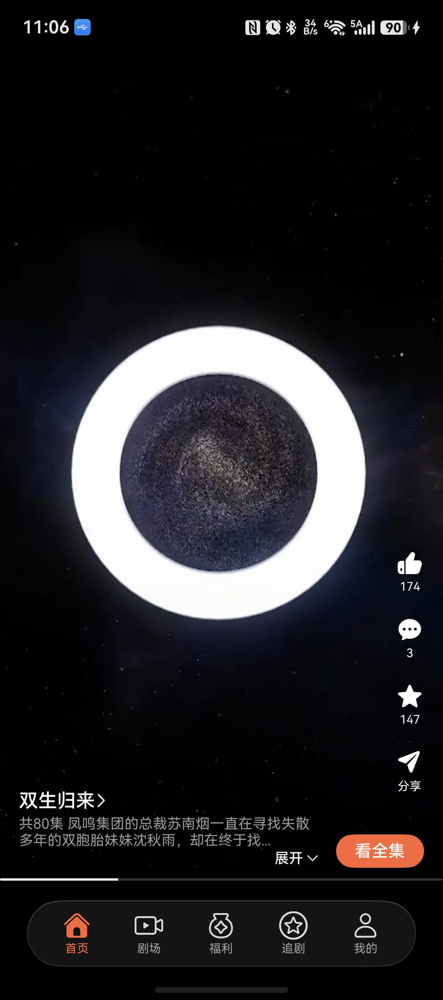
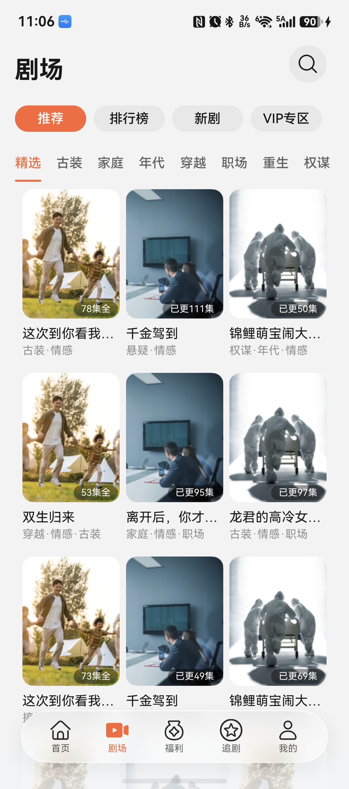
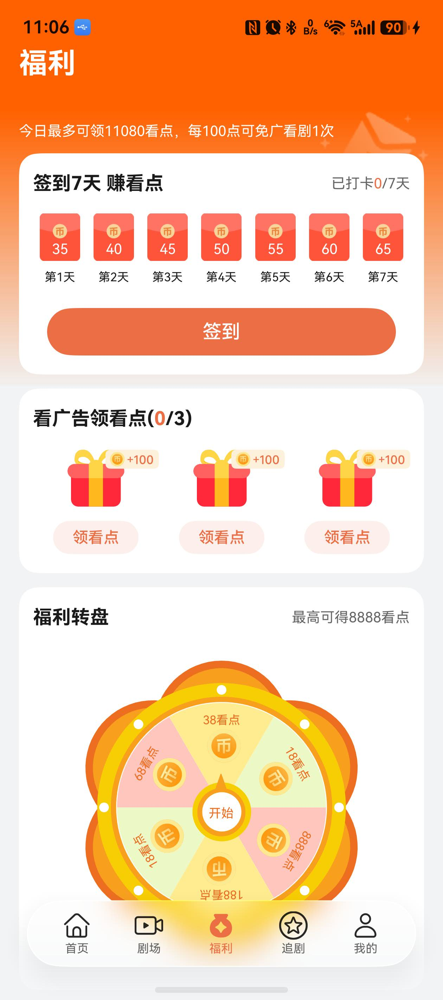
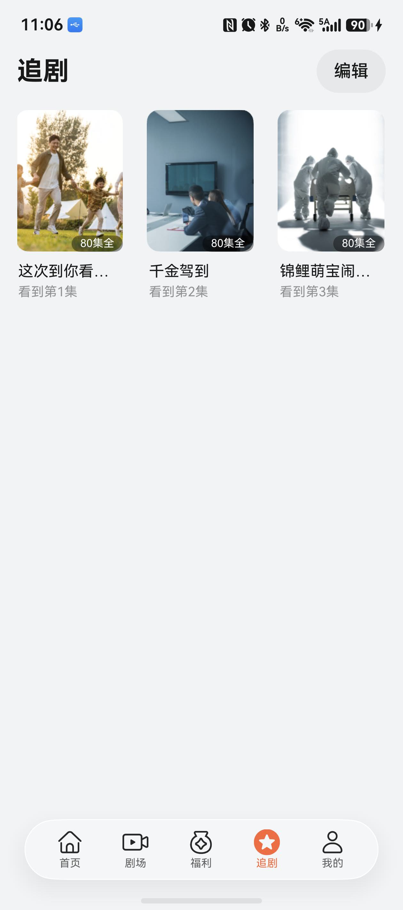
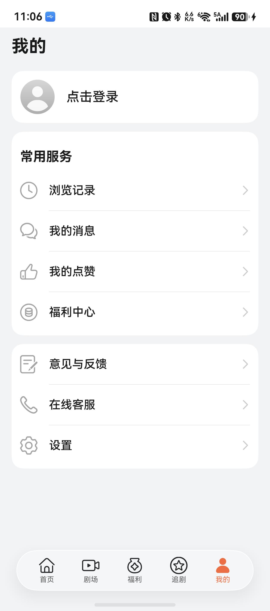
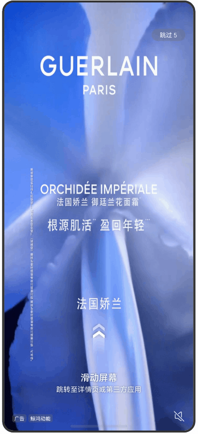

# 影视与直播（微短剧）应用模板快速入门

## 目录

- [功能介绍](#功能介绍)
- [约束和限制](#约束和限制)
- [快速入门](#快速入门)
- [示例效果](#示例效果)
- [开源许可协议](#开源许可协议)

## 功能介绍

您可以基于此模板直接定制应用，也可以挑选此模板中提供的多种组件使用，从而降低您的开发难度，提高您的开发效率。

此模板提供如下组件，所有组件存放在工程根目录的components下，如果您仅需使用组件，可参考对应组件的指导链接；如果您使用此模板，请参考本文档。

| 组件                                  | 描述                                         | 使用指导                                            |
|-------------------------------------|--------------------------------------------|-------------------------------------------------|
| 竖屏滑动视频组件(video_swiper) | 提供滑动视频，视频播放的控制等功能                          | [使用指导](components/video_swiper/README.md)       |
| 投屏组件(module_cast)      | 提供投屏播放控制功能                                 | [使用指导](components/module_cast/README.md)        |
| 福利签到组件(day_signin)     | 提供福利页面的打卡功能                                | [使用指导](components/day_signin/README.md)         |
| 看广告领奖励组件(look_ad)      | 提供看广告领取奖励的功能                               | [使用指导](components/look_ad/README.md)            |
| 日常任务组件(task_list)      | 提供做日常任务的功能                                 | [使用指导](components/task_list/README.md)          |
| 转盘组件(wheel)            | 提供福利转盘的功能                                  | [使用指导](components/wheel/README.md)              |
| 通用登录组件(aggregated_login)   | 支持华为账号一键登录及其他方式登录（微信、手机号登录）                | [使用指导](components/aggregated_login/README.md)   |
| 通用分享组件(aggregated_share)   | 支持分享到微信好友、朋友圈、QQ、微博等方式，支持碰一碰分享、生成海报、系统分享等功能 | [使用指导](components/aggregated_share/README.md)   |
| 通用支付组件(aggregated_payment)      | 支持微信、支付宝、华为支付等多方的支付能力                      | [使用指导](components/aggregated_payment/README.md) |
| 通用问题反馈组件(feedback)            | 支持提交问题反馈、查看反馈记录                            | [使用指导](components/feedback/README.md)           |
| 通用搜索组件(search)      | 提供了搜索功能，包括搜索历史，可选的猜你想搜和热搜榜，搜索联想，搜索结果                                 | [使用指导](components/search/README.md)             |
| 通用会员组件(membership)     | 提供了通过应用内支付实现会员开通的能力（自动续期订阅会员及非续期订阅会员）                               | [使用指导](components/membership/README.md)         |
| 通用拨号组件(dial_panel)      | 提供了拉起拨号面板以及一键拨号的能力                          | [使用指导](components/dial_panel/README.md)         |


本模板为短剧类应用提供了常用功能的开发样例，模板主要分首页、剧场、我的及详情播放页六大模块：

* 首页：提供短剧推荐流功能，按照剧目播放。

* 剧场：提供榜单和优选短剧浏览，支持输入剧名搜索。

* 福利：提供任务，完成任务来获取看点。

* 追剧：用于管理用户收藏的剧集。

* 我的：支持账号的管理和常用服务(设置/观看记录)。

* 详情：沉浸式观看短剧，支持剧集播放常用功能(上下滑切换剧集，选集，社交交互等)

本模板已集成华为账号、推送、预加载、广告、朗读、无障碍屏幕朗读、适老化、深色模式、会员订阅等服务，适配平板和折叠的一多布局、视频悬停态播放，支持不同设备间同步短剧浏览进度，提供剧场页面动态布局能力，只需做少量配置和定制即可快速实现华为账号的登录功能。

| 首页                         | 剧场                         | 福利                         | 追剧                         | 我的                         | 详情                         |
|----------------------------|----------------------------|----------------------------|----------------------------|----------------------------|----------------------------|
|  |  |  |  |  |  |

本模板主要页面及核心功能如下所示：

```ts
短剧模板
 |-- 首页
 |    |-- 简介
 |    |-- 看全集
 |    └-- 自动播放全集
 |-- 剧场
 |    |-- 榜单
 |    |-- 标签分类
 |    └-- 搜索
 |         └-- 历史记录
 |-- 福利
 |    |-- 任务
 |    |-- 抽奖
 |    └-- 签到
 |-- 追剧
 |    |-- 查看收藏
 |    └-- 管理删除
 |-- 我的
 |    |-- 用户信息
 |    |-- 我的追剧
 |    └-- 观看记录
 └-- 详情
      |-- 简介
      |-- 社交信息
      |    |-- 点赞
      |    |-- 分享
      |    |-- 收藏
      |    └-- 评论
      |-- 选集
      |-- 播放设置
      └-- 剧集详情介绍
```

本模板工程代码结构如下所示：

```ts
WebShortDrama
  |- commons                                       // 公共层
  |   |- common                                    // 资源统一管理层
  |   |- server/src/main/ets                       // 无法层
  |   |    |- api                                  // 接口层 
  |   |    |    mock                               // 模拟数据
  |   |    |    Decorators.ts                      // 装饰器
  |   |    |    Domain.ts                          // 域名管理
  |   |    |    RequestAPI.ts                      // 请求API定义
  |   |    |- bean                                 // 后端数据结构定义
  |   |    └- handler                              // 请求handler 
  |   |- styles                                    // 风格统一管理层
  |   |- utils                                     // 工具类层
  |   └- widgets                                   // 基础控件类层
  |
  |- components                                    // 组件   
  |   |- base_apis                                 // 集成能力组件   
  |   |- feedback                                  // 意见反馈组件   
  |   |- aggregated_share                          // 分享组件   
  |   |- open_ads                                  // 广告组件   
  |   |- video_swiper                              // 滑动视频组件     
  |   |- module_cast                               // 视频投屏组件     
  |   └- vip_center                                // 会员中心组件  
  |
  |- EntryCard                                     // 卡片资源     
  |                      
  |- features    
  |   |- award/src/main/ets                         // 福利功能(hsp)
  |   |        |- common                            // 公共组件 
  |   |        |- components                        // 抽离组件   
  |   |        |- constants                         // 常量
  |   |        |- customdialog                      // dialog组件
  |   |        |- model                             // class类型定义     
  |   |        |- pages                                
  |   |        |    AwardMainPage.ets               // 福利页面
  |   |        |- utils                             // 工具组件   
  |   |        └- viewmodel                         // 与页面一一对应的vm层 
  |   | 
  |   |- home/src/main/ets                          // home主页组合(hsp)
  |   |        |- components                        // 抽离组件   
  |   |        |- mapper                            // 接口数据到页面数据类型映射 
  |   |        |- pages                               
  |   |        |    HomeMainPage.ets                // 主页页面
  |   |        └- viewmodel                         // 与页面一一对应的vm层 
  |   | 
  |   |- detail/src/main/ets                        // 详情播放功能(hsp)
  |   |        |- components                        // 抽离组件   
  |   |        |- mapper                            // 接口数据到页面数据类型映射 
  |   |        |- models                            // class类型定义     
  |   |        |- page                                
  |   |        |    ShortDramaDetailPage.ets        // 详情播放页面
  |   |        |- viewdata                          // view组件的数据定义   
  |   |        └- viewmodels                        // 与页面一一对应的vm层 
  |   | 
  |   |- mine/src/main/ets                          // 我的组合(hsp)
  |   |        |- component                         // 抽离组件   
  |   |        └- pages                               
  |   |             ChangePage.ets                  // 信息修改播放页面
  |   |             MineMainPage.ets                // 我的主页页面
  |   |             VIPCenterPage.ets               // 会员中心页面
  |   |             PersonalInfoPage.ets            // 个人信息页面
  |   |             WatchRecordsPage.ets            // 观看记录页面
  |   |             AboutPage.ets                   // 关于我的页面
  |   |             FeedbackPage.ets                // 反馈页面
  |   |             FeedbackRecordPage.ets          // 反馈记录页面
  |   |             LaunchPage.ets                  // 启动页面
  |   |             LaunchAdPage.ets                // 广告页面
  |   |             LikesPage.ets                   // 点赞记录页面
  |   |             MyPreferencesPage.ets           // 首选项页面
  |   |             PrivacyAgreementPage.ets        // 隐私协议页面
  |   |             PrivacyStatementPage.ets        // 隐私声明页面
  |   |             SetupPage.ets                   // 设置页面
  |   | 
  |   |- theater/src/main/ets                       // 剧场组合(hsp)
  |   |        |- components                        // 抽离组件   
  |   |        |- mapper                            // 接口数据到页面数据类型映射 
  |   |        |- pages                               
  |   |        |    BillboardPage.ets               // 排行榜页面
  |   |        |    DramaDetailInfoPage.ets         // 剧集详情信息页面
  |   |        |    SearchPage.ets                  // 搜索页面
  |   |        |    TheaterMainPage.ets             // 剧场入口页面  
  |   |        |- views                             // 视图组件
  |   |        └- viewmodels                        // 与页面一一对应的vm层 
  |   | 
  |   |- favor/src/main/ets                         // 追剧组合(hsp)
  |   |        └- pages                               
  |   |             FavorMainPage.ets               // 追剧页面
  |   | 
  |   |- frame/src/main/ets/view                    // 通用Frame框架(hsp)
  |   |        |- components                        // 抽离组件   
  |   |        └- pages                               
  |   |             MainTabPage.ets                 // 主页Tab容器页面
  |   | 
  |   └- login                                      // 通用登录功能(hsp)
  |   
  └- products/entry                                 // 应用层主包(hap)  
      └-  src/main/ets                                               
           |- entryability                          // Ability入口页面                                       
           |- entryformability                      // 卡片Ability入口页面                                    
           |- pages                              
           |    Index.ets                           // 入口页面  
           └- widget2x2                             // 卡片页面 
```

## 约束和限制

### 环境

- DevEco Studio版本：DevEco Studio 6.1.1 Release及以上
- HarmonyOS SDK版本：HarmonyOS 6.1.1 Release SDK及以上
- 设备类型：华为手机（包括双折叠和阔折叠）和华为平板
- 系统版本：HarmonyOS 6.1.0(23)及以上

### 权限

- 网络权限：ohos.permission.INTERNET
- 后台运行权限：ohos.permission.KEEP_BACKGROUND_RUNNING

### 调试

- 本模板支持模拟器调试。**模拟器调试时，支付功能仅为展示，无功能实现，无法实现开屏广告功能**。
- 本模板支持真机调试，可根据需要进行第三方支付SDK替换。
  
```
修改components\vip_center\oh-package.json5和sdk\aggregated_payment\oh-package.json5中的依赖
"dependencies": {
  "@tencent/wechat_open_sdk": "1.0.7",
  // 支付宝 SDK 官方版本 (当前仅支持真机)
  // "@cashier_alipay/cashiersdk": "15.8.39",
  // 支付宝 SDK 兼容版本 (接口一致，功能无实现，用于确保引入支付组件的应用可以在模拟器正常运行)
  "@cashier_alipay/cashiersdk": "./libs/swallow_alipay_sdk"
}
```

### 使用约束
1. 跨设备同步短剧浏览进度，使用约束如下，详细参考：[应用接续开发指导](https://developer.huawei.com/consumer/cn/doc/harmonyos-guides/app-continuation-guide#section17575828642)
   -  双端设备需要登录同一华为账号
   -  双端设备需要打开 WLAN 和蓝牙开关，或者在设置中的“多设备协同 > 高级”中启用“多设备协同增强服务”功能
   -  双端设备需要在“设置”应用中开启“多设备协同 > 接续”功能
   -  双端设备都需要安装该应用

2. 碰一碰分享，使用约束如下，详细参考：[手机与手机碰一碰分享](https://developer.huawei.com/consumer/cn/doc/harmonyos-guides/knock-share-between-phones-overview#section184317615456)
   - 任意一端设备不支持碰一碰能力时，轻碰无任何响应

3. 使用隔空传送功能前，需要先打开隔空传送开关，开启路径：设置 > 系统 > 快捷启动和手势 > 隔空传送。详细参考：[打开设备侧隔空传送开关](https://developer.huawei.com/consumer/cn/doc/harmonyos-guides/gestures-share-open)

4. 暂不支持模拟器的功能：小艺朗读、隔空传送

## 快速入门

### 配置工程

在运行此模板前，需要完成以下配置：

1. 在AppGallery Connect创建应用，将包名配置到模板中。

   a. 参考[创建HarmonyOS应用](https://developer.huawei.com/consumer/cn/doc/app/agc-help-create-app-0000002247955506)为应用创建APP ID，并将APP ID与应用进行关联。
   
   b. 返回应用列表页面，查看应用的包名。

   c. 将模板工程根目录下AppScope/app.json5文件中的bundleName替换为创建应用的包名。

2. 配置华为账号服务。

   a. 将应用的client
   ID配置到products/entry/src/main路径下的module.json5文件中，详细参考：[配置Client ID](https://developer.huawei.com/consumer/cn/doc/harmonyos-guides/account-client-id)。

   b. 申请华为账号一键登录所需的quickLoginMobilePhone权限，详细参考：[配置scope权限](https://developer.huawei.com/consumer/cn/doc/harmonyos-guides/account-config-permissions)。

3. 配置应用内支付服务。

   a. 您需[开通商户服务](https://developer.huawei.com/consumer/cn/doc/start/merchant-service-0000001053025967)才能开启应用内购买服务。商户服务里配置的银行卡账号、币种，用于接收华为分成收益。

   b. 使用应用内购买服务前，需要打开应用内购买服务(HarmonyOS NEXT) 开关，此开关是应用级别的，即所有使用IAP Kit功能的应用均需执行此步骤，详情请参考[打开应用内购买服务API开关](https://developer.huawei.com/consumer/cn/doc/app/switch-0000001958955097)。

   c. 开启应用内购买服务(HarmonyOS NEXT) 开关后，开发者需进一步激活应用内购买服务 (HarmonyOS NEXT)，具体请参见[激活服务和配置事件通知](https://developer.huawei.com/consumer/cn/doc/app/parameters-0000001931995692)。

4. （可选）用户购买商品后，IAP服务器会在订单（消耗型/非消耗型商品）和订阅场景的某些关键事件发生时发送通知至开发者配置的订单/订阅通知接收地址，您可以根据关键事件的通知进行服务端的开发，详情请参考[激活服务和配置事件通知](https://developer.huawei.com/consumer/cn/doc/app/parameters-0000001931995692)。

5. 配置商品信息，详情请参考[配置商品信息](https://developer.huawei.com/consumer/cn/doc/harmonyos-guides/iap-config-product)。

6. 配置预加载服务。

   a. [开通预加载](https://developer.huawei.com/consumer/cn/doc/harmonyos-guides/cloudfoundation-enable-prefetch)。

   b. [开通云函数](https://developer.huawei.com/consumer/cn/doc/harmonyos-guides/cloudfoundation-enable-function)。

   c. 打包云函数包：进入工程preload目录，将目录下的文件压缩为zip文件，注意进入文件夹中，全选文件，右击压缩。

   d. [创建云函数](https://developer.huawei.com/consumer/cn/doc/harmonyos-guides/cloudfoundation-create-and-config-function)。

   * “函数名称”为“preload”
   * “触发方式”为“事件调用”
   * “触发器类型”为“HTTP触发器”，其他保持默认
   * “代码输入类型”为“*.zip文件”，代码文件上传上一步打包的zip文件

    

   e. [配置安装预加载](https://developer.huawei.com/consumer/cn/doc/harmonyos-guides/cloudfoundation-prefetch-config)

   安装预加载函数名称配置为上一步创建的云函数

    

7. 配置推送服务。

   a. [开启推送服务](https://developer.huawei.com/consumer/cn/doc/harmonyos-guides/push-config-setting)。

   b. 按照需要的权益[申请通知消息自分类权益](https://developer.huawei.com/consumer/cn/doc/harmonyos-guides/push-apply-right)。

   c. [端云调试](https://developer.huawei.com/consumer/cn/doc/harmonyos-guides/push-server)。

8. 配置App Linking服务。

   a. [开通App Linking服务](https://developer.huawei.com/consumer/cn/doc/harmonyos-guides/applinking-enable-applinking)

   b. [在开发者网站上关联应用](https://developer.huawei.com/consumer/cn/doc/harmonyos-guides/app-linking-startupapp#section6903241628)

   c. [在AGC为应用创建关联的网址域名](https://developer.huawei.com/consumer/cn/doc/harmonyos-guides/app-linking-startupapp#section1101111611317)

   d. 在products/phone/src/main路径下的module.json5中配置关联的网址域名，详细参考：[在module.json5中配置关联的网址域名](https://developer.huawei.com/consumer/cn/doc/harmonyos-guides/app-linking-startupapp#section13808113610362)

   e. 在products/phone/src/main/ets/common/WantUtils.ets#WantUtils.handleAppLinkingWant方法中处理传入的链接，详细参考：[处理传入的链接](https://developer.huawei.com/consumer/cn/doc/harmonyos-guides/app-linking-startupapp#section1620481746)

9. 配置广告服务。

   a. 如果仅调测广告，可使用测试广告位ID：开屏广告：testd7c5cewoj6。

   b. 申请正式的广告位ID。登录[鲸鸿动能媒体服务平台](https://developer.huawei.com/consumer/cn/service/ads/publisher/html/index.html?lang=zh)进行申请，具体操作详情请参见[展示位创建](https://developer.huawei.com/consumer/cn/doc/distribution/monetize/zhanshiweichuangjian-0000001132700049)。

10. 对应用进行[手工签名](https://developer.huawei.com/consumer/cn/doc/harmonyos-guides/ide-signing#section297715173233)。

11. 添加手工签名所用证书对应的公钥指纹。详细参考：[配置应用签名证书指纹](https://developer.huawei.com/consumer/cn/doc/app/agc-help-cert-fingerprint-0000002278002933)

### 运行调试工程

1. 连接调试手机和PC。

2. 菜单选择“Run > Run 'entry' ”或者“Run > Debug 'entry' ”，运行或调试模板工程。

## 示例效果



## 开源许可协议

该代码经过[Apache 2.0 授权许可](http://www.apache.org/licenses/LICENSE-2.0)。
