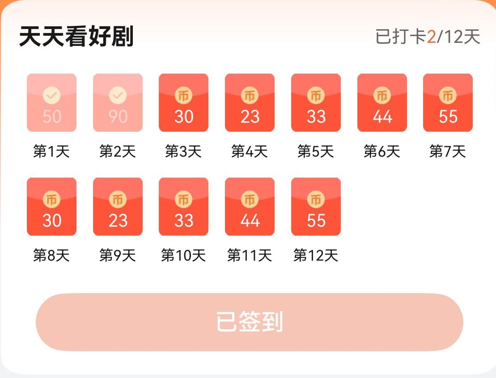

# 福利签到组件快速入门

## 目录

- [简介](#简介)
- [约束与限制](#约束与限制)
- [使用](#使用)
- [API参考](#API参考)
- [示例代码](#示例代码)

## 简介

本组件提供了福利页面的打卡功能，**其中打卡获取金币数据均为mock数据，实际开发中可以做借鉴使用**。



## 约束与限制

### 环境

* DevEco Studio版本：DevEco Studio 5.0.0 Release及以上
* HarmonyOS SDK版本：HarmonyOS 5.0.0 Release SDK及以上
* 设备类型：华为手机（包括双折叠和阔折叠）、平板
* 系统版本：HarmonyOS 5.0.0(12)及以上

### 权限

无

## 使用

1. 安装组件。

   如果是在DevEco Studio使用插件集成组件，则无需安装组件，请忽略此步骤。

   如果是从生态市场下载组件，请参考以下步骤安装组件。

   a. 解压下载的组件包，将包中所有文件夹拷贝至您工程根目录的XXX目录下。

   b. 在项目根目录build-profile.json5添加day_signin模块。

   ```
    // 在项目根目录build-profile.json5填写day_signin路径。其中XXX为组件存放的目录名
    "modules": [
        {
        "name": "day_signin",
        "srcPath": "./XXX/day_signin",
        }
    ]
   ```
   c. 在项目根目录oh-package.json5中添加依赖。
   ```
    // XXX为组件存放的目录名称
    "dependencies": {
      "day_signin": "file:./XXX/day_signin"
    }
   ```

2. 引入组件。

   ```
   import { DaySignIn } from 'day_signin';
   ```

3. 调用组件，详细参数配置说明参见[API参考](#API参考)。

   ```
   import { DaySignIn } from 'day_signin'
   
   @Entry
   @ComponentV2
   struct Index {
   
     build() {
       Column() {
         DaySignIn({
                title : "天天看好剧",
                coinArray : [50,90,30,23,33,44,55,30,23,33,44,55]
         })
       }
     }
   }
   ```

## API参考

### 子组件

无

### 接口

DaySignIn(options?: DaySignInOptions)

福利签到组件

**参数：**

| 参数名     | 类型                                        | 是否必填 | 说明     |
|---------|-------------------------------------------|------|--------|
| options | [DaySignInOptions](#DaySignInOptions对象说明) | 否    | 福利签到组件 |

### DaySignInOptions对象说明

| 名称            | 类型                                   | 是否必填 | 说明                           |
|:--------------|:-------------------------------------|----|------------------------------|
| title         | ResourceStr                          | 否  | 活动名称                         |
| coinArray     | number[]                             | 否  | 活动周期每日获取金币数                  |
| onSignSuccess | (day: number, balance: number)=>void | 否  | 定义回调函数，day为签到天数，balance为金币奖励 |
| isLogin       | boolean                              | 否  | 登录状态                         |
| loginFunc     | ()=>void                             | 否  | 定义登录函数                       |

## 示例代码

```
import { DaySignIn } from 'day_signin'
   
   @Entry
   @ComponentV2
   struct Index {
     bonus: number = 0
     
     build() {
       Column() {
         DaySignIn({
                title: "天天看好剧",
                coinArray: [50, 90, 30, 23, 33, 44, 55, 30, 23, 33, 44, 55],
                onSignSuccess: (day: number, balance: number) => this.bonus += balance
              })
       }
     }
   }
```