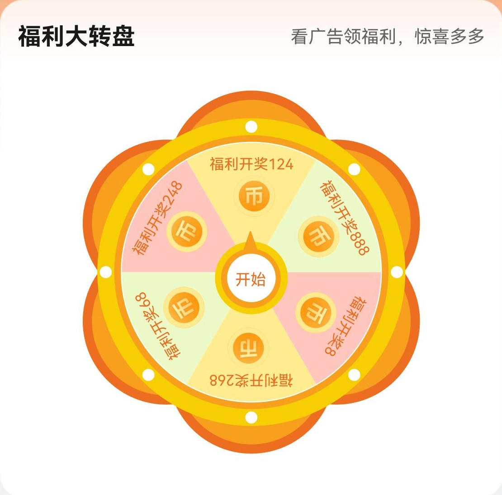

# 转盘组件快速入门

## 目录

- [简介](#简介)
- [约束与限制](#约束与限制)
- [使用](#使用)
- [API参考](#API参考)
- [示例代码](#示例代码)

## 简介

本组件提供了通过转盘获取奖励的功能。



## 约束与限制
### 环境

* DevEco Studio版本：DevEco Studio 5.0.0 Release及以上
* HarmonyOS SDK版本：HarmonyOS 5.0.0 Release SDK及以上
* 设备类型：华为手机（包括双折叠和阔折叠）、平板
* 系统版本：HarmonyOS 5.0.0(12)及以上

### 权限

无

## 使用

1. 安装组件。

   如果是在DevEco Studio使用插件集成组件，则无需安装组件，请忽略此步骤。

   如果是从生态市场下载组件，请参考以下步骤安装组件。

   a. 解压下载的组件包，将包中所有文件夹拷贝至您工程根目录的XXX目录下。

   b. 在项目根目录build-profile.json5添加wheel模块。

   ```
    // 在项目根目录build-profile.json5填写wheel路径。其中XXX为组件存放的目录名
    "modules": [
        {
        "name": "wheel",
        "srcPath": "./XXX/wheel",
        }
    ]
   ```
   c. 在项目根目录oh-package.json5中添加依赖。
    ```
    // XXX为组件存放的目录名称
    "dependencies": {
      "wheel": "file:./XXX/wheel"
    }
    ```

2. 引入组件。

   ```
   import { Wheel } from 'wheel';
   ```

3. 调用组件，详细参数配置说明参见[API参考](#API参考)。

   ```
   import { Wheel } from 'wheel';
   
   @Entry
   @ComponentV2
   struct Index {
   
     build() {
       Column() {
         Wheel({
                textCOIN: ["福利开奖888", "福利开奖124", "福利开奖248", "福利开奖68", "福利开奖268", "福利开奖8"],
                title: "福利大转盘",
                subTitle: "看广告领福利，惊喜多多"
              })
       }
     }
   }
   ```

## API参考

### 子组件

无

### 接口

Wheel(options?: WheelOptions)

转盘组件

**参数：**

| 参数名  | 类型                                          | 是否必填 | 说明   |
| ------- | --------------------------------------------- | ---- |------|
| options | [WheelOptions](#WheelOptions对象说明) | 否   | 转盘组件 |

### WheelOptions对象说明

| 名称       | 类型                                  | 是否必填 | 说明                     |
| :--------- |:------------------------------------| ---- |------------------------|
| textCOIN | string[]                            | 否   | 转盘奖项                   |
| title | string                              | 否   | 活动名称                   |
| subTitle | string                              | 否   | 活动提示                   |
| onWheelSuccess | (balance:number)=>void              | 否   | 定义回调函数，balance为转盘获得金币数 |
| isLogin       | boolean                             | 否  | 登录状态                         |
| loginFunc     | ()=>void                            | 否  | 定义登录函数                       |

## 示例代码
```
import { Wheel } from 'wheel';
   
   @Entry
   @ComponentV2
   struct Index {
     bonus: number = 0
   
     build() {
       Column() {
         Wheel({
                textCOIN: ["福利开奖888", "福利开奖124", "福利开奖248", "福利开奖68", "福利开奖268", "福利开奖8"],
                title: "福利大转盘",
                subTitle: "看广告领福利，惊喜多多",
                onWheelSuccess: (balance: number) => this.bonus += balance
              })
       }
     }
   }
```
