# 航空出行模板

## 目录

- [功能介绍](#功能介绍)
- [环境要求](#环境要求)
- [快速入门](#快速入门)
- [示例效果](#示例效果)
- [权限要求](#权限要求)
- [开源许可协议](#开源许可协议)

## 功能介绍

本模板为航空出行元服务提供了常用功能的开发样例，模板主要分首页、行程、航班动态、和我的四大模块：

* 首页：提供单程机票预订，乘机、行李托运、改签、退票等操作指引。

* 行程：展示待出行和已结束的行程列表。

* 航班动态：支持根据起降地和航班号查询航班信息。

* 我的：展示个人信息、订单中心，常用乘机人、客服中心、设置等功能。

本模板已集成华为账号、定位等服务，只需做少量配置和定制即可快速实现华为账号的登录、位置定位等功能，从而快速完成相关功能的实现。

| 首页                                | 行程                                   | 航班动态                               | 我的                             |
|-----------------------------------|--------------------------------------|------------------------------------|--------------------------------|
| 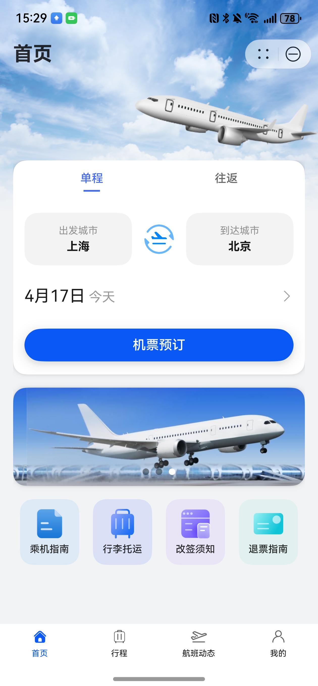     | 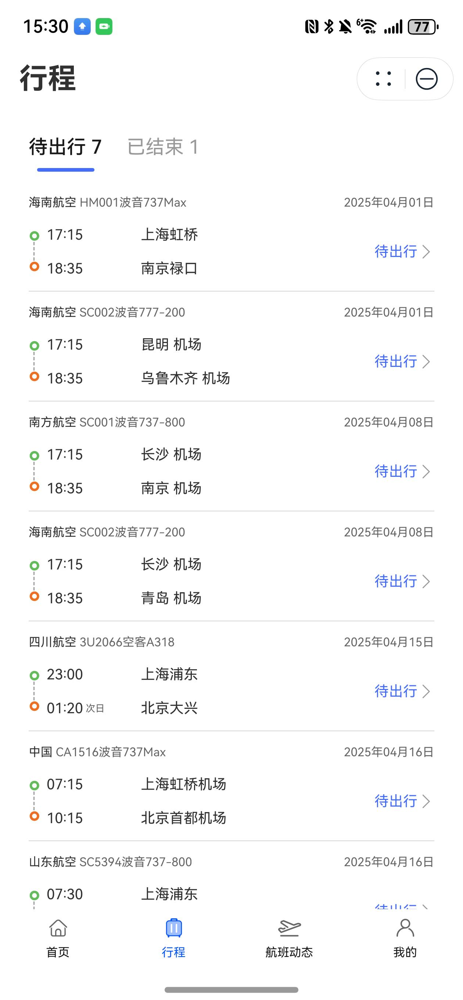   | 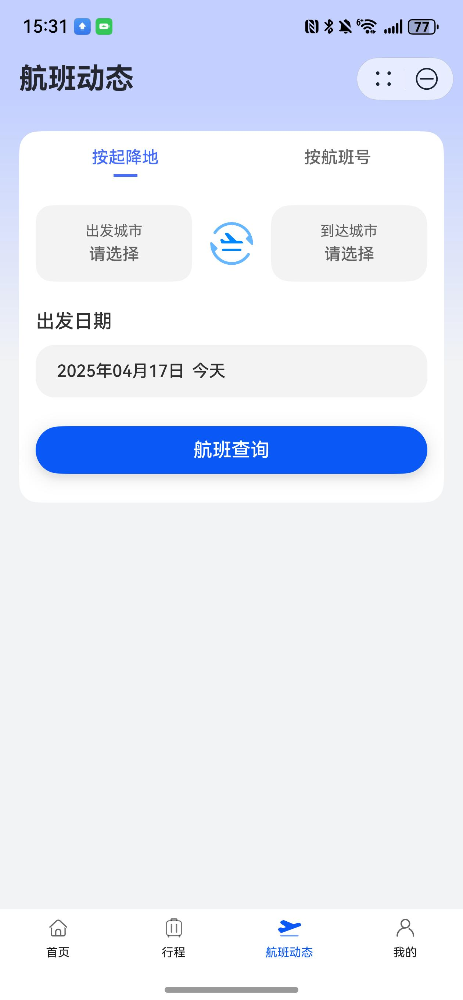  | 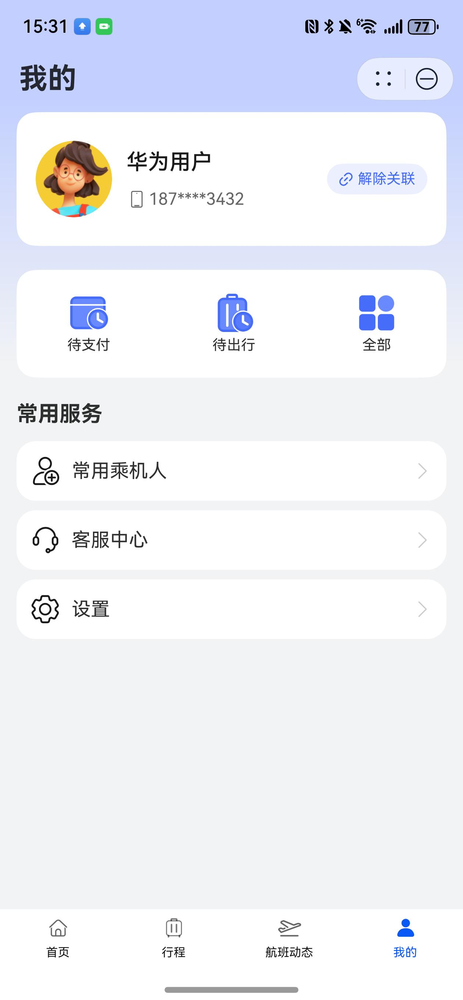  |

本模板主要页面及核心功能如下所示：

```ts
航空出行模板
 |-- 首页
 |    |-- 单程
 |          |-- 出发城市
 |          |-- 到达城市
 |          |-- 出发日期
 |    |-- 机票预订
 |          |-- 航班查询
 |                 |-- 舱位选择
 |                        |-- 确认订单、提交订单、支付订单
 |    |-- banner活动查询
 |    |-- 乘机指南
 |    |-- 行李托运
 |    |-- 改签须知
 |    |-- 退票指南
 |
 |-- 行程
 |    |-- 个人行程查询
 |          |-- 待出行的行程
 |          |-- 已结束的行程
 |-- 航班动态
 |    |-- 按起降地查询航班
 |    |-- 按航班号查询航班
 └-- 我的
      |-- 用户信息
      |     |-- 个人信息
      |     └-- 编辑资料
      |-- 订单中心
      |     |-- 待支付
      |     |-- 待出行
      |     |-- 全部
      |-- 常用乘机人
            |-- 新增、编辑乘机人
      └-- 客服中心
      └-- 设置
            └-- 隐私政策
```

本模板工程代码结构如下所示：

```ts
├──commons
│   ├──common                                // 公共能力层
│     ├──src/main/ets                        // 基础能力
│     │  ├──apis                             // 云函数请求接口
│     │  └──components                       // 公共组件
│     │  └──constants                        // 公共常量
│     │  └──customCalendar                   // 自定义日期选择组件
│     │  └──model                            // 数据结构
│     │  └──pages                            // 共用页面
│     │  └──utils                            // 公共方法
│     └──Index.ets                           // 对外接口类
├──feature                                   // 基础特性层
│  ├──flight/src/main/ets                    // 航班模块（包含航班选择、舱位选择、航班动态）
│  │  ├──api      
│  │  ├──model    
│  │  ├──pages                               // 航班模块入口 
│  ├──flight/src/main/resources              // 资源文件目录
│  ├──flight/Index.ets                       // 对外接口类
|  |
│  ├──home/src/main/ets                      // 首页模块
│  │  ├──model    
│  │  ├──pages                               // 首页入口
│  ├──home/src/main/resources                // 资源文件目录
│  ├──home/Index.ets                         // 对外接口类
|  |
│  ├──itinerary/src/main/ets                 // 行程模块
│  │  ├──api      
│  │  ├──components                          // 组件
│  │  ├──model
│  │  ├──pages                               // 行程入口页
│  ├──itinerary/Index.ets                    // 对外接口类
|  |
│  ├──mine/src/main/ets                      // 我的（包含一键登录）
│  │  ├──components                          // 组件
│  │  ├──model
│  │  ├──pages                               // 我的入口页
│  ├──mine/src/main/resources                // 资源文件目录
│  ├──mine/Index.ets                         // 对外接口类
└──products                                  // 产品定制层
   ├──phone/src/main/ets
   │  ├──dataModel                           // index入口的数据
   │  ├──entryability                        // 主入口生命周期（包含预加载） 
   │  └──pages                               // app主入口 
   └──phone/src/main/resources               // 资源文件目录
```

## 环境要求

### 软件

* DevEco Studio版本：DevEco Studio 5.0.3 Release及以上
* HarmonyOS SDK版本：HarmonyOS 5.0.3 Release SDK及以上

### 硬件

* 设备类型：华为手机（直板机）
* HarmonyOS版本：HarmonyOS 5.0.3 Release及以上

## 快速入门

### 配置工程

在运行此模板前，需要完成以下配置：

1. 在DevEco Studio中打开此模板。

2. 在AppGallery Connect创建元服务，将包名配置到模板中。

   a. 参考[创建元服务](https://developer.huawei.com/consumer/cn/doc/app/agc-help-createharmonyapp-0000001945392297)为元服务创建APPID，并进行关联。

   b. 返回应用列表页面，查看元服务的包名。

   c. 将Application/AppScope/app.json5文件中的bundleName替换为创建元服务的包名。

3. 配置签名。

   a. 为元服务进行[手工签名](https://developer.huawei.com/consumer/cn/doc/harmonyos-guides/ide-signing)。

   b. 添加公钥指纹，详细参考：[配置应用证书指纹](https://developer.huawei.com/consumer/cn/doc/app/agc-help-signature-info-0000001628566748#section5181019153511)。

4. 本模板是端云一体模版，采用云函数接口的方式mock请求数据，所以需要部署云函数以及云数据库。

   a. [开通元函数服务](https://developer.huawei.com/consumer/cn/doc/harmonyos-guides/cloudfoundation-enable-function)和[开通云数据库服务](https://developer.huawei.com/consumer/cn/doc/harmonyos-guides/cloudfoundation-enable-database)。

   b. 在CloudProgram/cloud-config.json文件中配置相关信息，依次填写当前项目的appId、appName、projectId、teamId、projectName，相关信息查询参考[查看应用基本信息](https://developer.huawei.com/consumer/cn/doc/app/agc-help-appinfo-0000001100014694)。
   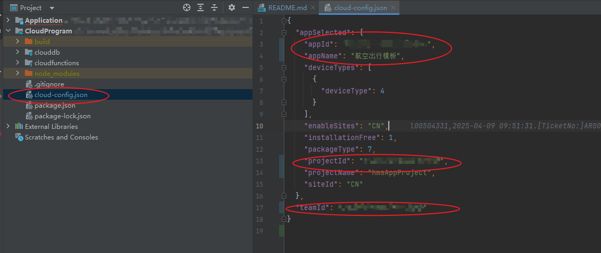
   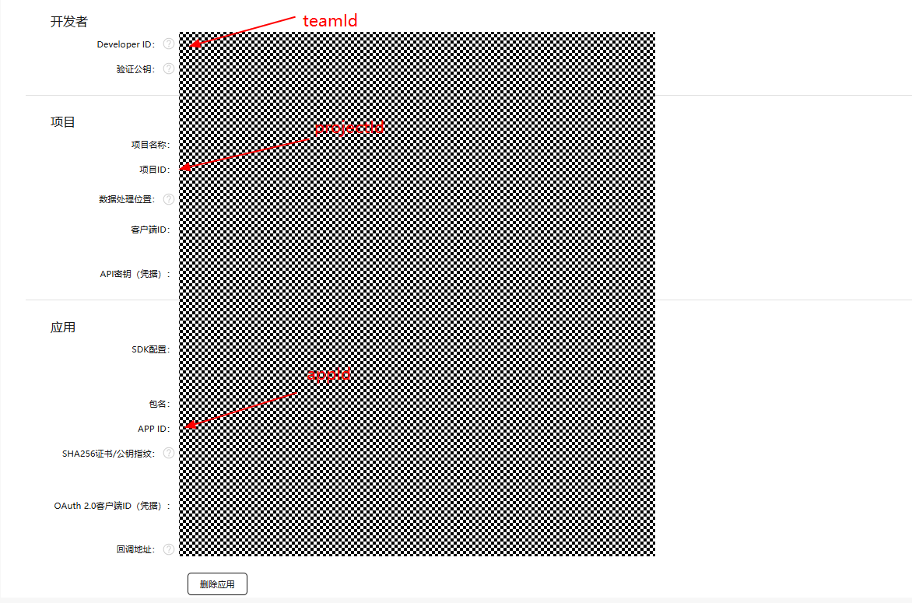

   c.  部署云数据库。右击clouddb选择“deploy Cloud db”进行部署，部署成功之后可以在AGC上查看数据库状态。
   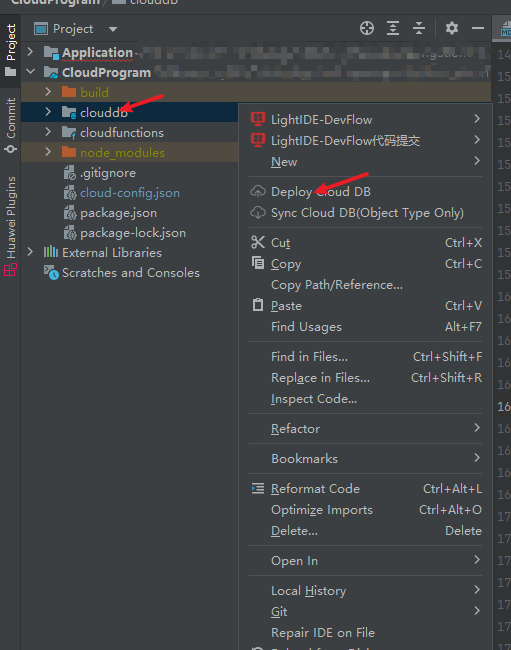
   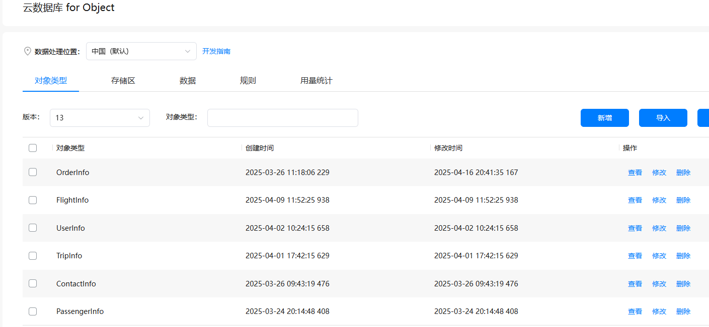

   d. 部署云函数。右击air-trip-service，点击Deploy 'air-trip-service' 部署云函数，类似操作部署app-resource-service。
   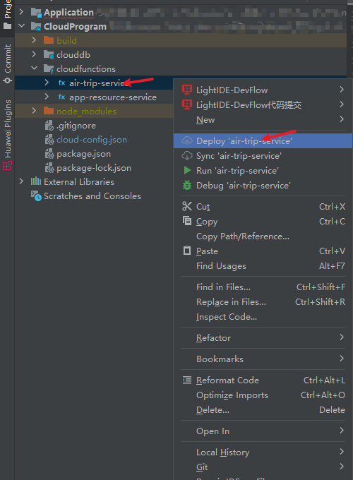

   e. 云函数部署成功，可以在AGC上查看相关记录。
   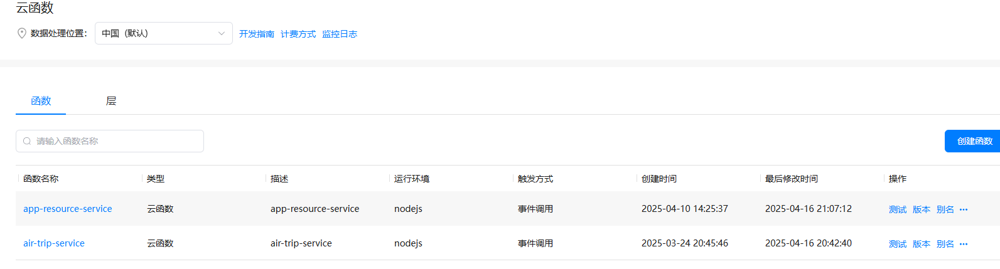
5. 配置预加载。

   a. [开通预加载服务](https://developer.huawei.com/consumer/cn/doc/AppGallery-connect-Guides/agc-preload-enable-0000001834523102)。

   b. 为预加载绑定签名部署的云函数app-resource-service。
   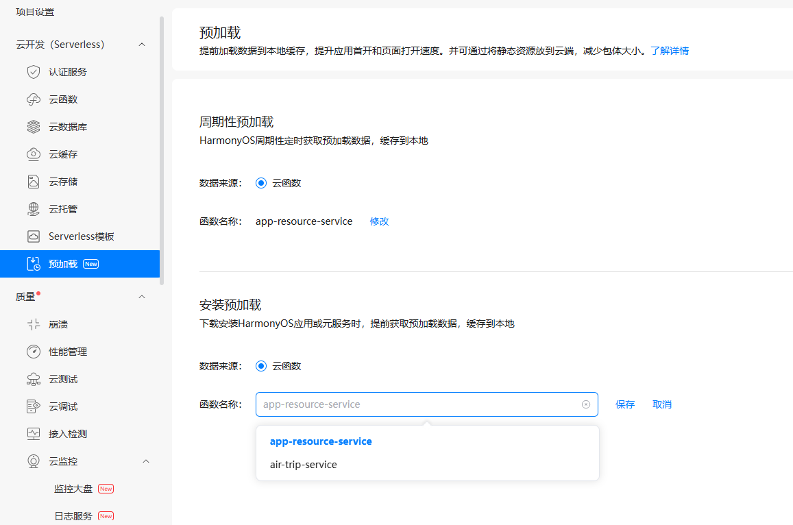

6. 配置华为账号服务。

   a. 将元服务的client ID配置到Application/product/phone模块的module.json5文件，详细参考：[配置Client ID](https://developer.huawei.com/consumer/cn/doc/atomic-guides/account-atomic-client-id)。

   b. 添加公钥指纹，详细参考：[配置应用证书指纹](https://developer.huawei.com/consumer/cn/doc/app/agc-help-signature-info-0000001628566748#section5181019153511)。

   c. 如需获取用户真实手机号，需要申请phone权限，详细参考：[配置scope权限](https://developer.huawei.com/consumer/cn/doc/atomic-guides/account-guide-atomic-permissions)，并在端侧使用快速验证手机号码Button进行[验证获取手机号码](https://developer.huawei.com/consumer/cn/doc/atomic-guides/account-guide-atomic-get-phonenumber)。

7. 为元服务[配置服务器域名](https://developer.huawei.com/consumer/cn/doc/atomic-guides/agc-help-harmonyos-server-domain)，配置httpRequest合法域名即可。


### 运行调试工程

1. 连接调试手机和PC。

2. 对元服务[手工签名](https://developer.huawei.com/consumer/cn/doc/harmonyos-guides/ide-signing#section297715173233)。

3. 菜单选择“Run > Run 'phone' ”或者“Run > Debug 'phone' ”，运行或调试模板工程。

## 示例效果

1. [首页](https://agc-storage-drcn.platform.dbankcloud.cn/v0/default-bucket-o7oax/1.mp4?token=72769894-adb4-4366-8c92-7abf13f8c18b)

2. [行程](https://agc-storage-drcn.platform.dbankcloud.cn/v0/default-bucket-o7oax/2.mp4?token=37fe1066-17be-42fb-87f0-99656a697bd9)

3. [航班动态](https://agc-storage-drcn.platform.dbankcloud.cn/v0/default-bucket-o7oax/3.mp4?token=e180aa35-fb42-4abe-8ec6-99fb511fc6d4)

4. [我的](https://agc-storage-drcn.platform.dbankcloud.cn/v0/default-bucket-o7oax/4.mp4?token=1242ff11-000c-4783-bf71-b7d1d7f5308b)


## 权限要求

* 获取位置权限：ohos.permission.LOCATION、ohos.permission.APPROXIMATELY_LOCATION
* 网络权限：ohos.permission.INTERNET

## 开源许可协议

该代码经过[Apache 2.0 授权许可](http://www.apache.org/licenses/LICENSE-2.0)。
