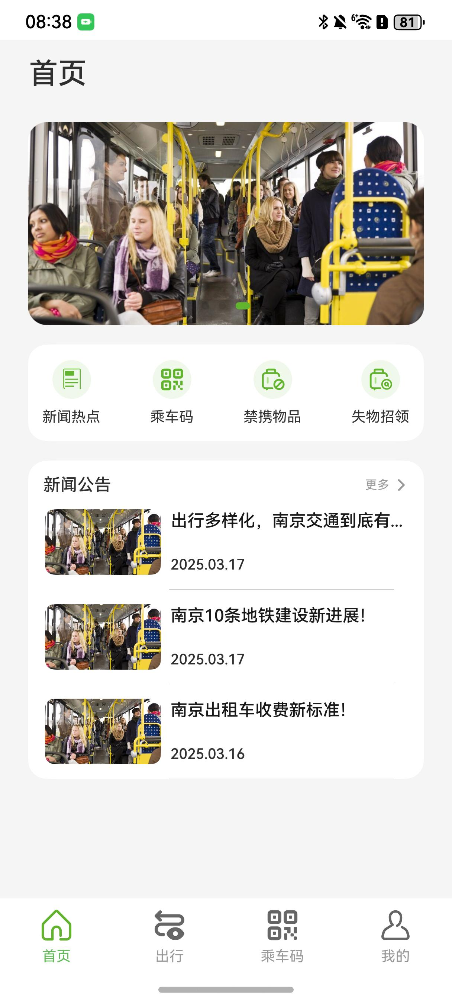
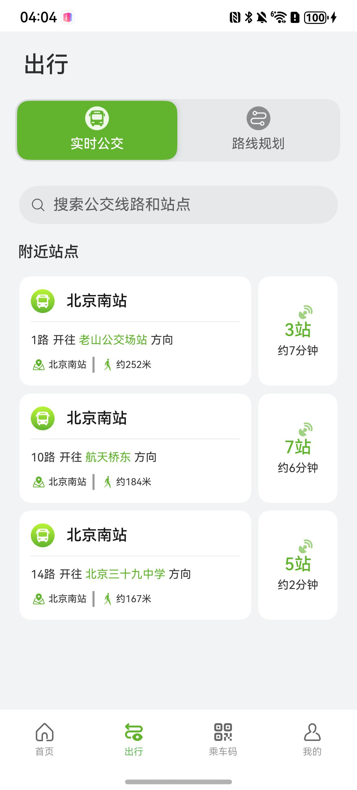
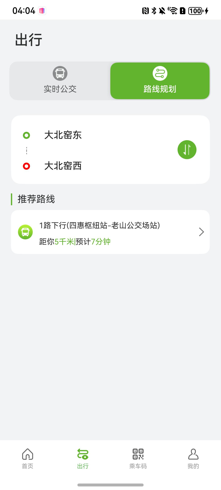
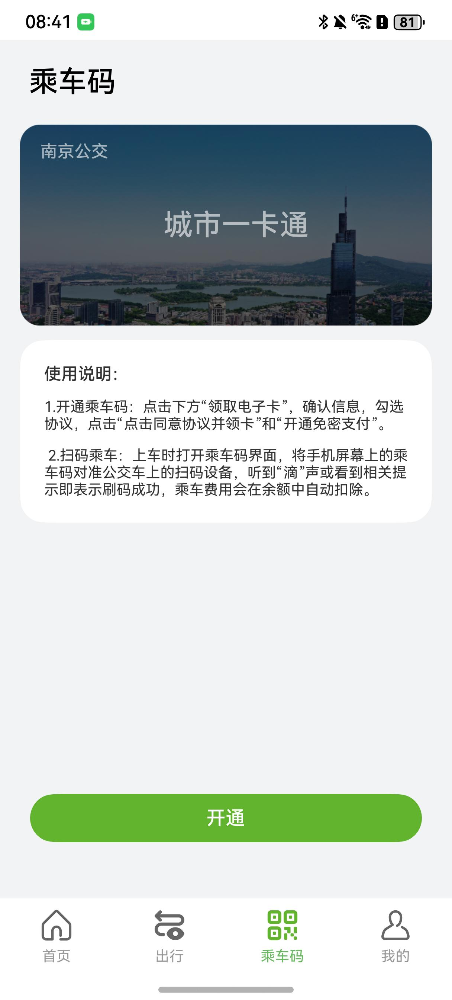
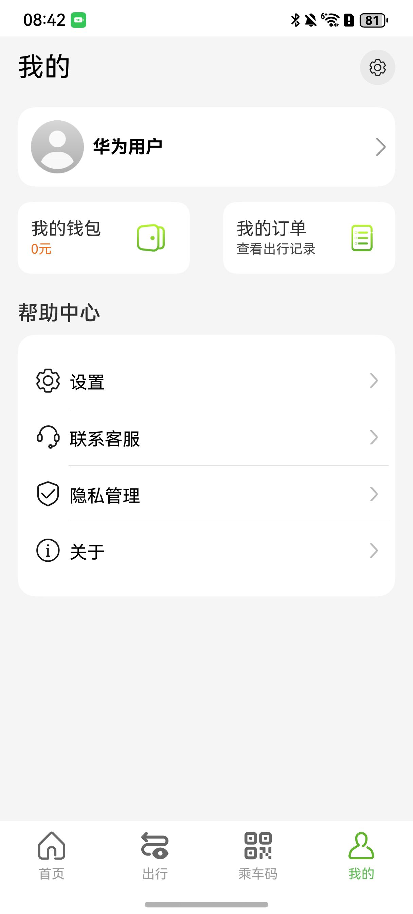

# 出行导航（公交）应用模板快速入门

## 目录
- [功能介绍](#功能介绍)
- [环境要求](#环境要求)
- [快速入门](#快速入门)
- [示例效果](#示例效果)
- [权限要求](#权限要求)
- [开源许可协议](#开源许可协议)

## 功能介绍

本模板为公交类应用提供了常用功能的开发样例，模板主要分为首页，出行，乘车码和我的四大模块：

* 首页：可查看最近新闻热点，开通、打开乘车码，查看禁携物品和寻找遗失物品。
* 出行：实时公交页可查看附近站点信息，包括该路线最近车辆离当前位置的距离和时间，点击对应线路可以查看该线路的地图展示。路径规划中可以根据输入的起点和终点查询推荐路线。
* 乘车码：可进行开卡，享受乘车扫码服务。
* 我的：登录后可管理钱包和订单记录，还可以设置个人信息、联系客服。

本模板已集成华为账号、地图等服务，只需做少量配置和定制即可快速实现华为账号的登录、乘车购票等功能。

| 首页                                  | 出行-实时公交                            | 出行-路线规划                            |
| ------------------------------------- |------------------------------------|------------------------------------|
|  |  |  |

| 乘车码                                   | 我的                            |
|---------------------------------------|-------------------------------|
|  |   |


本模板主要页面及核心功能如下所示：

```ts
公交出行模板
 |-- 首页
 |    |-- 轮播图
 |    |-- 新闻热点
 |    |     |-- 新闻列表
 |    |     └-- 新闻详情
 |    |-- 乘车码
 |    |-- 禁携物品
 |    └-- 失物招领
 |-- 出行
 |    |-- 实时公交
 |    |     |-- 搜索
 |    |     |-- 附近公交列表
 |    |     └-- 公交详情页
 |    └-- 路线规划
 |          |-- 搜索
 |          └-- 推荐路线
 |-- 乘车码
 |    |-- 领取电子卡
 |    |-- 开通电子卡
 |    └-- 乘车码
 └-- 我的
      |-- 登录
      |-- 个人信息
      |-- 我的钱包
      |-- 我的订单
      |-- 设置
      |-- 联系客服
      |-- 隐私管理
      |     └-- 隐私服务
      └-- 关于我们
            |-- 意见建议
            └-- 版本更新
```

本模板工程代码结构如下所示：
```ts
BusTravel
├─common/src/main/ets
│  ├─AxiosHttpRequest                                  // 网络请求封装
│  ├─components                                        // 细化业务组件
│  ├─constants                                         // 公共常量
│  ├─Interface                                         // 公共接口常量
│  ├─logger                                            // 日志打印
│  ├─model                                             // 模型定义
│  ├─page                                              // 公共页面
│  └─utils                                             // 公共方法
│
├─entry
│  ├─src/main/ets
│  │  ├─constants
│  │  │  └─AppConstants.ets                            // 常量定义
│  │  ├─dataModel
│  │  │  └─HomeTab.ets                                 // Tab页定义
│  │  ├─entryability
│  │  │  └─EntryAbility.ets                            // 主入口生命周期（包含预加载）
│  │  ├─entrybackupability
│  │  │  └─EntryBackupAbility.ets                      // 主入口生命周期（包含预加载）
│  │  ├─pages
│  │  │  └─Index.ets                                   // 主页
│  │  └─viewmodels
│        └─EntryVM.ets                                 // 路由管理
├─feature
│  ├─CodeScan/src/main/ets
│  │  └─index
│  │     ├─ActivateCloudCard.ets                       // 常量定义
│  │     ├─CloudCard.ets                               // 模型定义
│  │     └─CodeScanPage.ets                            // 方法定义
│  ├─frontpage/src/main/ets
│  │  ├─mock
│  │  │  └─MockData.ets                                // mock数据
│  │  ├─model
│  │  │  └─Interface.ets                               // 接口定义
│  │  └─pages
│  │     ├─HomePage.ets                                // 首页
│  │     ├─LostFind.ets                                // 失物招领
│  │     ├─NewsDetail.ets                              // 新闻详情
│  │     ├─NewsHotspot.ets                             // 新闻热点
│  │     └─ProhibitedItemsPage.ets                     // 禁携物品
│  ├─PersonalCenter/src/main/ets
│  │  ├─components
│  │  │  └─PageHeader.ets                              // 页面标题栏组件
│  │  ├─model                                          // 模型定义
│  │  └─pages
│  │     ├─AboutUs.ets                                 // 关于我们
│  │     ├─index.ets                                   // 首页
│  │     ├─Login.ets                                   // 华为一键登录
│  │     ├─MinePage.ets                                // 个人中心主页面
│  │     ├─MineWallet.ets                              // 我的钱包
│  │     ├─MyOrder.ets                                 // 我的订单
│  │     ├─PersonalSetting.ets                         // 个人设置
│  │     ├─PrivacyPage.ets                             // 隐私协议
│  │     ├─SettingsPage.ets                            // 设置页面
│  │     └─Suggestion.ets                              // 意见建议
│  └─RouteDesign/src/main/ets
│     ├─components
│     │  ├─BusInfo.ets                                 // 公交列表组件
│     │  ├─BusLine.ets                                 // 公交地图信息组件
│     │  ├─BusLineView.ets                             // 公交附图站点展示组件
│     │  ├─BusStationRandom.ets                        // 站点信息
│     │  └─RandomCountdown.ets                         // 站点信息
│     ├─constants
│     │  └─MapConstants.ets                            // 常量
│     ├─index
│     │  └─index.ets                                   // 主页
│     ├─page
│     │  ├─BusLinePlan.ets                             // 出行页
│     │  ├─realTimeBus.ets                             // 实时公交
│     │  ├─routeDetail.ets                             // 公交地图详情页
│     │  └─TravelPlan.ets                              // 路径规划
│     └─viewmodels
│        └─RouterParams.ets                            // 路由参数
```

## 环境要求
### 软件
* DevEco Studio版本：DevEco Studio 5.0.0 Release及以上
* HarmonyOS SDK版本：HarmonyOS 5.0.0 Release SDK及以上
### 硬件
* 设备类型：华为手机（直板机）
* HarmonyOS版本：HarmonyOS 5.0.0 Release及以上

## 快速入门
在运行此模板前，需要完成以下配置：

1. 在DevEco Studio中打开此模板。

2. 在AppGallery Connect创建应用，将包名配置到模板中。

   a. 参考[创建应用](https://developer.huawei.com/consumer/cn/doc/app/agc-help-createharmonyapp-0000001945392297)。

   b. 返回应用列表页面，查看应用的包名。

   c. 将模板工程根目录下AppScope/app.json5文件中的bundleName替换为创建应用的包名。

3. 配置华为账号服务。

   a. 将应用的client ID配置到entry模块的module.json5文件，详细参考：[配置Client ID](https://developer.huawei.com/consumer/cn/doc/harmonyos-guides/account-client-id)。

   b. 添加公钥指纹，详细参考：[配置应用证书指纹](https://developer.huawei.com/consumer/cn/doc/app/agc-help-signature-info-0000001628566748#section5181019153511)。

   c. 如需获取用户真实手机号，需要申请phone权限，详细参考：[配置scope权限](https://developer.huawei.com/consumer/cn/doc/harmonyos-guides/account-config-permissions)。在端侧使用快速验证手机号码Button进行[验证获取手机号码](https://developer.huawei.com/consumer/cn/doc/harmonyos-guides/account-get-phonenumber)。

4. 配置地图服务。

   a. 将应用的client ID配置到entry模块的module.json5文件，如果华为账号服务已配置，可跳过此步骤。

   b. 添加公钥指纹，如果华为账号服务已配置，可跳过此步骤。

   c. [开通地图服务](https://developer.huawei.com/consumer/cn/doc/harmonyos-guides/map-config-agc)。
   
### 运行调试工程

1. 连接调试手机和PC。

2. 对应用[手工签名](https://developer.huawei.com/consumer/cn/doc/harmonyos-guides/ide-signing)。

3. 菜单选择“Run > Run 'entry' ”或者“Run > Debug 'entry' ”，运行或调试模板工程。


## 示例效果
[应用示例效果](./screenshots/应用使用示例效果.mp4)

## 权限要求
需要向系统申请的权限列表
* 网络权限：ohos.permission.INTERNET
* 获取位置权限：ohos.permission.LOCATION
* 模糊位置信息：ohos.permission.APPROXIMATELY_LOCATION

## 开源许可协议
该代码经过[Apache 2.0 授权许可](http://www.apache.org/licenses/LICENSE-2.0)。