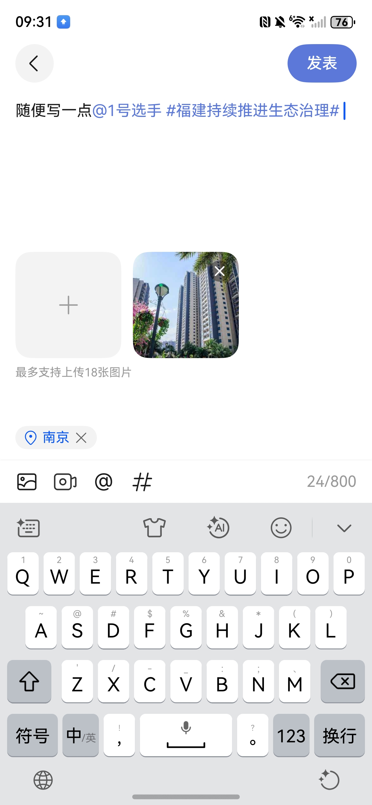
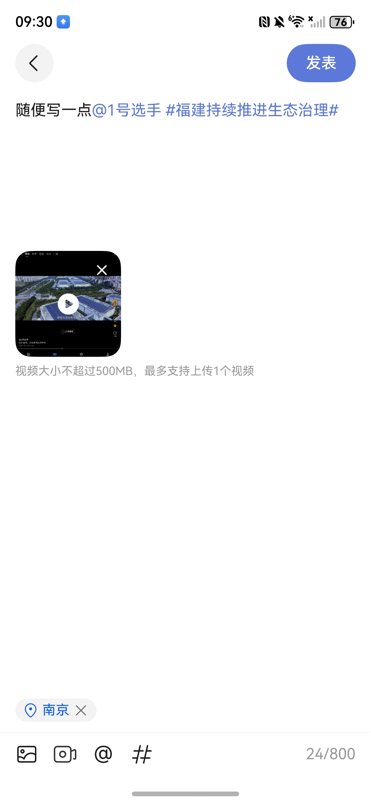

# 发帖组件快速入门

## 目录

- [简介](#简介)
- [约束与限制](#约束与限制)
- [使用](#使用)
- [API参考](#API参考)
- [示例代码](#示例代码)

## 简介

本组件支持编辑互动发帖，支持发布图片或者视频，支持@联系人、引用话题、添加当前位置。

| 发表图片&文字                                              | 发表视频&文字                                              |
|------------------------------------------------------|------------------------------------------------------|
|  |  |

## 约束与限制

### 环境

- DevEco Studio版本：DevEco Studio 6.0.2 Release及以上
- HarmonyOS SDK版本：HarmonyOS 6.0.2 Release SDK及以上
- 设备类型：华为手机（包括双折叠和阔折叠）、平板
- 系统版本：HarmonyOS 6.0.1(21)及以上

### 权限

- 位置权限: ohos.permission.APPROXIMATELY_LOCATION

## 使用

1. 安装组件。

   如果是在DevEco Studio使用插件集成组件，则无需安装组件，请忽略此步骤。

   如果是从生态市场下载组件，请参考以下步骤安装组件。

   a. 解压下载的组件包，将包中所有文件夹拷贝至您工程根目录的XXX目录下。

   b. 在项目根目录build-profile.json5添加module_post、module_imagepreview模块。

   ```
   // 项目根目录下build-profile.json5填写module_post、module_imagepreview路径。其中XXX为组件存放的目录名
   "modules": [
     {
       "name": "module_post",
       "srcPath": "./XXX/module_post"
     },
     {
       "name": "module_imagepreview",
       "srcPath": "./XXX/module_imagepreview"
     }
   ]
   ```

   c. 在项目根目录oh-package.json5添加依赖。
   ```
   // XXX为组件存放的目录名称
   "dependencies": {
     "module_post": "file:./XXX/module_post"
   }
   ```

2. 引入组件。

    ```
    import { PublishPostComp } from 'module_post';
    ```

3. 调用组件，详细参数配置说明参见[API参考](#API参考)。
   ```
   PublishPostComp({
     fontRatio: 1,
     onChange: (body: string, mediaList: PostImgVideoItem[]) => {
       this.body = body;
       this.mediaList = mediaList;
     },
   })
   ```

## API参考

### 接口

PublishPostComp(option?: [PublishPostCompOptions](#PublishPostCompOptions对象说明))

发帖组件

**参数：**

| 参数名     | 类型                                                    | 是否必填 | 说明         |
|:--------|:------------------------------------------------------|:-----|:-----------|
| options | [PublishPostCompOptions](#PublishPostCompOptions对象说明) | 否    | 配置发帖组件的参数。 |

### PublishPostCompOptions对象说明

| 参数名                  | 类型                                                                                                                                         | 是否必填 | 说明                   |
|:---------------------|:-------------------------------------------------------------------------------------------------------------------------------------------|:-----|:---------------------|
| fontRatio            | number                                                                                                                                     | 否    | 字体大小比例               |
| themeColor           | ResourceColor                                                                                                                              | 否    | 主体色                  |
| imageParams          | [MediaParams](#MediaParams对象说明)                                                                                                            | 否    | 图片参数                 |
| videoParams          | [MediaParams](#MediaParams对象说明)                                                                                                            | 否    | 视频参数                 |
| postController       | [PostController](#PostController类)                                                                                                         | 否    | 发帖控制器                |
| richEditorController | [RichEditorController](https://developer.huawei.com/consumer/cn/doc/harmonyos-references/ts-basic-components-textarea#textareacontroller8) | 否    | RichEditor控制器        |
| attachedTopic        | [Topic](#Topic接口说明)                                                                                                                        | 否    | 初始化是携带的话题            |
| topicList            | [Topic](#Topic接口说明)[]                                                                                                                      | 否    | 话题列表                 |
| userList             | [User](#User接口说明)[]                                                                                                                        | 否    | 联系人列表                |
| onChange             | (body: string, mediaList: [PostImgVideoItem](#PostImgVideoItem对象说明)[], cityLocation?: string) => void                                      | 否    | 文字、图片、视频、当前城市定位变化的回调 |
| isFocus              | (result: boolean) => void                                                                                                                  | 否    | 键盘是否被拉起的回调           |
| jumpTopicPage        | (topic: [Topic](#Topic接口说明)) => void                                                                                                       | 否    | 跳转话题详情页的回调           |

### MediaParams对象说明

| 参数名      | 类型                                                                                                                                                          | 是否必填 | 说明               |
|:---------|:------------------------------------------------------------------------------------------------------------------------------------------------------------|:-----|:-----------------|
| type     | [photoAccessHelper.PhotoViewMIMETypes](https://developer.huawei.com/consumer/cn/doc/harmonyos-references/arkts-apis-photoaccesshelper-e#photoviewmimetypes) | 是    | 媒体文件类型           |
| maxLimit | number                                                                                                                                                      | 是    | 限制资源选择最大数量       |
| maxSize  | number                                                                                                                                                      | 否    | 限制资源选择最大大小，单位是MB |

### PostImgVideoItem对象说明

| 参数名         | 类型                                                                                                                                          | 说明           |
|:------------|:--------------------------------------------------------------------------------------------------------------------------------------------|:-------------|
| id          | number                                                                                                                                      | 唯一索引         |
| picVideoUrl | string                                                                                                                                      | 图片/视频媒体文件uri |
| surfaceUrl  | string                                                                                                                                      | 视频封面图沙箱uri   |
| movingPhoto | [photoAccessHelper.MovingPhoto](https://developer.huawei.com/consumer/cn/doc/harmonyos-references/arkts-apis-photoaccesshelper-movingphoto) | 动态图片对象       |

### FileUtils类

文件工具类，提供文件处理相关功能。

| 方法名                      | 参数                                                                                                                                                                                                              | 说明            |
|:-------------------------|:----------------------------------------------------------------------------------------------------------------------------------------------------------------------------------------------------------------|:--------------|
| handleUri                | (uiContext: UIContext, uri: string) => Promise<string>                                                                                                                                                          | 将uri对应文件复制到沙箱 |
| saveMovingPhotoToSandbox | (context: Context, movingPhoto: photoAccessHelper.MovingPhoto) => Promise<string[]>                                                                                                                             | 动态图片写入沙箱      |
| scalePriorityCompress    | (sourcePixelMap: [image.PixelMap](https://developer.huawei.com/consumer/cn/doc/harmonyos-references/ts-image-common#pixelmap), maxCompressedImageSize: number, quality: number) => Promise<ArrayBuffer \| null> | 优先压缩图片尺寸      |
| packing                  | (sourcePixelMap: [image.PixelMap](https://developer.huawei.com/consumer/cn/doc/harmonyos-references/ts-image-common#pixelmap), imageQuality: number) => Promise<ArrayBuffer \| null>                            | packing压缩     |
| writePixelMap            | (uiContext: UIContext, pixelMap?: [image.PixelMap](https://developer.huawei.com/consumer/cn/doc/harmonyos-references/ts-image-common#pixelmap)) => Promise<string>                                              | pixelMap写入沙箱  |
| getFileExtension         | (filePath: string) => string                                                                                                                                                                                    | 获取文件后缀名       |

### PostController类

帖子控制器，提供帖子相关控制功能。

| 参数名         | 类型                     | 说明        |
|:------------|:-----------------------|:----------|
| joinDiscuss | (topic: Topic) => void | 参与讨论的回调函数 |

### Topic接口说明

话题数据模型。

| 参数名   | 类型     | 说明   |
|:------|:-------|:-----|
| id    | string | 话题ID |
| title | string | 话题标题 |

### User接口说明

用户数据模型。

| 参数名            | 类型     | 说明   |
|:---------------|:-------|:-----|
| authorId       | string | 作者ID |
| authorNickName | string | 作者昵称 |
| authorIcon     | string | 作者头像 |

### TextSpanInfo接口说明

文本片段信息，用于标识富文本中的不同类型文本片段。

| 参数名  | 类型                                | 说明                                     |
|:-----|:----------------------------------|:---------------------------------------|
| text | string                            | 文本内容                                   |
| type | 'contact' \| 'topic' \| 'default' | 文本类型：contact-联系人、topic-话题、default-默认文本 |

## 示例代码

```ts
import { PublishPostComp, PostImgVideoItem, Topic, User, PostController, TextSpanInfo } from 'module_post';

@Entry
@ComponentV2
struct Sample1 {
  @Local body: string = '[]';
  @Local mediaList: PostImgVideoItem[] = [];
  @Local cityLocation: string = '';
  // 示例话题列表
  private topicList: Topic[] = [
    { id: '1', title: '#HarmonyOS开发#' },
    { id: '2', title: '#ArkTS编程#' },
    { id: '3', title: '#前端技术#' },
  ];
  // 示例联系人列表
  private userList: User[] = [
    {
      authorId: '001',
      authorNickName: '张三',
      authorIcon: 'https://agc-storage-drcn.platform.dbankcloud.cn/v0/news-hnp2d/avatar%2Favatar_1.jpg',
    },
    {
      authorId: '002',
      authorNickName: '李四',
      authorIcon: 'https://agc-storage-drcn.platform.dbankcloud.cn/v0/news-hnp2d/avatar%2Favatar_2.jpg',
    },
    {
      authorId: '003',
      authorNickName: '王五',
      authorIcon: 'https://agc-storage-drcn.platform.dbankcloud.cn/v0/news-hnp2d/avatar%2Favatar_3.jpg',
    },
  ];
  // 初始化携带的话题
  private attachedTopic: Topic = { id: '1', title: '#HarmonyOS开发#' };
  // 发帖控制器
  private postController: PostController = new PostController();

  build() {
    NavDestination() {
      this.titleBuilder()

      Column() {
        PublishPostComp({
          fontRatio: 1,
          postController: this.postController,
          attachedTopic: this.attachedTopic,
          topicList: this.topicList,
          userList: this.userList,
          onChange: (body: string, mediaList: PostImgVideoItem[], cityLocation?: string) => {
            this.body = body;
            this.mediaList = mediaList;
            this.cityLocation = cityLocation || '';
          },
          jumpTopicPage: (topic: Topic) => {
            // 跳转到话题详情页
            this.getUIContext().getPromptAction().showToast({
              message: `跳转到话题：${topic.title}`,
            })
          },
        })
      }
      .layoutWeight(1)
    }
    .hideTitleBar(true)
  }

  @Builder
  titleBuilder() {
    Row() {
      Text('发帖页面')
        .fontSize($r('sys.float.Body_L'))
        .fontWeight(FontWeight.Medium)
      Blank()
      Button('发布')
        .width(72)
        .height(40)
        .fontSize($r('sys.float.Body_L'))
        .fontColor(this.enablePublish ? $r('sys.color.font_on_primary') : $r('sys.color.font_tertiary'))
        .backgroundColor(this.enablePublish ? '#5C79D9' :
          $r('sys.color.comp_background_secondary'))
        .enabled(this.enablePublish)
        .onClick(() => {
          this.getUIContext().getPromptAction().showToast({
            message: '点击了发布按钮',
          })
        })
    }
    .width('100%')
    .height(56)
    .padding({ left: 16, right: 16 })
  }

  @Computed
  get plainText() {
    try {
      const list = JSON.parse(this.body) as TextSpanInfo[];
      return list.map(v => v.text).join('');
    } catch (e) {
      return '';
    }
  }

  @Computed
  get enablePublish() {
    if (this.plainText) {
      return true;
    }
    if (this.mediaList.length) {
      return true;
    }
    return false;
  }
}
```