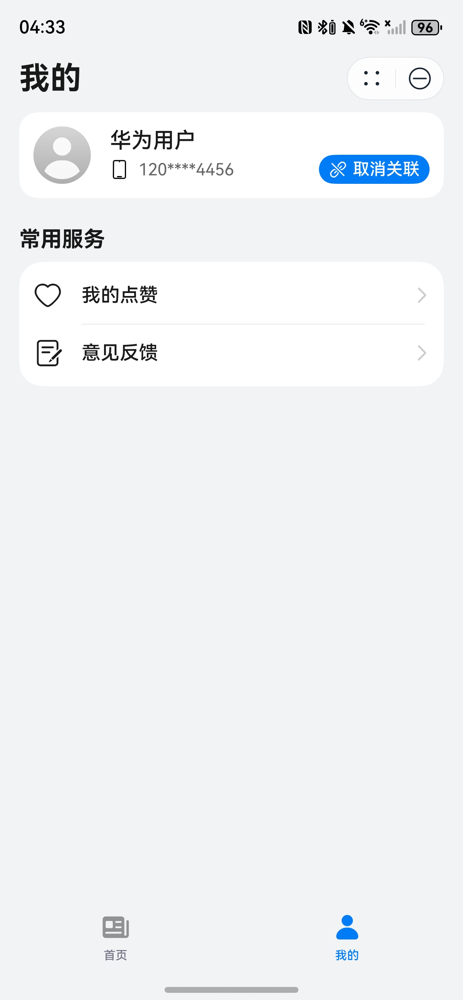

# 新闻（封面新闻）元服务模板快速入门

## 目录

- [功能介绍](#功能介绍)
- [约束与限制](#约束与限制)
- [快速入门](#快速入门)
- [示例效果](#示例效果)
- [开源许可协议](#开源许可协议)

## 功能介绍

您可以基于此模板直接定制元服务，也可以挑选此模板中提供的多种组件使用，从而降低您的开发难度，提高您的开发效率。

此模板提供如下组件，所有组件存放在工程根目录的components下，如果您仅需使用组件，可参考对应组件的指导链接；如果您使用此模板，请参考本文档。

| 组件                               | 描述               | 使用指导                                             |
|:---------------------------------|:-----------------|:-------------------------------------------------|
| 通用元服务关联账号组件（atomicservice_login） | 支持关联、解除关联账号      | [使用指导](components/atomicservice_login/README.md) |
| 通用问题反馈组件（feedback）               | 支持提交问题反馈、查看反馈记录  | [使用指导](components/feedback/README.md)            |
| 通用图片预览组件（image_preview）          | 支持预览图片、双指缩放，滑动预览 | [使用指导](components/image_preview/README.md)       |

本模板为新闻行业（封面新闻）类元服务提供了常用功能的开发样例，模板主要分首页和我的两大模块：

- 首页：提供新闻轮播、新闻详情、图片预览等功能。
- 我的：展示用户信息、收藏列表、问题反馈等功能。

本模板已集成华为账号、华为分享等服务，只需做少量配置和定制即可快速实现元服务关联账号、新闻浏览、收藏管理等功能。

| 首页                                                    | 我的                                                    |
|-------------------------------------------------------|-------------------------------------------------------|
|  |  |

本模板主要页面及核心功能如下所示：

```text
新闻（封面新闻）元服务模板
 |-- 首页模块
 |    |-- 新闻轮播
 |    └-- 新闻详情
 |          |-- 图片预览
 |          └-- 分享
 └-- 我的模块
      |-- 用户信息
      |     |-- 个人信息
      |     |-- 账号关联
      └-- 常用服务
            |-- 我的点赞
            └-- 意见反馈
```

本模板工程代码结构如下所示：

```text
CoverNews
  ├─commons/lib_common/src/main
  │  ├─ets
  │  │  ├─components
  │  │  │      CommonConfirmDialog.ets        // 通用确认对话框
  │  │  │      CustomTitleBar.ets             // 自定义标题栏
  │  │  │      EmptyBuilder.ets               // 空页面构建器
  │  │  │      LoadingView.ets                // 加载视图
  │  │  ├─constants
  │  │  │      AppConstants.ets               // 应用常量
  │  │  │      CommonConstants.ets            // 通用常量
  │  │  │      GridRowColSetting.ets          // 一多适配，栅格和断点常量
  │  │  │      RouterMap.ets                  // 路由表
  │  │  ├─http
  │  │  │      BaseRequest.ets                // 请求基础能力
  │  │  │      HttpService.ets                // HTTP服务
  │  │  │      HttpServiceMock.ets            // HTTP服务Mock
  │  │  │      MockAdapter.ets                // Mock适配器
  │  │  │      MockData.ets                   // 数据Mock
  │  │  ├─models
  │  │  │      BaseViewModel.ets              // 基础ViewModel
  │  │  │      BreakpointModel.ets            // 一多适配断点模型
  │  │  │      LoadingModel.ets               // 加载模型
  │  │  │      NewsDetailRouter.ets           // 新闻详情路由
  │  │  │      UserInfoModel.ets              // 用户信息模型
  │  │  │      WindowModel.ets                // 窗口模型
  │  │  ├─types
  │  │  │      NewsItem.ets                   // 新闻数据类型
  │  │  └─utils
  │  │         AppPrivacyUtils.ets            // 隐私声明方法
  │  │         BreakpointUtils.ets            // 一多适配监听断点方法
  │  │         ContextUtils.ets               // 上下文工具方法
  │  │         Logger.ets                     // 日志工具
  │  │         RouterUtils.ets                // 路由工具
  │  │         TimeUtils.ets                  // 时间工具
  │  │         WindowUtils.ets                // 窗口工具
  │  └─resources
  │
  ├──components
  │  ├──atomicservice_login                   // 通用元服务关联账号组件
  │  ├──feedback                              // 反馈组件
  │  └──image_preview                         // 通用图片预览组件
  │
  ├─features/business_home/src/main
  │  ├─ets
  │  │  ├─components
  │  │  │      BigImage.ets                   // 大图组件
  │  │  │      SwiperView.ets                 // 轮播视图组件
  │  │  ├─pages
  │  │  │      HomePage.ets                   // 首页
  │  │  │      ImagePreviewPage.ets           // 图片预览页
  │  │  │      NewsDetailPage.ets             // 新闻详情页
  │  │  └─viewmodels
  │  │         HomePageVM.ets                 // 首页ViewModel
  │  │         NewsDetailPageVM.ets           // 新闻详情页ViewModel
  │  └─resources
  │
  ├─features/business_mine/src/main
  │    ├─ets
  │    │  ├─components
  │    │  │      EditCheckbox.ets              // 编辑复选框
  │    │  │      NewsCard.ets                  // 新闻卡片
  │    │  │      SettingItem.ets               // 设置项
  │    │  │      ToolBarBottom.ets             // 底部工具栏
  │    │  ├─pages
  │    │       MineLikePage.ets                // 我的收藏页
  │    │       MinePage.ets                    // 我的页面
  │    │  └─viewmodels
  │    │       MineLikePageVM.ets              // 我的收藏页ViewModel
  │    │       MinePageVM.ets                  // 我的页面ViewModel
  │    └─resources
  │
  └─products/phone/src/main
      ├─ets
      |  ├─common
      |  |      Constants.ets                  // 常量
      |  |      ShareUtils.ets                 // 分享工具
      |  |      WantUtils.ets                  // Want工具
      |  ├─models
      |  |      FormCardModel.ets              // 服务卡片模型
      |  |      ShareInfo.ets                  // 分享信息
      |  |      TabModel.ets                   // Tab模型
      |  ├─pages
      |  |      Index.ets                      // 入口页面
      |  |      IndexPage.ets                  // 主页面
      |  ├─phoneability
      |  |      PhoneAbility.ets               // 应用入口Ability
      |  ├─phoneformability
      |  |      PhoneFormAbility.ets           // 卡片入口Ability
      |  ├─viewmodels
      |  |      IndexPageVM.ets                // 主页面ViewModel
      |  |      IndexVM.ets                    // 入口页面ViewModel
      |  └─widget/pages
      |         NewsCard2x2Card.ets            // 2*2服务卡片页面
      └─resources
```

## 约束与限制

### 环境

- DevEco Studio版本：DevEco Studio 6.1.0 Release及以上
- HarmonyOS SDK版本：HarmonyOS 6.1.0 Release SDK及以上
- 设备类型：华为手机（包括双折叠和阔折叠）、平板、模拟器（API22及以上）
- 系统版本：HarmonyOS 6.0.0(20)及以上

### 权限

- 网络权限：ohos.permission.INTERNET
- 振动权限：ohos.permission.VIBRATE

## 快速入门

### 配置工程

在运行此模板前，需要完成以下配置：

1. 在AppGallery Connect创建元服务，将包名配置到模板中。

   a. 参考[创建元服务](https://developer.huawei.com/consumer/cn/doc/app/agc-help-create-atomic-service-0000002247795706)为元服务创建APP ID，并将APP ID与元服务进行关联。

   b. 返回应用列表页面，查看元服务的包名。

   c. 将模板工程根目录下AppScope/app.json5文件中的bundleName替换为创建元服务的包名。

2. 配置华为账号服务。

   a. 将元服务的Client ID配置到products/phone/src/main/module.json5文件，详细参考：[配置Client ID](https://developer.huawei.com/consumer/cn/doc/atomic-guides/account-atomic-client-id)。

   b. 获取华为账号相关授权，详细参考：[申请账号权限](https://developer.huawei.com/consumer/cn/doc/atomic-guides/account-guide-atomic-permissions)。

3. 配置业务域名。详细参考：[配置业务域名](https://developer.huawei.com/consumer/cn/doc/atomic-guides/agc-help-harmonyos-business-domain)

4. （可选）配置服务器域名。

   a. 当前模板接口均采用mock数据，若是使用服务端接口请求，需要改造http请求的相关代码：commons/lib_common/src/main/ets/http/BaseRequest.ets。

   b. [配置服务器域名](https://developer.huawei.com/consumer/cn/doc/atomic-guides/agc-help-harmonyos-server-domain)，"httpRequest合法域名"需要配置为：`https://agc-storage-drcn.platform.dbankcloud.cn`

5. 对元服务进行[手工签名](https://developer.huawei.com/consumer/cn/doc/harmonyos-guides/ide-signing#section297715173233)。

6. 添加手工签名所用证书对应的公钥指纹。详细参考：[配置公钥指纹](https://developer.huawei.com/consumer/cn/doc/app/agc-help-cert-fingerprint-0000002278002933)

### 运行调试工程

1. 连接调试手机和PC。
2. 菜单选择“Run > Run 'phone' ”或者“Run > Debug 'phone' ”，运行或调试模板工程。
   **【说明】**如果调试运行时出现错误，可参考[在DevEco Studio调试运行ASCF元服务的时候报错](https://developer.huawei.com/consumer/cn/doc/atomic-ascf/faqs-plugin-debugging-error)。

## 示例效果

1. [首页](./screenshots/home.mp4)
2. [我的](./screenshots/mine.mp4)

## 开源许可协议

该代码经过[Apache 2.0 授权许可](http://www.apache.org/licenses/LICENSE-2.0)。