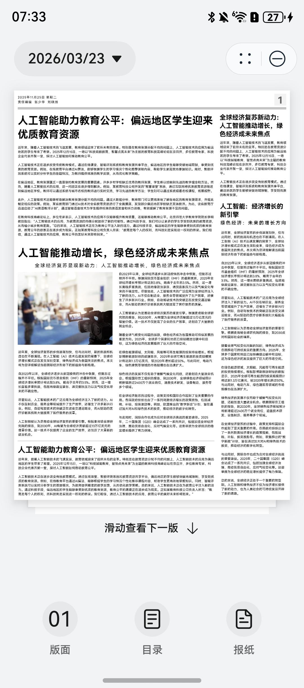
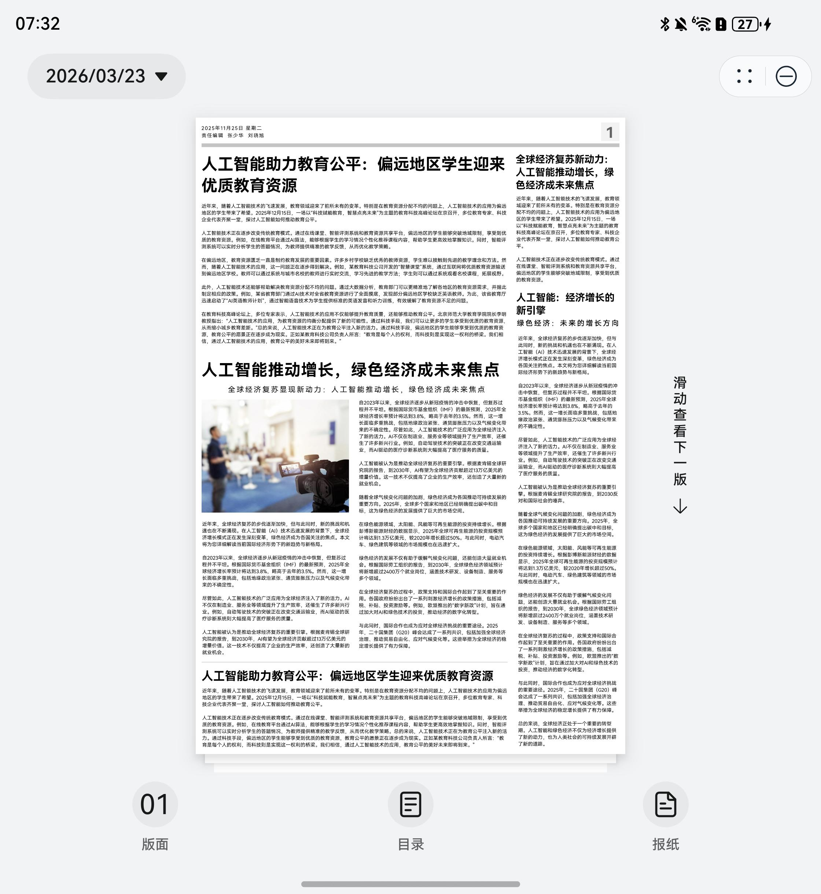
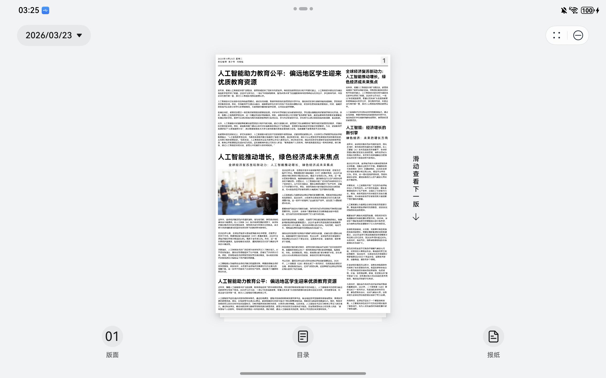
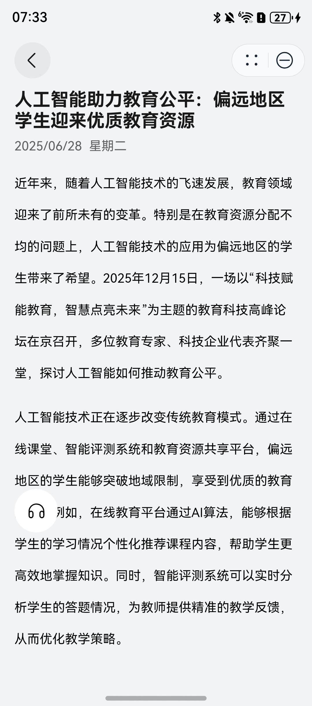
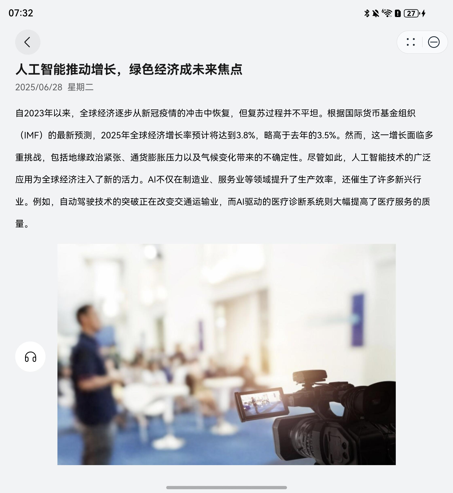
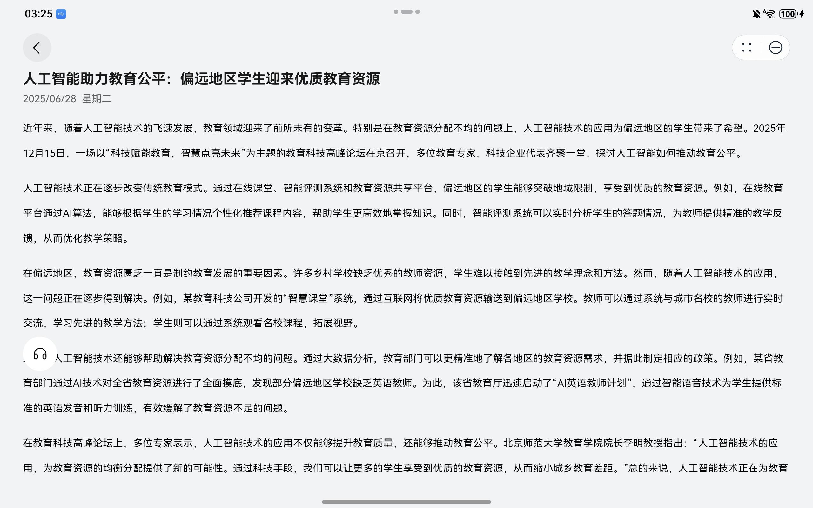

# 新闻（数字报）元服务模板快速入门

## 目录

- [功能介绍](#功能介绍)
- [约束与限制](#约束与限制)
- [快速入门](#快速入门)
- [示例效果](#示例效果)
- [开源许可协议](#开源许可协议)

## 功能介绍

您可以基于此模板直接定制元服务，也可以挑选此模板中提供的多种组件使用，从而降低您的开发难度，提高您的开发效率。

此模板提供如下组件，所有组件存放在工程根目录的components下，如果您仅需使用组件，可参考对应组件的指导链接；如果您使用此模板，请参考本文档。

| 组件                             | 描述                  | 使用指导                                              |
|--------------------------------|---------------------|---------------------------------------------------|
| 通用朗读组件（module_text_reader）     | 支持文本朗读              | [使用指导](components/module_text_reader/README.md)   |
| 通用图片预览组件（module_image_preview） | 支持预览图片、双指放大、缩小，滑动预览 | [使用指导](components/module_image_preview/README.md) |

本模板为数字报元服务提供了常用功能的开发样例，模板主要分数字报首页、新闻文章详情两个页面：

- 数字报首页：选择版面、目录、报纸来源等相关功能
- 新闻文章详情：展示具体新闻详情。

本模板已集成华为账号服务，只需做少量配置和定制即可快速实现静默登录。

<div style='overflow-x:auto'>
  <table style='min-width:800px'>
    <tr>
      <th></th>
      <th>直板机</th>
      <th>折叠屏</th>
      <th>平板</th>
    </tr>
    <tr>
      <th scope='row'>首页</th>
      <td valign='top'></td>
      <td valign='top'></td>
      <td valign='top'></td>
    </tr>
    <tr>
      <th scope='row'>新闻详情</th>
      <td valign='top'></td>
      <td valign='top'></td>
      <td valign='top'></td>
    </tr>
  </table>
</div>

本模板工程代码结构如下所示：

```
DigitalNewspaper
    ├── AppScope/                                           # 应用级配置
    │   ├── app.json5                                       # 应用配置文件
    │   └── resources/                                      # 应用资源文件
    ├── commons/                                            # 公共库
    │   └── lib_foundation/                                 # 应用基础lib
    ├── components/                                         # 组件
    │   ├── module_text_reader/                             # 通用朗读组件
    │   └── module_image_preview/                           # 通用图片预览组件
    ├── products/                                           # 产品入口
    │   └── entry/                                          # 应用入口
    ├── screenshots/                                        # 项目截图
    ├── build-profile.json5                                 # 项目构建配置
    ├── oh-package.json5                                    # 项目依赖配置
    ├── CHANGELOG.md                                        # 版本更新日志
    └── README.md                                           # 项目说明文档
```
## 约束与限制

### 环境

* DevEco Studio版本：DevEco Studio 6.0.2 Release及以上
* HarmonyOS SDK版本：HarmonyOS 6.0.2 Release SDK及以上
* 设备类型：华为手机（包括双折叠和阔折叠）、平板
* 系统版本：HarmonyOS 6.0.1(21)及以上及以上

### 权限

- 网络权限: ohos.permission.INTERNET
- 后台运行权限: ohos.permission.KEEP_BACKGROUND_RUNNING

## 快速入门

### 配置工程

在运行此模板前，需要完成以下配置：

1. 在AppGallery Connect创建元服务，将包名配置到模板中。

   a. 参考[创建元服务](https://developer.huawei.com/consumer/cn/doc/app/agc-help-create-atomic-service-0000002247795706)为元服务创建APP ID，并将APP ID与元服务进行关联。

   b. 返回应用列表页面，查看元服务的包名。

   c. 将模板工程根目录下AppScope/app.json5文件中的bundleName替换为创建元服务的包名。

2. 配置服务器域名。

   a. 当前模板接口均采用mock数据，若是使用服务端接口请求，需要改造http请求的相关代码：commons/lib_foundation/src/main/ets/http/AxiosBase.ets，将服务端请求基础url填充到commons/lib_foundation/src/main/ets/common/Constant.ets中。

   ```
   export enum CurAppInfo {
     BASE_URL = 'xxx',// 推送服务通知模板ID
   }
   ```

   b. 由于元服务包体大小有限制，部分图片资源将从云端拉取，需为模板项目[配置服务器域名](https://developer.huawei.com/consumer/cn/doc/atomic-guides/agc-help-harmonyos-server-domain)，“httpRequest合法域名”需要配置为：`https://agc-storage-drcn.platform.dbankcloud.cn`

3. 配置华为账号服务。

   a. 将元服务的Client ID配置到products/entry/src/main/module.json5文件，详细参考：[配置Client ID](https://developer.huawei.com/consumer/cn/doc/atomic-guides/account-atomic-client-id)。

   b. 将元服务的Client ID配置到commons/lib_foundation/src/main/ets/common/Constant.ets文件中。

   ```
   export enum CurAppInfo {
     CLIENT_ID = 'xxx', // Client_id
   }
   ```

   c. 如需获取用户真实手机号，需要申请账号权限，详细参考：[申请账号权限](https://developer.huawei.com/consumer/cn/doc/atomic-guides/account-guide-atomic-permissions)，并在端侧使用快速验证手机号码Button进行[验证获取手机号码](https://developer.huawei.com/consumer/cn/doc/atomic-guides/account-guide-atomic-get-phonenumber)。
4. 配置业务域名。
   
   在元服务内，使用AtomicServiceEnhancedWeb组件显示Web页面，且需要[配置业务域名](https://developer.huawei.com/consumer/cn/doc/atomic-guides/agc-help-harmonyos-business-domain)。

5. 对元服务进行[手工签名](https://developer.huawei.com/consumer/cn/doc/harmonyos-guides/ide-signing#section297715173233)。

6. 添加手工签名所用证书对应的公钥指纹。详细参考：[配置公钥指纹](https://developer.huawei.com/consumer/cn/doc/app/agc-help-cert-fingerprint-0000002278002933)。

### 运行调试工程

1. 连接调试手机和PC。

2. 菜单选择“Run > Run 'phone' ”或者“Run > Debug 'phone' ”，运行或调试模板工程。

  **【说明】** 如果调试运行时出现错误，可参考[在DevEco Studio调试运行ASCF元服务的时候报错](https://developer.huawei.com/consumer/cn/doc/atomic-ascf/faqs-plugin-debugging-error)处理。

## 示例效果


## 开源许可协议

该代码经过[Apache 2.0 授权许可](http://www.apache.org/licenses/LICENSE-2.0)。
