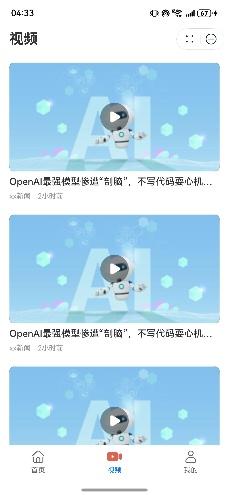
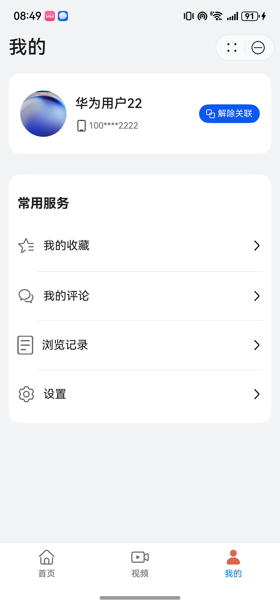

# 新闻（新闻）元服务模板快速入门

## 目录
- [功能介绍](#功能介绍)
- [环境要求](#环境要求)
- [快速入门](#快速入门)
- [示例效果](#示例效果)
- [权限要求](#权限要求)
- [开源许可协议](#开源许可协议)

## 功能介绍
本模板为新闻类元服务提供了常用功能的开发样例，模板主要分首页、视频和我的三大模块：
- 首页：提供热点新闻和本地新闻的展示，支持查看新闻详情，对新闻进行收藏、评论。
- 视频：提供新闻视频的展示和观看。
- 我的：提供账号信息的管理，以及收藏、评论、浏览记录的查看。

本模板已集成华为账号，只需做少量配置和定制即可快速实现页面的快速加载、华为账号的登录等功能。

| 首页                          | 视频                                     | 我的                         |
|-----------------------------|----------------------------------------|----------------------------|
|   |  |  |


本模板主要页面及核心功能清单如下所示：
```ts
新闻模板
 |-- 首页
 |    └-- 新闻列表
 |         |-- 新闻详情
 |         |-- 评论 -- 提交评论
 |         |-- 收藏
 |         └-- 分享
 |-- 视频
 |    └-- 视频列表
 |         |-- 视频详情
 |         |-- 收藏
 |         └-- 分享
 └-- 我的
      |-- 用户信息
      |    |-- 修改头像
      |    |-- 修改昵称
      |    └-- 关联解绑账号
      └-- 常用服务
           |-- 我的收藏
           |-- 我的评论
           |-- 浏览记录
           └-- 设置
                |-- 字号设置
                └-- 隐私协议
```

本模板工程代码结构如下所示：
```
News
  │─commons/commonLib/src/main   
  │  ├─ets
  │  │  ├─constants
  │  │  │      BreakpointConstants.ets         // 断点常量
  │  │  │      CommonContants.ets              // 公共常量
  │  │  │      CommonEnums.ets                 // 公共枚举常量
  │  │  │      HomeConstants.ets               // 首页常量
  │  │  ├─database                           
  │  │  │      PreferencesUtil.ets             // 首选项存储工具
  │  │  ├─model                           
  │  │  │      NewsData.ets                    // 新闻数据类
  │  │  │      NewsDataSource.ets              // 新闻加载数据源
  │  │  │      NewsTypeModel                   // 新闻类型类
  │  │  │      NewsViewModel                   // 新闻模型类  
  │  │  ├─preferences                           
  │  │  │      Preferences.ets                 // 首选项类  
  │  │  ├─types                           
  │  │  │      Types.ets                       // 用户类型  
  │  │  └─utils
  │  │         AccountUtil.ets                 // 账号工具
  │  │         BreakpointType.ets              // 断点工具
  │  │         FormatUtil.ets                  // 格式化日期工具
  │  │         GlobalContext.ets               // 全局上下文工具     
  │  │         Logger.ets                      // 日志工具
  │  │         PermissionUtil.ets              // 权限加载工具
  │  │         RouterModule.ets                // 路由模块工具       
  │  └─resources
  │─commons/componentLib/src/main   
  │  ├─ets
  │  │  ├─components
  │  │  │      BaseTitle.ets                   // 二级页面导航页标题组件
  │  │  │      CommonButton.ets                // 公共按钮组件
  │  │  │      GlobalDialog.ets                // 全局弹窗组件
  │  │  └─dialog                               // 与页面一一对应的vm层 
  │  │         BindPhoneDialog.ets             // 绑定手机号弹窗组件
  │  └─resources
  │─commons/network/src/main   
  │  ├─ets
  │  │  ├─axiosHttpRequest
  │  │  │      AxiosHttp.ets                   // 评论详情组件
  │  │  │      AxiosModel.ets                  // 新闻详情组件
  │  │  │      AxiosRequest.ets                // 新闻列表刷新组件
  │  │  │      HttpRequestApi.ets              // 热门和本地新闻切换组件
  │  │  ├─cardManager                            
  │  │  │      CardManager.ets                 // 卡片管理
  │  │  │      EntryContext.ets                // 应用上下文
  │  │  │      SubscriberClass.ets             // 卡片公共事件  
  │  │  ├─constants                           
  │  │  │      Common.ets                      // 网络请求公共常量  
  │  │  ├─mock                            
  │  │  │      MockData.ets                    // 接口mock数据
  │  │  │      MockResponse.ets                // 接口mock请求
  │  │  ├─models                               // 与页面一一对应的vm层 
  │  │  │      RequestModel.ets                // 卡片管理
  │  │  │      ResponseModel.ets               // 应用上下文       
  │  │  └─utils
  │  │         Utils.ets                       // 网络请求工具
  │  └─resources
  │─features/home/src/main   
  │  ├─ets
  │  │  ├─components
  │  │  │      CommentDetail.ets               // 评论详情组件
  │  │  │      NewsDetail.ets                  // 新闻详情组件
  │  │  │      PullToRefreshNews.ets           // 新闻列表刷新组件
  │  │  │      TabBar.ets                      // 热门和本地新闻切换组件
  │  │  ├─viewModels                           // 与页面一一对应的vm层 
  │  │  │      CommentModel.ets                // 评论页vm层
  │  │  │      HomePageVM.ets                  // 首页vm层
  │  │  └─pages
  │  │         HomePage.ets                    // 新闻首页
  │  └─resources
  │─features/mine/src/main   
  │  ├─ets
  │  │  ├─components
  │  │  │      GlobalDialog.ets                // 全局弹窗组件
  │  │  │      HistoryRecord.ets               // 历史记录组件
  │  │  │      MyComment.ets                   // 我的评论组件
  │  │  │      MySettings.ets                  // 我的设置组件
  │  │  │      NavHeaderBar.ets                // 头部导航标题组件
  │  │  │      PrivacyPolicyPage.ets           // 隐私协议组件
  │  │  │      SetFontSize.ets                 // 字号设置组件
  │  │  │      UserInfoSettingPage             // 用户信息设置组件
  │  │  ├─pages
  │  │  │      MinePage.ets                    // 我的页面
  │  │  │      ProfileEditPage.ets             // 简介编辑
  │  │  ├─utils
  │  │  │      SetFontSizeUtil.ets             // 字号设置工具
  │  │  │      Util.ets                        // 我的页面通用工具
  │  │  └─viewModels                           // 与页面一一对应的vm层
  │  └─resources
  │─features/video/src/main   
  │  ├─ets
  │  │  │─components
  │  │  │      VideoPlayer.ets                 // 视频组件
  │  │  │─pages
  │  │  │      VideoView.ets                   // 视频列表页
  │  │  │       VideoDetailPage.ets            // 视频详情页
  │  │  │─utils
  │  │  │      CommonDataSource.ets            // 视频公共数据工具
  │  │  └─viewModels                           // 与页面一一对应的vm层
  │  └─resources
  └─products/src/main   
     ├─ets
     │  ├─components
     │  │      CityView.ets                    // 城市组件
     │  │      MineView.ets                    // 我的组件
     │  ├─constants
     │  │      Constants.ets                   // 入口页公共数据
     │  ├─entryability
     │  │      EntryAbility.ets                // 应用程序入口
     │  ├─entryformability
     │  │      EntryFormAbility.ets            // 卡片程序入口
     │  ├─pages
     │  │      MainEntry.ets                   // 入口页面
     │  └─widget/pages
     │         WidgetCard.ets                  // 卡片页面
     └─resources
```

## 环境要求
### 软件
* DevEco Studio版本：DevEco Studio 5.0.0 Release及以上
* HarmonyOS SDK版本：HarmonyOS 5.0.0 Release SDK及以上
### 硬件
* 设备类型：华为手机（直板机）
* HarmonyOS版本：HarmonyOS 5.0.0 Release及以上


## 快速入门
###  配置工程
在运行此模板前，需要完成以下配置：

1. 在DevEco Studio中打开此模板。

2. 在AppGallery Connect创建元服务，将包名配置到模板中。

   a. 参考[创建元服务](https://developer.huawei.com/consumer/cn/doc/app/agc-help-createharmonyapp-0000001945392297)为元服务创建APPID，并进行关联。

   b. 返回应用列表页面，查看元服务的包名。

   c. 将模板工程根目录下AppScope/app.json5文件中的bundleName替换为创建元服务的包名。

3. 配置服务器域名。

   本模板接口均采用mock数据，由于元服务包体大小有限制，部分图片资源将从云端拉取，所以需为模板项目[配置服务器域名](https://developer.huawei.com/consumer/cn/doc/atomic-guides/agc-help-harmonyos-server-domain)，“httpRequest合法域名”需要配置为：`https://agc-storage-drcn.platform.dbankcloud.cn`

4. 配置华为账号服务。

   a. 将元服务的client ID配置到entry模块的module.json5文件，详细参考：[配置Client ID](https://developer.huawei.com/consumer/cn/doc/atomic-guides/account-atomic-client-id)。

   b. 添加公钥指纹，详细参考：[配置应用证书指纹](https://developer.huawei.com/consumer/cn/doc/app/agc-help-signature-info-0000001628566748#section5181019153511)。

   c. 如需获取用户真实手机号，需要申请phone权限，详细参考：[配置scope权限](https://developer.huawei.com/consumer/cn/doc/atomic-guides/account-guide-atomic-permissions)。在端侧使用快速验证手机号码Button进行[验证获取手机号码](https://developer.huawei.com/consumer/cn/doc/atomic-guides/account-guide-atomic-get-phonenumber)。

###  运行调试工程

1. 连接调试手机和PC。

2. 对元服务进行[手工签名](https://developer.huawei.com/consumer/cn/doc/harmonyos-guides/ide-signing)。

3. 菜单选择“Run > Run 'entry' ”或者“Run > Debug 'entry' ”，运行或调试模板工程。

## 示例效果

   [功能展示录屏](./screenshots/功能展示录屏.mp4)


## 权限要求
- 网络权限：ohos.permission.INTERNET

## 开源许可协议
该代码经过[Apache 2.0 授权许可](http://www.apache.org/licenses/LICENSE-2.0)。
