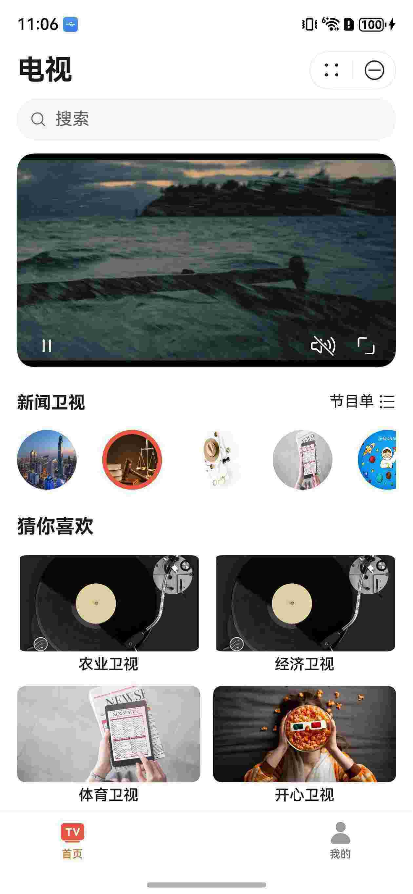
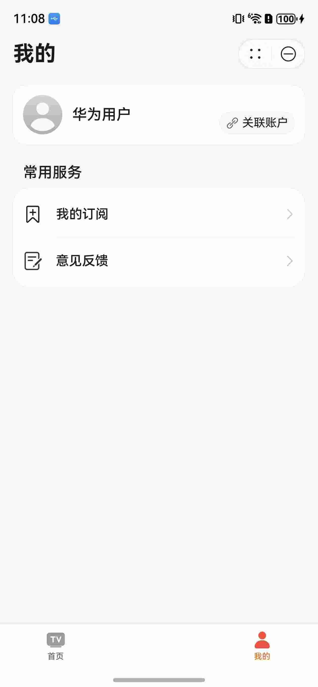
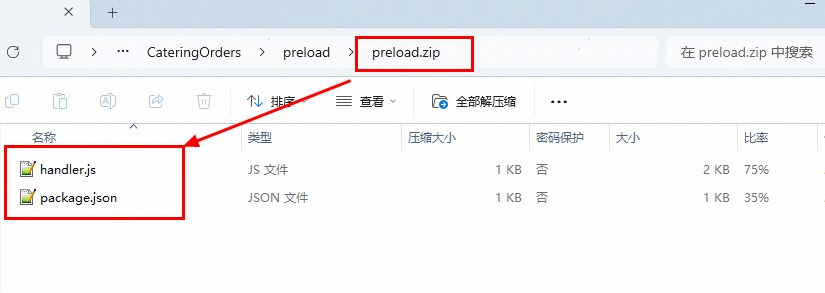
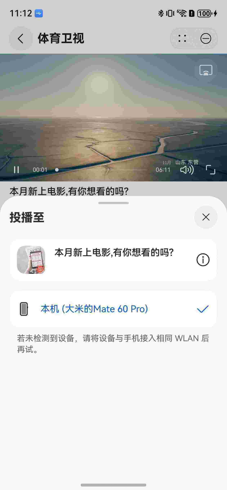
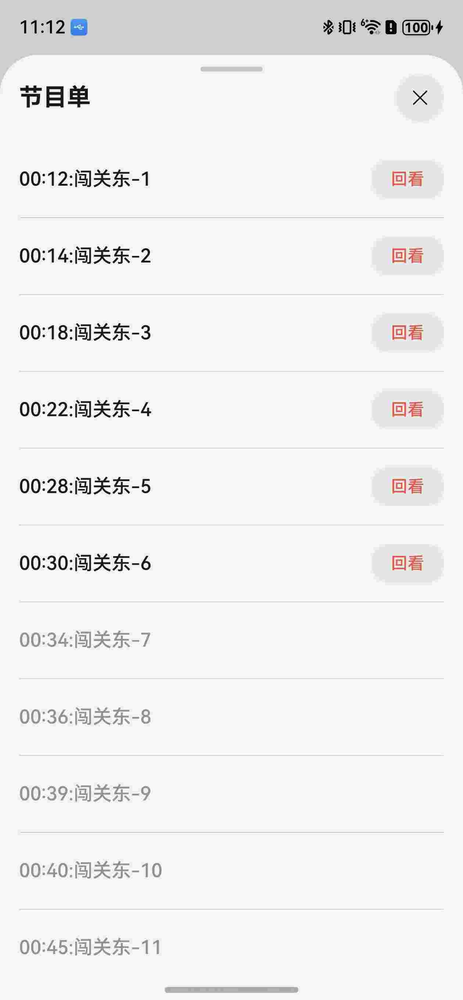

# 影视与直播（电视台）元服务模板快速入门

## 目录

- [功能介绍](#功能介绍)
- [约束与限制](#约束与限制)
- [快速入门](#快速入门)
- [示例效果](#示例效果)
- [开源许可协议](#开源许可协议)

## 功能介绍

您可以基于此模板直接定制元服务，也可以挑选此模板中提供的多种组件使用，从而降低您的开发难度，提高您的开发效率。

此模板提供如下组件，所有组件存放在工程根目录的components下，如果您仅需使用组件，可参考对应组件的指导链接；如果您使用此模板，请参考本文档。

| 组件                                    | 描述                                                         | 使用指导                                             |
| --------------------------------------- | ------------------------------------------------------------ | ---------------------------------------------------- |
| 通用问题反馈组件（module_feedback）     | 支持提交问题反馈、查看反馈记录                               | [使用指导](components/module_feedback/README.md)     |
| 通用图片预览组件（module_imagepreview） | 支持预览图片、双指放大、缩小，滑动预览                       | [使用指导](components/module_imagepreview/README.md) |
| 短视频滑动组件（module_swipeplayer）    | 支持短视频上下滑动、横竖屏切换、长按倍速、播放进度条拖动等能力 | [使用指导](components/module_swipeplayer/README.md)  |
| 一镜到底组件（module_transition）       | 支持卡片展开、搜索、查看大图一镜到底                         | [使用指导](components/module_transition/README.md)   |

本模板为电视台元服务提供了常用功能的开发样例，模板主要分首页、我的两大模块：

- 首页：电视台直播功能，电视回放，搜索，节目单回看等相关功能
- 我的：展示账号相关信息，意见反馈，我的订阅。

本模板已集成预加载、华为账号，只需做少量配置和定制即可快速实现页面的快速加载。

| 首页                                                    | 我的                                                    |
| ------------------------------------------------------- | ------------------------------------------------------- |
|  |  |

本模板主要页面及核心功能清单如下所示：

```ts
电视台元服务模板
 |-- 首页
 |    |-- 搜索
 |    |-- 直播
 |    |-- 猜你喜欢
 |    |-- 节目单
 |    └-- 电视详情
 └-- 我的
      |-- 用户信息
      |    |-- 修改头像
      |    └-- 关联解绑账号
      |-- 我的订阅
      |    |-- 查看订阅
      |    |-- 取消订阅
      └-- 意见反馈
           |-- 意见反馈
           └-- 反馈记录
```

本模板工程代码结构如下所示：

```
TelevisionNews
    ├── AppScope/                                           # 应用级配置
    │   ├── app.json5                                       # 应用配置文件
    │   └── resources/                                      # 应用资源文件
    ├── features/                                           # 功能模块
    │   ├── home/                                           # 电视新闻流首页模块
    │   │   └── src/main/ets/pages/TelevisionPage.ets
    │   └── mine/                                           # 我的页面模块
    │       └── src/main/ets/views/MinePage.ets
    ├── commons/                                            # 公共库
    │   ├── lib_common/                                     # 通用组件库
    │   ├── lib_search/                                     # 搜索组件
    │   ├── lib_tv_apis/                                    # 电视新闻API服务
    │   │   └── src/main/ets/https/
    │   │       ├── HomeService.ets                         # 首页API服务
    │   │       └── VideoService.ets                        # 视频API服务
    │   └── lib_tv_details/                                 # 电视详情库
    ├── components/                                         # 组件
    │   ├── module_swipeplayer/                             # 短视频滑动播放组件
    │   ├── module_transition/                              # 转场组件
    │   ├── module_feedback/                                # 反馈组件
    │   └── module_imagepreview/                            # 图片预览组件
    ├── products/                                           # 产品入口
    │   └── entry/                                          # 应用入口
    ├── screenshots/                                        # 项目截图
    ├── build-profile.json5                                 # 项目构建配置
    ├── oh-package.json5                                    # 项目依赖配置
    ├── CHANGELOG.md                                        # 版本更新日志
    └── README.md                                           # 项目说明文档
```

## 约束与限制

### 环境

- DevEco Studio版本：DevEco Studio 6.0.2 Release及以上
- HarmonyOS SDK版本：HarmonyOS 6.0.2 Release SDK及以上
- 设备类型：华为手机（包括双折叠和阔折叠）、平板
- 系统版本：HarmonyOS 6.0.0(20)及以上

### 权限

- 网络权限: ohos.permission.INTERNET, ohos.permission.GET_NETWORK_INFO
- 后台运行权限: ohos.permission.KEEP_BACKGROUND_RUNNING

## 快速入门

### 配置工程

在运行此模板前，需要完成以下配置：

1. 在AppGallery Connect创建元服务，将包名配置到模板中。

   a. 参考[创建元服务](https://developer.huawei.com/consumer/cn/doc/app/agc-help-create-atomic-service-0000002247795706)为元服务创建APP ID，并将APP ID与元服务进行关联。

   b. 返回应用列表页面，查看元服务的包名。

   c. 将模板工程根目录下AppScope/app.json5文件中的bundleName替换为创建元服务的包名。

2. 配置服务器域名。

   本模板接口均采用mock数据，由于元服务包体大小有限制，部分图片资源将从云端拉取，所以需为模板项目[配置服务器域名](https://developer.huawei.com/consumer/cn/doc/atomic-guides/agc-help-harmonyos-server-domain)，“httpRequest合法域名”需要配置为：`https://agc-storage-drcn.platform.dbankcloud.cn`

3. 配置华为账号服务。

   a. 将元服务的client ID配置到products/entry/src/main模块的[module.json5](./products/entry/src/main/module.json5)文件，详细参考：[配置Client ID](https://developer.huawei.com/consumer/cn/doc/atomic-guides/account-atomic-client-id)。

   b. 如需获取用户真实手机号，需要申请相关权限，详细参考：[申请账号权限](https://developer.huawei.com/consumer/cn/doc/atomic-guides/account-guide-atomic-permissions)。在端侧使用快速验证手机号码Button进行[验证获取手机号码](https://developer.huawei.com/consumer/cn/doc/atomic-guides/account-guide-atomic-get-phonenumber)。

4. 配置预加载服务。

   a. [开通预加载](https://developer.huawei.com/consumer/cn/doc/harmonyos-guides/cloudfoundation-enable-prefetch)。

   b. [开通云函数](https://developer.huawei.com/consumer/cn/doc/harmonyos-guides/cloudfoundation-enable-function)。

   c. 打包云函数包：**进入工程preload目录**，将目录下的文件压缩为zip文件，zip压缩包内不能含有目录。

   

   d. [创建云函数](https://developer.huawei.com/consumer/cn/doc/harmonyos-guides/cloudfoundation-create-and-config-function)。

   * “函数名称”为“preload”
   * “触发方式”为“事件调用”
   * “触发器类型”为“HTTP触发器”，其他保持默认
   * “代码输入类型”为“*.zip文件”，代码文件上传上一步打包的zip文件

   e. [配置安装预加载](https://developer.huawei.com/consumer/cn/doc/harmonyos-guides/cloudfoundation-prefetch-config)：安装预加载函数名称配置为上一步创建的云函数

5. 对元服务进行[手工签名](https://developer.huawei.com/consumer/cn/doc/harmonyos-guides/ide-signing#section297715173233)。

6. 添加手工签名所用证书对应的公钥指纹。详细参考：[配置公钥指纹](https://developer.huawei.com/consumer/cn/doc/app/agc-help-cert-fingerprint-0000002278002933)。

### 运行调试工程

1. 连接调试手机和PC。

2. 配置多模块调试：由于本模板存在多个模块，运行时需确保所有模块安装至调试设备。

   a. 运行模块选择“entry”。

   b. 下拉框选择“Edit Configurations”，在“Run/Debug Configurations”界面，选择“Deploy Multi Hap”页签，勾选上模板中所有模块。

   

   c. 点击"Run"，运行模板工程。

## 示例效果

| 电视详情                                                     | 投屏                                                    | 节目单                                                       |
| ------------------------------------------------------------ | ------------------------------------------------------- | ------------------------------------------------------------ |
|  |  |  |

## 开源许可协议

该代码经过[Apache 2.0 授权许可](http://www.apache.org/licenses/LICENSE-2.0)。