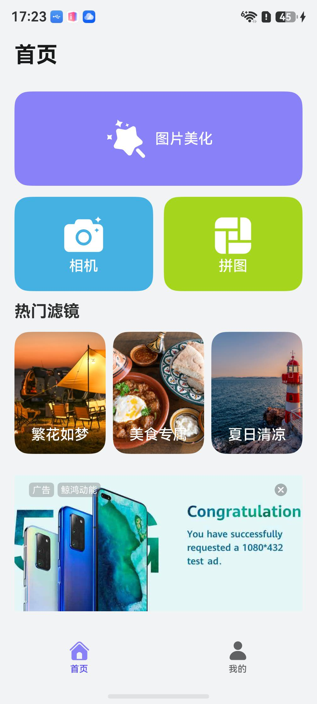
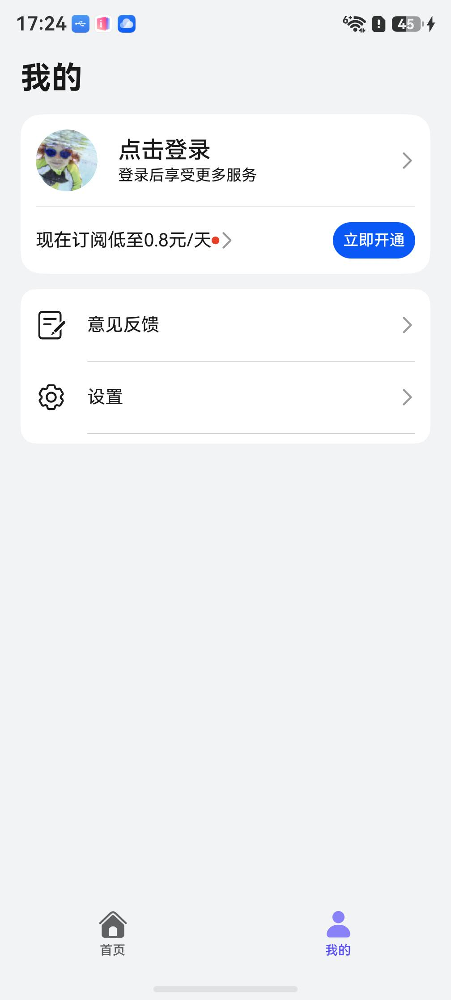
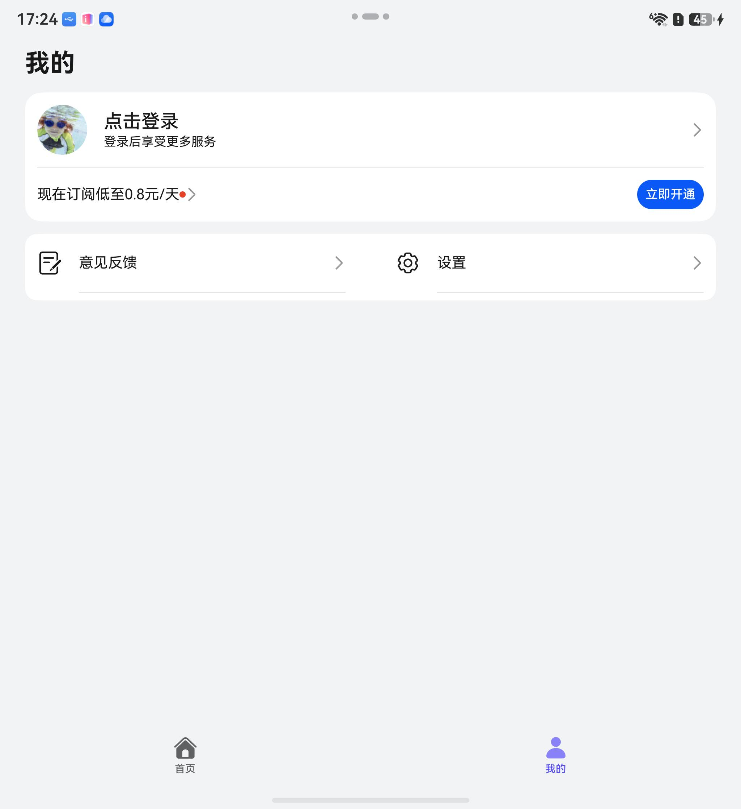
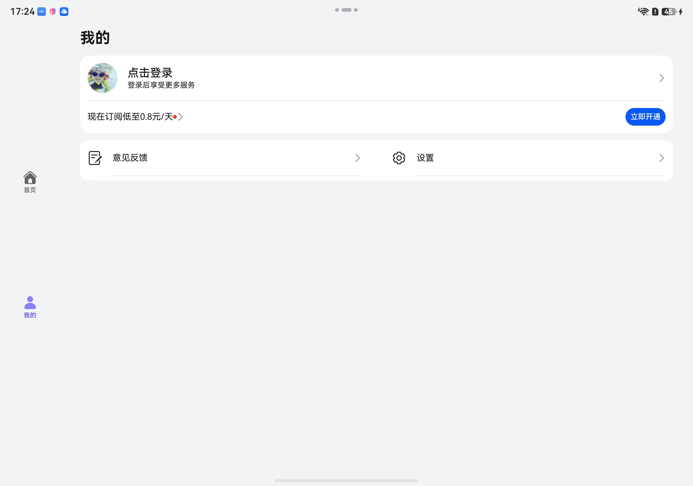
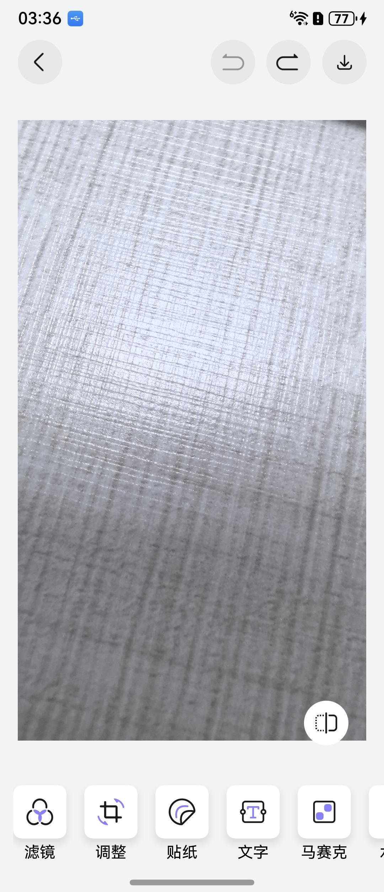
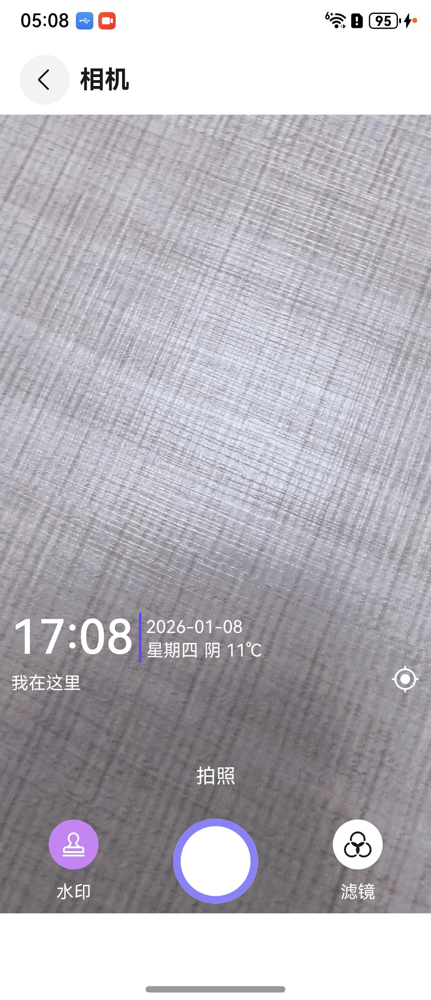

# 拍摄美化（图像美化）应用模板快速入门

## 目录

- [功能介绍](#功能介绍)
- [约束与限制](#约束与限制)
- [快速入门](#快速入门)
- [示例效果](#示例效果)
- [开源许可协议](#开源许可协议)

## 功能介绍

您可以基于此模板直接定制应用，也可以挑选此模板中提供的多种组件使用，从而降低您的开发难度，提高您的开发效率。

此模板提供如下组件，所有组件存放在工程根目录的components下，如果您仅需使用组件，可参考对应组件的指导链接；如果您使用此模板，请参考本文档。

| 组件                                      | 描述                                                         | 使用指导                                                 |
| ----------------------------------------- | ------------------------------------------------------------ | -------------------------------------------------------- |
| 通用登录组件（aggregated_login）          | 支持华为账号一键登录及其他方式登录（微信、手机号登录）       | [使用指导](./components/aggregated_login/README.md)      |
| 通用分享组件（aggregated_share）          | 支持分享到微信好友、朋友圈、QQ、微博等方式，支持碰一碰分享、生成海报、系统分享等功能 | [使用指导](components/aggregated_share/README.md)        |
| 通用应用内设置组件（app_setting）         | 支持设置开关切换、下拉选择、页面跳转、文本刷新等基础设置项   | [使用指导](./components/app_setting/README.md)           |
| 通用个人信息组件（collect_personal_info） | 支持编辑头像、昵称、姓名、性别、手机号、生日、个人简介等     | [使用指导](./components/collect_personal_info/README.md) |
| 通用问题反馈组件（feedback）              | 支持提交问题反馈、查看反馈记录                               | [使用指导](./components/feedback/README.md)              |
| 通用图片预览组件（image_preview）         | 本组件提供了图片预览相关功能。                               | [使用指导](components/image_preview/README.md)           |
| 通用会员组件（membership）                | 通过应用内支付实现会员开通的能力（自动续期订阅会员及非续期订阅会员），开发者可以根据业务需要快速实现应用会员开通 | [使用指导](./components/membership/README.md)            |

本模板为图片美化应用提供了常用功能的开发样例，提供了图片裁剪、添加文字、滤镜、贴纸、马赛克、水印等功能。模板主要分首页、我的两大模块：

* 首页：包含图片美化、相机、拼图三大入口，以及图片美化的滤镜、裁剪、贴纸、文字、马赛克、涂鸦、水印入口。

* 我的：提供账号管理、开通会员、设置、帮助与反馈等功能。

本模板已集成华为账号、开通会员等服务，只需做少量配置和定制即可快速实现华为账号登录、开通会员。

**【注意】**

* 本模版在未配置华为账号一键登录的情况下为保证正常使用本模版，均采用模拟用户信息登录，实际开发中请以具体业务为准。

|      | 直板机                                                     | 折叠屏                                                     | 平板                                                       |
| ---- | ---------------------------------------------------------- | ---------------------------------------------------------- | ---------------------------------------------------------- |
| 首页 |  |  |  |
| 我的 |  |  |  |

本模板主要页面及核心功能如下所示：

```ts
图片美化模板
 ├─ 首页
 │    ├─ 图片美化
 │    │    ├─ 图片裁剪
 │    │    ├─ 添加文字
 │    │    ├─ 添加滤镜   
 │    │    ├─ 添加贴纸
 │    │    ├─ 添加马赛克   
 │    │    ├─ 添加涂鸦
 │    │    └─ 添加水印
 │    │ 
 │    ├─ 相机
 │    │    ├─ 拍照
 │    │    ├─ 滤镜
 │    │    └─ 水印
 │    └─ 拼图
 │         ├─ 固定模式
 │         └─ 海报模式
 │    
 └─ 我的
      ├─ 登录
      │
      ├─ 开通会员
      │
      ├─ 意见反馈
      │
      └─ 设置
           ├─ 个人信息
           ├─ 隐私设置
           ├─ 清理缓存
           └─ 关于我们
```

本模板工程代码结构如下所示：

```ts
ImageProcessing  
├─commons
│  └─commonlib/src/main/ets
│     ├─components
│     │     BaseTitle.ets                           // 公共标题栏组件
│     │     CommonColorPicker.ets                   // 颜色选择组件
│     │     GlobalAttributeModifier.ets             // 全局属性修改组件
│     │     NoData.ets                              // 空数据组件
│     │     ToastLoading.ets                        // loading弹框组件
│     │     WaterMark.ets                           // 水印展示组件   
│     ├─constants
│     │     CommonEnums.ets                         // 公共枚举类
│     │     CommonModel.ets                         // 公共数据对象模型
│     │     Constants.ets                           // 常量
│     │     ErrorCode.ets                           // 错误码
│     │     GridRowColSetting.ets                   // 网格行列设置
│     │     Presets.ets                             // 滤镜数据
│     │─database
│     │     RdbHelper.ets                           // 关系型数据库操作类
│     │     UserDB.ets                              // 用户信息数据库表
│     │─http 
│     │     AxiosBase.ets                           // 网络请求基类
│     │     HttpApi.ets                             // API管理
│     │     MockAdapter.ets                         // mock适配器
│     │     MockApi.ets                             // mock的API
│     │─models
│     │     BaseViewModel.ets                       // ViewModel的基类
│     │     BreakpointModel.ets                     // 一多适配断点类
│     │     DateUtil.ets                            // 日期时间工具
│     │     User.ets                                // 用户信息类
│     │     UserInfo.ets                            // 用户属性
│     │     WindowSize.ets                          // 窗口大小
│     └─utils
│           BreakpointUtils.ets                     // 断点工具类
│           CommonUtil.ets                          // 通用工具类
│           ContextUtil.ets                         // 上下文工具类
│           Logger.ets                              // 日志类
│           PermissionUtil.ets                      // 权限请求工具类
│           PopViewUtils.ets                        // 视图弹出工具类
│           PreferenceUtil.ets                      // 持久化工具类
│           RdbUtil.ets                             // 关系型数据库操作工具类
│           RouterModule.ets                        // 导航模块
│           UIDialogUtil.ets                        // 弹框工具类
│           WindowUtil.ets                          // 窗口工具类
├─components
│     ├─aggregated_login                             // 通用登录组件
│     ├─aggregated_share                             // 通用分享组件
│     ├─app_setting                                  // 通用应用内设置组件
│     ├─collect_personal_info                        // 通用个人信息组件
│     ├─feedback                                     // 通用问题反馈组件
│     ├─image_preview                                // 通用图片预览组件
│     ├─membership                                   // 通用会员组件
│     └─module_advertisement                         // 广告组件
│
├─features
│     ├─camera/src/main/ets    
│     │   ├─pages
│     │   │   ImageDownloadPage.ets                   // 拍摄照片下载页
│     │   │   LutCameraPage.ets                       // 相机页面
│     ├─home/src/main/ets 
│     │   ├─pages
│     │   │   HomePage.ets                            // 首页
│     ├─mine/src/main/ets 
│     │   ├─pages
│     │   │   LoginPage.ets                           // 登录页
│     │   │   MinePage.ets                            // 我的
│     │   │   PersonalInfoPage.ets                    // 个人信息页
│     │   │   SettingPage.ets                         // 设置页
│     │   │   VipPage.ets                             // 会员页
│     └─photo_editing/src/main/ets 
│         └─pages
│             CollagePage.ets                         // 拼图页
│             PictureBeautification.ets               // 图片美化页
│             ShareImagePage.ets                      // 图片分享页     
└─product/phone
      └─src/main/ets   
          ├─pages
          │   Index.ets                              // 应用入口页
          │   MainEntry.ets                          // 主页面
          │   PrivacyPolicyPage.ets                  // 隐私授权页
          │   SplashPage.ets                         // 闪屏广告页
          └─widget                                   // 服务卡片
```

## 约束与限制

### 环境

* DevEco Studio版本：DevEco Studio 6.1.1 Release及以上
* HarmonyOS SDK版本：HarmonyOS 6.1.1 Release SDK及以上
* 设备类型：华为手机（包括双折叠和阔折叠）、华为平板
* HarmonyOS版本：HarmonyOS 5.1.0(18)及以上

### 权限

* 获取相机权限：ohos.permission.CAMERA
* 位置权限：ohos.permission.LOCATION
* 模糊位置权限：ohos.permission.APPROXIMATELY_LOCATION
* 网络权限：ohos.permission.INTERNET

## 快速入门

在运行此模板前，需要完成以下配置：

1. 在AppGallery Connect创建应用，将包名配置到模板中。

   a. 参考[创建应用](https://developer.huawei.com/consumer/cn/doc/app/agc-help-create-app-0000002247955506)为应用创建APP ID，并将APP ID与应用进行关联。

   b. 返回应用列表页面，查看应用的包名。

   c. 将根目录下AppScope/app.json5文件中的bundleName替换为创建应用的包名。

2. 配置华为账号服务。

   a. 将应用的client ID配置到product/phone模块的src/main/module.json5文件，详细参考：[配置Client ID](https://developer.huawei.com/consumer/cn/doc/harmonyos-guides/account-client-id)。

   b. 申请华为账号一键登录所需的权限，详细参考：[申请账号权限](https://developer.huawei.com/consumer/cn/doc/harmonyos-guides/account-config-permissions)。

3. 配置地图服务。

   a. 将元服务的client ID配置到product/phone/src/main路径下的module.json5文件，如果华为账号服务已配置，可跳过此步骤。

   b. [开通地图服务](https://developer.huawei.com/consumer/cn/doc/harmonyos-guides/map-config-agc)。

4. 配置应用内支付服务。

   a. 您需[开通商户服务](https://developer.huawei.com/consumer/cn/doc/start/merchant-service-0000001053025967)才能开启应用内购买服务。商户服务里配置的银行卡账号、币种，用于接收华为分成收益。

   b. 使用应用内购买服务前，需要打开应用内购买服务(HarmonyOS NEXT) 开关，此开关是应用级别的，即所有使用IAP Kit功能的应用均需执行此步骤，详情请参考[打开应用内购买服务API开关](https://developer.huawei.com/consumer/cn/doc/app/switch-0000001958955097)。

   c. 开启应用内购买服务(HarmonyOS NEXT) 开关后，开发者需进一步激活应用内购买服务 (HarmonyOS NEXT)，具体请参见[激活服务和配置事件通知](https://developer.huawei.com/consumer/cn/doc/app/parameters-0000001931995692)。

5. （可选）用户购买商品后，IAP服务器会在订单（消耗型/非消耗型商品）和订阅场景的某些关键事件发生时发送通知至开发者配置的订单/订阅通知接收地址，您可以根据关键事件的通知进行服务端的开发，详情请参考[激活服务和配置事件通知](https://developer.huawei.com/consumer/cn/doc/app/parameters-0000001931995692)。

6. 配置会员商品信息，详情请参考[配置商品信息](https://developer.huawei.com/consumer/cn/doc/harmonyos-guides/iap-config-product)。

7. 注册字体。图片美化添加文字功能如需其它字体需自行添加，可按以下方式导入字体。

   a. 将需要导入的字体文件放到product/phone/src/main/resources/rawfile下。

   b. 在进入到图片美化PictureBeautification.ets页面时，在aboutToAppear方法中注册字体
   ```typescript
   aboutToAppear(): void {
     // 注册字体
     this.getUIContext().getFont().registerFont(i{
       familyName: '兰亭黑体',
       familySrc: $rawfile('fonts/兰亭黑体.ttf')
     });
   }
   ```

8. 对应用进行[手工签名](https://developer.huawei.com/consumer/cn/doc/harmonyos-guides/ide-signing#section297715173233)。

9. 添加手工签名所用证书对应的公钥指纹。详细参考：[配置公钥指纹](https://developer.huawei.com/consumer/cn/doc/app/agc-help-cert-fingerprint-0000002278002933)。

### 运行调试工程

1. 连接调试手机和PC。

2. 对应用[手工签名](https://developer.huawei.com/consumer/cn/doc/harmonyos-guides/ide-signing#section297715173233)。

3. 菜单选择“Run > Run 'phone' ”或者“Run > Debug 'phone' ”，运行或调试模板工程。

## 示例效果

| 图片美化                                                           | 相机                                                         |
|----------------------------------------------------------------|------------------------------------------------------------|
|  |  |

## 开源许可协议

该代码经过[Apache 2.0 授权许可](http://www.apache.org/licenses/LICENSE-2.0)。
