# HarmonyOS 应用/元服务模板介绍

## 模板导览

<table>
  <tr>
    <th width="150px">分类</th>
    <th width="200px">模板名称</th>
    <th width="150px">文档</th>
  </tr>
  <tr>
    <td rowspan="5"><a href="#生活服务">生活服务</a></td>
    <td><a href="#政务应用模板">政务应用模板</a></td>
    <td><a href="./LifestyleAndServiceTemplate/GovernmentService/Application/README.md" target="_blank">快速开始</a></td>
  </tr>
  <tr>
    <td><a href="#医保元服务模板">医保元服务模板</a></td>
    <td><a href="./LifestyleAndServiceTemplate/AdministrativeAffairs/Application/README.md" target="_blank">快速开始</a></td>
  </tr>
  <tr>
    <td><a href="#美业元服务模板">美业元服务模板</a></td>
    <td><a href="./LifestyleAndServiceTemplate/LifeBeauty/README.md" target="_blank">快速开始</a></td>
  </tr>
  <tr>
    <td><a href="#家政元服务模板">家政元服务模板</a></td>
    <td><a href="./LifestyleAndServiceTemplate/HouseholdService/README.md" target="_blank">快速开始</a></td>
  </tr>
    <tr>
    <td><a href="#日历应用模板">日历应用模板</a></td>
    <td><a href="./LifestyleAndServiceTemplate/Calendar/README.md" target="_blank">快速开始</a></td>
  </tr>
  <tr>
    <td><a href="#休闲娱乐">休闲娱乐</a></td>
    <td><a href="#娱乐票务元服务模板">娱乐票务元服务模板</a></td>
    <td><a href="./LifestyleAndServiceTemplate/MuseumTicket/README.md" target="_blank">快速开始</a></td>
  </tr>
  <tr>
    <td rowspan="3"><a href="#旅游">旅游</a></td>
    <td><a href="#综合酒店元服务模板">综合酒店元服务模板</a></td>
    <td><a href="./TravelTemplate/FullServiceHotel/README.md" target="_blank">快速开始</a></td>
  </tr>
  <tr>
    <td><a href="#景区元服务模板">景区元服务模板</a></td>
    <td><a href="./TravelTemplate/TouristAttraction/README.md" target="_blank">快速开始</a></td>
  </tr>
  <tr>
   <td><a href="#民宿应用模板">民宿应用模板</a></td>
   <td><a href="./TravelTemplate/TouristAttraction/README.md" target="_blank">快速开始</a></td>
  </tr>
    <tr>
    <td rowspan="2"><a href="#购物">购物</a></td>
    <td><a href="#商城元服务模板">商城元服务模板</a></td>
    <td><a href="./ShoppingTemplate/ComprehensiveMall/README.md" target="_blank">快速开始</a></td>
  </tr>
  <tr>
    <td><a href="#优惠券场景模板">优惠券场景模板</a></td>
    <td><a href="./ShoppingTemplate/CouponsModule/README.md" target="_blank">快速开始</a></td>
  </tr>
  <tr>
    <td rowspan="3"><a href="#美食">美食</a></td>
    <td><a href="#点餐元服务模板">点餐元服务模板</a></td>
    <td><a href="./FoodAndDrinkTemplate/CateringOrders//README.md" target="_blank">快速开始</a></td>
  </tr>
  <tr>
    <td><a href="#茶饮元服务模板">茶饮元服务模板</a></td>
    <td><a href="./FoodAndDrinkTemplate/TeaDrinkOrders/README.md" target="_blank">快速开始</a></td>
  </tr>
  <tr>
    <td><a href="#菜谱应用模板">菜谱应用模板</a></td>
    <td><a href="./FoodAndDrinkTemplate/Recipes/README.md" target="_blank">快速开始</a></td>
  </tr>
  <tr>
    <td><a href="#金融理财">金融理财</a></td>
    <td><a href="#理财元服务模板">理财元服务模板</a></td>
    <td><a href="./FinanceTemplate/FinancialManagement/README.md" target="_blank">快速开始</a></td>
  </tr>
  <tr>
    <td rowspan="2"><a href="#教育">教育</a></td>
    <td><a href="#课程助手元服务模板">课程助手元服务模板</a></td>
    <td><a href="./EducationTemplate/SchoolLife//README.md" target="_blank">快速开始</a></td>
  </tr>
  <tr>
    <td><a href="#艺术培训元服务模板">艺术培训元服务模板</a></td>
    <td><a href="./EducationTemplate/ArtTraining/Application/README.md" target="_blank">快速开始</a></td>
  </tr>
  <tr>
    <td><a href="#医疗">医疗</a></td>
    <td><a href="#医院元服务模板">医院元服务模板</a></td>
    <td><a href="./MedicalTemplate/MedicalCare/README.md" target="_blank">快速开始</a></td>
  </tr>
  <tr>
    <td><a href="#社交">社交</a></td>
    <td><a href="#相亲交友元服务模板">相亲交友元服务模板</a></td>
    <td><a href="./SocialTemplate/SocialDating/README.md" target="_blank">快速开始</a></td>
  </tr>
  <tr>
    <td><a href="#工具">工具</a></td>
    <td><a href="#智慧家居应用模板">智慧家居应用模板</a></td>
    <td><a href="./ToolsTemplate//SmartHome/README.md" target="_blank">快速开始</a></td>
  </tr>
  <tr>
    <td rowspan="2"><a href="#儿童">儿童</a></td>
    <td><a href="#儿童教育应用模板">儿童教育应用模板</a></td>
    <td><a href="./KidsTemplate/ChildrenEducation/README.md" target="_blank">快速开始</a></td>
  </tr>
  <tr>
    <td><a href="#月子中心元服务模板">月子中心元服务模板</a></td>
    <td><a href="./KidsTemplate/PostpartumCareCenter/README.md" target="_blank">快速开始</a></td>
  </tr>
  <tr>
    <td rowspan="2"><a href="#商务">商务</a></td>
    <td><a href="#办公考勤应用模板">办公考勤应用模板</a></td>
    <td><a href="./BusinessTemplate/OfficeAttendance/README.md" target="_blank">快速开始</a></td>
  </tr>
  <tr>
    <td><a href="#企业招聘应用模板">企业招聘应用模板</a></td>
    <td><a href="./BusinessTemplate/EnterpriseRecruitment/README.md" target="_blank">快速开始</a></td>
  </tr>
  <tr>
    <td><a href="#汽车">汽车</a></td>
    <td><a href="#汽车保养应用模板">汽车保养应用模板</a></td>
    <td><a href="./CarsTemplate/CarBeautyCare/README.md" target="_blank">快速开始</a></td>
  </tr>
  <tr>
    <td><a href="#新闻">新闻</a></td>
    <td><a href="#新闻元服务模板">新闻元服务模板</a></td>
    <td><a href="./NewsTemplate/News/README.md" target="_blank">快速开始</a></td>
  </tr>
  <tr>
    <td><a href="#阅读与工具书">阅读与工具书</a></td>
    <td><a href="#阅读应用模板">阅读应用模板</a></td>
    <td><a href="./BooksAndReferenceTemplate/BookRead/README.md" target="_blank">快速开始</a></td>
  </tr>
  <tr>
    <td rowspan="3"><a href="#出行导航">出行导航</a></td>
    <td><a href="#公交出行应用模板">公交出行应用模板</a></td>
    <td><a href="./NavigationTemplate/BusTravel/README.md" target="_blank">快速开始</a></td>
  </tr>
  <tr>
    <td><a href="#地铁出行元服务模板">地铁出行元服务模板</a></td>
    <td><a href="./NavigationTemplate/Metro/README.md" target="_blank">快速开始</a></td>
  </tr>
  <tr>
   <td><a href="#航空出行元服务模板">航空出行元服务模板</a></td>
   <td><a href="./NavigationTemplate/AirTrip/Application/README.md" target="_blank">快速开始</a></td>
  </tr>
</table>

## 生活服务

### 政务应用模板

**功能介绍**

本模板为政务应用提供了常用功能的开发样例，模板主要分首页、办事、互动、和我的四大模块：

- 首页：主要提供服务查询，身份码，资讯公告，热门服务，我的收藏，最近使用，专题服务等功能

- 服务：展示全部服务列表，支持搜索所需服务。

- 资讯：提供民声在线，客服问答等相关功能

- 我的：展示个人信息、关于我们，并支持意见反馈。

本模板已集成华为账号、广告、定位、推送等服务，只需做少量配置和定制即可快速实现华为账号的登录、定位、推送等功能，从而快速完成相关功能的实现。

<a href="./LifestyleAndServiceTemplate/GovernmentService/Application/README.md" target="_blank">详细说明</a>

| 首页                                                                                     | 办事                                                                                         | 我的                                                                                     | 互动                                                                                            |
| ---------------------------------------------------------------------------------------- | -------------------------------------------------------------------------------------------- | ---------------------------------------------------------------------------------------- | ----------------------------------------------------------------------------------------------- |
|  |  | 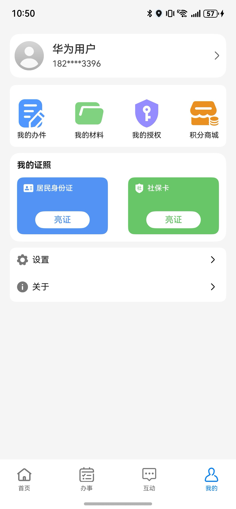 | 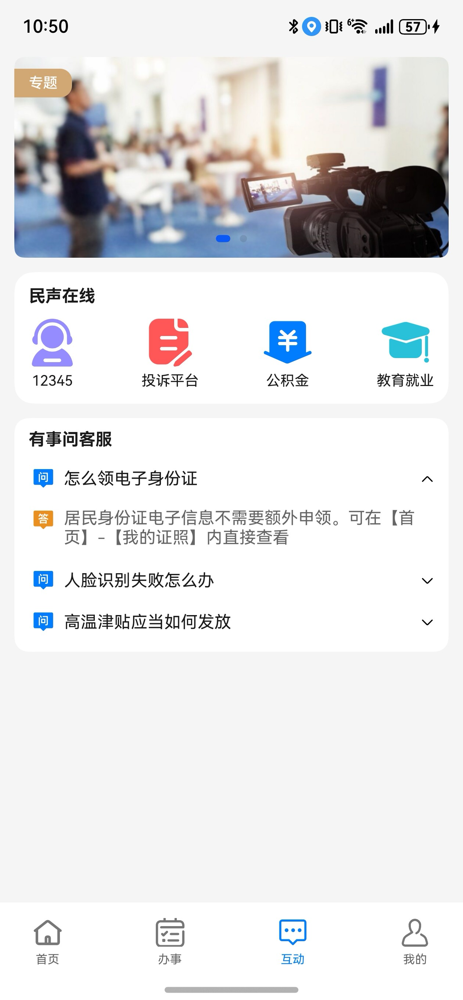 |

### 医保元服务模板

**功能介绍**

本模板为医保元服务提供了常用功能的开发样例，模板主要分首页、服务、医保码、资讯、和我的五大模块：

- 首页：主要提供医保码展示，长辈模式，以及热点查询，便民服务等功能

- 服务：展示全部服务列表，支持搜索所需服务。

- 资讯：展示当前医保相关资讯，支持上拉刷新、下拉加载、以及跳转 h5 查看资讯详情

- 医保码：展示当前账号绑定的医保码，

- 我的：展示个人信息、关于我们，切换头像，并支持意见反馈。

本模板已集成华为账号、定位、地图等服务，只需做少量配置和定制即可快速实现华为账号的登录、位置定位等功能，从而快速完成相关功能的实现。

<a href="./LifestyleAndServiceTemplate/AdministrativeAffairs/Application/README.md" target="_blank">详细说明</a>

| 首页                                                                                         | 服务                                                                                            | 我的                                                                                         | 资讯                                                                                         |
| -------------------------------------------------------------------------------------------- | ----------------------------------------------------------------------------------------------- | -------------------------------------------------------------------------------------------- | -------------------------------------------------------------------------------------------- |
|  | 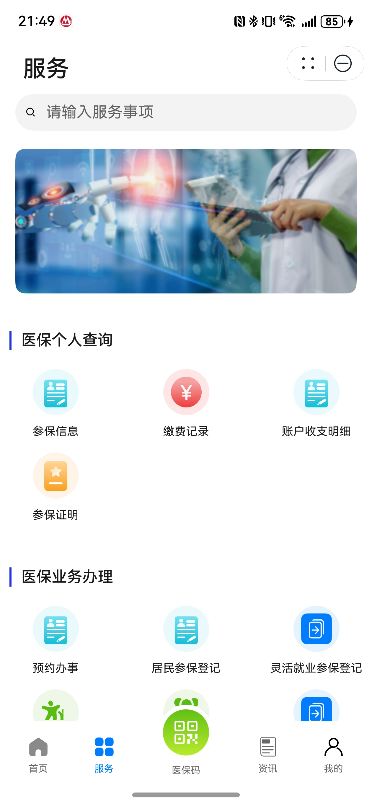 | 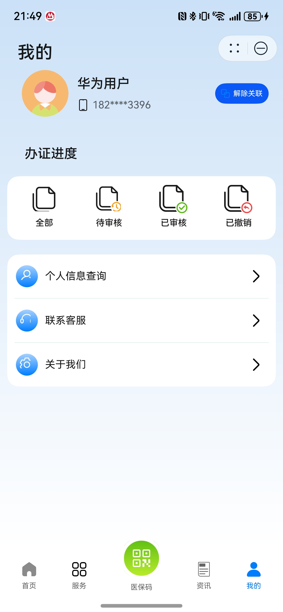 |  |

### 美业元服务模板

**功能介绍**

本模板为美容行业（美甲美睫）类元服务提供了常用功能的开发样例，模板主要分首页和我的两大模块：

- 首页：提供商品卡、团购、推荐商品的展示，支持购买和预约。
- 我的：展示会员卡信息，支持订单、商品卡、团购信息的管理。

本模板已集成华为账号、推送、华为支付等服务，只需做少量配置和定制即可快速实现华为账号的登录、预约提醒、购买商品等功能。

<a href="./LifestyleAndServiceTemplate/LifeBeauty/README.md" target="_blank">详细说明</a>

| 首页                                                                                    | 我的                                                                                    |
| --------------------------------------------------------------------------------------- | --------------------------------------------------------------------------------------- |
|  |  |

### 家政元服务模板

**功能介绍**

本模板为家政类元服务提供了常用功能的开发样例，模板主要分首页、全部服务和我的三大模块：

- 首页：提供主要商品轮播图、常用类别菜单和精选服务列表，支持城市切换、商品搜索、商品价格咨询以及商品购买。

- 全部服务：展示全部品类的商品列表，支持切换城市、搜索商品。

- 我的：展示个人信息、我的订单、服务和工具以及部分商品列表，支持修改个人信息、管理订单、管理地址等。

本模板已集成华为账号、支付等服务，只需做少量配置和定制即可快速实现华为账号的登录、购买商品等功能。

<a href="./LifestyleAndServiceTemplate/HouseholdService/README.md" target="_blank">详细说明</a>

| 首页                                                                         | 全部服务                                                                             | 我的                                                                         |
| ---------------------------------------------------------------------------- | ------------------------------------------------------------------------------------ | ---------------------------------------------------------------------------- |
|  |  |  |

### 日历应用模板

**功能介绍**

本模板为日历应用提供了常用功能的开发样例，模板主要分为万年历、黄历、和我的三大模块：

- 万年历：主要提供日历服务查询、吉日工具查询、日期查询、节日节气查询等工具。
- 黄历：根据选择日历展示黄历内容，支持切换日期查看今日宜以及今日忌。
- 我的：展示个人信息、华为账号一键登录、切换主题等。

<a href="./LifestyleAndServiceTemplate/Calendar/README.md" target="_blank">详细说明</a>

| 万年历                                                                                          | 黄历                                                                                             | 我的                                                                                          |
| ----------------------------------------------------------------------------------------------- | ------------------------------------------------------------------------------------------------ | --------------------------------------------------------------------------------------------- |
| 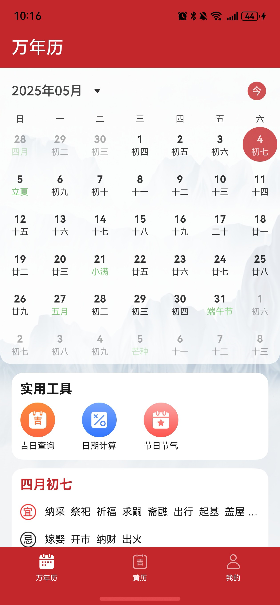 | 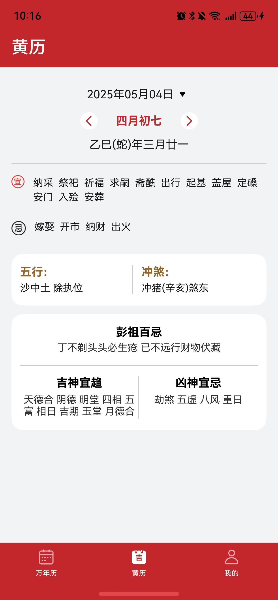 | 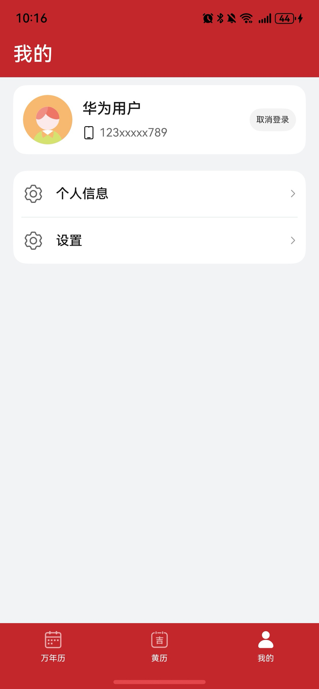 |

## 休闲娱乐

### 娱乐票务元服务模板

**功能介绍**

本模板为博物馆票务类元服务提供了常用功能的开发样例，模板主要分首页、我的预定和我的三大模块：

- 首页：提供用户信息、推荐展览的展示，支持常用参观人编辑、参观预约、特展购票以及讲解服务、省博介绍、场馆地图、停车缴费等的查看。

- 我的预定：展示不同类型的订单，以及订单的处理。

- 我的：支持账号关联、个人信息的编辑及隐私政策的查看。

本模板已集成华为账号、地图、支付等服务，只需做少量配置和定制即可快速实现华为账号的登录及展览预定等功能。

<a href="./LifestyleAndServiceTemplate/MuseumTicket/README.md" target="_blank">详细说明</a>

| 首页                                                                      | 会员                                                                               | 我的                                                                       |
| ------------------------------------------------------------------------- | ---------------------------------------------------------------------------------- | -------------------------------------------------------------------------- |
|  |  | 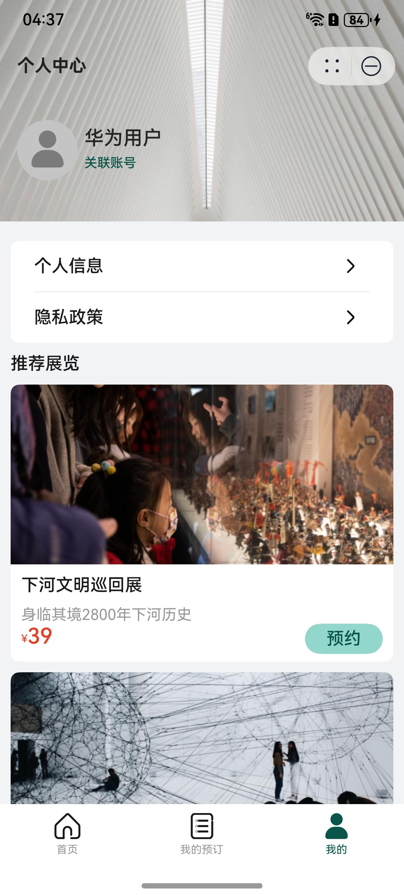 |

## 旅游

### 综合酒店元服务模板

**功能介绍**

本模板为综合酒店类元服务提供了常用功能的开发样例，模板主要分首页、会员和我的三大模块：

- 首页：提供公告、会员信息、热销商品的展示，支持酒店、餐饮、宴会厅的预订。

- 会员：展示不同等级的会员卡片和等级说明。

- 我的：展示会员等级，支持订单、账号的管理。

本模板已集成华为账号、地图、支付等服务，只需做少量配置和定制即可快速实现华为账号的登录、酒店位置定位导航和购买商品等功能。

<a href="./TravelTemplate/FullServiceHotel/README.md" target="_blank">详细说明</a>

| 首页                                                            | 会员                                                            | 我的                                                            |
| --------------------------------------------------------------- | --------------------------------------------------------------- | --------------------------------------------------------------- |
|  |  |  |

### 景区元服务模板

**功能介绍**

本模板为景区旅游类元服务提供了常用功能的开发样例，模板主要分首页、门票、导览、订单和我的五大模块：

- 首页：提供景区轮播展示、公告信息、主要服务导航、热门景点推荐、攻略游记推荐。
- 门票：展示门票列表，支持门票的预订。
- 导览：提供景点、餐饮、住宿、卫生间的位置导航。
- 订单：支持对所有订单的管理。
- 我的：支持账号登录，提供订单入口，支持旅客信息、地址的管理。

本模板已集成华为账号、通话、地图、音频等服务，只需做少量配置和定制即可快速实现华为账号的登录、一键拨打服务电话、景点位置定位导航、景点信息讲解和购买门票和商品等功能。

<a href="./TravelTemplate/TouristAttraction/README.md" target="_blank">详细说明</a>

| 首页                                                                     | 门票                                                                       | 导览                                                                      | 订单                                                                      | 我的                                                                     |
| ------------------------------------------------------------------------ | -------------------------------------------------------------------------- | ------------------------------------------------------------------------- | ------------------------------------------------------------------------- | ------------------------------------------------------------------------ |
|  |  |  | 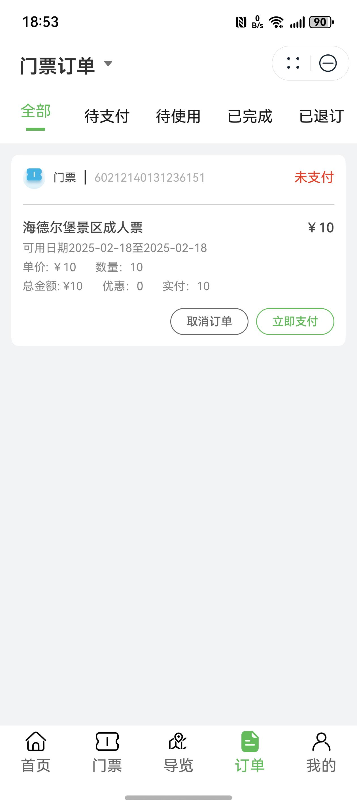 |  |

### 民宿应用模板

**功能介绍**

本模板为民宿住宿类应用提供了常用功能的开发样例，模板主要分首页、发现、地图、商城和我的五大模块：

- 首页：提供民宿轮播展示、民宿信息查看、入住时间选择、热门房型选择。
- 发现：展示发现列表，展示发现详情。
- 地图：提供民宿地理位置展示、民宿导航。
- 商城：展示商城商品列表、商品详情和商品购买。
- 我的：提供订单入口，支持旅客信息、投诉建议、客服列表、关于我们。

本模板已集成华为账号、通话、地图、华为支付等服务，只需做少量配置和定制即可快速实现华为账号的登录、一键拨打服务电话、民宿位置定位导航、订房下单、购买商品等功能。

<a href="./TravelTemplate/HomeStay/README.md" target="_blank">详细说明</a>

| 首页                                                     | 发现                                                          | 地图                                                    | 商城                                                     | 我的                                                     |
| -------------------------------------------------------- | ------------------------------------------------------------- | ------------------------------------------------------- | -------------------------------------------------------- | -------------------------------------------------------- |
| 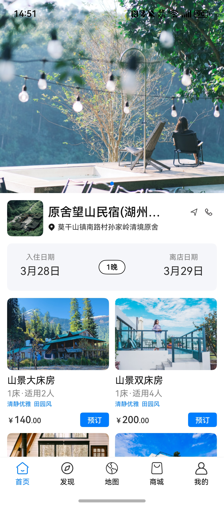 | 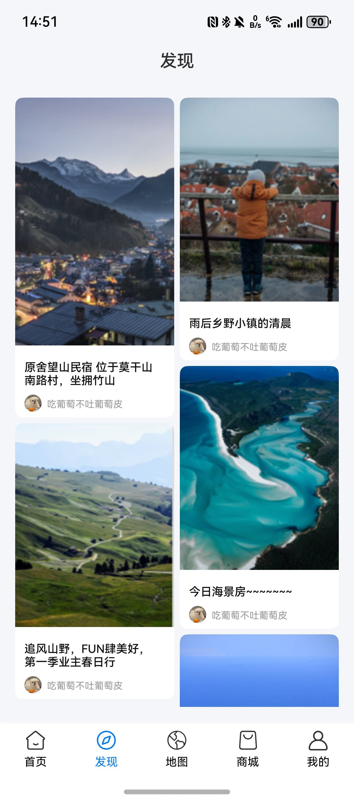 | 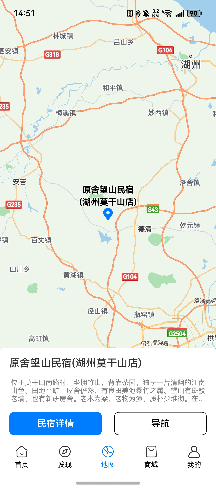 |  | 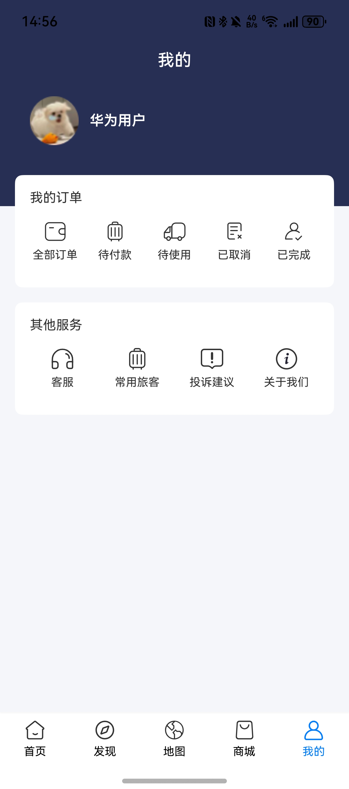 |

## 购物

### 商城元服务模板

**功能介绍**

本模板为综合商城元服务提供了常用功能的开发样例，模板主要分首页、分类、购物车、和我的四大模块：

- 首页：主要提供商品搜索、卡片轮播、分类选择、商品浏览等功能。
- 分类：按照类别展示商品列表和购买商品。
- 购物车：展示已添加的商品，支持商品数量的修改，商品删除、结算等操作。
- 我的：展示个人信息、订单管理入口以及联系客服功能。

<a href="./ShoppingTemplate/ComprehensiveMall/README.md" target="_blank">详细说明</a>

本模板已集成华为账号、通话、华为支付等服务，只需做少量配置和定制即可快速实现华为账号的登录、一键拨打服务电话、商品购买等功能。

| 首页                                                               | 分类                                                                   | 购物车                                                               | 我的                                                                  |
| ------------------------------------------------------------------ | ---------------------------------------------------------------------- | -------------------------------------------------------------------- | --------------------------------------------------------------------- |
|  |  |  |  |

### 优惠券场景模板

**功能介绍**

本模板为提供优惠券类元服务提供了常用功能的开发样例，模板主要分首页、订单和我的三大模块：

- 首页：提供商品的展示。
- 订单：提供订单过程选择优惠券的能力。
- 我的：提供查看全部优惠券的入口。

<a href="./ShoppingTemplate/CouponsModule/README.md" target="_blank">详细说明</a>

| 首页                                                           | 订单                                                            | 我的                                                           |
| -------------------------------------------------------------- | --------------------------------------------------------------- | -------------------------------------------------------------- |
|  |  |  |

## 美食

### 点餐元服务模板

**功能介绍**

本模板为餐饮点餐类元服务提供了常用功能的开发样例，模板主要分点餐、订单和我的三大模块：

- 点餐：提供店铺、优惠券、商品详情、购物车的展示，支持提交订单。
- 订单：支持对不同状态下订单的管理。
- 我的：展示账号相关信息，支持钱包、优惠券和积分的查看，以及帮助中心。

本模板已集成预加载、华为账号、地图、华为支付、通话等服务，只需做少量配置和定制即可快速实现页面的快速加载、华为账号的登录、商家位置定位导航、购买餐饮和联系商家等功能。

<a href="./FoodAndDrinkTemplate/CateringOrders/README.md" target="_blank">详细说明</a>

| 点餐                                                                            | 订单                                                                           | 我的                                                                           |
| ------------------------------------------------------------------------------- | ------------------------------------------------------------------------------ | ------------------------------------------------------------------------------ |
|  | 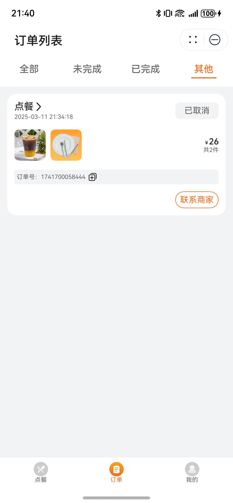 |  |

### 茶饮元服务模板

**功能介绍**

本模板为餐饮茶饮类元服务提供了常用功能的开发样例，模板主要分首页、点单、我的订单和我的四大模块：

- 首页：展示账号相关信息、选择点单方式、选择店铺、展示优惠活动和会员活动。
- 点单：提供店铺、优惠券、商品详情、购物车的展示，支持提交订单。
- 我的订单：支持对不同状态下订单的管理。
- 我的：展示账号相关信息，支持会员信息、优惠券和积分的查看，支持外卖配置地址管理，以及联系客服。

本模板已集成华为账号、地图、华为支付、通话等服务，只需做少量配置和定制即可快速实现华为账号的登录、商家位置定位导航、购买茶饮和联系商家等功能。

<a href="./FoodAndDrinkTemplate/TeaDrinkOrders/README.md" target="_blank">详细说明</a>

| 首页                                                                           | 点单                                                                            | 我的订单                                                                                | 我的                                                                           |
| ------------------------------------------------------------------------------ | ------------------------------------------------------------------------------- | --------------------------------------------------------------------------------------- | ------------------------------------------------------------------------------ |
|  | 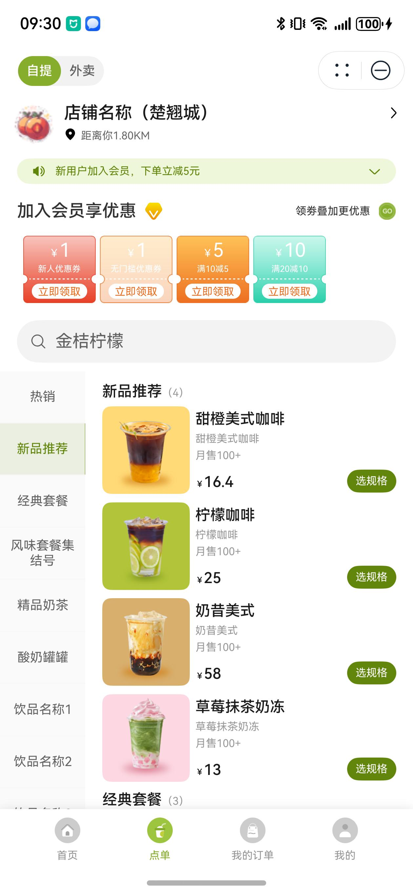 | 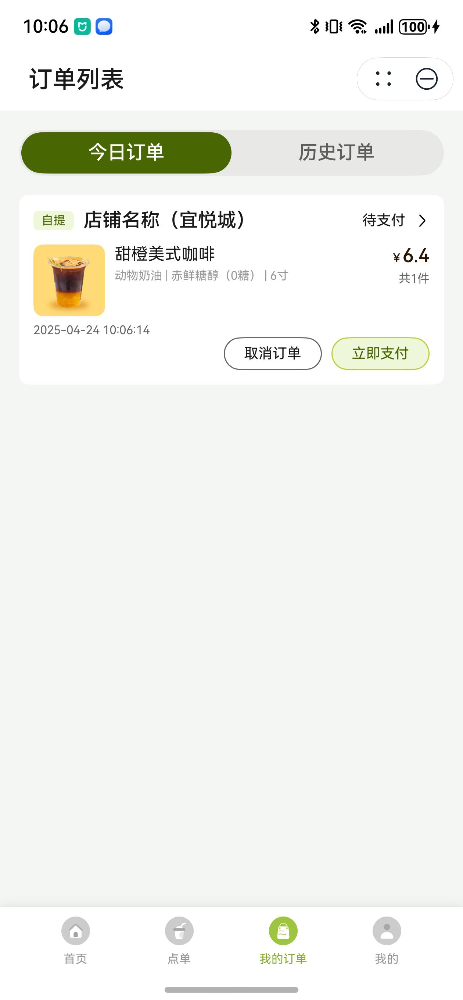 | 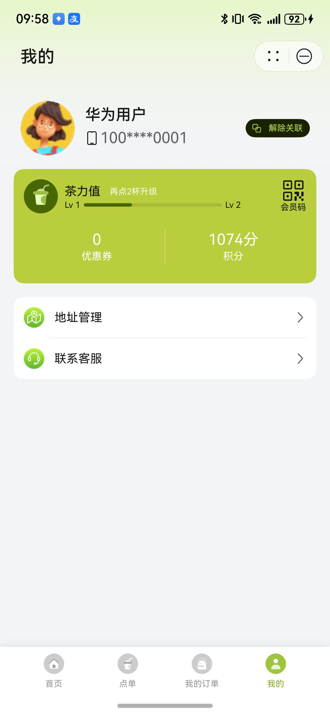 |

### 菜谱应用模板

**功能介绍**

本模板为美食菜谱类应用提供了常用功能的开发样例，模板主要分首页、分类和我的三大模块：

- 首页：展示菜谱信息、按名称搜索、按类别搜索。
- 分类：按分类展示菜谱，支持查看详情、收藏菜谱、加入菜篮子和管理菜篮子。
- 我的：展示账号相关信息，展示我的菜谱和上传菜谱，展示我的收藏菜谱，展示浏览记录，以及设置等功能。

本模板已集成华为账号服务，只需做少量配置和定制即可快速实现华为账号的登录等功能。

<a href="./FoodAndDrinkTemplate/Recipes/README.md" target="_blank">详细说明</a>

| 首页                                                                                              | 分类                                                                                                  | 我的                                                                                              |
| ------------------------------------------------------------------------------------------------- | ----------------------------------------------------------------------------------------------------- | ------------------------------------------------------------------------------------------------- |
| 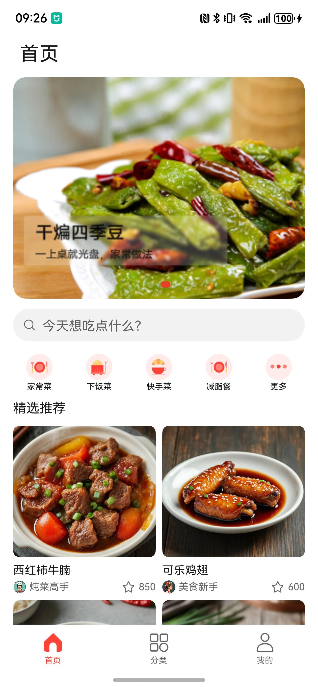 | 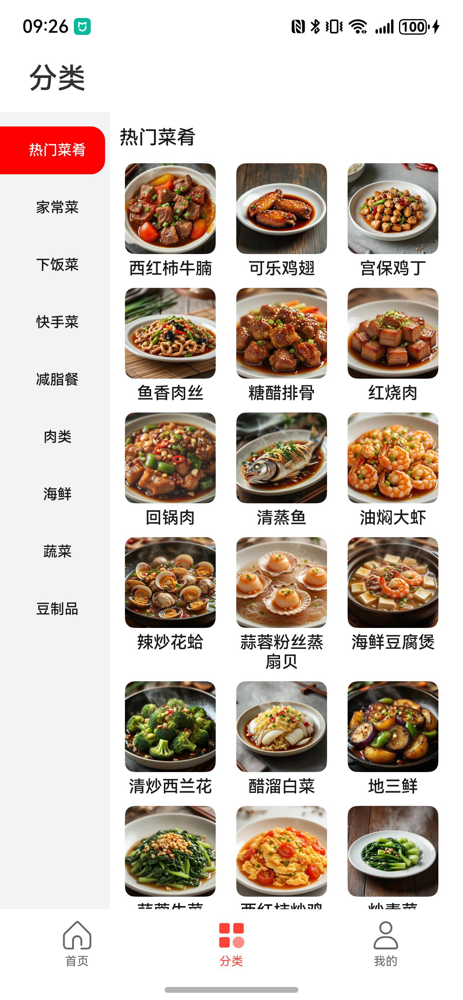 | 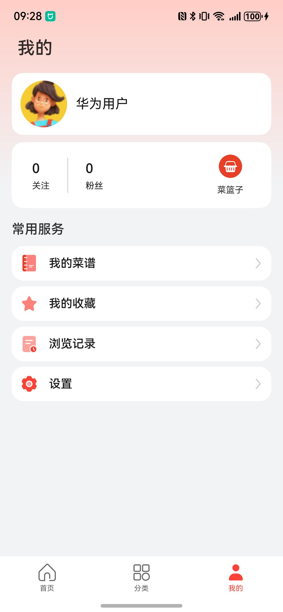 |

## 金融理财

### 理财元服务模板

**功能介绍**

本模板为理财类应用提供了常用功能的开发样例，模板主要分理财和我的两大模块：

- 理财：提供公告、热销商品的展示等。
- 我的：展示持仓、交易、协议，提供账号的管理、产品的赎回、追加购买等。

本模板已集成华为账号、支付等服务，只需做少量配置和定制即可快速实现华为账号的登录和购买商品等功能。

<a href="./FinanceTemplate/FinancialManagement/README.md" target="_blank">详细说明</a>

| 理财                                                                                   | 我的                                                                                   |
| -------------------------------------------------------------------------------------- | -------------------------------------------------------------------------------------- |
|  | 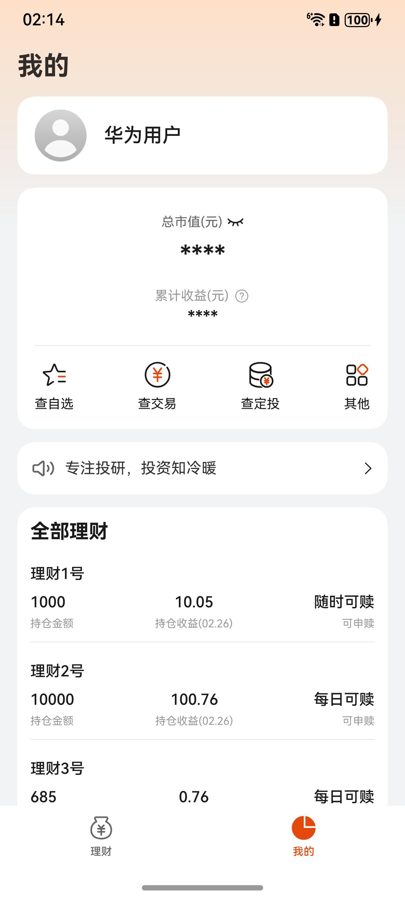 |

## 教育

### 课程助手元服务模板

**功能介绍**

本模板为课程助手类元服务提供了常用功能的开发样例，模板主要分首页和我的两大模块：

- 首页：展示今日课程、明日课程，以及学期所有课程。进入课程支持根据签到地点、签到码进行签到。
- 我的：展示账号相关信息，支持修改用户昵称、头像。

本模板已集成华为账号、定位服务，只需做少量配置和定制即可快速实现华为账号的登录、基于位置签到等功能。

<a href="./EducationTemplate/SchoolLife//README.md" target="_blank">详细说明</a>

### 艺术培训元服务模板

**功能介绍**

本模板为艺术培训类元服务提供了常用功能的开发样例，模板主要分首页、课程中心、打卡活动和我的四大模块：

- 首页：提供课程中心、直播课程、关于我们和附近门店功能入口，展示直播课程列表和热门课程列表，展示门店位置地图和门店信息。
- 课程中心：展示用户可购买的课程列表，支持课程搜索、过滤和排序功能，支持课程详情查看和下单。
- 打卡活动：展示用户可参与的打卡列表，支持参与打卡活动并上传打卡内容，支持查看历史打卡记录。
- 我的：展示用户个人头像及昵称，支持个人资料编辑，支持订单管理、个人课程和打卡活动查看、课程表查看、学员卡查看等。

本模板为端云一体化模板，已集成华为账号、地图、日历、支付等服务，只需做少量配置和定制即可快速实现课程购买、打卡活动参与、课程表查看等功能。

<a href="./EducationTemplate/ArtTraining/Application/README.md" target="_blank">详细说明</a>

| 首页                                                                               | 课程中心                                                                             | 打卡活动                                                                              | 我的                                                                               |
| ---------------------------------------------------------------------------------- | ------------------------------------------------------------------------------------ | ------------------------------------------------------------------------------------- | ---------------------------------------------------------------------------------- |
|  |  | 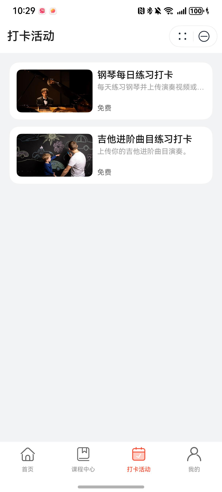 | 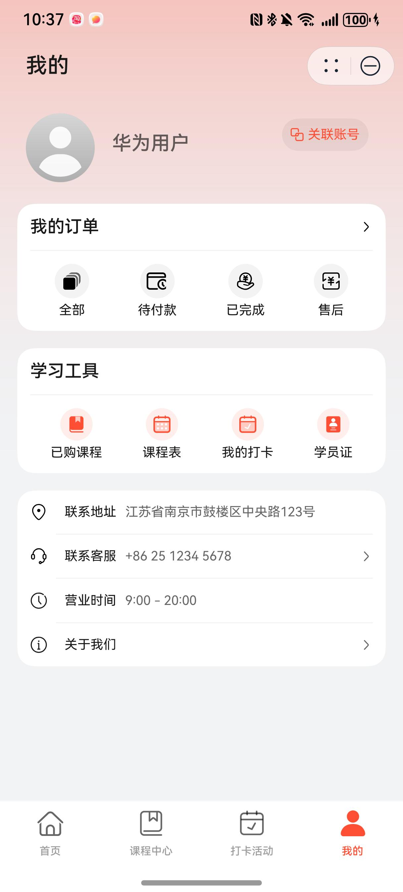 |

## 医疗

### 医院元服务模板

**功能介绍**

本模板为医疗类元服务提供了常用功能的开发样例，模板主要分首页、消息和我的三大模块：

- 首页：提供就诊人基本信息，以及常用服务的入口。
- 消息：支持查看医院动态信息，以及我接收到的消息。
- 我的：支持账户管理，登录后可以管理就诊人信息，查询挂号记录和就诊报告。

本模板已集成华为账号、地图、支付、推送等服务，只需做少量配置和定制即可快速实现华为账号的登录并一键获取账号的手机号和头像、医院位置定位导航和缴费等功能。

<a href="./MedicalTemplate/MedicalCare/README.md" target="_blank">详细说明</a>

| 首页                                                                | 按科室挂号                                                          | 按医生挂号                                                          | 挂号支付                                                            | 报告查询                                                            |
| ------------------------------------------------------------------- | ------------------------------------------------------------------- | ------------------------------------------------------------------- | ------------------------------------------------------------------- | ------------------------------------------------------------------- |
|  |  |  | 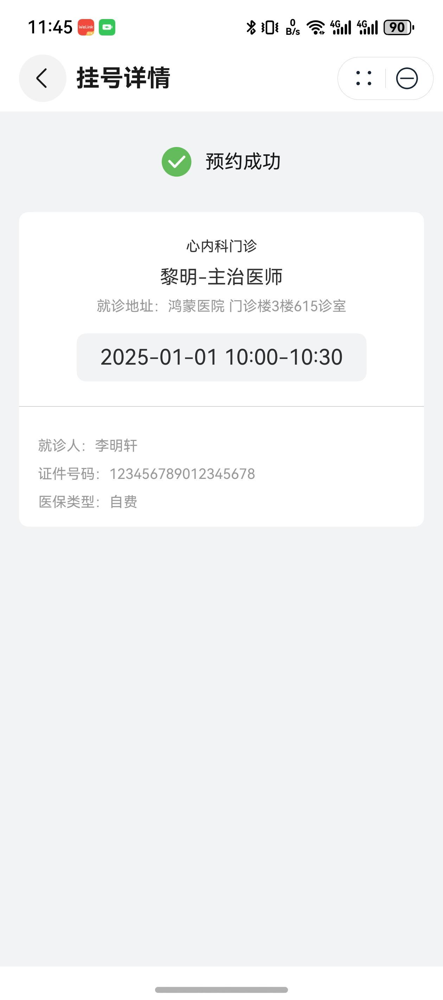 | 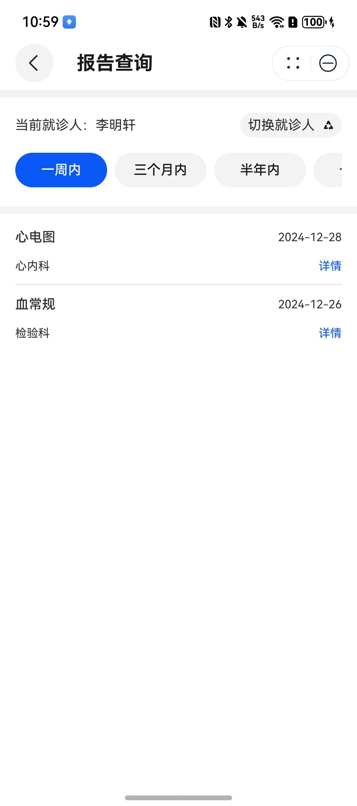 |

## 社交

### 相亲交友元服务模板

**功能介绍**

本模板为社交类相亲交友平台的元服务提供了常用功能的开发样例，提供了用户推荐、相亲活动、广场、会员、个人中心等能力。模板主要分首页、广场、会员、我的四大模块：

- 首页：分为“推荐”和“活动”两个页签，默认的“推荐”页签展示系统推荐的用户信息。“活动”页签展示活动信息。
- 广场：分为“推荐”和“关注”两个页签。“推荐”页签展示系统推荐的（热门）的动态信息，“关注”页签展示当前用户关注的用户发布的动态信息。
- 会员：展示会员特权描述和会员订购入口。
- 我的：展示用户的个人信息、操作记录、以及择偶标准、我的动态、我的订单、设置的管理。

本模板已集成华为账号、支付等服务，只需做少量配置和定制即可快速实现华为账号的登录和购买会员套餐等功能。

<a href="./SocialTemplate/SocialDating/README.md" target="_blank">详细说明</a>

| 首页                                                                              | 广场                                                                        | 会员                                                                          | 我的                                                                            |
| --------------------------------------------------------------------------------- | --------------------------------------------------------------------------- | ----------------------------------------------------------------------------- | ------------------------------------------------------------------------------- |
|  |  |  |  |

## 工具

### 智慧家居应用模板

**功能介绍**

本模板构建了一款包含设备添加、设备管理的智能家居应用，并构建了设备模拟端，实现与该模板的蓝牙、MQTT 交互，从而整体功能的闭环展示。模板主要分首页、产品和我的三大模块：

- 首页：提供添加设备的功能，支持自动扫描、扫码和手动添加三种方式。

- 产品：展示月激活量大的产品列表。

- 我的：提供账号管理、授权管理、意见反馈、帮助中心等功能。

<a href="./ToolsTemplate//SmartHome/README.md" target="_blank">详细说明</a>

| 首页                                                         | 产品                                                            | 我的                                                        | 设备模拟                                                                  |
| ------------------------------------------------------------ | --------------------------------------------------------------- | ----------------------------------------------------------- | ------------------------------------------------------------------------- |
|  |  |  | 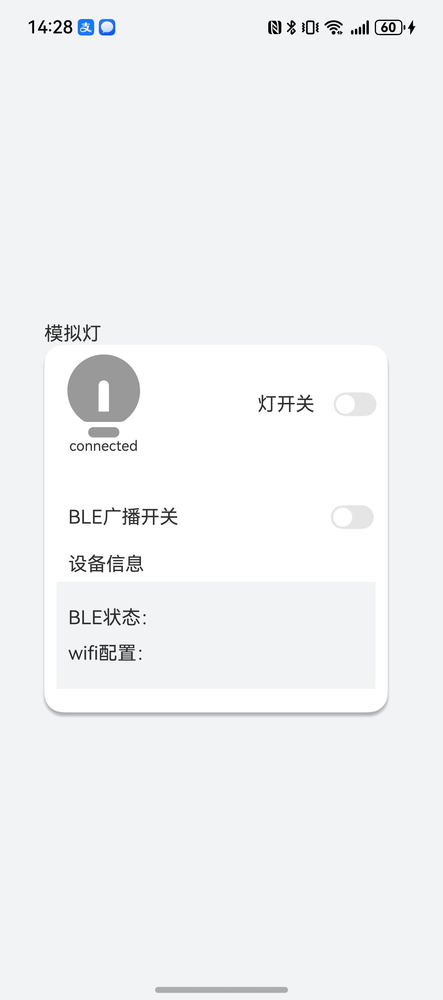 |

## 儿童

### 儿童教育应用模板

**功能介绍**

本模板为儿童教育类应用提供了常用功能的开发样例，模板主要分首页、VIP 和我的三大模块：

1、首页：通过精选、看动画、英语乐园、儿歌、学汉语多个 Tab 页展示不同类型的视频内容。

2、vip：提供会员信息展示，以及会员套餐的开通。

3、我的：提供登录，会员信息、观看历史管理，联系我们等功能。

本模板已集成华为账号服务，只需做少量配置和定制即可快速实现华为账号登录。

<a href="./KidsTemplate/ChildrenEducation/README.md" target="_blank">详细说明</a>

| 首页                                                                               | 会员                                                                              | 我的                                                                               |
| ---------------------------------------------------------------------------------- | --------------------------------------------------------------------------------- | ---------------------------------------------------------------------------------- |
| 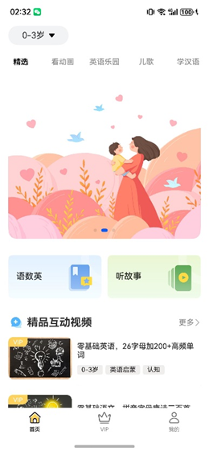 |  |  |

### 月子中心元服务模板

**功能介绍**

本模板为母婴行业（月子中心）类应用提供了常用功能的开发样例，模板主要分为首页、门店、活动和我的四大模块：

- 首页：提供品牌服务信息、附近门店情况的展示，支持电话咨询、参观预约等功能。

- 门店：根据附近或者城市获取门店信息，提供门店详情和套餐价目介绍，支持参观预约、地址导航、日程添加、手机号关联和电话咨询等功能。

- 活动：根据附近或者城市、活动类型获取活动信息，提供活动详情介绍，支持活动报名、电话咨询等功能。

- 我的：支持展示用户信息和隐私条款，支持门店、活动预约记录的管理、意见反馈、华为账号一键登录等功能。

本模板已集成华为账号、地图等服务，只需做少量配置和定制即可快速实现华为账号的登录、定位导航和预约门店、活动等功能。

<a href="./KidsTemplate/PostpartumCareCenter/README.md" target="_blank">详细说明</a>

| 首页                                                               | 门店                                                               | 活动                                                               | 我的                                                               |
| ------------------------------------------------------------------ | ------------------------------------------------------------------ | ------------------------------------------------------------------ | ------------------------------------------------------------------ |
|  |  |  |  |

## 商务

### 办公考勤应用模板

**功能介绍**

本模板为商务办公考勤类应用提供了常用功能的开发样例，模板主要分打卡、待办、日程、我的四大模块：

- 打卡：提供考勤打卡、打卡记录查看、快捷打卡设置功能。

- 待办：提供日常待办任务的管理，支持待办创建、修改，列表显示待处理与已处理待办记录。

- 日程：提供日常日程管理，支持创建、修改日程以及同步日程至系统日历进行提醒。

- 我的：提供账号信息查看、头像修改、退出登录功能。

本模板已集成华为账号、地图、日历等服务，只需做少量配置和定制即可快速实现华为账号的登录、考勤打卡、待办和日程管理等功能。

<a href="./BusinessTemplate/OfficeAttendance/README.md" target="_blank">详细说明</a>

| 打卡                                                                 | 待办                                                                | 日程                                                                  | 我的                                                              |
| -------------------------------------------------------------------- | ------------------------------------------------------------------- | --------------------------------------------------------------------- | ----------------------------------------------------------------- |
| 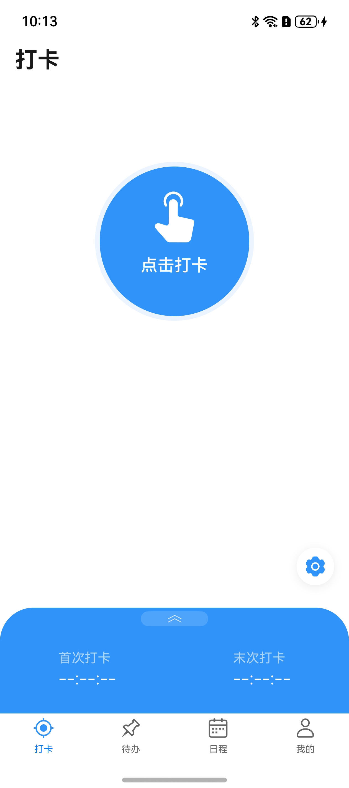 |  | 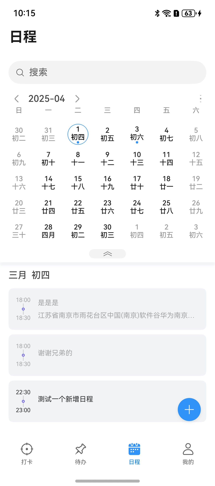 | 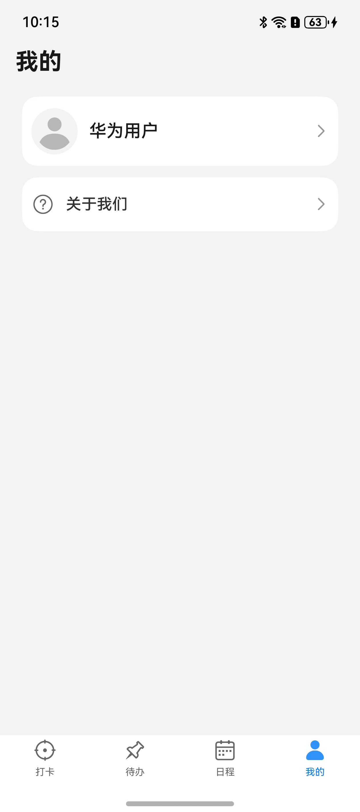 |

### 企业招聘应用模板

**功能介绍**

本模板为企业招聘类应用提供了常用功能的开发样例，模板主要分首页、职位和我的三大模块：

- 首页：提供企业招聘 banner 轮播图、公司文化信息、企业生活等宣传介绍。

- 职位：支持不同地域和岗位类型的职位搜索、职位详情查看、简历投递和职位收藏功能。

- 我的：支持账号信息、简历信息、职位收藏信息和投递记录的查询和维护。

本模板已集成华为账号等服务，只需做少量配置和定制即可快速实现华为账号的登录功能。

<a href="./BusinessTemplate/EnterpriseRecruitment/README.md" target="_blank">详细说明</a>

| 首页                                                                                             | 职位                                                                                          | 我的                                                                                    |
| ------------------------------------------------------------------------------------------------ | --------------------------------------------------------------------------------------------- | --------------------------------------------------------------------------------------- |
|  | 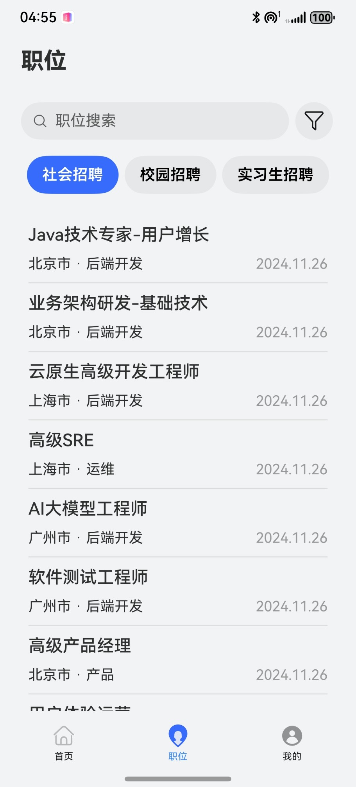 |  |

## 汽车

### 汽车保养应用模板

**功能介绍**

本模板为汽车美容保养类应用提供了常用功能的开发样例，模板主要分首页、汽车服务和我的三大模块：

- 首页：提供附近店铺和推荐套餐的展示，支持保养、美容、预约等功能。

- 汽车服务：展示不同的优惠券、以及详细展示汽车美容、轮胎护理、保养等服务功能。

- 我的：展示我的订单、我的预约、我的优惠券、我的车辆、联系人信息

本模板已集成华为账号、地图服务，只需做少量配置和定制即可快速实现华为账号登录、店铺定位、基于位置查找店铺等功能。

<a href="./CarsTemplate/CarBeautyCare/README.md" target="_blank">详细说明</a>

| 首页                                                               | 汽车服务                                                               | 我的                                                       |
| ------------------------------------------------------------------ | ---------------------------------------------------------------------- | ---------------------------------------------------------- |
| 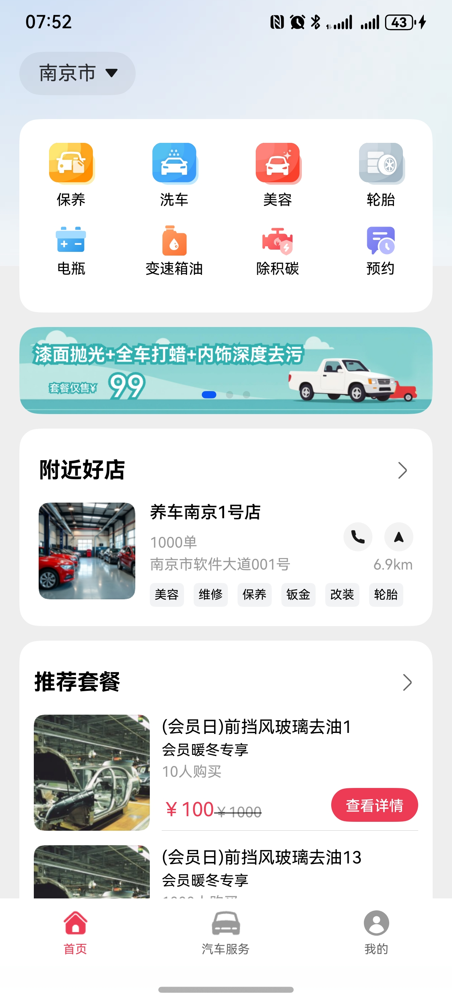 | 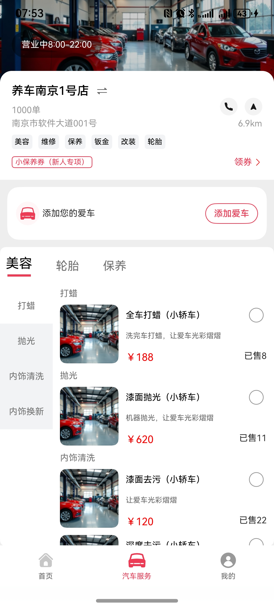 |  |

## 新闻

### 新闻元服务模板

**功能介绍**

本模板为新闻类元服务提供了常用功能的开发样例，模板主要分首页、视频和我的三大模块：

- 首页：提供热点新闻和本地新闻的展示，支持查看新闻详情，对新闻进行收藏、评论。
- 视频：提供新闻视频的展示和观看。
- 我的：提供账号信息的管理，以及收藏、评论、浏览记录的查看。

本模板已集成华为账号，只需做少量配置和定制即可快速实现页面的快速加载、华为账号的登录等功能。

<a href="./NewsTemplate/News/README.md" target="_blank">详细说明</a>

| 首页                                                             | 视频                                                             | 我的                                                             |
| ---------------------------------------------------------------- | ---------------------------------------------------------------- | ---------------------------------------------------------------- |
|  | 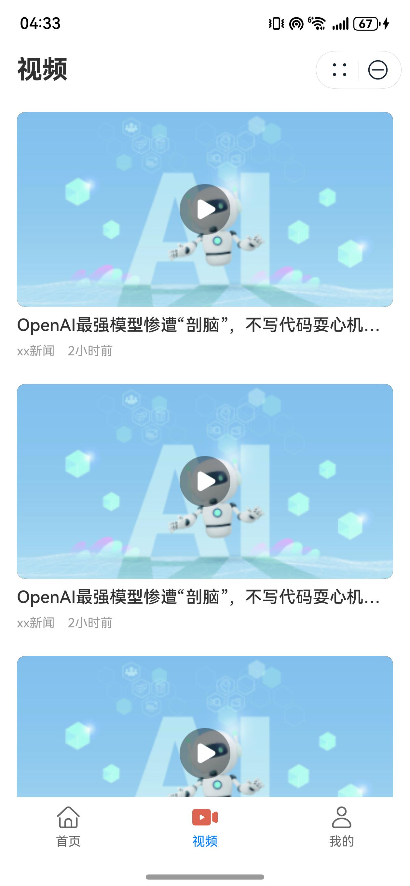 |  |

## 阅读与工具书

### 阅读应用模板

**功能介绍**

本模板为阅读听书类应用提供了常用功能的开发案例，模板主要分阅读、书架和我的三大模块：

- 阅读：支持 epub 标准格式电子书加载、工具栏（目录跳转、字体修改、亮度与颜色修改等功能）、添加书架和听书功能。
- 书架：支持电子书列表和浏览历史展示。
- 我的：支持华为账号登录、修改个人信息、借阅证与借阅信息查看等功能。

<a href="./BooksAndReferenceTemplate/BookRead/README.md" target="_blank">详细说明</a>

| 阅读                                                                  | 书架                                                                    | 我的                                                                |
| --------------------------------------------------------------------- | ----------------------------------------------------------------------- | ------------------------------------------------------------------- |
| 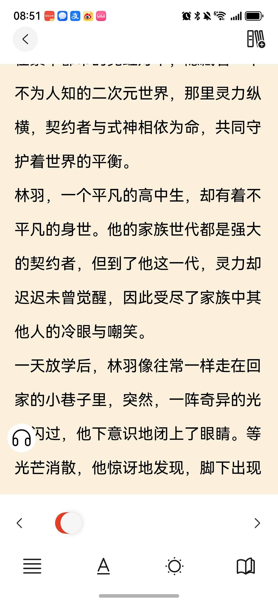 | 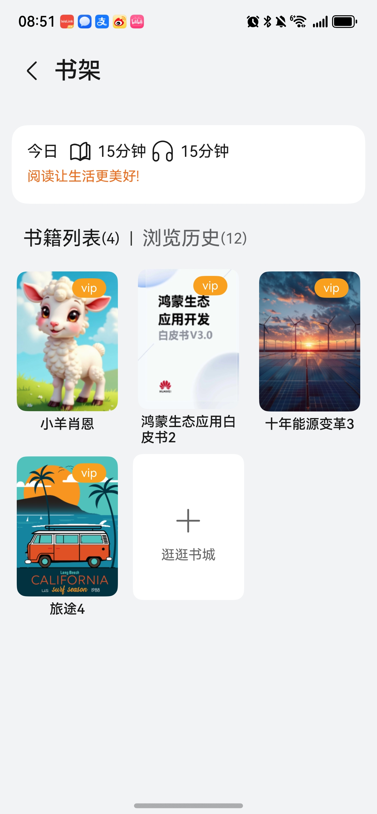 | 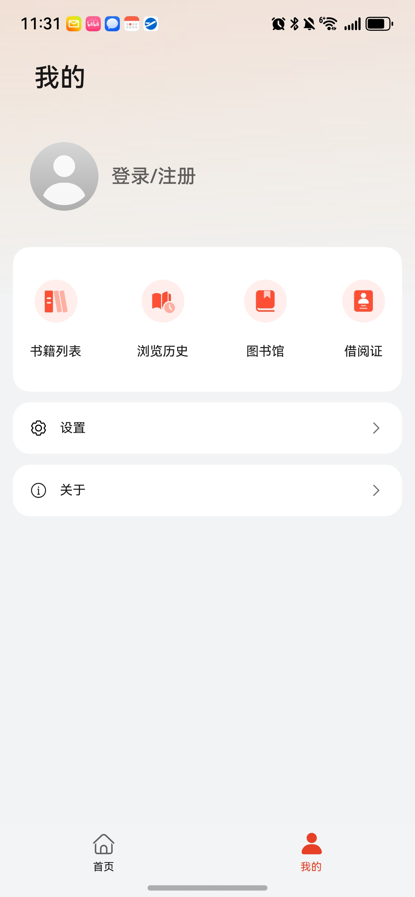 |

## 出行导航

### 公交出行应用模板

**功能介绍**

本模板为公交类应用提供了常用功能的开发样例，模板主要分为首页，出行，乘车码和我的四大模块：

- 首页：可查看最近新闻热点，开通、打开乘车码，查看禁携物品和寻找遗失物品。
- 出行：实时公交页可查看附近站点信息，包括该路线最近车辆离当前位置的距离和时间，点击对应线路可以查看该线路的地图展示。路径规划中可以根据输入的起点和终点查询推荐路线。
- 乘车码：可进行开卡，享受乘车扫码服务。
- 我的：登录后可管理钱包和订单记录，还可以设置个人信息、联系客服。

本模板已集成华为账号、地图等服务，只需做少量配置和定制即可快速实现华为账号的登录、乘车购票等功能。

<a href="./NavigationTemplate/BusTravel/README.md" target="_blank">详细说明</a>

| 首页                                                                         | 出行                                                                                        | 乘车码                                                                           | 我的                                                                         |
| ---------------------------------------------------------------------------- | ------------------------------------------------------------------------------------------- | -------------------------------------------------------------------------------- | ---------------------------------------------------------------------------- |
|  | 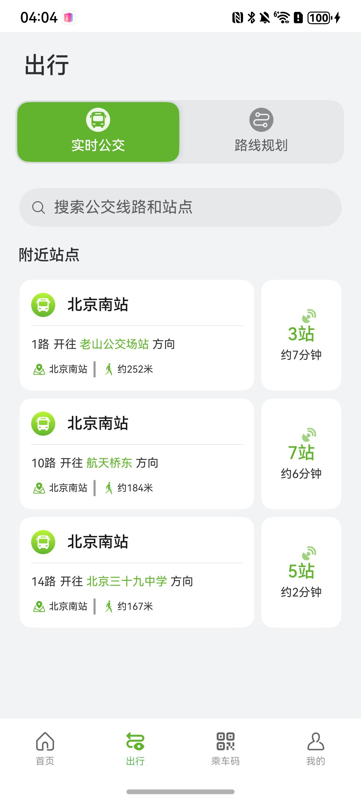 |  |  |

### 地铁出行元服务模板

**功能介绍**

本模板为出行类元服务提供了常用功能的开发样例，模板主要分首页，出行导航，乘车码，和我的四大模块：

- 首页：提供展示站点信息、优惠购票，联系客服的功能，以及新闻公告的展示。
- 出行导航：提供出行地点的定位，以及前往地点的地铁路径规划功能。
- 乘车码：提供扫码乘车、日票、乘车记录展示，线网图的展示，开发票，以及卡包管理功能。
- 我的：展示账号相关信息，以及查看用户协议和隐私政策。

本模板已集成华为账号、定位服务，只需做少量配置和定制即可快速实现华为账号的登录、基于位置导航等功能。

<a href="./NavigationTemplate/Metro/README.md" target="_blank">详细说明</a>

| 首页                                                        | 出行导航                                                        | 乘车码                                                         | 我的                                                        |
| ----------------------------------------------------------- | --------------------------------------------------------------- | -------------------------------------------------------------- | ----------------------------------------------------------- |
| 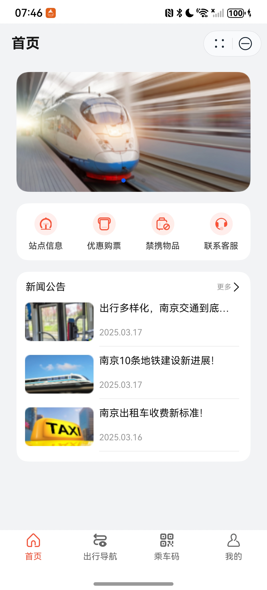 | 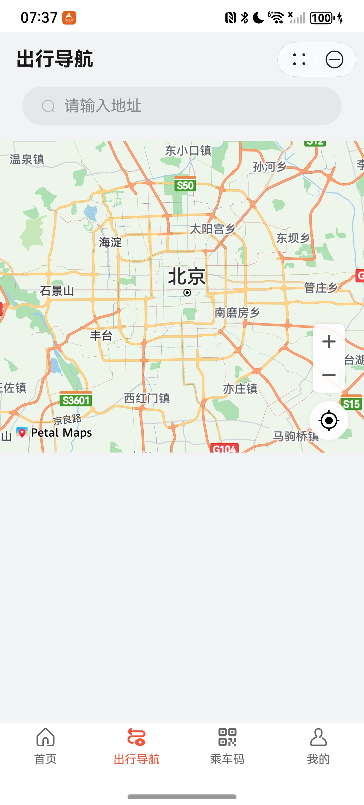 | 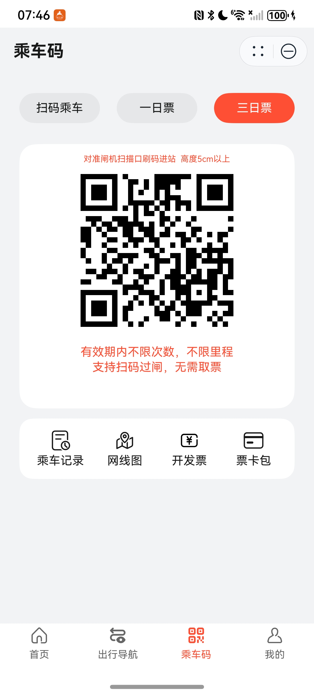 | 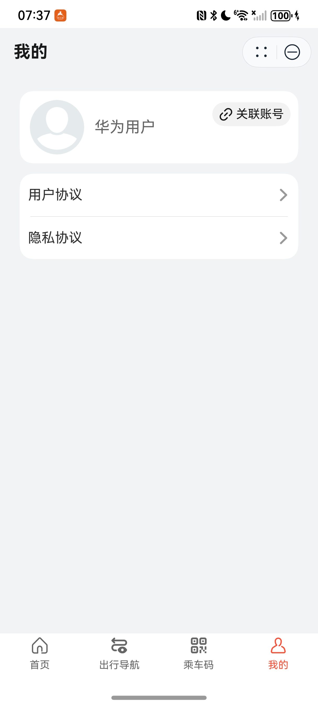 |

### 航空出行元服务模板

**功能介绍**

本模板为航空出行元服务提供了常用功能的开发样例，模板主要分首页、行程、航班动态、和我的四大模块：

- 首页：提供单程机票预订，乘机、行李托运、改签、退票等操作指引。

- 行程：展示待出行和已结束的行程列表。

- 航班动态：支持根据起降地和航班号查询航班信息。

- 我的：展示个人信息、订单中心，常用乘机人、客服中心、设置等功能。

本模板已集成华为账号、定位等服务，只需做少量配置和定制即可快速实现华为账号的登录、位置定位等功能，从而快速完成相关功能的实现。

<a href="./NavigationTemplate/AirTrip/Application/README.md" target="_blank">详细说明</a>

| 首页                                                                   | 行程                                                                        | 航班动态                                                                     | 我的                                                                   |
| ---------------------------------------------------------------------- | --------------------------------------------------------------------------- | ---------------------------------------------------------------------------- | ---------------------------------------------------------------------- |
|  |  |  |  |

## 开源许可协议

该代码经过[Apache 2.0 授权许可](http://www.apache.org/licenses/LICENSE-2.0)。
