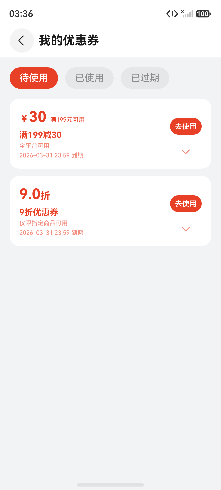
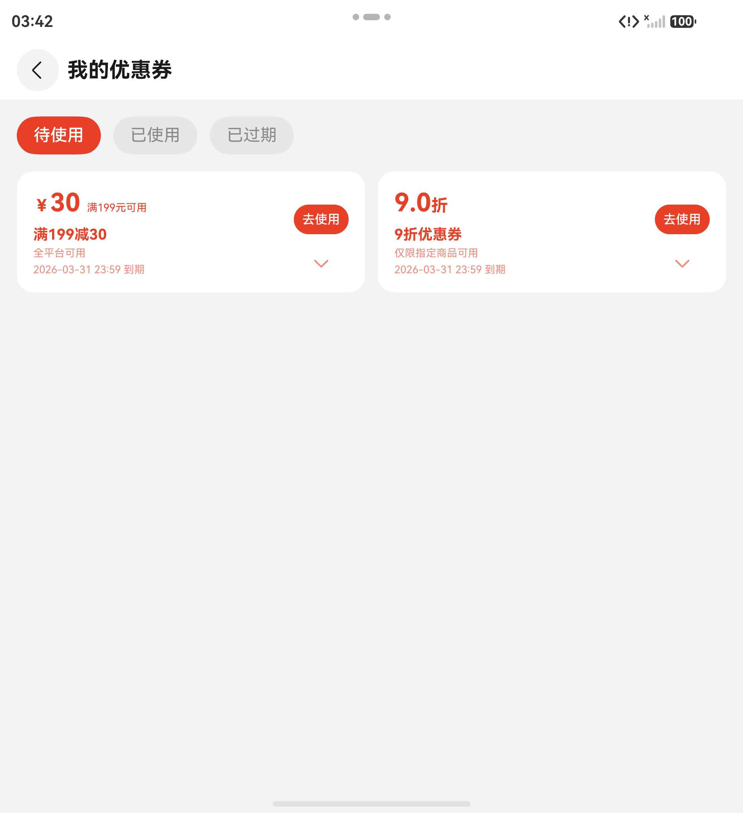
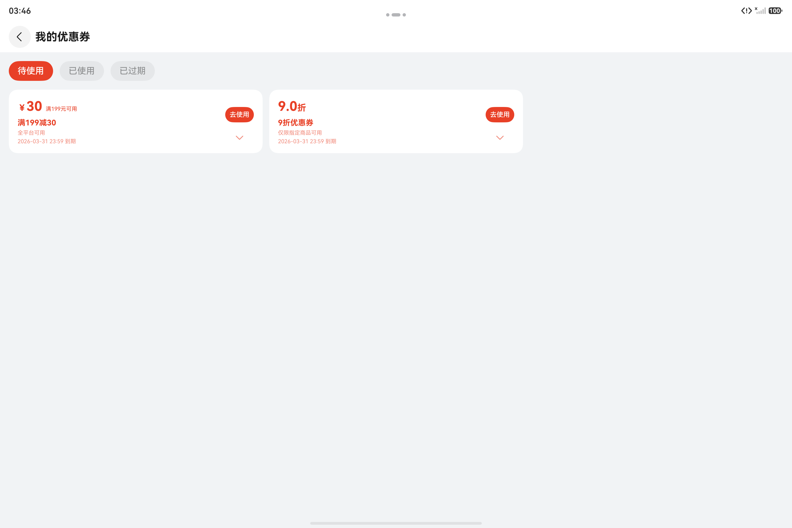
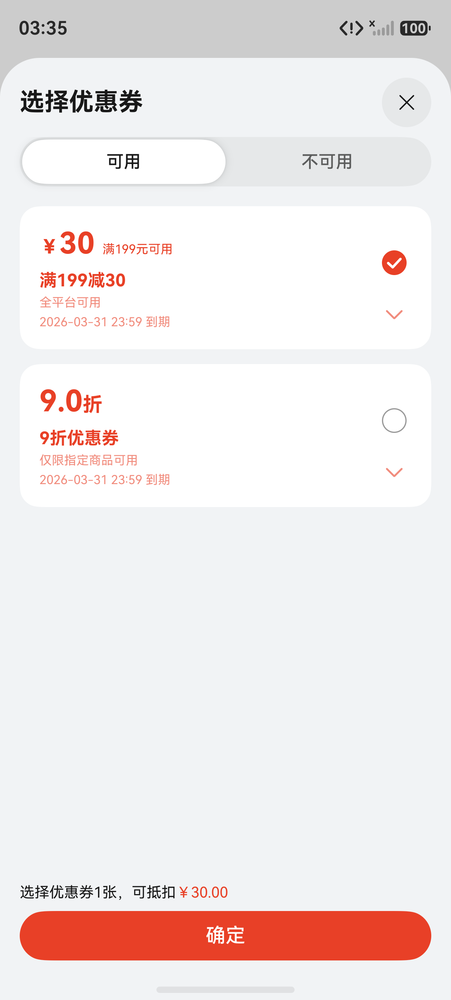
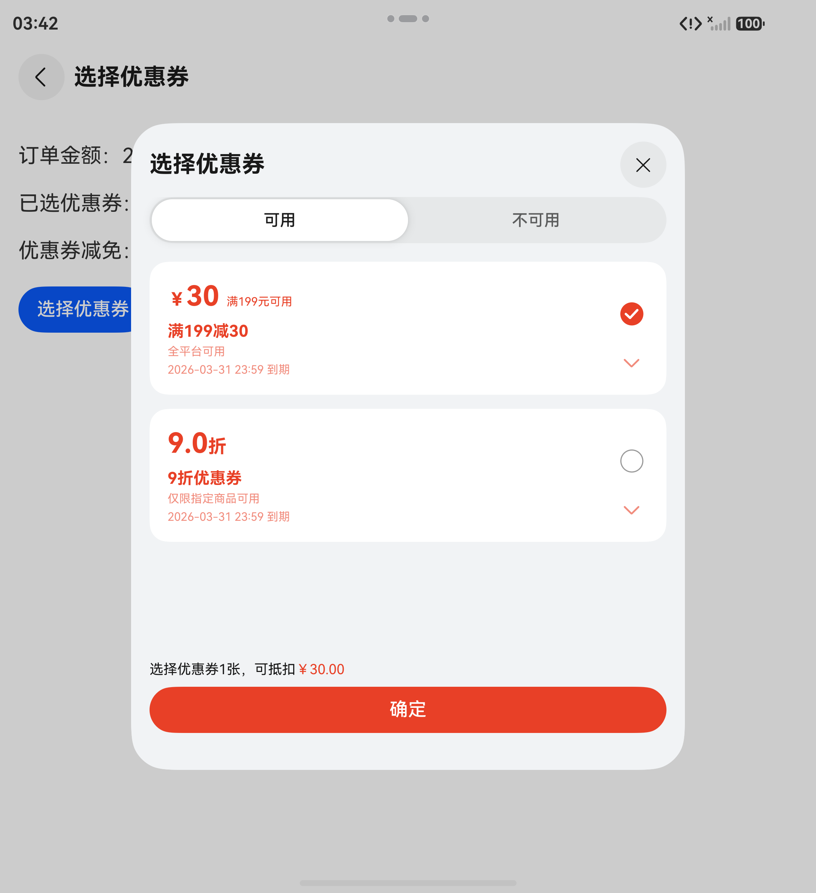
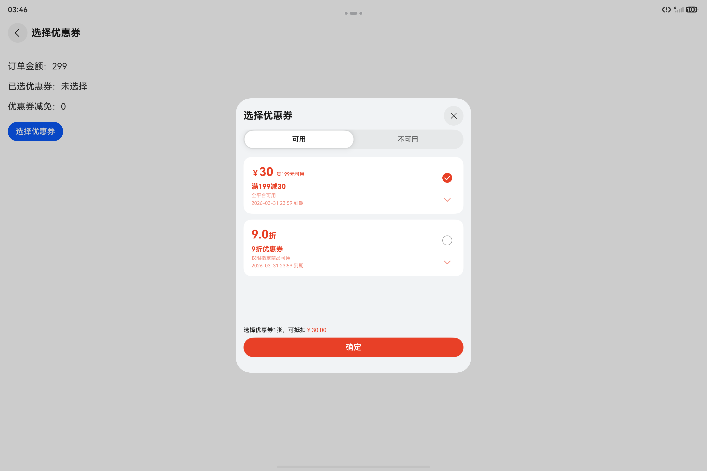

# 通用优惠券组件快速入门

## 目录

- [简介](#简介)
- [约束与限制](#约束与限制)
- [使用](#使用)
- [API参考](#API参考)
- [示例代码](#示例代码)

## 简介

本组件提供了优惠券相关功能：

- 支持优惠券浏览，按待使用、已使用、已过期分类展示
- 支持结算场景选择优惠券，并返回已选优惠券ID与减免金额
- 支持通过控制器统一配置主题色、数据加载与交互回调
- 支持优惠券卡片独立渲染，便于在自定义页面中复用

<div style='overflow-x:auto'>
  <table style='min-width:800px'>
    <tr>
      <th></th>
      <th>直板机</th>
      <th>折叠屏</th>
      <th>平板</th>
    </tr>
    <tr>
      <th scope='row'>浏览</th>
      <td valign='top'></td>
      <td valign='top'></td>
      <td valign='top'></td>
    </tr>
    <tr>
      <th scope='row'>选择</th>
      <td valign='top'></td>
      <td valign='top'></td>
      <td valign='top'></td>
    </tr>
  </table>
</div>

## 约束与限制

### 环境

- DevEco Studio版本：DevEco Studio 6.0.0 Release及以上
- HarmonyOS SDK版本：HarmonyOS 6.0.0 Release SDK及以上
- 设备类型：华为手机
- 系统版本：HarmonyOS 6.0.0(20)及以上

### 权限

- 网络权限：ohos.permission.INTERNET（当优惠券数据通过网络接口获取时需要）

## 使用

1. 安装组件。

   如果是在DevEco Studio使用插件集成组件，则无需安装组件，请忽略此步骤。

   如果是从生态市场下载组件，请参考以下步骤安装组件。

   a. 解压下载的组件包，将包中所有文件夹拷贝至您工程根目录的XXX目录下。

   b. 在项目根目录build-profile.json5添加coupons模块。

   ```
   // 项目根目录下build-profile.json5填写coupons路径。其中XXX为组件存放的目录名
   "modules": [
     {
       "name": "coupons",
       "srcPath": "./XXX/coupons"
     }
   ]
   ```

   c. 在项目根目录oh-package.json5添加依赖。

   ```
   // XXX为组件存放的目录名称
   "dependencies": {
     "coupons": "file:./XXX/coupons"
   }
   ```

2. 引入组件。

   ```ts
   import { CouponCard, CouponsController, MyCouponsView } from 'coupons';
   import type { CouponItem, OnPopParams } from 'coupons';
   ```

3. 浏览优惠券。详细组件调用参见[API参考](#API参考)。

   ```ts
   const controller = new CouponsController();
   controller.themeColor = '#FF7E3E';
   controller.onLoadCoupons = async (): Promise<CouponItem[]> => {
     return [];
   };
   controller.onUseNow = (couponId: string) => {
     console.info(`use coupon: ${couponId}`);
   };

   MyCouponsView({
     controller: controller,
   })
   ```

4. 选择优惠券。详细组件调用参见[API参考](#API参考)。

   ```ts
   const controller = new CouponsController();
   controller.themeColor = '#FF7E3E';
   controller.totalMoney = 299;
   controller.selectedId = '';
   controller.onLoadCoupons = async (): Promise<CouponItem[]> => {
     return [];
   };
   controller.onConfirm = (params: OnPopParams) => {
     console.info(`selectId=${params.selectId}, reduce=${params.reduce}`);
   };
   
   void CouponsController.select(this.getUIContext(), controller);
   ```

## API参考

### 接口

### CouponsController对象说明

优惠券控制器，用于管理优惠券数据、浏览页交互以及选择优惠券弹层。

**属性：**

| 名称 | 类型 | 是否必填 | 说明 |
| ---- | ---- | -------- | ---- |
| couponList | [CouponItem](#CouponItem对象说明)[] | 否 | 当前优惠券列表数据。 |
| isLoading | boolean | 否 | 当前是否处于加载中。 |
| themeColor | [ResourceColor](https://developer.huawei.com/consumer/cn/doc/harmonyos-references/ts-types#resourcecolor) | 否 | 组件主题色，默认值为系统橙色。 |
| selectedId | string | 否 | 当前已选优惠券ID。 |
| reduce | number | 否 | 当前选中优惠券对应的减免金额。 |
| totalMoney | number | 否 | 当前订单总金额，用于选择优惠券时判断可用性和计算减免金额。 |
| onLoadCoupons | () => Promise<[CouponItem](#CouponItem对象说明)[]> | 否 | 加载优惠券数据回调。 |
| onClaimCoupon | (couponId: string) => Promise<[CouponItem](#CouponItem对象说明)[] \| null> | 否 | 领取优惠券回调。 |
| onAfterUse | (couponId: string) => Promise<[CouponItem](#CouponItem对象说明)[] \| null> | 否 | 确认使用优惠券后的刷新回调。 |
| onUseNow | (couponId: string) => void | 否 | 浏览页点击“立即使用”时的回调。 |
| onConfirm | (params: [OnPopParams](#OnPopParams对象说明)) => void | 否 | 选择优惠券确认后的回调。 |

**方法：**

| 名称 | 参数 | 说明 |
| ---- | ---- | ---- |
| select | (uiContext: [UIContext](https://developer.huawei.com/consumer/cn/doc/harmonyos-references/arkts-apis-uicontext-uicontext)) => Promise<void> | 打开选择优惠券底部弹层。 |
| loadCoupons | () => Promise<void> | 主动触发优惠券列表加载。 |
| claimCoupon | (couponId: string) => Promise<void> | 触发领取优惠券逻辑。 |
| useNow | (couponId: string) => void | 触发立即使用回调。 |
| toggleSelect | (coupon: [CouponItem](#CouponItem对象说明)) => void | 切换当前优惠券选中状态。 |
| confirm | () => Promise<void> | 确认当前选中的优惠券。 |

### MyCouponsView对象说明

我的优惠券页面组件。

| 参数名 | 类型 | 是否必填 | 说明 |
| ------ | ---- | -------- | ---- |
| controller | [CouponsController](#CouponsController对象说明) | 是 | 优惠券控制器，负责提供列表数据、主题色和交互回调。 |

#### CouponCard对象说明

优惠券卡片组件，可在自定义页面中独立使用。

| 参数名 | 类型 | 是否必填 | 说明 |
| ------ | ---- | -------- | ---- |
| coupon | [CouponItem](#CouponItem对象说明) | 是 | 优惠券数据。 |
| totalMoney | number | 否 | 订单总金额，默认值0。 |
| themeColor | [ResourceColor](https://developer.huawei.com/consumer/cn/doc/harmonyos-references/ts-types#resourcecolor) | 否 | 卡片主题色。 |
| isAvailable | boolean | 否 | 卡片是否按可用态展示，默认值true。 |
| actionSlot | (status:[ScenarioStatus](#ScenarioStatus枚举说明)) => void | 否 | 卡片右上角自定义区域。 |

#### CouponItem对象说明

优惠券数据模型。

| 参数名 | 类型 | 是否必填 | 说明 |
| ------ | ---- | -------- | ---- |
| couponID | string | 是 | 优惠券ID。 |
| couponName | string | 是 | 优惠券名称。 |
| usageRestriction | string | 是 | 使用限制说明。 |
| startTime | string | 是 | 优惠开始时间，格式为 `YYYY-MM-DD`。 |
| endTime | string | 是 | 优惠结束时间，格式为 `YYYY-MM-DD`。 |
| createdTime | string | 是 | 创建时间。 |
| couponStatus | [CouponStatus](#CouponStatus枚举说明) | 是 | 优惠券状态。 |
| amountRule | [CouponRule](#CouponRule对象说明) | 是 | 优惠规则。 |

#### CouponRule对象说明

优惠券规则模型。

| 参数名 | 类型 | 是否必填 | 说明 |
| ------ | ---- | -------- | ---- |
| discountType | [ReductionTypes](#ReductionTypes枚举说明) | 是 | 优惠类型：`0`-满减，`1`-立减，`2`-折扣。 |
| fullAmount | string | 是 | 满减门槛金额。 |
| discountAmount | string | 是 | 优惠金额，适用于满减和立减场景。 |
| discountCoefficient | string | 是 | 折扣系数，适用于折扣场景。 |

#### ScenarioStatus枚举说明

| 名称       | 值   | 说明     |
| ---------- | ---- | -------- |
| NOW_USE    | 0    | 立马可用 |
| LESS_FULL  | 1    | 低于满额 |
| FUTURE_USE | 2    | 未来使用 |
| HAS_USED   | 3    | 已使用   |
| EXPIRE     | 4    | 已过期   |

#### ReductionTypes枚举说明

| 名称               | 值   | 说明 |
| ------------------ | ---- | ---- |
| FULL_REDUCTION     | 0    | 满减 |
| DIRECT_REDUCTION   | 1    | 立减 |
| DISCOUNT_REDUCTION | 2    | 折扣 |

#### CouponStatus枚举说明

| 名称      | 值   | 说明   |
| --------- | ---- | ------ |
| AVAILABLE | 0    | 待使用 |
| USED      | 1    | 已使用 |
| EXPIRED   | 2    | 已过期 |

#### OnPopParams对象说明

选择优惠券确认回调参数。

| 参数名 | 类型 | 是否必填 | 说明 |
| ------ | ---- | -------- | ---- |
| reduce | number | 是 | 当前选中优惠券对应的减免金额，未选择时为0。 |
| selectId | string | 是 | 当前选中的优惠券ID，未选择时为空字符串。 |

## 示例代码

### 示例1（浏览优惠券）

```ts
import { CouponsController, MyCouponsView, CouponItem, ReductionTypes, CouponStatus } from 'coupons';

@Entry
@ComponentV2
struct CouponsSample1 {
  controller: CouponsController = new CouponsController();

  aboutToAppear(): void {
    this.controller.onLoadCoupons = async (): Promise<CouponItem[]> => {
      return [
        {
          couponID: 'coupon_001',
          couponName: '满199减30',
          usageRestriction: '全平台可用',
          startTime: '2026-03-01',
          endTime: '2026-03-31',
          createdTime: '2026-03-01 10:00:00',
          couponStatus: CouponStatus.AVAILABLE,
          amountRule: {
            discountType: ReductionTypes.FULL_REDUCTION,
            fullAmount: '199',
            discountAmount: '30',
            discountCoefficient: '1',
          },
        },
        {
          couponID: 'coupon_002',
          couponName: '9折优惠券',
          usageRestriction: '仅限指定商品可用',
          startTime: '2026-03-01',
          endTime: '2026-03-31',
          createdTime: '2026-03-01 10:00:00',
          couponStatus: CouponStatus.AVAILABLE,
          amountRule: {
            discountType: ReductionTypes.DISCOUNT_REDUCTION,
            fullAmount: '0',
            discountAmount: '0',
            discountCoefficient: '0.9',
          },
        },
      ];
    };
    this.controller.onUseNow = (couponId: string) => {
      try {
        this.getUIContext().getPromptAction().showToast({
          message: '点击了立即使用，可以自定义后续跳转操作。couponId:' + couponId
        })
      } catch (err) {
        console.log('show toast failed. err:' + JSON.stringify(err))
      }
    };
  }

  build() {
    NavDestination() {
      MyCouponsView({
        controller: this.controller,
      })
    }
    .title('我的优惠券')
  }
}

@Builder
export function buildCouponsSample1() {
  CouponsSample1()
}

```


### 示例2（选择优惠券）

```ts
import { CouponsController, CouponItem, OnPopParams, ReductionTypes, CouponStatus } from 'coupons';

@Entry
@ComponentV2
struct CouponsSample2 {
  @Local totalMoney: number = 299;
  @Local selectId: string = '';
  @Local reduce: number = 0;

  private buildCouponController(): CouponsController {
    const controller = new CouponsController();
    controller.totalMoney = this.totalMoney;
    controller.selectedId = this.selectId;
    controller.reduce = this.reduce;
    controller.onLoadCoupons = async (): Promise<CouponItem[]> => {
      return [
        {
          couponID: 'coupon_001',
          couponName: '满199减30',
          usageRestriction: '全平台可用',
          startTime: '2026-03-01',
          endTime: '2026-03-31',
          createdTime: '2026-03-01 10:00:00',
          couponStatus: CouponStatus.AVAILABLE,
          amountRule: {
            discountType: ReductionTypes.FULL_REDUCTION,
            fullAmount: '199',
            discountAmount: '30',
            discountCoefficient: '1',
          },
        },
        {
          couponID: 'coupon_002',
          couponName: '9折优惠券',
          usageRestriction: '仅限指定商品可用',
          startTime: '2026-03-01',
          endTime: '2026-03-31',
          createdTime: '2026-03-01 10:00:00',
          couponStatus: CouponStatus.AVAILABLE,
          amountRule: {
            discountType: ReductionTypes.DISCOUNT_REDUCTION,
            fullAmount: '0',
            discountAmount: '0',
            discountCoefficient: '0.9',
          },
        },
      ];
    };
    controller.onConfirm = (params: OnPopParams) => {
      this.selectId = params.selectId;
      this.reduce = params.reduce;
    };
    return controller;
  }

  build() {
    NavDestination() {
      Column({ space: 20 }) {
        Text(`订单金额：${this.totalMoney}`)
          .fontSize(18)

        Text(`已选优惠券：${this.selectId || '未选择'}`)
          .fontSize(18)

        Text(`优惠券减免：${this.reduce}`)
          .fontSize(18)

        Button('选择优惠券')
          .onClick(() => {
            const controller = this.buildCouponController();
            controller.select(this.getUIContext());
          })
      }
      .padding({ top: 30, left: 16, right: 16 })
      .width('100%')
      .height('100%')
      .alignItems(HorizontalAlign.Start)
    }
    .title('选择优惠券')
  }
}

@Builder
export function buildCouponsSample2(){
  CouponsSample2()
}
```

