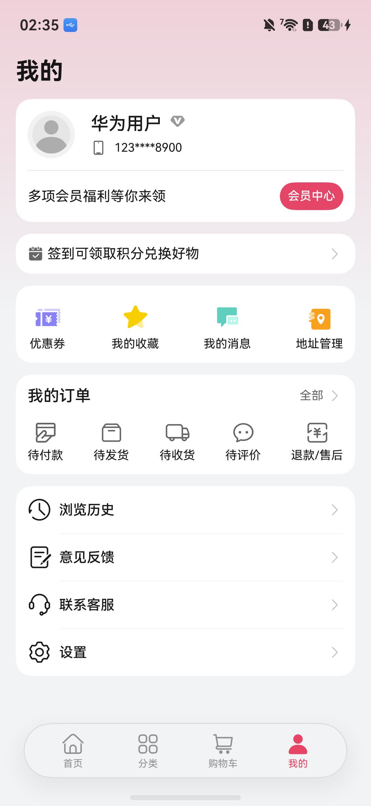

# 购物（商城）应用模板快速入门

## 目录

- [功能介绍](#功能介绍)
- [约束与限制](#约束与限制)
- [快速入门](#快速入门)
- [示例效果](#示例效果)
- [开源许可协议](#开源许可协议)

## 功能介绍

您可以基于此模板直接定制应用，也可以挑选此模板中提供的多种组件使用，从而降低您的开发难度，提高您的开发效率。

本模板提供如下组件，所有组件存放在工程根目录的components下，如果您仅需使用组件，可参考对应组件的指导链接；如果您使用此模板，请参考本文档。

| 组件                                 | 描述                                                         | 使用指导                                                     |
|------------------------------------| ------------------------------------------------------------ | ------------------------------------------------------------ |
| 通用优惠券组件（coupons）                   | 提供了优惠券的浏览、选择能力                                 | [使用指导](./components/coupons/README.md)            |
| 商品搜索组件（module_product_search）      | 提供了查看并编辑搜索历史，查看并刷新推荐关键词，查看热搜榜的搜索页面组件 | [使用指导](./components/module_product_search/README.md)     |
| 商品评价组件（module_product_review）      | 提供商品评价功能，支持评定星级、填写评价、上传图片。         | [使用指导](./components/module_product_review/README.md)     |
| 客服聊天组件（module_custom_service_chat） | 提供客服聊天组件，提供原生的聊天交互界面。                   | [使用指导](./components/module_custom_service_chat/README.md) |
| 商品筛选组件（module_product_filter）      | 提供了根据筛选条件对商品进行筛选的功能。                     | [使用指导](./components/module_product_filter/README.md)     |
| 商品识别组件（module_product_scan）        | 支持扫描商品条码/二维码，拍摄商品图片并获取返回结果。        | [使用指导](./components/module_product_scan/README.md)       |
| 通用地址管理组件（address_management）       | 提供了新增/编辑/删除地址等功能，支持从地图选址、智能识别地址、获取华为账号收货地址 | [使用指导](./components/address_management/README.md)        |
| 通用应用内设置组件（app_setting）             | 支持设置开关切换、下拉选择、页面跳转、文本刷新等基础设置项   | [使用指导](./components/app_setting/README.md)               |
| 通用登录组件（aggregated_login）           | 支持华为账号一键登录及其他方式登录（微信、手机号登录）       | [使用指导](./components/aggregated_login/README.md)          |
| 通用支付组件（aggregated_payment）         | 聚合了多方的支付能力。提供开箱即用的收银台选择器 (CashierPicker)以及封装完好的聚合支付服务接口 (aggregatedPaymentService) | [使用指导](./components/aggregated_payment/README.md)        |
| 通用分享组件（aggregated_share）           | 支持分享到微信好友、朋友圈、QQ、微博等方式，支持碰一碰分享、生成海报、系统分享等功能 | [使用指导](./components/aggregated_share/README.md)          |
| 通用个人信息组件（collect_personal_info）    | 支持编辑头像、昵称、姓名、性别、手机号、生日、个人简介等     | [使用指导](./components/collect_personal_info/README.md)     |
| 通用问题反馈组件（feedback）                 | 支持提交问题反馈、查看反馈记录                               | [使用指导](./components/feedback/README.md)                  |
| 通用会员组件（membership）                 | 通过应用内支付实现会员开通的能力（自动续期订阅会员及非续期订阅会员），开发者可以根据业务需要快速实现应用会员开通 | [使用指导](./components/membership/README.md)                |
| 通用图片预览组件（image_preview）            | 提供了图片预览相关功能                                       | [使用指导](./components/image_preview/README.md)             |

本模板为综合商城应用提供了常用功能的开发样例，模板主要分首页、分类、购物车、和我的四大模块：

- 首页：主要提供商品搜索、卡片轮播、分类选择、商品浏览等功能。

- 分类：按照类别展示商品列表和购买商品。

- 购物车：展示已添加的商品，支持商品数量的修改，商品删除、结算等操作。

- 我的：展示个人信息、订单管理、优惠券、地址管理、联系客服等功能。

本模板已集成华为账号、通话、华为支付等服务，只需做少量配置和定制即可快速实现华为账号的登录、一键拨打服务电话、商品购买等功能。

本模板主要页面及核心功能如下所示：

```ts
综合商城模板
 ├── 首页
 |    ├── 搜索
 |    |    ├── 搜索页
 |    |    └── 搜索结果展示
 |    ├── 扫码/识别
 |    |    ├── 扫描商品二维码/条形码
 |    |    └── 拍摄或选取照片识别商品
 |    ├── 图片轮播
 |    ├── 分类项展示
 |    |    ├── 签到
 |    |    ├── 秒杀
 |    |    └── 秒杀列表页
 |    |    └── 分类浏览页
 |    └── 商品卡片瀑布流
 |         └── 商品详情页
 |              ├── 商品规格选择
 |              ├── 加入购物车
 |              └── 发起预下单
 ├── 分类
 |    ├── 分类二级页
 |    ├── 商品搜索
 |    └── 商品分类浏览
 ├── 购物车
 |    ├── 购物车管理
 |    ├── 购物车结算
 |    └── 商品推荐列表
 └── 我的
      ├── 账号登录
      ├── 个人信息展示
      ├── 会员中心     
      |     └── 开通/续费会员
      ├── 签到/积分兑换
      ├── 订单管理
      |    ├── 订单列表
      |    └── 订单详情
      ├── 优惠券/收藏/消息/地址管理
      └── 浏览历史/意见反馈/联系客服/设置
```

本模板工程代码结构如下所示：

```ts
├── commons
│   ├──lib_foundation/src/main/ets                // 应用基础工具包
│   │   ├── constants                             // 常量定义
│   │   ├── models                                // 数据模型定义
│   │   ├── types                                 // 数据接口定义
│   │   └── utils
│   │       ├── caches                            // 缓存工具
│   │       ├── idata                             // 全局数据工具
│   │       ├── resmanage                         // 资源处理工具
│   │       └── routerstack                       // 路由工具
│   │
│   │── lib_network/src/main/ets
│   │   ├── constants                             // 常量
│   │   ├── https                                 // 网络请求封装
│   │   ├── httpsmock                             // 网络请求本地mock
│   │   └── types                                 // 网络请求、响应数据类型
│   │
│   └── lib_widget/src/main/ets/components
│       ├── CommonButton                          // 通用按钮组件
│       ├── CommonConfirmDialog                   // 通用确认弹窗
│       ├── CommonLoading                         // 通用加载标识
│       ├── CommonScroll                          // 通用滚动容器
│       ├── CommonSymbol                          // 通用Symbol图标
│       ├── ContainerColumn                       // 通用Column容器
│       ├── CustomService                         // 通用客服联系弹窗
│       └── NavTitleBar                           // 通用页面标题栏
│
├── components  
│   ├── address_manage                            // 通用地址管理组件
│   ├── app_setting                               // 通用应用设置组件
│   ├── aggregated_login                          // 通用登录组件
│   ├── aggregated_payment                        // 通用支付组件
│   ├── aggregated_share                          // 通用分享组件
│   ├── collect_personal_info                     // 通用个人信息组件
│   ├── feedback                                  // 通用意见反馈组件
│   ├── membership                                // 通用会员组件
│   ├── coupons                                   // 优惠券组件
│   ├── module_custom_service                     // 客服聊天组件
│   ├── module_notice_center                      // 消息中心组件
│   ├── module_privacy_agreement                  // 协议授权组件
│   ├── module_product_category                   // 商品分类组件
│   ├── module_product_detail                     // 商品详情组件
│   ├── module_product_filter                     // 商品筛选组件
│   ├── module_product_review                     // 商品评价组件
│   ├── module_product_scan                       // 商品识别组件
│   ├── module_product_search                     // 商品搜索组件
│   ├── module_product_cart                       // 购物车组件
│   ├── module_transition                         // 一镜到底组件
│   └── module_ui_base                            // 组件通用层
│
├── features                                      // 场景化模块
│    ├── member/src/main/ets                      // 会员
│    │  └── views
│    │      ├── MemberBenefitsPage.ets            // 会员福利页
│    │      ├── MemberSubscriptionPage.ets        // 开通会员页
│    │      ├── PointsRecordPage.ets              // 积分记录页
│    │      └── RedemptionSubmitPage.ets          // 积分兑换页
│    ├── order/src/main/ets                       // 订单
│    │  └── pages
│    │      ├── OrderExpressInfoPage.ets          // 订单物流信息页
│    │      ├── OrderInfoPage.ets                 // 订单详情页
│    │      ├── OrderListPage.ets                 // 订单列表页
│    │      ├── OrderReviewCreatePage.ets         // 订单创建评价页
│    │      ├── OrderReviewInfoPage.ets           // 订单查看评价页
│    │      ├── OrderSearchPage.ets               // 订单搜索页
│    │      ├── OrderSubmitPage.ets               // 订单提交页
│    │      └── UpdateAddressSheet.ets            // 更新地址页
│    ├── product/src/main/ets                     // 商品
│    │  └── views
│    │      ├── ProductInfoPage.ets               // 商品详情页
│    │      ├── ProductReviewPage.ets             // 商品评价页
│    │      └── ProductSwiperPage.ets             // 商品推荐页
│    ├── setting/src/main/ets                     // 设置
│    │  └── views
│    │      ├── AgreementPage.ets                 // 隐私政策&用户协议页
│    │      ├── CouponPage.ets                    // 个人优惠券
│    │      ├── EditProfilePage.ets               // 用户信息编辑
│    │      ├── LoginPage.ets                     // 用户登录编辑
│    │      ├── MyCollectionPage.ets              // 个人收藏页
│    │      ├── SettingPage.ets                   // 设置页
│    │      ├── SettingPrivacyPage.ets            // 隐私信息设置页
│    │      └── ViewHistoryPage.ets               // 浏览记录页
│    └──shopping/src/main/ets
│       └── pages
│           ├── CustomServicePage.ets             // 客服聊天页
│           ├── ProductSearchPage.ets             // 商品搜索页
│           ├── ProductSearchResultsPage.ets      // 商品搜索结果页
│           ├── SeckillListPage.ets               // 秒杀商品列表页
│           └── SubCategoryPage.ets               // 二级分类页
│
└── products
    └── entry/src/main/ets
       ├── views
       │   ├── Index.ets                          // 应用启动根页面
       │   ├── MainEntry.ets                      // 首页
       │   ├── SafePage.ets                       // 首启用户授权页
       │   └── SplashPage.ets                     // 启动广告页
       └── widget                                 // 服务卡片

```

## 约束与限制

### 环境

- DevEco Studio版本：DevEco Studio 6.1.1 Release及以上
- HarmonyOS SDK版本：HarmonyOS 6.1.1 Release SDK及以上
- 设备类型：华为手机（包括双折叠和阔折叠）、华为平板
- 系统版本：HarmonyOS 6.1.0(23)及以上

### 权限

- 获取位置权限：ohos.permission.APPROXIMATELY_LOCATION，ohos.permission.LOCATION。
- 相机权限：ohos.permission.CAMERA
- 马达振动权限：ohos.permission.VIBRATE
- 网络权限：ohos.permission.INTERNET, ohos.permission.GET_NETWORK_INFO
- 读取开放匿名设备标识符权限：ohos.permission.APP_TRACKING_CONSENT
- 隐私窗口权限：ohos.permission.PRIVACY_WINDOW
- 持久化数据存储权限：ohos.permission.STORE_PERSISTENT_DATA
- 握持手权限：ohos.permission.DETECT_GESTURE

### 使用约束

* 本模板中的支付、会员开通、获取华为账号收货地址等功能暂不支持模拟器调测
* 碰一碰分享在任意一端设备不支持碰一碰能力时，轻碰无任何响应，详细参考：[手机与手机碰一碰分享](https://developer.huawei.com/consumer/cn/doc/harmonyos-guides/knock-share-between-phones-overview#section184317615456)
* 智感握姿使用约束详见：[获取用户动作开发指导](https://developer.huawei.com/consumer/cn/doc/harmonyos-guides/motion-guidelines#%E7%BA%A6%E6%9D%9F%E4%B8%8E%E9%99%90%E5%88%B6-1)


## 快速入门

### 配置工程

在运行此模板前，需要完成以下配置：

1. 在AppGallery Connect创建应用，将包名配置到模板中。

   a. 参考[创建HarmonyOS应用](https://developer.huawei.com/consumer/cn/doc/app/agc-help-create-app-0000002247955506)为应用创建APP ID，并将APP ID与应用进行关联。

   b. 返回应用列表页面，查看应用的包名。

   c. 将模板工程根目录下AppScope/app.json5文件中的bundleName替换为创建应用的包名。

   d. 将products/entry/src/main/resources/base/profile/shortcuts_config.json中的bundleName替换为创建应用的包名。

2. 配置华为账号服务。

   a. 将应用的client ID配置到entry/src/main路径下的module.json5文件中，详细参考：[配置Client ID](https://developer.huawei.com/consumer/cn/doc/harmonyos-guides/account-client-id)。

   b. 申请华为账号一键登录所需的quickLoginMobilePhone权限，详细参考：[配置scope权限](https://developer.huawei.com/consumer/cn/doc/harmonyos-guides/account-config-permissions)。

3. 配置支付服务。

   华为支付当前仅支持商户接入，在使用服务前，需要完成商户入网、开发服务等相关配置，本模板仅提供了端侧集成的示例。详细参考：[支付服务接入准备](https://developer.huawei.com/consumer/cn/doc/harmonyos-guides/payment-preparations)。

4. 配置地图服务。

   a. 将应用的client ID配置到entry/src/main路径下的module.json5文件，如果华为账号服务已配置，可跳过此步骤。

   b. [开通地图服务](https://developer.huawei.com/consumer/cn/doc/harmonyos-guides/map-config-agc)。

5. 配置华为账号收货地址管理服务。

   当前模板的地址管理组件支持获取华为账号收货地址，使用此功能需满足一定条件。详细参考：[收货地址服务开发前提](https://developer.huawei.com/consumer/cn/doc/harmonyos-guides/account-choose-address-dev#section1061219267293)。

6. 配置推送服务。

   a. [开启推送服务](https://developer.huawei.com/consumer/cn/doc/harmonyos-guides/push-config-setting)。

   b. 按照需要的权益[申请通知消息自分类权益](https://developer.huawei.com/consumer/cn/doc/harmonyos-guides/push-apply-right)。

   c. [端云调试](https://developer.huawei.com/consumer/cn/doc/harmonyos-guides/push-server)。

7. 配置App Linking服务。

   a. [开通App Linking服务](https://developer.huawei.com/consumer/cn/doc/harmonyos-guides/applinking-enable-applinking)

   b. [在开发者网站上关联应用](https://developer.huawei.com/consumer/cn/doc/harmonyos-guides/app-linking-startupapp#section6903241628)

   c. [在AGC为应用创建关联的网址域名](https://developer.huawei.com/consumer/cn/doc/harmonyos-guides/app-linking-startupapp#section1101111611317)

   d. 在products/entry/src/main路径下的module.json5中配置关联的网址域名，详细参考：[在module.json5中配置关联的网址域名](https://developer.huawei.com/consumer/cn/doc/harmonyos-guides/app-linking-startupapp#section13808113610362)

8. 配置广告服务。

   a. 如果仅调测广告，可使用测试广告位ID：开屏广告：testd7c5cewoj6。

   b. 申请正式的广告位ID。 登录[鲸鸿动能媒体服务平台](https://developer.huawei.com/consumer/cn/service/ads/publisher/html/index.html?lang=zh) 进行申请，具体操作详情请参见[展示位创建](https://developer.huawei.com/consumer/cn/doc/distribution/monetize/zhanshiweichuangjian-0000001132700049)。

9. 配置应用内支付服务

   a. 您需[开通商户服务](https://developer.huawei.com/consumer/cn/doc/start/merchant-service-0000001053025967)才能开启应用内购买服务。商户服务里配置的银行卡账号、币种，用于接收华为分成收益。

   b. 使用应用内购买服务前，需要打开应用内购买服务(HarmonyOS NEXT) 开关，此开关是应用级别的，即所有使用IAP Kit功能的应用均需执行此步骤，详情请参考[打开应用内购买服务API开关](https://developer.huawei.com/consumer/cn/doc/app/switch-0000001958955097)。

   c. 开启应用内购买服务(HarmonyOS NEXT) 开关后，开发者需进一步激活应用内购买服务 (HarmonyOS NEXT)，具体请参见[激活服务和配置事件通知](https://developer.huawei.com/consumer/cn/doc/app/parameters-0000001931995692)。

   d. 由于真实支付需依赖应用及其关联的会员商品上架，故建议在接入华为应用内支付调测过程中，您可以使用[沙盒测试](https://developer.huawei.com/consumer/cn/doc/harmonyos-guides/iap-sandbox)对订单进行虚拟支付。

10. 开启智感握姿功能

   - 在调试设备-设置-搜索设置项中输入【智感握姿】，确保开关开启。

11. 配置预加载服务（可选）。

    a. [开通预加载](https://developer.huawei.com/consumer/cn/doc/harmonyos-guides/cloudfoundation-enable-prefetch)。

    b. [开通云函数](https://developer.huawei.com/consumer/cn/doc/harmonyos-guides/cloudfoundation-enable-function)。

    c. 打包云函数包：进入工程preload目录，将目录下的文件压缩为zip文件，注意进入文件夹中，全选文件，右击压缩。

    d. [创建云函数](https://developer.huawei.com/consumer/cn/doc/harmonyos-guides/cloudfoundation-create-and-config-function)。

    - “函数名称”为“preload”
    - “触发方式”为“事件调用”
    - “触发器类型”为“HTTP触发器”，其他保持默认
    - “代码输入类型”为“*.zip文件”，代码文件上传上一步打包的zip文件

    e. [配置安装预加载](https://developer.huawei.com/consumer/cn/doc/harmonyos-guides/cloudfoundation-prefetch-config)

    安装预加载函数名称配置为上一步创建的云函数

12. 接入微信SDK（可选）。 前往微信开放平台申请AppID并配置鸿蒙应用信息，详情参考：[鸿蒙接入指南](https://developers.weixin.qq.com/doc/oplatform/Mobile_App/Access_Guide/ohos.html)。

13. 接入QQ（可选）。 前往QQ开放平台申请AppID并配置鸿蒙应用信息，详情参考：[鸿蒙接入指南](https://wiki.connect.qq.com/sdk下载)。

14. 对应用进行[手工签名](https://developer.huawei.com/consumer/cn/doc/harmonyos-guides/ide-signing#section297715173233)。

15. 添加手工签名所用证书对应的公钥指纹。详细参考：[配置应用签名证书指纹](https://developer.huawei.com/consumer/cn/doc/app/agc-help-cert-fingerprint-0000002278002933)

### 运行调试工程

1. 连接调试手机和PC。

2. 菜单选择“Run > Run 'entry' ”或者“Run > Debug 'entry' ”，运行或调试模板工程。

## 示例效果

| 首页                                                    | 分类                                                       | 购物车                                                   | 我的                                                        |
|-------------------------------------------------------| ---------------------------------------------------------- | -------------------------------------------------------- | ----------------------------------------------------------- |
|  |  |  |  |


## 开源许可协议

该代码经过[Apache 2.0 授权许可](http://www.apache.org/licenses/LICENSE-2.0)。
