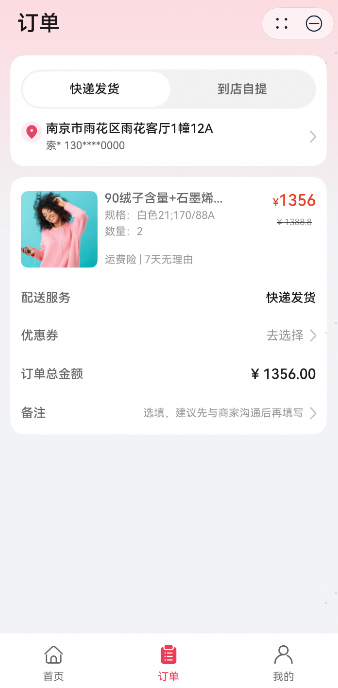
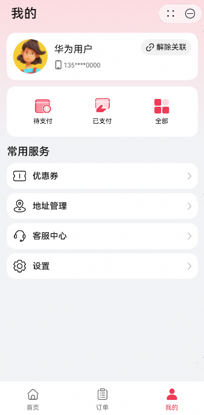
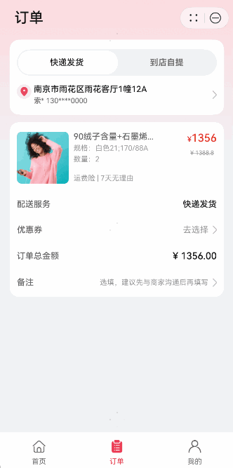

# 购物比价(优惠券)行业模板快速入门

## 目录

- [功能介绍](#功能介绍)
- [环境要求](#环境要求)
- [快速入门](#快速入门)
- [示例效果](#示例效果)
- [权限要求](#权限要求)
- [开源许可协议](#开源许可协议)

## 功能介绍

本模板为提供优惠券类元服务提供了常用功能的开发样例，模板主要分首页、订单和我的三大模块：

* 首页：提供商品的展示。

* 订单：提供订单过程选择优惠券的能力。

* 我的：提供查看全部优惠券的入口。

| 首页                          | 订单                           | 我的                          |
|-----------------------------|------------------------------|-----------------------------|
|  |  |  |

本模板主要页面及核心功能如下所示：

```
优惠券模板
 |-- 首页
 |    |-- 顶部广告
 |    |-- 为你推荐
 |    |-- 新品上市
 |    └-- 时尚秋装
 |-- 订单
 |    |-- 发货自提
 |    |     |-- 发货方式
 |    |     └-- 收货信息
 |    └-- 订单信息
 |          |-- 商品规格
 |          |-- 配送服务
 |          |-- 选择优惠券入口
 |          |-- 订单总金额（含减免）
 |          └-- 备注信息
 └-- 我的
      |-- 关联账号
      |-- 分类订单
      └-- 常用服务
           |-- 全部优惠券入口
           |-- 地址管理
           |-- 客服中心
           └-- 个人信息
```

本模板工程代码结构如下所示：

```
CouponsModule
  |- commons                                       // 公共层
  |   |- commonlib/src/main/ets                    // 公共工具模块(har)
  |   |    |- constants 
  |   |    |     CommonContants.ets                // 公共常量
  |   |    |- models
  |   |    |     FullLoading.ets                   // 网络请求弹窗
  |   |    |     Router.ets                        // 路由管理工具
  |   |    |- types 
  |   |    |     Types.ets                         // 公共类型
  |   |    └- utils 
  |   |          CommonUtil.ets                    // 设备配置工具
  |   |          Logger.ets                        // 日志管理工具
  |   |  
  |   |- componentlib/src/main/ets                 // 公共组件模块(har)
  |   |     └- components 
  |   |          CommonHeader.ets                  // 公共标题栏         
  |   |   
  |   └- network/src/main/ets                      // 网络模块(har)
  |        |- apis                                 // 网络接口  
  |        |- mocks                                // 数据mock   
  |        |- models                               // 网络库封装    
  |        └- types                                // 请求和响应类型   
  |
  |- features/other
  |   └- scenes/src/main/ets                       // 优惠券使用场景
  |        └- pages                     
  |              HomePage.ets                      // 首页        
  |              MinePage.ets                      // 我的        
  |              OrderPage.ets                     // 订单        
  |- features/service
  |   └- coupons/src/main/ets                      // 优惠券核心模块
  |        |- components 
  |        |     CouponCardComp.ets                // 优惠券单体卡片
  |        |     TabComp.ets                       // 动画条Tab组件
  |        |- constants 
  |        |     Constants.ets                     // 默认页签和样式
  |        |- pages
  |        |     MyCouponsPage.ets                 // 全部优惠券页面
  |        |     SelectCouponsPage.ets             // 选择优惠券页面
  |        |- types 
  |        |     Types.ets                         // 界面样式类型和优惠券接口类型
  |        └- utils 
  |              Utils.ets                         // 获取数据和样式内容方法
  └- products                                      // 产品层  
      └- phone/src/main/ets                        // 主包(hap)                                                     
           |- constants                            // Tabs配置
           |- entryability                         // 生命周期管理                                            
           └- pages                              
                 MainEntry.ets                     // 主页面
```

## 环境要求

### 软件

* DevEco Studio版本：DevEco Studio 5.0.0 Release及以上
* HarmonyOS SDK版本：HarmonyOS 5.0.0 Release SDK及以上

### 硬件

* 设备类型：华为手机
* HarmonyOS版本：HarmonyOS 5.0.0 Release及以上

## 快速入门

### 配置工程

在运行此模板前，需要完成以下配置：

1. 在DevEco Studio中打开此模板。

2. 在AppGallery Connect创建元服务，将包名配置到模板中。

   a. 参考[创建元服务](https://developer.huawei.com/consumer/cn/doc/app/agc-help-createharmonyapp-0000001945392297)
   为元服务创建APPID，并进行关联。

   b. 返回应用列表页面，查看元服务的包名。

   c. 将模板工程根目录下AppScope/app.json5文件中的bundleName替换为创建元服务的包名。
3. 配置华为账号服务。

   a. 将元服务的client
   ID配置到phone模块的module.json5文件，详细参考：[配置Client ID](https://developer.huawei.com/consumer/cn/doc/atomic-guides-V5/account-atomic-client-id-V5)。

   b.添加公钥指纹，详细参考：[配置应用证书指纹](https://developer.huawei.com/consumer/cn/doc/app/agc-help-signature-info-0000001628566748#section5181019153511)。

### 运行调试工程

1. 连接调试手机和PC。

2. 对元服务进行[手工签名](https://developer.huawei.com/consumer/cn/doc/harmonyos-guides/ide-signing#section297715173233)。

3. 配置多模块调试：由于本模板存在多个模块，运行时需确保所有模块安装至调试设备。

   a. 运行模块选择“phone”。

   b. 下拉框选择“Edit Configurations”，在“Run/Debug Configurations”界面，选择“Deploy Multi Hap”页签，勾选上模板中所有模块。

   c. 点击"Run"，运行模板工程。

## 示例效果

### 场景1：订单页，去选择可用优惠券/取消选中优惠券



### 场景2：个人页，去查看所有优惠券


### 场景3：跳转至首页展示商品


## 权限要求

* 网络权限：ohos.permission.INTERNET

## 开源许可协议

该代码经过[Apache 2.0 授权许可](http://www.apache.org/licenses/LICENSE-2.0)。

