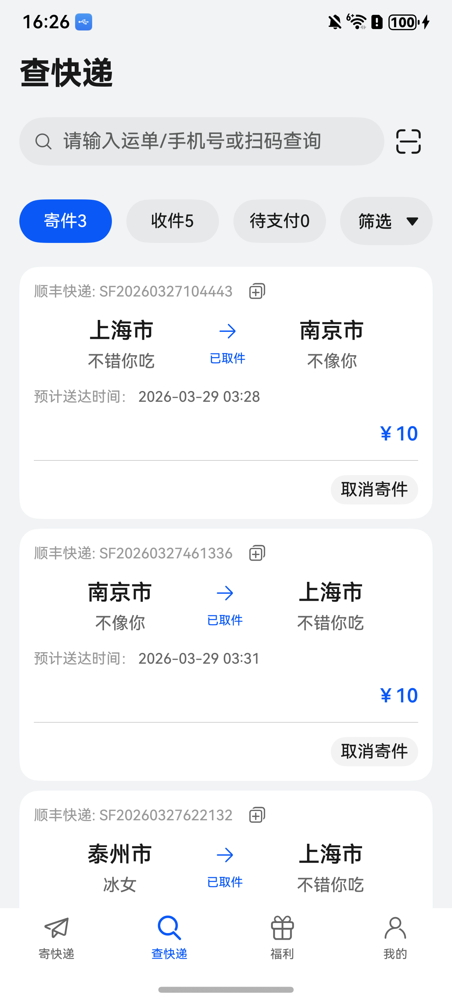
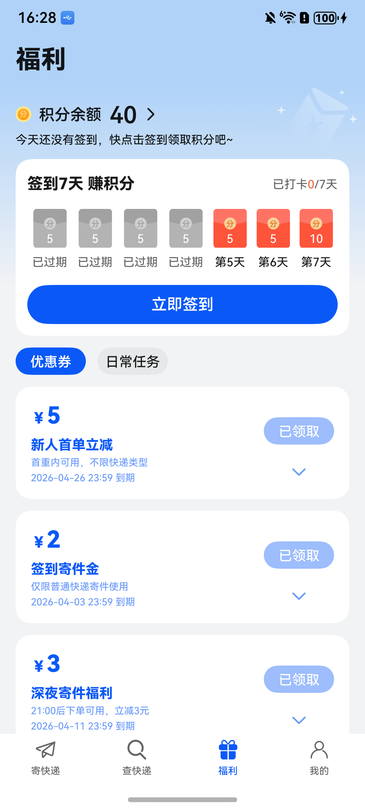

# 购物（快递）应用模板快速入门

## 目录

- [功能介绍](#功能介绍)
- [约束与限制](#约束与限制)
- [快速入门](#快速入门)
- [示例效果](#示例效果)
- [开源许可协议](#开源许可协议)

## 功能介绍

您可以基于此模板直接定制应用，也可以挑选此模板中提供的多种组件使用，从而降低您的开发难度，提高您的开发效率。

此模板提供如下组件，所有组件存放在工程根目录的components下，如果您仅需要使用组件，可参考对应组件的指导链接；如果您使用此模板，请参考本文档。

| 组件                                      | 描述                                                         | 使用指导                                                 |
| :---------------------------------------- | :----------------------------------------------------------- | :------------------------------------------------------- |
| 通用地址管理组件（address_management）    | 提供了新增/编辑/删除地址等功能，支持从地图选址、智能识别地址、获取华为账号收货地址 | [使用指导](./components/address_management/README.md)    |
| 通用登录组件（aggregated_login）          | 支持华为账号一键登录及其他方式登录（微信、手机号登录）       | [使用指导](./components/aggregated_login/README.md)      |
| 通用应用内设置组件（app_setting）         | 支持设置开关切换、下拉选择、页面跳转、文本刷新等基础设置项   | [使用指导](./components/app_setting/README.md)           |
| 通用个人信息组件（collect_personal_info） | 支持编辑头像、昵称、姓名、性别、手机号、生日、个人简介等     | [使用指导](./components/collect_personal_info/README.md) |
| 通用问题反馈组件（feedback）              | 支持提交问题反馈、查看反馈记录                               | [使用指导](./components/feedback/README.md)              |
| 通用会员组件（membership）                | 通过应用内支付实现会员开通的能力（自动续期订阅会员及非续期订阅会员），开发者可以根据业务需要快速实现应用会员开通 | [使用指导](./components/membership/README.md)            |
| 实名认证组件（module_auth）               | 提供实名认证的功能                                           | [使用指导](components/module_auth/README.md)             |
| 通用优惠券组件（coupons）                 | 提供了优惠券相关功能                                         | [使用指导](./components/coupons/README.md)               |
| 通用支付组件（aggregated_payment）        | 聚合了多方的支付能力。提供开箱即用的收银台选择器 (CashierPicker)以及封装完好的聚合支付服务接口 (aggregatedPaymentService) | [使用指导](./components/aggregated_payment/README.md)    |

### 模板

本模板为快递物流类应用提供了常用功能的开发样例，模板主要分寄快递、查快递、福利、我的三大模块：

* 寄快递：提供寄快递、模板、物品等。
* 查快递：展示快递信息，筛选搜索快递等。
* 福利：提供签到获取积分、领取优惠券、做日常任务获取积分等
* 我的：展示登录、地址簿、实名认证、设置等。

本模板已集成华为账号、支付等服务，只需做少量配置和定制即可快速实现华为账号的登录和寄快递等功能。

本模板主要页面及核心功能如下所示：

```ts
快递物流模板
 |-- 首页
 |    └-- 立即寄件
 |    └-- 用户服务
 |    |    └-- 开通会员
 |    |    └-- 实名认证
 |    └-- 基础服务
 |    |    └-- 寄快递
 |    |    |    |-- 添加模板
 |    |    |    |-- 模板列表
 |    |    |    |-- 地址列表
 |    |    |    └-- 物品列表
 |    |    |    └-- 寄快递
 |    |    └-- 发物流
 |    |    |    |-- 添加模板
 |    |    |    |-- 模板列表
 |    |    |    |-- 地址列表
 |    |    |    └-- 物品列表
 |    |    |    └-- 寄快递
 |    └-- 咨询客服
 |    └-- 广告
 |-- 查快递
 |    └-- 顶部搜索
 |    └-- 快递列表
 |    |    └-- 快递详情
 |    |    |    |-- 地图
 |    |    |    |-- 修改信息
 |    |    |    |-- 取消寄件
 |    |    |    └-- 联系快递员
 |    |    └-- 运单详情
 |    |    |    |-- 地图
 |    |    |    |-- 物流状态
 |-- 福利
 |    └-- 积分
 |    └-- 签到
 |    └-- 优惠券
 |    └-- 日常任务
 └-- 我的
      └-- 账号
      |    |-- 账号登录
 |    |    |-- 账号详情
 |    |    └-- 账号信息修改
 |    └-- 开通会员
 |    └-- 我的快递
 |    └-- 地址管理
 |    |    └-- 地址列表
 |    └-- 我的消息
 |    └-- 优惠券
 |    └-- 意见反馈
 |    └-- 联系客服
 |    └-- 设置
```

本模板工程代码结构如下所示：

```ts
ExpressTemplate
  |- commons                                       // 公共层
  |   |- lib_foundation/src/main/ets               // 公共工具模块(har)
  |   |    |- common 
  |   |    |     AddressService.ets                // 地址管理公共工具类
  |   |    |     CommonEnum.ets                    // 公共枚举
  |   |    |     Contant.ets                       // 公共常量
  |   |    |     GridRowColSetting.ets             // 栅格布局常量
  |   |    |- database 
  |   |    |     AddressBookDB.ets                 // 地址薄数据库表
  |   |    |     CouponDB.ets                      // 优惠券数据库表
  |   |    |     GoodsDB.ets                       // 物品数据库表
  |   |    |     index.ets                         // index
  |   |    |     LogisticsDB.ets                   // 物流数据库表
  |   |    |     ParcelDB.ets                      // 运单数据库
  |   |    |     PointDetailDB.ets                 // 积分数据库表
  |   |    |     RdbHelper.ets                     // 关系型数据库操作类
  |   |    |     TaskDB.ets                        // 日常任务数据库表
  |   |    |     TemplateDB.ets                    // 模板数据库表
  |   |    |     UserCouponDB.ets                  // 用户优惠券数据库表
  |   |    |     UserDB.ets                        // 用户信息数据库表
  |   |    |     UserSignDB.ets                    // 用户签到数据库表
  |   |    |     UserTaskDB.ets                    // 用户日常任务数据库表
  |   |    |- http 
  |   |    |     ApiManage.ets                     // API管理
  |   |    |     AxiosBase.ets                     // 网络请求基类
  |   |    |     MockAdapter.ets                   // mock适配器
  |   |    |     MockApi.ets                       // mock的API
  |   |    |     MockCouponData.ets                // 优惠券mock数据
  |   |    |     MockData.ets                      // 其他mock数据
  |   |    |     MockTaskData.ets                  // 日常任务mock数据
  |   |    |- model 
  |   |    |     AddressBook.ets                   // 地址信息类
  |   |    |     BaseViewModel.ets                 // ViewModel的基类
  |   |    |     BreakpointModel.ets               // 一多适配断点类
  |   |    |     CommonModel.ets                   // 公共数据类
  |   |    |     ControllerModule.ets              // 全局tab的控制器
  |   |    |     Coupon.ets                        // 优惠券类
  |   |    |     Goods.ets                         // 物品类
  |   |    |     IRequest.ets                      // 请求数据类型
  |   |    |     IResponse.ets                     // 响应数据类型
  |   |    |     Logistics.ets                     // 物流轨迹类
  |   |    |     Parcel.ets                        // 运单/订单类
  |   |    |     PointDetail.ets                   // 积分详情类
  |   |    |     Task.ets                          // 日常任务类
  |   |    |     Template.ets                      // 模板类
  |   |    |     User.ets                          // 用户信息类
  |   |    |     UserSign.ets                      // 用户签到类
  |   |    |     WindowInfo.ets                    // 全局窗口类
  |   |    └- push 
  |   |          Model.ets                          // 推送数据结构
  |   |          PushUtil.ets                       // 推送工具方法
  |   |    |- router 
  |   |    |     RouterModule.ets                  // 路由
  |   |    └- uicomponent 
  |   |          BottomBtn.ets                      // 页面底部按钮组件
  |   |          CommonEmpty.ets                    // 页面空白组件
  |   |          CommonLoading.ets                  // 页面loading组件
  |   |          CommonNoticeBar.ets                // 页面上层提示组件
  |   |          CommonStepper.ets                  // 计数器组件
  |   |          CommonTitle.ets                    // 页面标题组件
  |   |          GridPickerSheet.ets                // 格口选择器组件
  |   |          PreferPickupTimeSheet.ets          // 上门时间选择器组件
  |   |          ToastLoading.ets                   // loading toast组件
  |   |  
  |   |- components
  |   |     └- address_management                   // 通用地址管理组件
  |   |     └- aggregated_login                     // 通用登录组件     
  |   |     └- aggregated_payment                   // 通用支付组件
  |   |     └- app_setting                          // 通用应用内设置组件                     
  |   |     └- collect_personal_info                // 通用个人信息组件            
  |   |     └- coupons                              // 通用优惠券组件  
  |   |     └- feedback                             // 通用问题反馈组件 
  |   |     └- membership                           // 通用会员组件
  |   |     └- module_advertisement                 // 广告组件 
  |   |     └- module_auth                          // 实名认证组件 
  |   |     └- module_template                      // 模板组件 
  |   |     └- notice_center                        // 消息中心组件 
  |   |                                                
  |- features                                         
  |   |- business_benefits/src/main/ets              // 福利tab页功能组合(har)
  |   |   |- pages                               
  |   |   |   BenefitPage.ets                        // 福利首页
  |   |   |   PointsHistoryPage.ets                  // 积分明细页
  |   |   |   VipBenefitPage.ets                     // 会员福利页
  |   └- business_home/src/main/ets                  // 首页tab页功能组合(har)
  |   |   |- pages                               
  |   |   |   ExpressPage.ets                        // 寄件页
  |   |   |   GoodsPage.ets                          // 物品选择页
  |   |   |   HomePage.ets                           // 首页
  |   |   |   ServicePointPage.ets                   // 快递柜服务页
  |   └- business_mine/src/main/ets                  // 我的tab页功能组合(har)
  |   |   |- pages                               
  |   |   |   CouponPage.ets                         // 优惠券页
  |   |   |   MinePage.ets                           // 我的页
  |   |   |   PersonalInformationPage.ets            // 个人信息页
  |   |   |   PrivacyPage.ets                        // 隐私页
  |   |   |   PurchasePage.ets                       // 会员开通页
  |   |   |   QuickLoginPage.ets                     // 登录页
  |   |   |   RealNameAuthPage.ets                   // 实名认证页
  |   |   |   SettingPage.ets                        // 设置页
  |   |   |   SettingPrivacyPage.ets                 // 隐私设置页
  |   └- business_order/src/main/ets                 // 订单tab页功能组合(har)
  |   |   |- pages                               
  |   |   |   EditOrderPage.ets                      // 订单编辑页
  |   |   |   OrderDetailPage.ets                    // 订单详情页
  |   |   |   OrderInfoPage.ets                      // 物流轨迹详情页
  |   |   |   OrderPage.ets                          // 订单列表页
  └- products/entry                                 // 应用层主包(hap)  
      └-  src/main/ets                                                                   
           |- pages                              
           |    Index.ets                           // 入口页
           |    MainEntry.ets                       // 主页面
           |    SafePage.ets                        // 首启用户授权页
           |    SplashPage.ets                      // 闪屏广告页     
           └- widget                                // 服务卡片

```

## 约束与限制

### 环境

* DevEco Studio版本：DevEco Studio 6.0.2 Release及以上
* HarmonyOS SDK版本：HarmonyOS 6.0.2 Release SDK及以上
* 设备类型：华为手机（包括双折叠和阔折叠）、华为平板
* 系统版本：HarmonyOS 6.0.0(20)及以上

### 权限

* 网络权限：ohos.permission.INTERNET

### 使用约束

- 本模板中的支付、会员开通、获取华为账号收货地址等功能暂不支持模拟器调测

## 快速入门

### 配置工程

在运行此模板前，需要完成以下配置：

1. 在AppGallery Connect创建应用，将包名配置到模板中。

   a. 参考[创建HarmonyOS应用](https://developer.huawei.com/consumer/cn/doc/app/agc-help-create-app-0000002247955506)
   为应用创建APP ID，并将APP ID与应用进行关联。

   b. 返回应用列表页面，查看应用的包名。

   c. 将AppScope/app.json5文件中的bundleName替换为创建应用的包名。

   d. 将products/phone/src/main/resources/base/profile/shortcuts_config.json中的bundleName替换为创建应用的包名。

2. 配置华为账号服务。

   a. 将应用的client ID配置到products/entry/src/main路径下的module.json5文件，详细参考：[配置Client ID](https://developer.huawei.com/consumer/cn/doc/harmonyos-guides/account-client-id)。

   b. 申请华为账号一键登录所需的quickLoginMobilePhone权限，详细参考：[配置scope权限](https://developer.huawei.com/consumer/cn/doc/harmonyos-guides/account-config-permissions)。

3. 配置支付服务。

   华为支付当前仅支持商户接入，在使用服务前，需要完成商户入网、开发服务等相关配置，本模板仅提供了端侧集成的示例。详细参考：[支付服务接入准备](https://developer.huawei.com/consumer/cn/doc/harmonyos-guides/payment-preparations)。

4. 配置推送服务。

   a. [开启推送服务](https://developer.huawei.com/consumer/cn/doc/harmonyos-guides/push-config-setting)。

   b. 按照需要的权益[申请通知消息自分类权益](https://developer.huawei.com/consumer/cn/doc/harmonyos-guides/push-apply-right)。

   c. [端云调试](https://developer.huawei.com/consumer/cn/doc/harmonyos-guides/push-server)。

5. 配置地图服务。

   a. 将应用的client ID配置到entry/src/main路径下的module.json5文件，如果华为账号服务已配置，可跳过此步骤。

   b. [开通地图服务](https://developer.huawei.com/consumer/cn/doc/harmonyos-guides/map-config-agc)。

6. 配置华为账号收货地址管理服务。

   当前模板的地址管理组件支持获取华为账号收货地址，使用此功能需满足一定条件。详细参考：[收货地址服务开发前提](https://developer.huawei.com/consumer/cn/doc/harmonyos-guides/account-choose-address-dev#section1061219267293)。

7. 配置广告服务。

   a. 如果仅调测广告，可使用测试广告位ID：开屏广告：testd7c5cewoj6，激励广告：testx9dtjwj8hp，横幅广告：testw6vs28auh3

   b. 申请正式的广告位ID。 登录[鲸鸿动能媒体服务平台](https://developer.huawei.com/consumer/cn/service/ads/publisher/html/index.html?lang=zh) 进行申请，具体操作详情请参见[展示位创建](https://developer.huawei.com/consumer/cn/doc/distribution/monetize/zhanshiweichuangjian-0000001132700049)。

8. 配置应用内支付服务

   a. 您需[开通商户服务](https://developer.huawei.com/consumer/cn/doc/start/merchant-service-0000001053025967)才能开启应用内购买服务。商户服务里配置的银行卡账号、币种，用于接收华为分成收益。

   b. 使用应用内购买服务前，需要打开应用内购买服务(HarmonyOS NEXT) 开关，此开关是应用级别的，即所有使用IAP Kit功能的应用均需执行此步骤，详情请参考[打开应用内购买服务API开关](https://developer.huawei.com/consumer/cn/doc/app/switch-0000001958955097)。

   c. 开启应用内购买服务(HarmonyOS NEXT) 开关后，开发者需进一步激活应用内购买服务 (HarmonyOS NEXT)，具体请参见[激活服务和配置事件通知](https://developer.huawei.com/consumer/cn/doc/app/parameters-0000001931995692)。

   d. 由于真实支付需依赖应用及其关联的会员商品上架，故建议在接入华为应用内支付调测过程中，您可以使用[沙盒测试](https://developer.huawei.com/consumer/cn/doc/harmonyos-guides/iap-sandbox)对订单进行虚拟支付。

9. 接入微信SDK（可选）。 前往微信开放平台申请AppID并配置鸿蒙应用信息，详情参考：[鸿蒙接入指南](https://developers.weixin.qq.com/doc/oplatform/Mobile_App/Access_Guide/ohos.html)。

10. 接入QQ（可选）。 前往QQ开放平台申请AppID并配置鸿蒙应用信息，详情参考：[鸿蒙接入指南](https://wiki.connect.qq.com/sdk下载)。

11. 对应用进行[手工签名](https://developer.huawei.com/consumer/cn/doc/harmonyos-guides/ide-signing#section297715173233)。

12. 添加手工签名所用证书对应的公钥指纹。详细参考：[配置应用签名证书指纹](https://developer.huawei.com/consumer/cn/doc/app/agc-help-cert-fingerprint-0000002278002933)

### 运行调试工程

1. 连接调试手机和PC。

2. 菜单选择“Run > Run 'entry' ”或者“Run > Debug 'entry' ”，运行或调试模板工程。

## 示例效果

| 首页                                                        | 查快递                                                       | 福利                                                         | 我的                                                        |
| ----------------------------------------------------------- | ------------------------------------------------------------ | ------------------------------------------------------------ | ----------------------------------------------------------- |
|  |  |  |  |


## 开源许可协议

该代码经过[Apache 2.0 授权许可](http://www.apache.org/licenses/LICENSE-2.0)。
