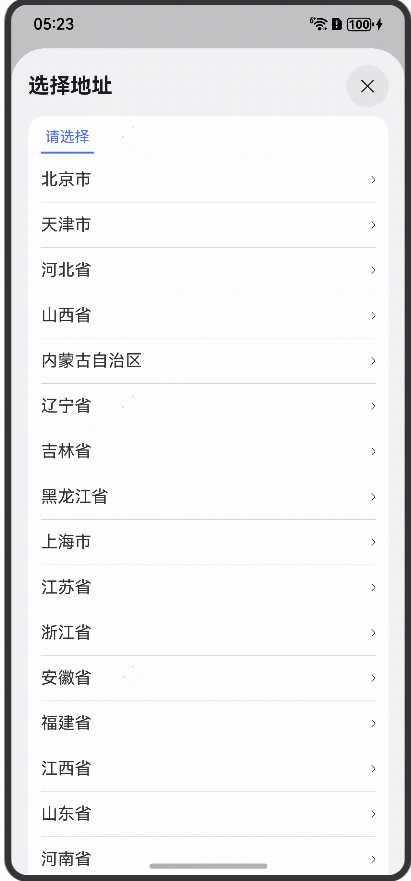

# 城市选择组件快速入门

## 目录

- [简介](#简介)
- [约束与限制](#约束与限制)
- [使用](#使用)
- [API参考](#API参考)
- [示例代码](#示例代码)

## 简介

本组件提供按省、市、区选择城市相关功能。



## 约束与限制

### 环境

* DevEco Studio版本：DevEco Studio 5.0.0 Release及以上
* HarmonyOS SDK版本：HarmonyOS 5.0.0 Release SDK及以上
* 设备类型：华为手机（包括双折叠和阔折叠）
* 系统版本：HarmonyOS 5.0.0(12) 及以上

### 权限

无

## 使用

1. 安装组件。

   如果是在DevEco Studio使用插件集成组件，则无需安装组件，请忽略此步骤。

   如果是从生态市场下载组件，请参考以下步骤安装组件。

   a. 解压下载的组件包，将包中所有文件夹拷贝至您工程根目录的XXX目录下。

   b. 在项目根目录build-profile.json5添加module_city和module_base模块。

    ```
    // 在项目根目录build-profile.json5填写module_city路径。其中XXX为组件存放的目录名
    "modules": [
        {
        "name": "module_city",
        "srcPath": "./XXX/module_city",
        }
    ]
    ```
   c. 在项目根目录oh-package.json5中添加依赖。
    ```
    // XXX为组件存放的目录名称
    "dependencies": {
      "module_city": "file:./XXX/module_city"
    }
    ```

2. 调用组件，详细参数配置说明参见[API参考](#API参考)。
   ```
   // 使用时请将src/main/resources/rawfile/regioin.json文件放在项目的rawfile文件夹
   import { CommonCascade } from 'module_city'
   @Entry
   @ComponentV2
   struct Sample {
     stack = new NavPathStack()
     build() {
       Navigation(this.stack) {
         Row() {
           Text('地址')
             .fontSize(16)
             .width('20%')
           CommonCascade({
             province: '江苏省',
             city: '南京市',
             area: '雨花台区',
           })
         }
         .width('100%')
         .height(40)
         .backgroundColor(Color.White)
         .padding({ left: 16, right: 16 })
         .borderRadius(16)
       }
       .hideTitleBar(true)
       .backgroundColor('#F1F3F5')
       .mode(NavigationMode.Stack)
     }
   }
   ```

## API参考

### 子组件

无

### 接口

CommonCascade(option: CommonCascadeOptions)

城市选择组件。

**参数：**

| 参数名     | 类型                                                | 是否必填 | 说明          |
|---------|---------------------------------------------------|------|-------------|
| options | [CommonCascadeOptions](#CommonCascadeOptions对象说明) | 否    | 配置城市选组件的参数。 |

### CommonCascadeOptions对象说明

| 参数       | 类型     | 是否必填 | 说明 |
|:---------|:-------|:-----|:---|
| province | string | 否    | 省  |
| city     | string | 否    | 市  |
| area     | string | 否    | 区  |

### onChange事件说明

| 事件       | 类型                       | 说明       |
|:---------|:-------------------------|:---------|
| onChange | (data: string[]) => void | 获取更改后的数据 |

## 示例代码

```
// 使用时请将src/main/resources/rawfile/regioin.json文件放在项目的rawfile文件夹
import { CommonCascade } from 'module_city'
@Entry
@ComponentV2
struct Sample {
  stack = new NavPathStack()
  build() {
    Navigation(this.stack) {
      Row() {
        Text('地址')
          .fontSize(16)
          .width('20%')
        CommonCascade({
          province: '江苏省',
          city: '南京市',
          area: '雨花台区',
        })
      }
      .width('100%')
      .height(40)
      .backgroundColor(Color.White)
      .padding({ left: 16, right: 16 })
      .borderRadius(16)
    }
    .hideTitleBar(true)
    .backgroundColor('#F1F3F5')
    .mode(NavigationMode.Stack)
  }
}
```
