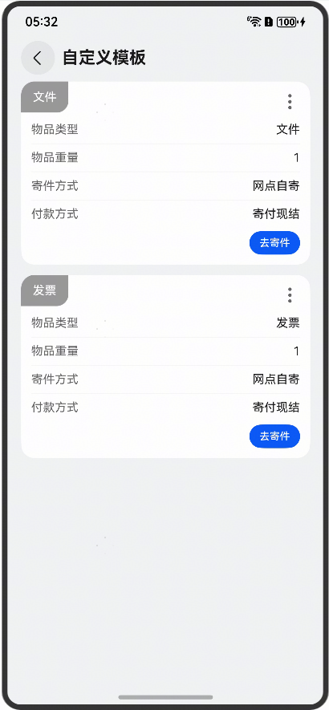
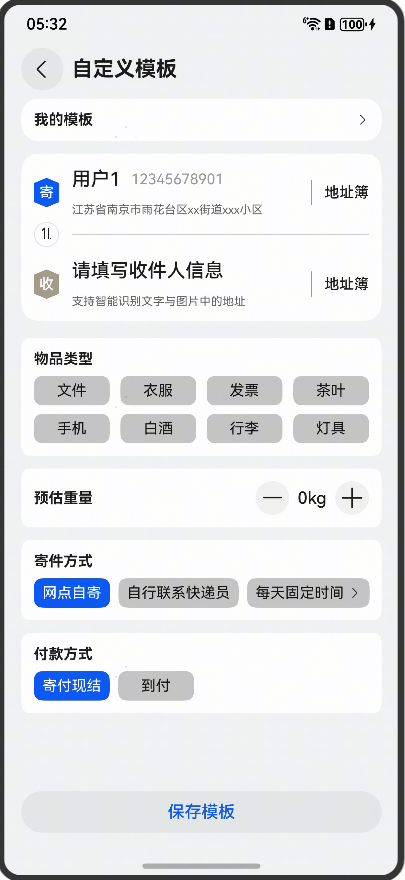

# 快递信息模板管理组件快速入门

## 目录

- [简介](#简介)
- [约束与限制](#约束与限制)
- [使用](#使用)
- [API参考](#API参考)
- [示例代码](#示例代码)

## 简介

本组件提供模板管理的功能，可以生成一个固定物品信息的寄件模板，方便用户多次寄送同一类快递。

| 模板列表                                         | 模板编辑                                         |
|----------------------------------------------|----------------------------------------------|
|  |  |

## 约束与限制

### 环境

* DevEco Studio版本：DevEco Studio 5.0.0 Release及以上
* HarmonyOS SDK版本：HarmonyOS 5.0.0 Release SDK及以上
* 设备类型：华为手机（包括双折叠和阔折叠）
* 系统版本：HarmonyOS 5.0.0(12) 及以上

### 权限

无

## 使用

1. 安装组件。

   如果是在DevEco Studio使用插件集成组件，则无需安装组件，请忽略此步骤。

   如果是从生态市场下载组件，请参考以下步骤安装组件。

   a. 解压下载的组件包，将包中所有文件夹拷贝至您工程根目录的XXX目录下。

   b. 在项目根目录build-profile.json5添加module_template、module_address、module_address_card和module_base模块。

    ```
    // 在项目根目录build-profile.json5填写module_template、module_address、module_address_card和module_base路径。其中XXX为组件存放的目录名
    "modules": [
        {
        "name": "module_template",
        "srcPath": "./XXX/module_template",
        },
        {
        "name": "module_address",
        "srcPath": "./XXX/module_address",
        },
        {
        "name": "module_address_card",
        "srcPath": "./XXX/module_address_card",
        },
        {
        "name": "module_base",
        "srcPath": "./XXX/module_base",
        }
    ]
    ```
   c. 在项目根目录oh-package.json5中添加依赖。
    ```
    // XXX为组件存放的目录名称
    "dependencies": {
      "module_template": "file:./XXX/module_template"
    }
    ```

2. 调用组件，详细参数配置说明参见[API参考](#API参考)。
   ```
   import { TemplateManage } from 'module_template'
   import { promptAction } from '@kit.ArkUI'
   
   @Entry
   @ComponentV2
   struct Sample {
     stack: NavPathStack = new NavPathStack()
   
     build() {
       Navigation(this.stack) {
         Column({ space: 10 }) {
           TemplateManage({
             navPathStack: this.stack,
             onPushPath: (id: number) => {
               this.getUIContext().getPromptAction().showToast({ message: '可自定义' })
             },
           }) {
             Button('模板管理')
           }
         }
         .padding(10)
       }
       .hideTitleBar(true)
       .mode(NavigationMode.Stack)
     }
   }
   ```

## API参考

### 子组件

无

### 接口

TemplateManage(option: TemplateManageOptions)

模板管理组件。

**参数：**

| 参数名     | 类型                                                  | 是否必填 | 说明           |
|---------|-----------------------------------------------------|------|--------------|
| options | [TemplateManageOptions](#TemplateManageOptions对象说明) | 否    | 配置模板管理组件的参数。 |

### TemplateManageOptions对象说明

| 参数名              | 类型                   | 是否必填 | 说明                    |
|:-----------------|:---------------------|:-----|:----------------------|
| navPathStack     | NavPathStack         | 是    | Navigation路由栈实例       |
| onBeforeNavigate | () => boolean        | 否    | 页面跳转前的回调，返回false将取消跳转 |
| onPushPath       | (id: number) => void | 否    | 去寄件按钮的回调              |

## 示例代码

```
import { promptAction } from '@kit.ArkUI'
import { TemplateManage } from 'module_template'

@Entry
@ComponentV2
struct Sample {
  stack: NavPathStack = new NavPathStack()

  build() {
    Navigation(this.stack) {
      Column({ space: 10 }) {
        TemplateManage({
          navPathStack: this.stack,
          onPushPath: (id: number) => {
            this.getUIContext().getPromptAction().showToast({ message: '可自定义' })
          },
        }) {
          Button('模板管理')
        }
      }
      .padding(10)
    }
    .hideTitleBar(true)
    .mode(NavigationMode.Stack)
  }
}
```