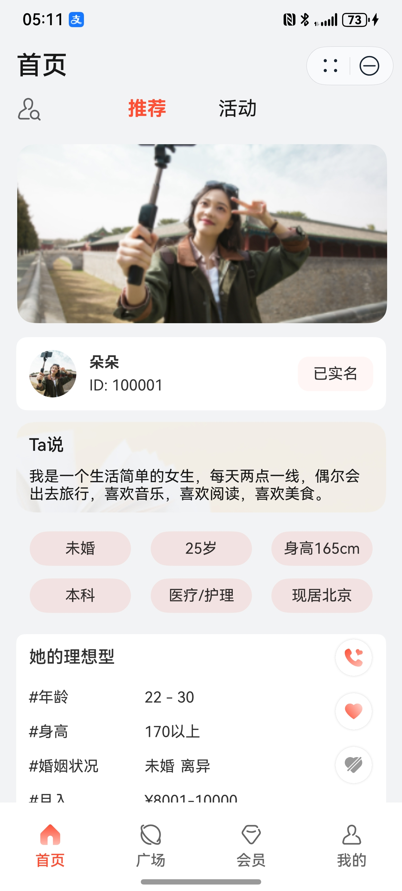
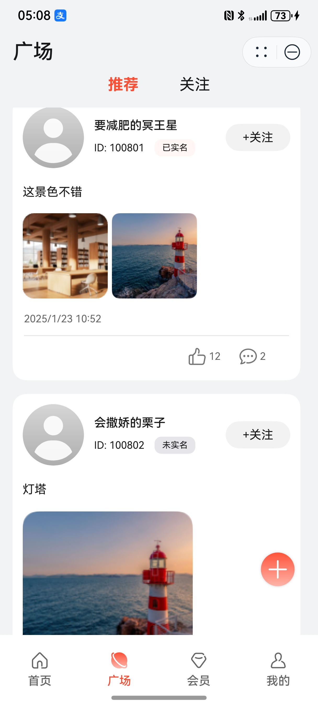
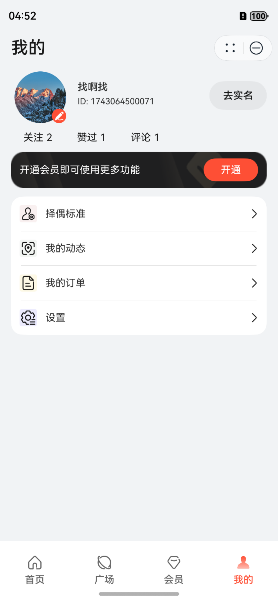

# 社交(相亲交友平台)行业模板快速入门

## 目录

- [功能介绍](#功能介绍)
- [环境要求](#环境要求)
- [快速入门](#快速入门)
- [API说明](#API说明)
- [示例效果](#示例效果)
- [权限要求](#权限要求)
- [开源许可协议](#开源许可协议)


## 功能介绍

本模板为社交类相亲交友平台的元服务提供了常用功能的开发样例，提供了用户推荐、相亲活动、广场、会员、个人中心等能力。模板主要分首页、广场、会员、我的四大模块：

* 首页：分为“推荐”和“活动”两个页签，默认的“推荐”页签展示系统推荐的用户信息。“活动”页签展示活动信息。
* 广场：分为“推荐”和“关注”两个页签。“推荐”页签展示系统推荐的（热门）的动态信息，“关注”页签展示当前用户关注的用户发布的动态信息。
* 会员：展示会员特权描述和会员订购入口。
* 我的：展示用户的个人信息、操作记录、以及择偶标准、我的动态、我的订单、设置的管理。

本模板已集成华为账号、支付等服务，只需做少量配置和定制即可快速实现华为账号的登录和购买会员套餐等功能。

| 首页                                              | 广场                                          | 会员                                            | 我的                                              |
|-------------------------------------------------|---------------------------------------------|-----------------------------------------------|-------------------------------------------------|
|  |  |  | 

本模板主要页面及核心功能如下所示：

```ts
相亲平台模板
 |-- 首页
 |    |-- 推荐用户
 |    |    |-- 用户信息
 |    |    |    |-- 用户相册展示
 |    |    |    |-- 用户自我介绍
 |    |    |    |-- 用户基本信息
 |    |    |    |-- 用户择偶条件
 |    |    |    └-- 用户近期动态
 |    |    └-- 操作
 |    |    |    |-- 联系红娘
 |    |    |    |-- 关注用户
 |    |    |    └-- 对当前用户不感兴趣
 |    |-- 活动
 |    |    |-- 活动地区选择
 |    |    └-- 活动列表
 |    |    |    |-- 活动详情
 |    |    |    └-- 活动报名
 |-- 广场
 |    |-- 推荐
 |    |    |-- 动态列表  
 |    |    |    |-- 动态详情
 |    |    |    |-- 动态点赞
 |    |    |    |-- 动态评论 
 |    |    |    |-- 关注用户
 |    |    |    └-- 新增动态
 |    |-- 关注
 |    |    |-- 动态列表
 |    |    |    |-- 动态详情
 |    |    |    |-- 动态点赞
 |    |    |    |-- 动态评论 
 |    |    |    └-- 新增动态
 |-- 会员
 |    └-- 会员权益介绍
 |    └-- 会员订购
 |
 └-- 我的
 |    |-- 个人信息
 |    |    |-- 头像设置
 |    |    |-- 详细信息设置
 |    |    └-- 实名认证
 |    |-- 操作记录汇总
 |    |    |-- 关注总数及详情查看
 |    |    |-- 点赞总数及详情查看
 |    |    └-- 评论总数及详情查看
 |    |-- 择偶标准	    
 |    |    └--择偶标准设置 
 |    |-- 我的动态
 |    |    |-- 动态列表 
 |    |    └-- 新增动态 
 |    |-- 我的订单
 |    |    └-- 订单查看 
 |    |-- 设置
 |    |    └--  是否公开设置
 |    |    └--  销户
```

本模板工程代码结构如下所示：

```
SocialDating
  ├─commons/src/main
  │  ├─ets
  │  │  ├─model                               // 公共数据模型
  │  │  ├─page                                // 公共页面
  │  │  ├─service                             // 基础服务，其中MockService为本地桩的实现类，在本地模拟服务端的实现
  │  │  └─utils                               // 常量、工具类
  │  │                                       
  │  └─resources                             
  │  │  ├─base
  │  │  │  ├─element                         // 公共的资源变量定义，如颜色、字符串等
  │  │  │  ├─media                           // 公共的图标、媒体文件 
  │  │  │  └─profile                         // 路由页面配置                                          
  │  │                             
  │─features                   
  │  ├─activity/src/main                     // 活动模块                                    
  │  │  ├─ ets
  │  │  │  ├─model                           // 活动模块相关的模型定义，如活动对象、参加的活动对象、请求和响应对象等
  │  │  │  ├─pages                           // 活动页面，主要是活动详情页和我参加的活动列表页  
  │  │  │  └─service                         // 活动服务类，该类负责对接后端进行数据处理                             
  │  │  └─resources                          // 资源文件目录， 同commons模块，不再赘述
  │  │                                
  │  ├─composite/src/main                    // 组合模块，这个模块在活动、用户、动态、会员这些基础模块的上一层，
  │  │  │                                    // 组合各基础模块的能力以提供组合服务，当前主要包括首页和个人中心两部分                       
  │  │  ├─ ets
  │  │  │  ├─model                           // 首页和个人中心相关的模型定义，如操作记录页参数等
  │  │  │  ├─pages                           // 页面，主要包括首页、个人中心页、我的操作记录（关注、点赞、评论）页 
  │  │  └─resources                          // 资源文件目录， 同commons模块，不再赘述    
  │  │     
  │  ├─feed/src/main                         // 动态（feed）模块                                    
  │  │  ├─ ets
  │  │  │  ├─model                           // 动态相关的模型定义，如动态对象、评论、动态相关的请求和响应对象等
  │  │  │  ├─pages                           // 动态页面，包括动态列表、动态详情、新增动态页等  
  │  │  │  └─service                         // 动态服务类，该类负责对接后端进行数据处理                             
  │  │  └─resources                          // 资源文件目录， 同commons模块，不再赘述
  │  │     
  │  ├─member/src/main                       // 会员模块                                    
  │  │  ├─ ets
  │  │  │  ├─model                           // 会员相关的模型定义，如红娘对象。
  │  │  │  ├─pages                           // 会员页面，当前主要是会员服务页  
  │  │  │  └─service                         // 会员服务类，该类负责对接后端进行数据处理                             
  │  │  └─resources                          // 资源文件目录， 同commons模块，不再赘述
  │  │     
  │  ├─user/src/main                         // 用户模块                                    
  │  │  ├─ ets
  │  │  │  ├─model                           // 用户相关的模型和数据对象定义。
  │  │  │  ├─pages                           // 用户页面，包括用户配置、用户信息编辑页、择偶条件设置页、用户列表、用户详情、用户注册、 
  │  │  │  │                                 // 和用户搜索、实名认证等页面
  │  │  │  └─service                         // 用户服务类，该类负责对接后端进行数据处理                             
  │  │  └─resources                          // 资源文件目录， 同commons模块，不再赘述                                            
  │─products                       
  │  ├─phone/src/main                                  
  │  │  ├─ets                        
  │  │  │  ├─model                           // 模型和数据对象定义
  │  │  │  └─pages                           // 主页                                                     
  │  │  │                                    
  │  │  └─resources                
  │  │  │  ├─base                           
  │  │  │  │  ├─element                      // 产品相关的资源变量定义，如颜色、字符串等
  │  │  │  │  ├─media                        // 产品相关的图标等
  │  │  │  │  └─profile                      // 主页和路由表配置文件
  │  │  │  │                        
  │  │  │  └─rawfile                         // mock数据。本模板仅实现了端侧，与后端相关的数据请求由本目录下的json文件进行mock                      
```

## 环境要求

### 软件
* DevEco Studio版本：DevEco Studio 5.0.0 Release及以上
* HarmonyOS SDK版本：HarmonyOS 5.0.0 Release SDK及以上

### 硬件
* 设备类型：华为手机（直板机）
* HarmonyOS版本：HarmonyOS 5.0.0 Release及以上


## 快速入门

### 配置工程

在运行此模板前，需要完成以下配置：

1. 在DevEco Studio中打开此模板。

2. 在AppGallery Connect创建元服务，将包名配置到模板中。

   a. 参考[创建元服务](https://developer.huawei.com/consumer/cn/doc/app/agc-help-createharmonyapp-0000001945392297)为元服务创建APPID，并进行关联。

   b. 返回应用列表页面，查看元服务的包名。

   c. 将模板工程根目录下AppScope/app.json5文件中的bundleName替换为创建元服务的包名。

3. 配置服务器域名。

   本模板接口均采用mock数据，由于元服务包体大小有限制，部分图片资源将从云端拉取，所以需为模板项目[配置服务器域名](https://developer.huawei.com/consumer/cn/doc/atomic-guides-V5/agc-help-harmonyos-server-domain-V5)，“httpRequest合法域名”需要配置为：`https://agc-storage-drcn.platform.dbankcloud.cn`

4. 配置华为账号服务。

   a. 将元服务的client ID配置到phone模块的module.json5文件，详细参考：[配置Client ID](https://developer.huawei.com/consumer/cn/doc/atomic-guides-V5/account-atomic-client-id-V5)。

   b. 添加公钥指纹，详细参考：[配置应用证书指纹](https://developer.huawei.com/consumer/cn/doc/app/agc-help-signature-info-0000001628566748#section5181019153511)。

   c. 如需获取用户真实手机号，需要申请phone权限，详细参考：[配置scope权限](https://developer.huawei.com/consumer/cn/doc/atomic-guides-V5/account-guide-atomic-permissions-V5)，并在端侧使用快速验证手机号码Button进行[验证获取手机号码](https://developer.huawei.com/consumer/cn/doc/atomic-guides-V5/account-guide-atomic-get-phonenumber-V5)。

5. 配置支付服务。

   华为支付当前仅支持商户接入，在使用服务前，需要完成商户入网、开发服务等相关配置，本模板仅提供了端侧集成的示例。详细参考：[支付服务接入准备](https://developer.huawei.com/consumer/cn/doc/harmonyos-guides-V5/payment-preparations-V5)。

6.  隐私保护：

    使用AGC的标准化隐私声明托管服务。
    详细说明和云侧集成参考：[隐私声明和用户协议托管](https://developer.huawei.com/consumer/cn/doc/app/agc-help-harmonyos-privacystatementguide-0000001757041969)

###  运行调试工程
1. 连接调试手机和PC。

2. 对元服务签名：由于模板中集成了华为账号等服务，所以需要采用[手工签名](https://developer.huawei.com/consumer/cn/doc/harmonyos-guides-V5/ide-signing-V5#section297715173233)。

3. 配置多模块调试：由于本模板存在多个模块，运行时需确保所有模块安装至调试设备。

   a. 运行模块选择“phone”。

   b. 下拉框选择“Edit Configurations”，在“Run/Debug Configurations”界面，选择“Deploy Multi Hap”页签，勾选上模板中所有模块。

   c. 点击"Run"，运行模板工程。

## API说明

-    [API文档](read_me_resource/SocailDating_API.html)

## 示例效果

[功能展示录屏](read_me_resource/功能展示录屏.mp4)

## 权限要求

* 网络权限：ohos.permission.INTERNET


## 开源许可协议

该代码经过[Apache 2.0 授权许可](http://www.apache.org/licenses/LICENSE-2.0)。

