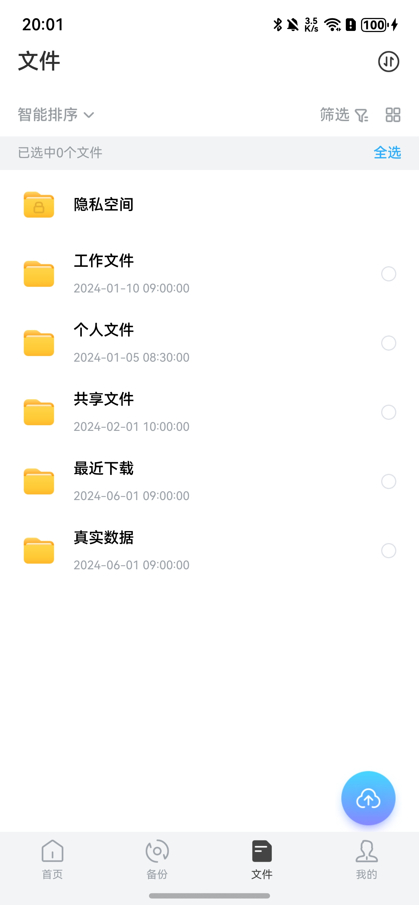

# 网盘文件基础组件快速入门

## 目录

- [简介](#简介)
- [约束与限制](#约束与限制)
- [使用](#使用)
- [API参考](#API参考)
- [示例代码](#示例代码)

## 简介

本组件提供了网盘文件展示的基础UI组件库，支持文件列表和宫格两种视图模式。包含文件选择单元格、文件夹单元格、宫格项、隐私空间单元格等多种展示组件，为网盘应用提供统一的文件展示界面。



## 约束与限制

### 环境

- DevEco Studio版本：DevEco Studio 5.0.5 Release及以上
- HarmonyOS SDK版本：HarmonyOS 5.0.5 Release SDK及以上
- 设备类型：华为手机（包括双折叠和阔折叠）
- 系统版本：HarmonyOS 5.0.3(15) 及以上

### 权限

- 无

## 使用

1. 安装组件。  
   如果是在DevEco Studio使用插件集成组件，则无需安装组件，请忽略此步骤。
   如果是从生态市场下载组件，请参考以下步骤安装组件。  
   a. 解压下载的组件包，将包中所有文件夹拷贝至您工程根目录的xxx目录下。  
   b. 在项目根目录build-profile.json5并添加cloud_file_base模块。
   ```typescript
   // 在项目根目录的build-profile.json5填写cloud_file_base路径。其中xxx为组件存在的目录名
   "modules": [
     {
       "name": "cloud_file_base",
       "srcPath": "./xxx/cloud_file_base",
     }
   ]
   ```
   c. 在项目根目录oh-package.json5中添加依赖
   ```typescript
   // xxx为组件存放的目录名称
   "dependencies": {
     "cloud_file_base": "file:./xxx/cloud_file_base"
   }
   ```

2. 引入组件。

   ```typescript
   import { 
     FileBaseCheckCell,
     FileBaseDirectorCell,
     FileBaseGridItem,
     FileBasePrivateSpaceCell,
     FileBaseSelectListView,
     FileBaseCheckViewModel,
     FileBaseCheckViewModelSource,
     FileBaseInfo,
     FileBaseType
   } from 'cloud_file_base';
   ```

3. 调用组件，详细参数配置说明参见[API参考](#API参考)。

   ```typescript
   // 文件选择列表视图
   FileBaseSelectListView({
     vm: this.viewModel,
     selectRowBgColor: Color.White
   })
   ```

## API参考

### 接口

#### FileBaseCheckCell

FileBaseCheckCell(options: { fileInfo: FileBaseInfo; isSelected?: boolean; checkAction?: () => void })

文件选择单元格组件，用于列表视图中展示可选择的文件项。

**参数：**

| 参数名         | 类型                            | 是否必填 | 说明              |
|-------------|-------------------------------|------|-----------------|
| fileInfo    | [FileBaseInfo](#FileBaseInfo) | 是    | 文件信息对象          |
| isSelected  | boolean                       | 否    | 是否选中状态，默认 false |
| checkAction | () => void                    | 否    | 选择框点击事件回调       |

#### FileBaseDirectorCell

FileBaseDirectorCell(options: { fileInfo: FileBaseInfo })

文件夹单元格组件，用于展示文件夹项。

**参数：**

| 参数名      | 类型                            | 是否必填 | 说明     |
|----------|-------------------------------|------|--------|
| fileInfo | [FileBaseInfo](#FileBaseInfo) | 是    | 文件信息对象 |

#### FileBaseGridItem

FileBaseGridItem(options: { fileInfo: FileBaseInfo; isSelected?: boolean; checkAction?: () => void })

文件宫格项组件，用于宫格视图中展示文件。

**参数：**

| 参数名         | 类型                            | 是否必填 | 说明              |
|-------------|-------------------------------|------|-----------------|
| fileInfo    | [FileBaseInfo](#FileBaseInfo) | 是    | 文件信息对象          |
| isSelected  | boolean                       | 否    | 是否选中状态，默认 false |
| checkAction | () => void                    | 否    | 选择框点击事件回调       |

#### FileBasePrivateSpaceCell

FileBasePrivateSpaceCell(options: { fileInfo: FileBaseInfo })

隐私空间单元格组件，用于展示隐私空间入口。

**参数：**

| 参数名      | 类型           | 是否必填 | 说明     |
|----------|--------------|------|--------|
| fileInfo | [FileBaseInfo](#FileBaseInfo) | 是    | 文件信息对象 |

#### FileBaseSelectListView

FileBaseSelectListView(options: { vm: FileBaseCheckViewModel; selectRowBgColor?: ResourceColor })

文件选择列表视图组件，提供文件列表展示和选择功能。

**参数：**

| 参数名              | 类型                          | 是否必填 | 说明                    |
|------------------|-----------------------------|------|-----------------------|
| vm               | [FileBaseCheckViewModel](#FileBaseCheckViewModel) | 是    | 文件选择视图模型              |
| selectRowBgColor | ResourceColor               | 否    | 选中行背景色，默认 Color.White |

### 数据模型

#### FileBaseInfo

文件基础信息数据模型。

**主要属性：**

| 名称           | 类型                                  | 说明                  |
|--------------|-------------------------------------|---------------------|
| fileId       | number                              | 文件唯一标识              |
| parentFileId | number                              | 父文件ID               |
| name         | string                              | 文件名                 |
| fileType     | [FileBaseType](#FileBaseType)       | 文件类型                |
| fileSize     | string                              | 文件大小                |
| createTime   | string                              | 文件创建时间              |
| updateTime   | string                              | 文件更新时间              |
| isCollected  | boolean                             | 是否已收藏               |
| isPrivate    | boolean                             | 是否隐私文件              |
| downloadUrl  | string                              | 资源下载路径              |
| thumbnailUrl | string                              | 缩略图路径               |
| path         | string                              | 本地路径                |
| resolution   | string                              | 文件尺寸（图片/视频）         |
| contentList  | [FileBaseInfo](#FileBaseInfo)[]     | 子文件列表（文件夹）          |
| expireTime   | number                              | 过期时间（0-未设置，-1-永久有效） |
| expire       | boolean                             | 是否过期                |
| usefullTime  | string                              | 有效期描述               |
| getCode      | string                              | 提取码                 |

**主要方法：**

- `removeFileBaseExtension(): string` - 删除文件扩展名后缀
- `checkShareExpireTime(): string` - 获取分享过期时间描述
- `checkShareExpireTimeColor(): ResourceColor` - 获取分享过期时间文本颜色
- `changeTimeBy(content: string): void` - 根据文本内容修改过期时间戳
- `toJSON(): FileBaseInfoPlain` - 序列化为 JSON 对象
- `static fromJSON(json: string): FileBaseInfo` - 从 JSON 字符串反序列化
- `static fromPlain(obj: Partial<FileBaseInfoPlain>): FileBaseInfo` - 从普通对象构建实例

#### FileBaseType

文件类型枚举。

| 值 | 名称           | 说明   |
|---|--------------|------|
| 0 | ALL          | 全部   |
| 1 | PICTURE      | 图片   |
| 2 | VIDEO        | 视频   |
| 3 | FILE         | 文件   |
| 4 | AUDIO        | 音频   |
| 5 | OTHER        | 其他   |
| 6 | DIRECTOR     | 文件夹  |
| 7 | PRIVATESPACE | 隐私空间 |

#### FileBaseCheckViewModelSource

列表展示来源枚举，用于标识文件列表的来源场景。

| 值 | 名称         | 说明     |
|---|------------|--------|
| 0 | DEFAULT    | 默认列表   |
| 1 | SHARE      | 分享列表   |
| 2 | COLLECT    | 收藏列表   |
| 3 | RECYCLEBIN | 回收站列表  |

#### FileBaseCheckViewModel

文件选择视图模型，管理文件列表和选中状态。

**构造函数：**

```typescript
constructor(
  fileList ? : FileBaseInfo[],
  clickAction ? : (index: number) => void,
  selectAction ? : (index: number) => void,
  switchAllSelectedAction ? : (isAllSelected: boolean) => void
)
```

**主要属性：**

| 名称                       | 类型                             | 说明                 |
|--------------------------|--------------------------------|--------------------|
| fileList                 | [FileBaseInfo](#FileBaseInfo)[]                 | 文件列表数据源            |
| selectedIndexes          | Set<number>                    | 选中索引集合             |
| isListVisibleGridMode    | boolean                        | 是否宫格模式展示           |
| isShow                   | boolean                        | 文件操作弹框是否展示         |
| listSource               | [FileBaseCheckViewModelSource](#FileBaseCheckViewModelSource)   | 列表来源（默认/分享/收藏/回收站） |
| didClickAtIndexAction    | (index: number) => void        | 点击某一项回调            |
| didSelectedAtIndexAction | (index: number) => void        | 选中某一项回调            |
| switchAllSelectedAction  | (isAllSelected: boolean) => void | 全选/反选回调            |

**主要方法：**

- `switchAllSelected()`: 切换全选/反选状态
- `checkIsAllSelected()`: 判断是否全选
- `getAllSelected()`: 获取所有选中的文件信息
- `getAllSelectedIds()`: 获取所有选中的文件ID
- `deleteAllSelected()`: 删除所有选中项
- `checkGridColumns()`: 获取网格列数（根据屏幕宽度自适应）
- `static getImageSource(fileType, fileName, isGrid)`: 根据文件类型获取图标资源

## 示例代码

```typescript
import {
  FileBaseSelectListView, FileBaseCheckViewModel, FileBaseInfo, FileBaseType
} from 'cloud_file_base';

@Entry
@ComponentV2 
export struct FileBaseTestPage {
  // 模拟文件数据
  fileData: FileBaseInfo[] = [];

  aboutToAppear()
  {
    // 创建文件数据
    const file1 = new FileBaseInfo();
    file1.fileId = 1;
    file1.name = '文档.pdf';
    file1.fileType = FileBaseType.FILE;
    file1.fileSize = '2.5MB';
    file1.createTime = '2024-11-20 10:30';
    file1.path = '/documents/文档.pdf';

    const file2 = new FileBaseInfo();
    file2.fileId = 2;
    file2.name = '图片文件夹';
    file2.fileType = FileBaseType.DIRECTOR;
    file2.fileSize = '';
    file2.createTime = '2024-11-18 14:20';
    file2.path = '/images';

    const file3 = new FileBaseInfo();
    file3.fileId = 3;
    file3.name = '隐私空间';
    file3.fileType = FileBaseType.PRIVATESPACE;
    file3.fileSize = '';
    file3.createTime = '2024-11-15 09:00';
    file3.path = '/private';

    this.fileData = [file1, file2, file3];

    // 初始化视图模型
    this.initViewModel();
  }

  // 视图模型
  viewModel: FileBaseCheckViewModel = new FileBaseCheckViewModel();

  initViewModel()
  {
    // 设置文件列表
    this.viewModel.fileList = this.fileData;

    // 设置点击回调
    this.viewModel.didClickAtIndexAction = (index: number) => {
      console.info('点击文件索引:', index);
      console.info('点击文件名:', this.fileData[index].name);
    };

    // 设置选中回调
    this.viewModel.didSelectedAtIndexAction = (index: number) => {
      console.info('选中文件索引:', index);
      console.info('当前选中数量:', this.viewModel.selectedIndexes.size);
    };

    // 设置全选/反选回调
    this.viewModel.switchAllSelectedAction = (isAllSelected: boolean) => {
      console.info('全选状态:', isAllSelected);
    };
  }

  build()
  {
    Column()
    {
      Text('文件基础组件示例')
        .fontSize(18)
        .fontWeight(FontWeight.Bold)
        .margin({ bottom: 20 })

      // 操作按钮
      Row()
      {
        Button('全选/反选')
          .onClick(() => {
            this.viewModel.switchAllSelected();
          })
          .margin({ right: 10 })

        Button('清空选择')
          .onClick(() => {
            this.viewModel.selectedIndexes.clear();
          })
      }
      .
      margin({ bottom: 20 })

      // 文件列表视图
      FileBaseSelectListView({
        vm: this.viewModel,
        selectRowBgColor: '#F1F8E9'
      })

      // 选中状态显示
      Text(`已选中 ${this.viewModel.selectedIndexes.size} 个文件`)
        .fontSize(14)
        .margin({ top: 20 })
    }
    .
    height('100%')
      .width('100%')
      .padding(16)
      .margin({ top: 60 })
  }
}
```
