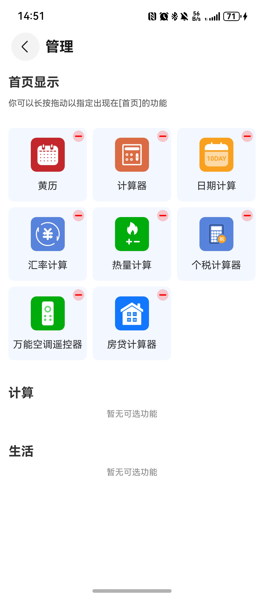

# 工具（综合工具）应用模板快速入门

## 目录

- [功能介绍](#功能介绍)
- [约束与限制](#约束与限制)
- [快速入门](#快速入门)
- [示例效果](#示例效果)
- [开源许可协议](#开源许可协议)

## 功能介绍

您可以基于此模板直接定制应用，也可以挑选此模板中提供的多种组件使用，从而降低您的开发难度，提高您的开发效率。

此模板提供如下组件，所有组件存放在工程根目录的components下，如果您仅需使用组件，可参考对应组件的指导链接；如果您使用此模板，请参考本文档。

| 组件                                 | 描述                                              | 使用指导                                                   |
|------------------------------------|-------------------------------------------------|--------------------------------------------------------|
| 黄历（almanac）                        | 提供了查看黄历和白话文的功能。                                 | [使用指导](./components/almanac/README.md)                 |
| 基础计算器（basic_calculator）            | 提供了基础计算的功能。                                     | [使用指导](./components/basic_calculator/README.md)        |
| 热量计算（calories_calculate）           | 提供了按日和按周根据摄入计算热量的功能。                            | [使用指导](./components/calories_calculate/README.md)      |
| 日期计算（date_calculate）               | 提供了日期计算和日期间隔计算的功能。                              | [使用指导](./components/date_calculate/README.md)          |
| 汇率计算器（exchange_calculator）         | 提供了多种币种之间实时汇率计算的功能。                             | [使用指导](./components/exchange_calculator/README.md)     |
| 个税计算器（income_calculator）           | 提供了工资、劳动报酬等收入个税计算的功能。                           | [使用指导](./components/income_calculator/README.md)       |
| 房贷计算器（mortgage_calculator）         | 提供了商业贷款、公积金贷款和组合贷款的还款计划计算功能。                    | [使用指导](./components/mortgage_calculator/README.md)     |
| 万能空调遥控器（remote_control）            | 提供了空调遥控器创建，删除及以发射红外信号控制对应空调等功能。                 | [使用指导](./components/remote_control/README.md)          |
| 科学计算器（science_calculator）          | 提供了多种科学计算方法的计算的功能。                              | [使用指导](./components/science_calculator/README.md)      |
| 日程提醒（calendar_events）              | 提供了新增以及编辑日历、生日、纪念日、待办，并将日程添加到系统日历提醒中的功能。        | [使用指导](./components/calendar_events/README.md)         |
| 敲木鱼（decompression_tool）            | 提供了敲木鱼解压的功能。                                    | [使用指导](./components/decompression_tool/README.md)      |
| 记账（money_track）                    | 提供了记账、查看账单列表和统计图表的功能。                           | [使用指导](./components/money_track/README.md)             |
| 隐私笔记（personal_notes）               | 提供了写笔记、编辑笔记、删除笔记、笔记分类，搜索，多选，排序，分享、复制功能。         | [使用指导](./components/personal_notes/README.md)          |
| 图片水印（picture_watermark）            | 提供了图片添加水印、下载保存相册、历史添加缓存等功能。                     | [使用指导](./components/picture_watermark/README.md)       |
| 手机NFC（mobile_nfc）                  | 提供了门禁卡、公交卡和银行卡的读取和克隆功能。                         | [使用指导](./components/mobile_nfc/README.md)              |
| 罗盘（compass）                        | 提供了罗盘方向的指引功能。                                   | [使用指导](./components/compass/README.md)                 |
| 日记（diary）                          | 提供写日记的功能                                        | [使用指导](./components/diary/README.md)                   |
| 网络测速（internet_speed_measure）       | 提供了网络实时测速的功能。                                   | [使用指导](./components/internet_speed_measure/README.md)  |
| 修图神器（photo_editing）                | 提供了滤镜相机、图片拼接、图片编辑的功能。                           | [使用指导](./components/photo_editing/README.md)           |
| BMI计算（bmi_calculator）              | 提供了BMI指标计算的功能。                                  | [使用指导](./components/bmi_calculator/README.md)          |
| 绘画（draw_board）                     | 提供了自由绘画的功能。                                     | [使用指导](./components/draw_board/README.md)              |
| 录音专家（simple_recorder）              | 提供了录音、音频格式转换、音频转文字、音频编辑等功能。                     | [使用指导](./components/simple_recorder/README.md)         |
| 解压缩（zip_tool）                      | 提供了解压、压缩等功能。                                    | [使用指导](./components/zip_tool/README.md)                |
| 吉他调音器（guitar_tuning）               | 提供了吉他调音功能。                                      | [使用指导](./components/guitar_tuning/README.md)           |
| 视频剪辑（video_clip）                   | 提供了视频剪辑及草稿管理功能。                                 | [使用指导](./components/video_clip/README.md)              |
| 克隆工具（clone）                        | 提供了克隆、隔空投送等功能                                   | [使用指导](./components/clone/README.md)                   |
| 手持弹幕（handheld_bullet）              | 提供了手持弹幕、荧光棒及历史记录管理功能。                           | [使用指导](./components/handheld_bullet/README.md)         |
| 图文识别（image_recognition）            | 提供图文识别等功能。                                      | [使用指导](./components/image_recognition/README.md)       |
| 理财计算器（financial_calculator）        | 提供了银行理财、复利理财、定投理财功能。                            | [使用指导](./components/financial_calculator/README.md)    |
| 养老金计算器（pension_calculator）         | 提供了养老金计算功能。                                     | [使用指导](./components/pension_calculator/README.md)      |
| 亲属称呼换算器（kinship_calculator）        | 提供了亲属称呼换算功能。                                    | [使用指导](./components/kinship_calculator/README.md)      |
| 退休年龄计算器（retirement_age_calculator） | 提供了退休年龄计算功能。                                    | [使用指导](./components/retirement_age_calculator/README.md) |
| 证件照（credentials_photo）             | 提供证件照生成功能。                                      | [使用指导](./components/credentials_photo/README.md)       |
| AR测量（ar_measure）                   | 提供AR体积测量及空间测量组件。                                | [使用指导](./components/ar_measure/README.md)                        |
| 翻译（translator）                     | 提供文本翻译、语音翻译组件。                                  | [使用指导](./components/translator/README.md)                        |
| 本地影音投屏（cast_tool）                  | 提供音频投屏、视频投屏功能。                                  | [使用指导](./components/cast_tool/README.md)                        |
| 通用登录组件（aggregated_login）           | 提供华为账号一键登录及其他方式登录（微信、手机号登录），开发者可以根据业务需要快速实现应用登录。 | [使用指导](./components/aggregated_login/README.md)                        |
| 通用个人信息组件（collect_personal_info）    | 提供编辑头像、昵称、姓名、性别、手机号、生日、个人简介等功能。                 | [使用指导](./components/collect_personal_info/README.md)                        |
| 通用问题反馈组件（feedback）                 | 提供通用的问题反馈功能。                                    | [使用指导](./components/feedback/README.md)                        |
| 通用会员组件（membership）           | 提供通过应用内支付实现会员开通的能力。                             | [使用指导](./components/membership/README.md)                        |

本模板为工具类应用提供了常用功能的开发样例，模板主要分首页、我的两大模块：

* 首页：提供计算器、黄历、汇率计算、热量计算等工具功能。
* 我的：支持问题反馈、用户协议、隐私政策查看。

本模板只需做少量配置和定制即可快速实现数字计算、日期查询、空调遥控、个税计算等功能。

| 首页                                                      | 我的                                                      |
|---------------------------------------------------------|---------------------------------------------------------|
|  |  |


本模板主要页面及核心功能如下所示：

```ts
综合工具
 |-- 首页
 |    |-- 顶部操作区
 |    |    |    └-- 工具管理
 |    |-- 计算器
 |    |    └-- 数字计算
 |    |-- 个税计算器
 |    |    └-- 个税计算
 |    |-- 汇率计算器
 |    |    |-- 汇率计算
 |    |-- 热量计算
 |    |    |-- 饮食计划
 |    |    |    └-- 食物搜索
 |    |    |    └-- 食物添加
 |    |-- 日期计算
 |    |    |-- 日期间隔
 |    |    |-- 日期计算
 |    |-- 黄历
 |    |    |-- 黄历查看
 |    |-- 万能空调遥控器
 |    |    |-- 遥控器列表
 |    |-- 房贷计算器
 |    |    |-- 房贷计算
 |    |-- 科学计算器
 |    |    └-- 科学计算
 |    |-- 日程提醒
 |    |    └-- 日程提醒列表
 |    |-- 记账
 |    |    └-- 账单统计
 |    |-- 隐私笔记
 |    |    └-- 添加笔记
 |    |-- 图片水印
 |    |    └-- 编辑水印
 |    |    └-- 历史记录
 |    |-- 手机NFC
 |    |    └-- 读取门禁卡
 |    |    └-- 读取公交卡
 |    |    └-- 读取银行卡
 |    |    └-- 克隆卡片
 |    |-- 敲木鱼
 |    |-- 罗盘
 |    |-- 日记
 |    |    └-- 新增日记
 |    |-- 网络测速
 |    |-- 修图神器
 |    |    └-- 修图 
 |    |    └-- 拍照
 |    |    └-- 拼图 
 |    |    └-- 相框 
 |    |-- BMI计算
 |    |-- 绘图
 |    |-- 解压缩
 |    |-- 录音专家
 |    |    └-- 录音  
 |    |    └-- 音频编辑  
 |    |    └-- 格式转换  
 |    |    └-- 音频转文字
 |    |-- 吉他调音器
 |    |-- 视频剪辑  
 |    |    └-- 视频管理  
 |    |    └-- 视频剪辑 
 |    |-- 克隆工具 
 |    |-- 手持弹幕
 |    |-- 图文识别
 |    |    └-- 图文识别  
 |    |    └-- 票据识别  
 |    |    └-- 证件识别
 |    |-- 理财计算器
 |    |-- 养老金计算器
 |    |-- 亲属称呼换算器
 |    |-- 退休年龄计算器 
 |    |-- 证件照 
 |    |-- AR测量 
 |    |-- 翻译 
 |    |-- 本地影音投屏
 └-- 我的
      |-- 问题反馈
      |    └-- 提交反馈
      |-- 用户协议
      └-- 隐私政策
```

本模板工程代码结构如下所示：

```ts
ComprehensiveTool
  |- feature                                               // 基础特性层
  |   |- home/src/main/ets                                 // 我的(har)
  |   |    |- constant                                     // 模块常量
  |   |    |- components                                   // 组件
  |   |    |- model                                        // 模型定义 
  |   |    └- pages                                        // 页面
  |   |    └- viewmodel                                    // 与页面一一对应的vm层
  |   |- mine/src/main/ets                                 // 首页(har)
  |   |    |- apis                                         // 模块接口
  |   |    |- constants                                    // 模块常量     
  |   |    |- components                                   // 公共组件
  |   |    |- model                                        // 模型定义  
  |   |    |- pages                                        // 页面
  |   |    |- style                                        // 模块样式
  |   |    |- utils                                        // 模块工具
  |   |    |- viewmodel                                    // 与页面一一对应的vm层           
  |   |    
  |- components                                            // 可分可合组件层
  |   |- almanac/src/main/ets                              // 黄历(har)
  |   |- basic_calculator/src/main/ets                     // 计算器(har)
  |   |- calories_calculate/src/main/ets                   // 热量计算(har)
  |   |- compass/src/main/ets                              // 罗盘(har)
  |   |- date_calculate/src/main/ets                       // 日期计算(har)    
  |   |- exchange_calculator/src/main/ets                  // 汇率计算器(har)
  |   |- income_calculator/src/main/ets                    // 个税计算器(har)
  |   |- remote_control/src/main/ets                       // 空调遥控器(har)
  |   |- mortgage_calculator/src/main/ets                  // 房贷计算器(har)     
  |   |- science_calculator/src/main/ets                   // 科学计算器(har)
  |   |- calendar_events/src/main/ets                      // 日程提醒(har)
  |   |- money_track/src/main/ets                          // 记账(har)
  |   |- decompression_tool/src/main/ets                   // 敲木鱼(har)
  |   |- personal_notes/src/main/ets                       // 隐私笔记(har)
  |   |- picture_watermark/src/main/ets                    // 图片水印(har)
  |   |- mobile_nfc/src/main/ets                           // 手机NFC(har)
  |   |- compass/src/main/ets                              // 罗盘(har)
  |   |- internet_speed_measure/src/main/ets               // 网络测速(har)
  |   |- photo_editing/src/main/ets                        // 修图神器(har)
  |   |- bmi_calculator/src/main/ets                       // BMI计算(har)
  |   |- draw_board/src/main/ets                           // 绘画(har)      
  |   |- zip_tool/src/main/ets                             // 解压缩(har)   
  |   |- diary/src/main/ets                                // 日记(har)
  |   |- simple_recorder/src/main/ets                      // 录音专家(har)
  |   |- guitar_tuning/src/main/ets                        // 吉他调音器(har)
  |   |- video_clip/src/main/ets                           // 视频剪辑(har)
  |   |- clone/src/main/ets                                // 克隆工具(har)
  |   |- handheld_bullet/src/main/ets                      // 手持弹幕(har)
  |   |- image_recognition/src/main/ets                    // 图文识别(har)
  |   |- credentials_photo/src/main/ets                    // 证件照(har)
  |   |- ar_measure/src/main/ets                           // AR测量(har)
  |   |- translator/src/main/ets                           // 翻译(har)
  |   |- cast_tool/src/main/ets                            // 本地影音投屏(har)
  |   |- aggregated_login/src/main/ets                     // 通用登录组件(har)
  |   |- collect_personal_info/src/main/ets                // 通用个人信息组件(har)
  |   |- feedback/src/main/ets                             // 通用问题反馈组件(har)
  |   |- membership/src/main/ets                           // 通用会员组件(har)
  |   |- module_base/src/main/ets                          // 应用登录、会员购买等功能基础组件(har)
  |
  |   |- entry/src/main/ets    
  |   |    |- apis                                         // 模块接口  
  |   |    |- constant                                     // 主页常量  
  |   |    |- components                                   // UIAbility实例                                                 
  |   |    |- utils                                        // 工具类
  |   |    |- entryability                                 // UIAbility实例
  |   |    |- entrybackupability                           // 备份实例                                                                                                             
  |   |    |- pages                                        // 页面  
  |   |    |- mocks                                        // mock数据   
  |   |    |- model                                        // 模型定义  
  |   |    |- viewmodel                                    // 与页面一一对应的vm层         
```

## 约束与限制

### 环境
* DevEco Studio版本：DevEco Studio 6.0.2 Release及以上
* HarmonyOS SDK版本：HarmonyOS 6.0.2 Release SDK及以上
* 设备类型：华为手机（包括双折叠和阔折叠）
* HarmonyOS版本：HarmonyOS 6.0.0(20)及以上

### 权限

* 红外发射权限权限：ohos.permission.MANAGE_INPUT_INFRARED_EMITTER
* NFC权限：ohos.permission.NFC_TAG
* 麦克风权限：ohos.permission.MICROPHONE
* 获取相机权限：ohos.permission.CAMERA
* 获取网络权限：ohos.permission.INTERNET、ohos.permission.GET_NETWORK_INFO
* 读取联系人权限：ohos.permission.READ_CONTACTS
* 写入联系人权限：ohos.permission.WRITE_CONTACTS
* 读取图片视频权限：ohos.permission.READ_IMAGEVIDEO
* 写入图片视频权限：ohos.permission.WRITE_IMAGEVIDEO
* 陀螺仪传感器权限：ohos.permission.GYROSCOPE
* 加速度传感器权限：ohos.permission.ACCELEROMETER

## 快速入门

###  配置工程
在运行此模板前，需要完成以下配置：

1. 在AppGallery Connect创建应用，将包名配置到模板中。

   a. 参考[创建应用](https://developer.huawei.com/consumer/cn/doc/app/agc-help-create-app-0000002247955506)为应用创建APP ID，并将APP ID与应用进行关联。

   b. 返回应用列表页面，查看应用的包名。

   c. 将模板工程根目录下AppScope/app.json5文件中的bundleName替换为创建应用的包名。

   d. ohos.permission.READ_CONTACTS、ohos.permission.WRITE_CONTACTS、ohos.permission.READ_IMAGEVIDEO、ohos.permission.WRITE_IMAGEVIDEO权限均为受限权限，参考[申请使用受限权限](https://developer.huawei.com/consumer/cn/doc/harmonyos-guides/declare-permissions-in-acl)，否则会导致工具运行失败。

   e. 将应用的client ID配置到entry模块的src/main/module.json5文件，详细参考：[配置Client ID](https://developer.huawei.com/consumer/cn/doc/harmonyos-guides/account-client-id)。

   f. 将entry模块的src/main/resources/base/profile/shortcuts_config.json文件中的bundleName替换为创建应用的包名。

2. 此模板通过通用登录组件实现了华为账号一键登录及其他方式登录（微信、手机号登录），具体配置请参考[使用指导](./components/aggregated_login/README.md)。

3. 此模板通过Push Kit实现了向应用实时推送消息的能力，请参考[开发流程](https://developer.huawei.com/consumer/cn/doc/harmonyos-guides/push-gettingstart#section65812095297)。

4. 此模板通过Ads Kit实现了展示应用开屏广告的能力，您需要前往[鲸鸿动能媒体服务平台](https://developer.huawei.com/consumer/cn/service/ads/publisher/html/index.html?lang=zh)申请广告位ID，并参考[展示位创建](https://developer.huawei.com/consumer/cn/doc/distribution/monetize/zhanshiweichuangjian-0000001132700049)创建广告展示位，并将entry/main/ets/pages/HwAdPage.ets代码文件下的测试广告位ID进行替换。

   ```
   private splashImageAdReqParams: advertising.AdRequestParams = {
      // todo 替换为您的广告位ID
      adId: 'testq6zq98hecj',
      adType: AdType.SPLASH_AD,
      adCount: 1,
   };
   ```
5. 配置应用内支付服务。

   a. 您需[开通商户服务](https://developer.huawei.com/consumer/cn/doc/start/merchant-service-0000001053025967)才能开启应用内购买服务。商户服务里配置的银行卡账号、币种，用于接收华为分成收益。

   b. 使用应用内购买服务前，需要打开应用内购买服务(HarmonyOS NEXT) 开关，此开关是应用级别的，即所有使用IAP Kit功能的应用均需执行此步骤，详情请参考[打开应用内购买服务API开关](https://developer.huawei.com/consumer/cn/doc/app/switch-0000001958955097)。

   c. 开启应用内购买服务(HarmonyOS NEXT) 开关后，开发者需进一步激活应用内购买服务 (HarmonyOS NEXT)，具体请参见[激活服务和配置事件通知](https://developer.huawei.com/consumer/cn/doc/app/parameters-0000001931995692)。

6. （可选）用户购买商品后，IAP服务器会在订单（消耗型/非消耗型商品）和订阅场景的某些关键事件发生时发送通知至开发者配置的订单/订阅通知接收地址，您可以根据关键事件的通知进行服务端的开发，详情请参考[激活服务和配置事件通知](https://developer.huawei.com/consumer/cn/doc/app/parameters-0000001931995692)。

7. 配置会员商品信息，详情请参考[配置商品信息](https://developer.huawei.com/consumer/cn/doc/harmonyos-guides/iap-config-product)。

###  运行调试工程
1. 连接调试手机和PC。

2. 对应用进行[手工签名](https://developer.huawei.com/consumer/cn/doc/harmonyos-guides/ide-signing#section297715173233)。

3. 点击"Run"，运行模板工程。

## 示例效果

* 工具管理

  

## 开源许可协议

该代码经过[Apache 2.0 授权许可](http://www.apache.org/licenses/LICENSE-2.0)。

