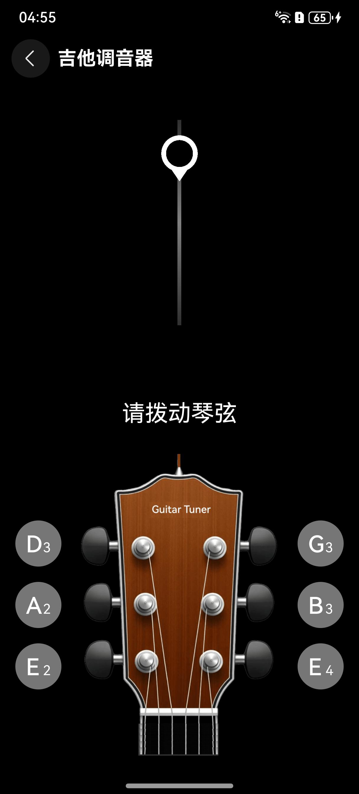

# 吉他调音器组件快速入门

## 目录

- [简介](#简介)
- [约束与限制](#约束与限制)
- [使用](#使用)
- [示例代码](#示例代码)

## 简介

本组件提供了吉他调音功能。



本组件工程代码结构如下所示：
```ts
guitar_tuning/src/main/ets                        // 吉他调音器(har)
  |- constant                                     // 模块常量定义   
  |- components                                   // 模块组件
  |- model                                        // 模型定义  
  |- util                                         // 模块工具类 
  |- pages                                        // 页面
  |- viewModels                                   // 与页面一一对应的vm层  
```

## 约束与限制

### 环境

* DevEco Studio版本：DevEco Studio 5.0.5 Release及以上
* HarmonyOS SDK版本：HarmonyOS 5.0.5 Release SDK及以上
* 设备类型：华为手机（包括双折叠和阔折叠）
* HarmonyOS版本：HarmonyOS 5.0.5(17)及以上

### 权限

* 麦克风权限：ohos.permission.MICROPHONE

## 使用
1. 安装组件。

   如果是在DevEco Studio使用插件集成组件，则无需安装组件，请忽略此步骤。

   如果是从生态市场下载组件，请参考以下步骤安装组件。

   a. 解压下载的组件包，将包中所有文件夹拷贝至您工程根目录的xxx目录下。

   b. 在项目根目录build-profile.json5添加guitar_tuning、membership、module_base、aggregated_login模块。
   ```
   "modules": [
      {
      "name": "guitar_tuning",
      "srcPath": "./xxx/guitar_tuning",
      },
      {
      "name": "membership",
      "srcPath": "./xxx/membership",
      },
      {
      "name": "module_base",
      "srcPath": "./xxx/module_base",
      },
      {
      "name": "aggregated_login",
      "srcPath": "./xxx/aggregated_login",
      },
   ]
   ```
   c. 在项目根目录oh-package.json5中添加依赖
   ```
   "dependencies": {
      "guitar_tuning": "file:./xxx/guitar_tuning",
      "membership": "file:./xxx/membership",
      "module_base": "file:./xxx/module_base",
      "aggregated_login": "file:./xxx/aggregated_login",
   }
   ```

2. 配置应用内支付服务。

   a. 您需[开通商户服务](https://developer.huawei.com/consumer/cn/doc/start/merchant-service-0000001053025967)才能开启应用内购买服务。商户服务里配置的银行卡账号、币种，用于接收华为分成收益。

   b. 使用应用内购买服务前，需要打开应用内购买服务(HarmonyOS NEXT) 开关，此开关是应用级别的，即所有使用IAP Kit功能的应用均需执行此步骤，详情请参考[打开应用内购买服务API开关](https://developer.huawei.com/consumer/cn/doc/app/switch-0000001958955097)。

   c. 开启应用内购买服务(HarmonyOS NEXT) 开关后，开发者需进一步激活应用内购买服务 (HarmonyOS NEXT)，具体请参见[激活服务和配置事件通知](https://developer.huawei.com/consumer/cn/doc/app/parameters-0000001931995692)。

3. （可选）用户购买商品后，IAP服务器会在订单（消耗型/非消耗型商品）和订阅场景的某些关键事件发生时发送通知至开发者配置的订单/订阅通知接收地址，您可以根据关键事件的通知进行服务端的开发，详情请参考[激活服务和配置事件通知](https://developer.huawei.com/consumer/cn/doc/app/parameters-0000001931995692)。

4. 配置会员商品信息，详情请参考[配置商品信息](https://developer.huawei.com/consumer/cn/doc/harmonyos-guides/iap-config-product)。

## 示例代码

```typescript
@Entry
@ComponentV2
export struct Index {
   @Local pageStack: NavPathStack = new NavPathStack();

   build() {
      Navigation(this.pageStack) {
         Button('跳转').onClick(() => {
            // TuningPage为吉他调音器路由入口页面名称
            this.pageStack.pushPathByName('TuningPage', null);
         });
      }.hideTitleBar(true);
   }
}
```


